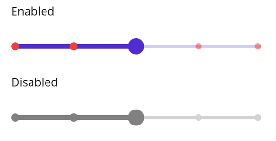

# Dividers in .NET MAUI Slider (SfSlider)

This section explains how to add the dividers in the slider.

## Show dividers

The [`ShowDividers`](https://help.syncfusion.com/cr/maui/Syncfusion.Maui.Sliders.RangeView-1.html#Syncfusion_Maui_Sliders_RangeView_1_ShowDividers) property is used to render the dividers on the track. The default value of the [`ShowDividers`](https://help.syncfusion.com/cr/maui/Syncfusion.Maui.Sliders.RangeView-1.html#Syncfusion_Maui_Sliders_RangeView_1_ShowDividers) property is `False`. It is a shape used to represent the major interval points of the track.

For example, if the [`Minimum`](https://help.syncfusion.com/cr/maui/Syncfusion.Maui.Sliders.SfSlider.html#Syncfusion_Maui_Sliders_SfSlider_Minimum) is 0.0, the [`Maximum`](https://help.syncfusion.com/cr/maui/Syncfusion.Maui.Sliders.SfSlider.html#Syncfusion_Maui_Sliders_SfSlider_Maximum) is 10.0, and [`Interval`](https://help.syncfusion.com/cr/maui/Syncfusion.Maui.Sliders.RangeView-1.html#Syncfusion_Maui_Sliders_RangeView_1_Interval) is 2.0, the slider will render the dividers at 0.0, 2.0, 4.0, and so on.





<sliders:SfSlider Interval="0.25"
                  ShowDividers="True" />





SfSlider slider = new SfSlider()
{
    Interval = 0.25,
    ShowDividers = true,
};





## Divider radius

Change the active and inactive divider radius of the slider using the [`ActiveRadius`](https://help.syncfusion.com/cr/maui/Syncfusion.Maui.Sliders.SliderDividerStyle.html#Syncfusion_Maui_Sliders_SliderDividerStyle_ActiveRadius) and the [`InactiveRadius`](https://help.syncfusion.com/cr/maui/Syncfusion.Maui.Sliders.SliderDividerStyle.html#Syncfusion_Maui_Sliders_SliderDividerStyle_InactiveRadius) properties of the [`DividerStyle`](https://help.syncfusion.com/cr/maui/Syncfusion.Maui.Sliders.SliderDividerStyle.html) class.





<sliders:SfSlider Interval="0.25"
                  ShowDividers="True">

    <sliders:SfSlider.DividerStyle>
        <sliders:SliderDividerStyle ActiveRadius="3"
                                    InactiveRadius="7" />
    </sliders:SfSlider.DividerStyle>

</sliders:SfSlider>





SfSlider slider = new SfSlider()
{
    Interval = 0.25,
    ShowDividers = true,
};
slider.DividerStyle.ActiveRadius = 3;
slider.DividerStyle.InactiveRadius = 7;





## Divider color

Change the active and inactive divider color of the slider using the [`ActiveFill`](https://help.syncfusion.com/cr/maui/Syncfusion.Maui.Sliders.SliderDividerStyle.html#Syncfusion_Maui_Sliders_SliderDividerStyle_ActiveFill) and [`InactiveFill`](https://help.syncfusion.com/cr/maui/Syncfusion.Maui.Sliders.SliderDividerStyle.html#Syncfusion_Maui_Sliders_SliderDividerStyle_InactiveFill) properties of the [`DividerStyle`](https://help.syncfusion.com/cr/maui/Syncfusion.Maui.Sliders.SliderDividerStyle.html) class.





<sliders:SfSlider Interval="0.25"
                  ShowDividers="True">

    <sliders:SfSlider.DividerStyle>
        <sliders:SliderDividerStyle ActiveRadius="7"
                                    InactiveRadius="7"
                                    ActiveFill="#EE3F3F"
                                    InactiveFill="#F7B1AE" />
    </sliders:SfSlider.DividerStyle>

</sliders:SfSlider>





SfSlider slider = new SfSlider()
{
    Interval = 0.25,
    ShowDividers = true,
};
slider.DividerStyle.ActiveRadius = 7;
slider.DividerStyle.InactiveRadius = 7;
slider.DividerStyle.ActiveFill = new SolidColorBrush(Color.FromArgb("#EE3F3F"));
slider.DividerStyle.InactiveFill = new SolidColorBrush(Color.FromArgb("#F7B1AE"));





## Divider stroke width and stroke color

Change the active and inactive divider stroke width of the slider using the [`ActiveStrokeThickness`](https://help.syncfusion.com/cr/maui/Syncfusion.Maui.Sliders.SliderDividerStyle.html#Syncfusion_Maui_Sliders_SliderDividerStyle_ActiveStrokeThickness) and the [`InactiveStrokeThickness`](https://help.syncfusion.com/cr/maui/Syncfusion.Maui.Sliders.SliderDividerStyle.html#Syncfusion_Maui_Sliders_SliderDividerStyle_InactiveStrokeThickness) properties of the [`DividerStyle`](https://help.syncfusion.com/cr/maui/Syncfusion.Maui.Sliders.SliderDividerStyle.html) class.

Also, change the active and inactive divider stroke color of the slider using the [`ActiveStroke`](https://help.syncfusion.com/cr/maui/Syncfusion.Maui.Sliders.SliderDividerStyle.html#Syncfusion_Maui_Sliders_SliderDividerStyle_ActiveStroke) and the [`InactiveStroke`](https://help.syncfusion.com/cr/maui/Syncfusion.Maui.Sliders.SliderDividerStyle.html#Syncfusion_Maui_Sliders_SliderDividerStyle_InactiveStroke) properties of the [`DividerStyle`](https://help.syncfusion.com/cr/maui/Syncfusion.Maui.Sliders.SliderDividerStyle.html) class.





<sliders:SfSlider Interval="0.25"
                  ShowDividers="True">

    <sliders:SfSlider.DividerStyle>
        <sliders:SliderDividerStyle ActiveRadius="7"
                                    InactiveRadius="7"
                                    ActiveFill="#EE3F3F"
                                    InactiveFill="#F7B1AE"
                                    ActiveStrokeThickness="2"
                                    InactiveStrokeThickness="2"
                                    ActiveStroke="#FFD700"
                                    InactiveStroke="#FFD700" />
    </sliders:SfSlider.DividerStyle>

</sliders:SfSlider>





SfSlider slider = new SfSlider()
{
    Interval = 0.25,
    ShowDividers = true,
};
slider.DividerStyle.ActiveRadius = 7;
slider.DividerStyle.InactiveRadius = 7;
slider.DividerStyle.ActiveStroke = new SolidColorBrush(Color.FromArgb("#EE3F3F"));
slider.DividerStyle.InactiveStroke = new SolidColorBrush(Color.FromArgb("#F7B1AE"));
slider.DividerStyle.ActiveStrokeThickness = 2;
slider.DividerStyle.InactiveStrokeThickness = 2;





## Disabled divider

Change the state of the slider to disabled by setting `false` to the `IsEnabled` property. Using the Visual State Manager (VSM), customize the slider divider properties based on the visual states. The applicable visual states are enabled(default) and disabled.





<ContentPage.Resources>
    
</ContentPage.Resources>

<ContentPage.Content>
    <VerticalStackLayout>
        <Label Text="Enabled"
               Padding="24,10" />
        <sliders:SfSlider />
        <Label Text="Disabled"
               Padding="24,10" />
        <sliders:SfSlider IsEnabled="False" />
    </VerticalStackLayout>
</ContentPage.Content>





VerticalStackLayout stackLayout = new();
SfSlider enabledSlider = new()
{
    Interval = 0.25,
    ShowDividers = true
};
SfSlider disabledSlider = new()
{
    IsEnabled = false,
    Interval = 0.25,
    ShowDividers = true
};

VisualStateGroupList visualStateGroupList = new();
VisualStateGroup commonStateGroup = new();
// Default State.
VisualState enabledState = new() { Name = "Default" };
enabledState.Setters.Add(new Setter
{
    Property = SfSlider.DividerStyleProperty,
    Value = new SliderDividerStyle
    {
        ActiveFill = Color.FromArgb("#EE3F3F"),
        InactiveFill = Color.FromArgb("#88EE3F3F"),
        ActiveRadius = 5,
        InactiveRadius = 4,
    }
});
// Disabled State.
VisualState disabledState = new() { Name = "Disabled" };
disabledState.Setters.Add(new Setter
{
    Property = SfSlider.DividerStyleProperty,
    Value = new SliderDividerStyle
    {
        ActiveFill = Colors.Gray,
        InactiveFill = Colors.LightGray,
        ActiveRadius = 5,
        InactiveRadius = 4,
    }
});
disabledState.Setters.Add(new Setter
{
    Property = SfSlider.TrackStyleProperty,
    Value = new SliderTrackStyle
    {
        ActiveFill = Colors.Gray,
        InactiveFill = Colors.LightGray,
    }
});
disabledState.Setters.Add(new Setter
{
    Property = SfSlider.ThumbStyleProperty,
    Value = new SliderThumbStyle
    {
        Fill = Colors.Gray,
    }
});

commonStateGroup.States.Add(enabledState);
commonStateGroup.States.Add(disabledState);
visualStateGroupList.Add(commonStateGroup);
VisualStateManager.SetVisualStateGroups(enabledSlider, visualStateGroupList);
VisualStateManager.SetVisualStateGroups(disabledSlider, visualStateGroupList);

stackLayout.Children.Add(new Label() { Text = "Enabled", Padding = new Thickness(24, 10) });
stackLayout.Children.Add(enabledSlider);
stackLayout.Children.Add(new Label() { Text = "Disabled", Padding = new Thickness(24, 10) });
stackLayout.Children.Add(disabledSlider);
this.Content = stackLayout;





