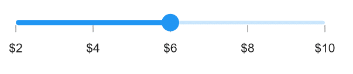
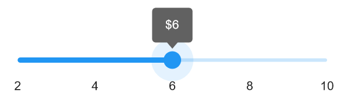

# Events and Commands in .NET MAUI Slider (SfSlider)

This section explains how to add events and commands to the slider.

## Events

### Handle Callbacks

* [ValueChangeStart](https://help.syncfusion.com/cr/maui/Syncfusion.Maui.Sliders.RangeView-1.html#Syncfusion_Maui_Sliders_RangeView_1_ValueChangeStart) - Triggered when the user starts selecting a new value for the slider by tapping or using the mouse on the thumb.
* [ValueChanging](https://help.syncfusion.com/cr/maui/Syncfusion.Maui.Sliders.SfSlider.html#Syncfusion_Maui_Sliders_SfSlider_ValueChanging) - Triggered when the user is actively selecting a new value by dragging the thumb.
* [ValueChanged](https://help.syncfusion.com/cr/maui/Syncfusion.Maui.Sliders.SfSlider.html#Syncfusion_Maui_Sliders_SfSlider_ValueChanged) - Triggered when the user completes selecting a new value.
* [ValueChangeEnd](https://help.syncfusion.com/cr/maui/Syncfusion.Maui.Sliders.RangeView-1.html#Syncfusion_Maui_Sliders_RangeView_1_ValueChangeEnd) - Triggered when the user stops interacting with the slider by releasing the thumb.





<sliders:SfSlider ValueChangeStart="OnValueChangeStart"
                  ValueChanging="OnValueChanging"
                  ValueChanged="OnValueChanged"
                  ValueChangeEnd="OnValueChangeEnd" />





{
   SfSlider slider = new SfSlider();
   slider.ValueChangeStart += OnValueChangeStart;
   slider.ValueChanging += OnValueChanging;
   slider.ValueChanged += OnValueChanged;
   slider.ValueChangeEnd += OnValueChangeEnd;
}

private void OnValueChangeStart(object sender, EventArgs e)
{
}

private void OnValueChanging(object sender, SliderValueChangingEventArgs e)
{
}

private void OnValueChanged(object sender, SliderValueChangedEventArgs e) 
{
}
private void OnValueChangeEnd(object sender, EventArgs e)
{
}





### Customize Label Text

Format or modify the numeric label text using the [`LabelCreated`](https://help.syncfusion.com/cr/maui/Syncfusion.Maui.Sliders.RangeView-1.html#Syncfusion_Maui_Sliders_RangeView_1_LabelCreated) event. The [`SliderLabelCreatedEventArgs`](https://help.syncfusion.com/cr/maui/Syncfusion.Maui.Sliders.SliderLabelCreatedEventArgs.html) provide the following parameters:

* Text – Customize the text using the [`Text`](https://help.syncfusion.com/cr/maui/Syncfusion.Maui.Sliders.SliderLabelCreatedEventArgs.html#Syncfusion_Maui_Sliders_SliderLabelCreatedEventArgs_Text) parameter.
* Style – Format text color, font size, font family, and offset using the [`Style`](https://help.syncfusion.com/cr/maui/Syncfusion.Maui.Sliders.SliderLabelCreatedEventArgs.html#Syncfusion_Maui_Sliders_SliderLabelCreatedEventArgs_Style) parameter.





<sliders:SfSlider Minimum="2"
                  Maximum="10"
                  Value="6"
                  Interval="2"
                  LabelCreated="OnLabelCreated"
                  ShowTicks="True"
                  ShowLabels="True" />





{
    SfSlider slider = new SfSlider()
    {
        Minimum = 2,
        Maximum = 10,
        Value = 6,
        Interval = 2,
        ShowTicks = true,
        ShowLabels = true,
    };
    slider.LabelCreated += OnLabelCreated;
}

 private void OnLabelCreated(object sender, SliderLabelCreatedEventArgs e)
 {
   e.Text = "$" + e.Text;
 }





### Tooltip Text Format

By default, tooltip formatting is based on the [`SliderTooltip.NumberFormat`](https://help.syncfusion.com/cr/maui/Syncfusion.Maui.Sliders.SliderTooltip.html#Syncfusion_Maui_Sliders_SliderTooltip_NumberFormat) property.

Format or change the tooltip label text using the [`TooltipLabelCreated`](https://help.syncfusion.com/cr/maui/Syncfusion.Maui.Sliders.SliderTooltip.html#Syncfusion_Maui_Sliders_SliderTooltip_TooltipLabelCreated) event. The [`SliderTooltipLabelCreatedEventArgs`](https://help.syncfusion.com/cr/maui/Syncfusion.Maui.Sliders.SliderTooltipLabelCreatedEventArgs.html) provide the following parameters:

* Text – Modify the tooltip text using the [`Text`](https://help.syncfusion.com/cr/maui/Syncfusion.Maui.Sliders.SliderTooltipLabelCreatedEventArgs.html#Syncfusion_Maui_Sliders_SliderTooltipLabelCreatedEventArgs_Text) property.
* Color – Change tooltip text color using the [`TextColor`](https://help.syncfusion.com/cr/maui/Syncfusion.Maui.Sliders.SliderTooltipLabelCreatedEventArgs.html#Syncfusion_Maui_Sliders_SliderTooltipLabelCreatedEventArgs_TextColor) property.
* Font Size – Adjust the font size using the [`FontSize`](https://help.syncfusion.com/cr/maui/Syncfusion.Maui.Sliders.SliderTooltipLabelCreatedEventArgs.html#Syncfusion_Maui_Sliders_SliderTooltipLabelCreatedEventArgs_FontSize) property.
* Font Family – Select the font family using the [`FontFamily`](https://help.syncfusion.com/cr/maui/Syncfusion.Maui.Sliders.SliderTooltipLabelCreatedEventArgs.html#Syncfusion_Maui_Sliders_SliderTooltipLabelCreatedEventArgs_FontFamily) property.
* Font Attributes – Set font attributes using the [`FontAttributes`](https://help.syncfusion.com/cr/maui/Syncfusion.Maui.Sliders.SliderTooltipLabelCreatedEventArgs.html#Syncfusion_Maui_Sliders_SliderTooltipLabelCreatedEventArgs_FontAttributes) property.





<slider:SfSlider>
    <slider:SfSlider.Tooltip>
        <slider:SliderTooltip TooltipLabelCreated="OnTooltipLabelCreated" />
    </slider:SfSlider.Tooltip>
</slider:SfSlider>





{
    SfSlider slider = new SfSlider()
    {
        Tooltip= new SliderTooltip(),
    };
    slider.TooltipLabelCreated += OnTooltipLabelCreated;
}

private void OnTooltipLabelCreated(object sender, SliderTooltipLabelCreatedEventArgs e)
{
    e.Text = "$" + e.Text;
}





## Commands and Their Parameters

### Drag Started Command

The [`DragStartedCommand`](https://help.syncfusion.com/cr/maui/Syncfusion.Maui.Sliders.RangeView-1.html#Syncfusion_Maui_Sliders_RangeView_1_DragStartedCommand) is executed when the user starts moving the thumb.





<ContentPage.BindingContext>
    <local:ViewModel x:Name="viewModel" />
</ContentPage.BindingContext>

<ContentPage.Content>
    <sliders:SfSlider DragStartedCommand="{Binding DragStartedCommand}" />
</ContentPage.Content>





SfSlider slider = new SfSlider()
{
    DragStartedCommand = viewModel.DragStartedCommand
};

public class ViewModel
{
    public ICommand DragStartedCommand { get; }

    public ViewModel()
    {
        DragStartedCommand = new Command(OnDragStarted);
    }

    private void OnDragStarted(object obj)
    {
    }
}





### Drag Started Command Parameter

The [`DragStartedCommandParameter`](https://help.syncfusion.com/cr/maui/Syncfusion.Maui.Sliders.RangeView-1.html#Syncfusion_Maui_Sliders_RangeView_1_DragStartedCommandParameter) is executed when the user starts moving the thumb.





<ContentPage.BindingContext>
    <local:ViewModel x:Name="viewModel" />
</ContentPage.BindingContext>

<ContentPage.Content>
    <sliders:SfSlider DragStartedCommand="{Binding DragStartedCommand}"
                      DragStartedCommandParameter="1" />
</ContentPage.Content>





SfSlider slider = new SfSlider()
{
    DragStartedCommand = viewModel.DragStartedCommand,
    DragStartedCommandParameter = "1"
};

public class ViewModel
{
    public ICommand DragStartedCommand { get; }

    public ViewModel()
    {
        DragStartedCommand = new Command(OnDragStarted);
    }

    private void OnDragStarted(object obj)
    {
    }
}





### Drag Completed Command

The [`DragCompletedCommand`](https://help.syncfusion.com/cr/maui/Syncfusion.Maui.Sliders.RangeView-1.html#Syncfusion_Maui_Sliders_RangeView_1_DragCompletedCommand) is executed when the user completes moving the thumb.





<ContentPage.BindingContext>
    <local:ViewModel x:Name="viewModel" />
</ContentPage.BindingContext>

<ContentPage.Content>
    <sliders:SfSlider DragCompletedCommand="{Binding DragCompletedCommand}" />
</ContentPage.Content>





SfSlider slider = new SfSlider()
{
    DragCompletedCommand = viewModel.DragCompletedCommand
};

public class ViewModel
{
    public ICommand DragCompletedCommand { get; }

    public ViewModel()
    {
        DragCompletedCommand = new Command(OnDragCompleted);
    }

    private void OnDragCompleted(object obj)
    {
    }
}





### Drag Completed Command Parameter

The [`DragCompletedCommandParameter`](https://help.syncfusion.com/cr/maui/Syncfusion.Maui.Sliders.RangeView-1.html#Syncfusion_Maui_Sliders_RangeView_1_DragCompletedCommandParameter) is executed when the user completes moving the thumb.





<ContentPage.BindingContext>
    <local:ViewModel x:Name="viewModel" />
</ContentPage.BindingContext>

<ContentPage.Content>
    <sliders:SfSlider DragCompletedCommand="{Binding DragCompletedCommand}"
                      DragCompletedCommandParameter="1" />
</ContentPage.Content>





SfSlider slider = new SfSlider()
{
    DragCompletedCommand = viewModel.DragCompletedCommand,
    DragCompletedCommandParameter = "1"
};

public class ViewModel
{
    public ICommand DragCompletedCommand { get; }

    public ViewModel()
    {
        DragCompletedCommand = new Command(OnDragCompleted);
    }

    private void OnDragCompleted(object obj)
    {
    }
}



