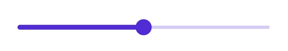
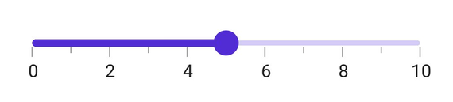
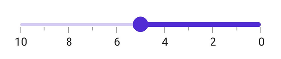

# Getting Started with .NET MAUI Slider

This section explains the steps required to add the slider control and its elements such as track, ticks, labels and tooltip. This section covers only basic features needed to know to get started with Syncfusion Slider.

To get start quickly with MAUI SfSlider, you can check on this video:

<iframe id='MAUISliderVideoTutorial' src='https://www.youtube.com/embed/eBSzMk9bi08'></iframe>

## Creating an application with .NET MAUI

Create a new .NET MAUI application in Visual Studio.

 

## Adding SfSlider reference

 The Syncfusion .NET MAUI components are available in [nuget.org](https://www.nuget.org/). To add the SfSlider to your project, open the NuGet package manager in the Visual Studio, search for the Syncfusion.Maui.Sliders, and install it.

 

## Handler registration

In the MauiProgram.cs file, register the handler for the Syncfusion core.



using Microsoft.Maui;
using Microsoft.Maui.Hosting;
using Microsoft.Maui.Controls.Compatibility;
using Microsoft.Maui.Controls.Hosting;
using Microsoft.Maui.Controls.Xaml;
using Syncfusion.Maui.Core.Hosting;

namespace SliderGettingStarted
{
    public static class MauiProgram
    {
        public static MauiApp CreateMauiApp()
        {
            var builder = MauiApp.CreateBuilder();
            builder
            .UseMauiApp<App>()
            .ConfigureSyncfusionCore()
            .ConfigureFonts(fonts =>
            {
                fonts.AddFont("OpenSans-Regular.ttf", "OpenSansRegular");
            });

            return builder.Build();
        }
    }
}



## Initialize slider

Import the [`SfSlider`](https://help.syncfusion.com/cr/maui/Syncfusion.Maui.Sliders.SfSlider.html) namespace and initialize the slider as shown below.





<ContentPage
    . . .
    xmlns:sliders="clr-namespace:Syncfusion.Maui.Sliders;assembly=Syncfusion.Maui.Sliders">
    <Grid>
        <sliders:SfSlider />
    </Grid>
</ContentPage>





using Syncfusion.Maui.Sliders;

namespace SliderGettingStarted
{
    public partial class MainPage : ContentPage
    {
        public MainPage()
        {
            InitializeComponent();
            SfSlider slider = new SfSlider();
            this.content = slider;
        }
    }
}





## Enable labels

The [`ShowLabels`](https://help.syncfusion.com/cr/maui/Syncfusion.Maui.Sliders.RangeView-1.html#Syncfusion_Maui_Sliders_RangeView_1_ShowLabels) property enables the labels which renders on given interval.





<sliders:SfSlider Minimum="0"
                  Maximum="10"
                  Value="5"
                  ShowLabels="True"
                  Interval="2" />





SfSlider slider = new SfSlider()
{
    Minimum = 0,
    Maximum = 10,
    Value = 5,
    Interval = 2,
    ShowLabels = true,
};





## Enable ticks

The [`ShowTicks`](https://help.syncfusion.com/cr/maui/Syncfusion.Maui.Sliders.RangeView-1.html#Syncfusion_Maui_Sliders_RangeView_1_ShowTicks) property enables the ticks in the range selector, while the [`MinorTicksPerInterval`](https://help.syncfusion.com/cr/maui/Syncfusion.Maui.Sliders.RangeView-1.html#Syncfusion_Maui_Sliders_RangeView_1_MinorTicksPerInterval) property enables the minor ticks between the major ticks.





<sliders:SfSlider Minimum="0"
                  Maximum="10"
                  Value="5"
                  Interval="2"
                  ShowTicks="True"
                  ShowLabels="True"
                  MinorTicksPerInterval="1" />





SfSlider slider = new SfSlider()
{
    Minimum = 0,
    Maximum = 10,
    Value = 5,
    Interval = 2,
    ShowLabels = true,
    ShowTicks = true,
    MinorTicksPerInterval = 1
};





## Orientation

The [`Orientation`](https://help.syncfusion.com/cr/maui/Syncfusion.Maui.Sliders.SliderBase-1.html#Syncfusion_Maui_Sliders_SliderBase_1_Orientation) property allows you to show the slider in both horizontal and vertical directions. The default value of the [`Orientation`](https://help.syncfusion.com/cr/maui/Syncfusion.Maui.Sliders.SliderBase-1.html#Syncfusion_Maui_Sliders_SliderBase_1_Orientation) property is `Horizontal`.





<sliders:SfSlider Orientation="Vertical"
                  Minimum="0"
                  Maximum="10"
                  Value="5"
                  Interval="2"
                  ShowLabels="True"
                  ShowTicks="True"
                  MinorTicksPerInterval="1" />





SfSlider slider = new SfSlider()
{
    Orientation = SliderOrientation.Vertical,
    Minimum = 0,
    Maximum = 10,
    Value = 5,
    Interval = 2,
    ShowLabels = true,
    ShowTicks = true,
    MinorTicksPerInterval = 1
};





## Inverse the slider

Invert the slider using the [`IsInversed`](https://help.syncfusion.com/cr/maui/Syncfusion.Maui.Sliders.RangeView-1.html#Syncfusion_Maui_Sliders_RangeView_1_IsInversed) property. The default value of the [`IsInversed`](https://help.syncfusion.com/cr/maui/Syncfusion.Maui.Sliders.RangeView-1.html#Syncfusion_Maui_Sliders_RangeView_1_IsInversed) property is `False`.





<sliders:SfSlider Minimum="0"
                  Maximum="10"
                  Value="5"
                  IsInversed="True"
                  Interval="2"
                  ShowTicks="True"
                  ShowLabels="True"
                  MinorTicksPerInterval="1" />





SfSlider slider = new SfSlider()
{
    Minimum = 0,
    Maximum = 10,
    Value = 5,
    IsInversed = true,
    Interval = 2,
    ShowLabels = true,
    ShowTicks = true,
    MinorTicksPerInterval = 1
};





## Formatting labels

Add prefix or suffix to the labels using the [`NumberFormat`](https://help.syncfusion.com/cr/maui/Syncfusion.Maui.Sliders.SfSlider.html#Syncfusion_Maui_Sliders_SfSlider_NumberFormat) property.





<sliders:SfSlider Minimum="20"
                  Maximum="100"
                  Value="60"
                  Interval="20"
                  NumberFormat="$##"
                  ShowLabels="True"
                  ShowTicks="True"
                  MinorTicksPerInterval="1" />





SfSlider slider = new SfSlider()
{
    Minimum = 20,
    Maximum = 100,
    Value = 60,
    Interval = 20,
    NumberFormat = "$##",
    ShowLabels = true,
    ShowTicks = true,
    MinorTicksPerInterval = 1
};





N> You can refer to our [.NET MAUI Slider](https://www.syncfusion.com/maui-controls/maui-slider) feature tour page for its groundbreaking feature representations. You can also explore our [.NET MAUI Slider Example](https://github.com/syncfusion/maui-demos/tree/master/MAUI/Sliders) that shows you how to render the Slider in .NET MAUI.
