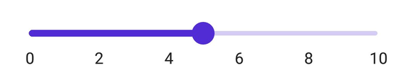

# Getting Started with .NET MAUI Slider

This section explains the steps required to add the slider control and its elements such as numeric and date values, ticks, labels and tooltip. This section covers only basic features needed to know to get started with Syncfusion Slider.

## Creating an application with .NET MAUI

Create a new .NET MAUI application in Visual Studio.

 

## Adding SfSlider reference

 Syncfusion .NET MAUI components are available in [nuget.org](https://www.nuget.org/). To add SfSlider to your project, open the NuGet package manager in Visual Studio, search for Syncfusion.Maui.Sliders and then install it.

 

## Handler registration

In the MauiProgram.cs file, register the handler for Syncfusion core



using Microsoft.Maui;
using Microsoft.Maui.Hosting;
using Microsoft.Maui.Controls.Compatibility;
using Microsoft.Maui.Controls.Hosting;
using Microsoft.Maui.Controls.Xaml;
using Syncfusion.Maui.Core.Hosting;

namespace SliderGettingStarted
{
    public static class MauiProgram
    {
        public static MauiApp CreateMauiApp()
        {
            var builder = MauiApp.CreateBuilder();
            builder
            .UseMauiApp<App>()
            .ConfigureSyncfusionCore()
            .ConfigureFonts(fonts =>
            {
                fonts.AddFont("OpenSans-Regular.ttf", "OpenSansRegular");
            });

            return builder.Build();
        }
    }
}



## Initialize slider

Import the [`SfSlider`](https://help.syncfusion.com/cr/maui/Syncfusion.Maui.Sliders.SfSlider.html) namespace and initialize the slider as shown below.





<ContentPage
    . . .
    xmlns:sliders="clr-namespace:Syncfusion.Maui.Sliders;assembly=Syncfusion.Maui.Sliders">
    <Grid>
        <sliders:SfSlider />
    </Grid>
</ContentPage>





using Syncfusion.Maui.Sliders;

namespace SliderGettingStarted
{
    public partial class MainPage : ContentPage
    {
        public MainPage()
        {
            InitializeComponent();
            SfSlider slider = new SfSlider();
            this.content = slider;
        }
    }
}





code snippet for `DateTime` slider,





<ContentPage
    . . .
    xmlns:sliders="clr-namespace:Syncfusion.Maui.Sliders;assembly=Syncfusion.Maui.Sliders">
    <Grid>
        <sliders:SfDateTimeSlider Minimum="2010-01-01" 
                          Maximum="2020-01-01" 
                          Value="2014-01-01" />
    </Grid>
</ContentPage>





using Syncfusion.Maui.Sliders;

namespace SliderGettingStarted
{
    public partial class MainPage : ContentPage
    {
        public MainPage()
        {
            InitializeComponent();
            SfDateTimeSlider slider = new SfDateTimeSlider();
            slider.Minimum = new Date(2010, 01, 01);
            slider.Maximum = new Date(2020, 01, 01);
            slider.value = new Date(2014, 01, 01);
            this.content = slider;
        }
    }
}





## Enable labels

The [`ShowLabels`](https://help.syncfusion.com/cr/maui/Syncfusion.Maui.Sliders.SliderBase.html#Syncfusion_Maui_Sliders_SliderBase_ShowLabels) property enables the labels which renders on given interval.





<sliders:SfSlider Minimum="0" 
		          Maximum="10" 
		          Value="6" 
		          ShowLabels="True" 
		          Interval="2">
</sliders:SfSlider>





SfSlider slider = new SfSlider();
slider.Minimum = 20;
slider.Maximum = 100;
slider.Value = 60;
slider.ShowLabels = true;
slider.Interval = 2;





Code snippets for `DateTime` slider,





<sliders:SfDateTimeSlider Minimum="2010-01-01" 
                          Maximum="2020-01-01" 
                          Value="2014-01-01"
		                  ShowLabels="True" 
		                  Interval="2">
</sliders:SfDateTimeSlider>





SfDateTimeSlider slider = new SfDateTimeSlider();
slider.Minimum = new Date(2010, 01, 01);
slider.Maximum = new Date(2020, 01, 01);
slider.value = new Date(2014, 01, 01);
slider.ShowLabels = true;
slider.Interval = 2;





## Enable ticks

The [`ShowTicks`](https://help.syncfusion.com/cr/maui/Syncfusion.Maui.Sliders.SliderBase.html#Syncfusion_Maui_Sliders_SliderBase_ShowTicks) property enables the ticks in the range selector, while the [`MinorTicksPerInterval`](https://help.syncfusion.com/cr/maui/Syncfusion.Maui.Sliders.SliderBase.html#Syncfusion_Maui_Sliders_SliderBase_MinorTicksPerInterval) property enables the minor ticks between the major ticks.





<sliders:SfSlider Minimum="0" 
		          Maximum="10" 
		          Value="6" 
		          ShowLabels="True"  
		          ShowTicks="True" 
		          Interval="2" 
		          MinorTicksPerInterval="1">
</sliders:SfSlider>





SfSlider slider = new SfSlider();
slider.Minimum = 20;
slider.Maximum = 100;
slider.Value = 60;
slider.ShowLabels = true;
slider.Interval = 2;
slider.ShowTicks = true;
slider.MinorTicksPerInterval = 1;





code snippet for `DateTime` slider,





<sliders:SfDateTimeSlider Minimum="2010-01-01" 
                          Maximum="2020-01-01" 
                          Value="2014-01-01" 
		                  ShowLabels="True"  
		                  ShowTicks="True" 
		                  Interval="2" 
		                  MinorTicksPerInterval="1">
</sliders:SfDateTimeSlider>





SfDateTimeSlider slider = new SfDateTimeSlider();
slider.Minimum = new Date(2010, 01, 01);
slider.Maximum = new Date(2020, 01, 01);
slider.value = new Date(2014, 01, 01);
slider.ShowLabels = true;
slider.Interval = 2;
slider.ShowTicks = true;
slider.MinorTicksPerInterval = 1;





## Orientation

The [`Orientation`](https://help.syncfusion.com/cr/maui/Syncfusion.Maui.Sliders.SfSlider.html#Syncfusion_Maui_Sliders_SfSlider_Orientation) property allows you to show the slider in both horizontal and vertical directions. The default value of the [`Orientation`](https://help.syncfusion.com/cr/maui/Syncfusion.Maui.Sliders.SfSlider.html#Syncfusion_Maui_Sliders_SfSlider_Orientation) property is `Horizontal`.





<sliders:SfSlider Orientation="Vertical"
                  Minimum="0" 
		          Maximum="10" 
		          Value="6" 
		          ShowLabels="True"  
		          ShowTicks="True" 
		          Interval="2" 
		          MinorTicksPerInterval="1">
</sliders:SfSlider>





SfSlider slider = new SfSlider();
slider.Orientation = SliderOrientation.Vertical;
slider.Minimum = 20;
slider.Maximum = 100;
slider.Value = 60;
slider.ShowLabels = true;
slider.Interval = 2;
slider.ShowTicks = true;
slider.MinorTicksPerInterval = 1;





code snippet for `DateTime` slider,





<sliders:SfDateTimeSlider Orientation="Vertical"
                          Minimum="2010-01-01" 
                          Maximum="2020-01-01" 
                          Value="2014-01-01" 
		                  ShowLabels="True"  
		                  ShowTicks="True" 
		                  Interval="2" 
		                  MinorTicksPerInterval="1">
</sliders:SfDateTimeSlider>





SfDateTimeSlider slider = new SfDateTimeSlider();
slider.Orientation = SliderOrientation.Vertical;
slider.Minimum = new Date(2010, 01, 01);
slider.Maximum = new Date(2020, 01, 01);
slider.value = new Date(2014, 01, 01);
slider.ShowLabels = true;
slider.Interval = 2;
slider.ShowTicks = true;
slider.MinorTicksPerInterval = 1;





## Inverse the slider

You can invert the slider using the [`IsInversed`](https://help.syncfusion.com/cr/maui/Syncfusion.Maui.Sliders.SliderBase.html#Syncfusion_Maui_Sliders_SliderBase_IsInversed) property. The default value of the [`IsInversed`](https://help.syncfusion.com/cr/maui/Syncfusion.Maui.Sliders.SliderBase.html#Syncfusion_Maui_Sliders_SliderBase_IsInversed) property is `False`.





<sliders:SfSlider IsInversed="True"
                  Minimum="0" 
		          Maximum="10" 
		          Value="6" 
		          ShowLabels="True"  
		          ShowTicks="True" 
		          Interval="2" 
		          MinorTicksPerInterval="1">
</sliders:SfSlider>





SfSlider slider = new SfSlider();
slider.IsInversed = true;
slider.Minimum = 20;
slider.Maximum = 100;
slider.Value = 60;
slider.ShowLabels = true;
slider.Interval = 2;
slider.ShowTicks = true;
slider.MinorTicksPerInterval = 1;





code snippet for `DateTime` slider,





<sliders:SfDateTimeSlider Minimum="2010-01-01" 
                          Maximum="2020-01-01" 
                          Value="2014-01-01" 
                          IsInversed="True"
		                  ShowLabels="True"  
		                  ShowTicks="True" 
		                  Interval="2" 
		                  MinorTicksPerInterval="1">
</sliders:SfDateTimeSlider>





SfDateTimeSlider slider = new SfDateTimeSlider();
slider.Minimum = new Date(2010, 01, 01);
slider.Maximum = new Date(2020, 01, 01);
slider.value = new Date(2014, 01, 01);
slider.IsInversed = true;
slider.ShowLabels = true;
slider.Interval = 2;
slider.ShowTicks = true;
slider.MinorTicksPerInterval = 1;





## Set date value

Set the 'DateTime' values to the [`Minimum`](https://help.syncfusion.com/cr/maui/Syncfusion.Maui.Sliders.SfDateTimeSlider.html#Syncfusion_Maui_Sliders_SfDateTimeSlider_Minimum), [`Maximum`](https://help.syncfusion.com/cr/maui/Syncfusion.Maui.Sliders.SfDateTimeSlider.html#Syncfusion_Maui_Sliders_SfDateTimeSlider_Maximum), and [`Value`](https://help.syncfusion.com/cr/maui/Syncfusion.Maui.Sliders.SfDateTimeSlider.html#Syncfusion_Maui_Sliders_SfDateTimeSlider_Value) properties to display date labels in the slider.





<sliders:SfDateTimeSlider Minimum="2010-01-01" 
		                  Maximum="2020-01-01" 
		                  Value="2014-01-01" 
                          ShowLabels="True"
		                  ShowTicks="True" 
		                  Interval="2" 
		                  MinorTicksPerInterval="1">
</sliders:SfDateTimeSlider>





SfDateTimeSlider slider = new SfDateTimeSlider();
slider.Minimum = new DateTime(2010, 01, 01);
slider.Maximum = new DateTime(2020, 01, 01);
slider.Value = new DateTime(2014, 02, 01);
slider.ShowLabels = true;
slider.ShowTicks = true;
slider.Interval = 2;
slider.MinorTicksPerInterval = 1;





## Formatting labels

You can add prefix or suffix to the labels using the [`NumberFormat`](https://help.syncfusion.com/cr/maui/Syncfusion.Maui.Sliders.SfSlider.html#Syncfusion_Maui_Sliders_SfSlider_NumberFormat) or [`DateFormat`](https://help.syncfusion.com/cr/maui/Syncfusion.Maui.Sliders.SfDateTimeSlider.html#Syncfusion_Maui_Sliders_SfDateTimeSlider_DateFormat) properties.





<sliders:SfSlider Minimum="20" 
		          Maximum="100" 
		          Value="60" 
		          NumberFormat="$##" 
                  ShowTicks="True"
                  MinorTicksPerInterval="1"
		          ShowLabels="True" 
		          Interval="20">
</sliders:SfSlider>





 SfSlider slider = new SfSlider();
 slider.Minimum = 20;
 slider.Maximum = 100;
 slider.Value = 60;
 slider.ShowLabels = true;
 slider.Interval = 20;
 slider.NumberFormat = "$##";





code snippet for `DateTime` slider,





<sliders:SfDateTimeSlider Minimum="2010-01-01" 
                          Maximum="2020-01-01" 
                          Value="2014-01-01" 
		                  NumberFormat="$##" 
                          ShowTicks="True"
                          MinorTicksPerInterval="1"
		                  ShowLabels="True" 
		                  Interval="20">
</sliders:SfDateTimeSlider>





SfDateTimeSlider slider = new SfDateTimeSlider();
slider.Minimum = new Date(2010, 01, 01);
slider.Maximum = new Date(2020, 01, 01);
slider.value = new Date(2014, 01, 01);
slider.ShowLabels = true;
slider.Interval = 20;
slider.NumberFormat = "$##";





