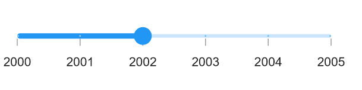
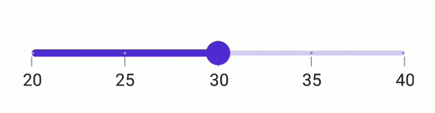

# Interval in .NET MAUI Slider (SfSlider)

This section explains about how to add the interval for numeric and date slider.

## Numeric interval

Slider elements like labels, ticks and dividers are rendered based on the [`Interval`](https://help.syncfusion.com/cr/maui/Syncfusion.Maui.Sliders.SliderBase.html#Syncfusion_Maui_Sliders_SliderBase_Interval), [`Minimum`](https://help.syncfusion.com/cr/maui/Syncfusion.Maui.Sliders.SliderBase.html#Syncfusion_Maui_Sliders_SliderBase_Minimum) and [`Maximum`](https://help.syncfusion.com/cr/maui/Syncfusion.Maui.Sliders.SliderBase.html#Syncfusion_Maui_Sliders_SliderBase_Maximum) properties. The default value is `Zero`.

For example, if [`Minimum`](https://help.syncfusion.com/cr/maui/Syncfusion.Maui.Sliders.SliderBase.html#Syncfusion_Maui_Sliders_SliderBase_Minimum) is 0.0 and [`Maximum`](https://help.syncfusion.com/cr/maui/Syncfusion.Maui.Sliders.SliderBase.html#Syncfusion_Maui_Sliders_SliderBase_Maximum) is 10.0 and [`Interval`](https://help.syncfusion.com/cr/maui/Syncfusion.Maui.Sliders.SliderBase.html#Syncfusion_Maui_Sliders_SliderBase_Interval) is 2.0, the slider will render the labels, major ticks, and dividers at 0.0, 2.0, 4.0 and so on.





<sliders:SfSlider Minimum="0" 
                  Maximum="10" 
                  Interval="2" 
                  Value="6" 
                  ShowLabels="True" 
                  ShowTicks="True" 
                  ShowDividers="True">
</sliders:SfSlider>





SfSlider slider = new SfSlider();
slider.Minimum = 0;
slider.Maximum = 10;
slider.Value = 6;
slider.Interval = 2;
slider.ShowLabels = true;
slider.ShowTicks = true;
slider.ShowDividers = true;





## Date interval

The type of date interval. It can be years to seconds. It is mandatory for date [`SfSlider`](https://help.syncfusion.com/cr/maui/Syncfusion.Maui.Sliders.SfSlider.html?tabs=tabid-1). The default value of  [`DateIntervalType`](https://help.syncfusion.com/cr/maui/Syncfusion.Maui.Sliders.SliderBase.html#Syncfusion_Maui_Sliders_SliderBase_DateIntervalType) property is `DateTime.Year`.

For date values, the slider does not have auto interval support. So, it is mandatory to set [`Interval`](https://help.syncfusion.com/cr/maui/Syncfusion.Maui.Sliders.SliderBase.html#Syncfusion_Maui_Sliders_SliderBase_Interval), [`DateIntervalType`](https://help.syncfusion.com/cr/maui/Syncfusion.Maui.Sliders.SliderBase.html#Syncfusion_Maui_Sliders_SliderBase_DateIntervalType), and [`DateFormat`](https://help.syncfusion.com/cr/maui/Syncfusion.Maui.Sliders.SliderBase.html#Syncfusion_Maui_Sliders_SliderBase_DateFormat) for date values.

For example, if [`Minimum`](https://help.syncfusion.com/cr/maui/Syncfusion.Maui.Sliders.SliderBase.html#Syncfusion_Maui_Sliders_SliderBase_Minimum) is `DateTime(2000, 01, 01)` and [`Maximum`](https://help.syncfusion.com/cr/maui/Syncfusion.Maui.Sliders.SliderBase.html#Syncfusion_Maui_Sliders_SliderBase_Maximum) is `DateTime(2005, 01, 01)` and [`Interval`](https://help.syncfusion.com/cr/maui/Syncfusion.Maui.Sliders.SliderBase.html#Syncfusion_Maui_Sliders_SliderBase_Interval) is `1`, [`DateIntervalType`](https://help.syncfusion.com/cr/maui/Syncfusion.Maui.Sliders.SliderBase.html#Syncfusion_Maui_Sliders_SliderBase_DateIntervalType) is [`SliderDateIntervalType.years`](https://help.syncfusion.com/cr/maui/Syncfusion.Maui.Sliders.SliderDateIntervalType.html#Syncfusion_Maui_Sliders_SliderDateIntervalType_Years), [`DateFormat`](https://help.syncfusion.com/cr/maui/Syncfusion.Maui.Sliders.SliderBase.html#Syncfusion_Maui_Sliders_SliderBase_DateFormat) is `yyyy` then the slider will render the labels, major ticks, and dividers at 2000, 2001, 2002 and so on.





<sliders:SfSlider Minimum="2000-01-01" 
                  Maximum="2005-01-01" 
                  Interval="1" 
                  Value="2002-01-01" 
                  DateFormat="yyyy" 
                  DateIntervalType="Years" 
                  ShowLabels="True"
                  ShowTicks="True" 
                  ShowDividers="True">
</sliders:SfSlider>





SfSlider slider = new SfSlider();
slider.Minimum = new DateTime(2000, 01, 01);
slider.Maximum = new DateTime(2005, 01, 01);
slider.Value = new DateTime(2002, 01, 01); 
slider.Interval = 1;
slider.DateIntervalType = SliderDateIntervalType.Years;
slider.DateFormat = "yyyy";
slider.ShowLabels = true;
slider.ShowTicks = true;
slider.ShowDividers = true;





## Discrete selection for numeric values

You can move the thumb in discrete manner for numeric values using the [`StepSize`](https://help.syncfusion.com/cr/maui/Syncfusion.Maui.Sliders.SliderBase.html#Syncfusion_Maui_Sliders_SliderBase_StepSize) property in the slider.





 <sliders:SfSlider Minimum="0" 
                    Maximum="10" 
                    Value="6"
                    StepSize="2" 
                    ShowLabels="True"
                    ShowTicks="True" 
                    ShowDividers="True">
 </sliders:SfSlider>                   





SfSlider slider = new SfSlider();
slider.Minimum = 0;
slider.Maximum = 10;
slider.StepSize = 2;
slider.Value = 6;
slider.ShowLabels = true;
slider.ShowTicks = true;
slider.ShowDividers = true;





## Discrete selection for date values

You can move the thumb in discrete manner for date values using the [`StepDuration`](https://help.syncfusion.com/cr/maui/Syncfusion.Maui.Sliders.SliderBase.html#Syncfusion_Maui_Sliders_SliderBase_StepDuration) property in the slider.

For example, if if [`Minimum`](https://help.syncfusion.com/cr/maui/Syncfusion.Maui.Sliders.SliderBase.html#Syncfusion_Maui_Sliders_SliderBase_Minimum) is DateTime(2015, 01, 01) and [`Maximum`](https://help.syncfusion.com/cr/maui/Syncfusion.Maui.Sliders.SliderBase.html#Syncfusion_Maui_Sliders_SliderBase_Maximum) is DateTime(2020, 01, 01) and [`StepDuration`](https://help.syncfusion.com/cr/maui/Syncfusion.Maui.Sliders.SliderBase.html#Syncfusion_Maui_Sliders_SliderBase_StepDuration) is `1`,the slider will move the thumbs at DateTime(2015, 01, 01), DateTime(2016, 01, 01), DateTime(2017, 01, 01),and DateTime(2018, 01, 01).





 <sliders:SfSlider Minimum="2000-01-01" 
                   Maximum="2005-01-01" 
                   Value="2002-01-01"
                   StepDuration="1"  
                   DateIntervalType="Years" >
</sliders:SfSlider>





SfSlider slider = new SfSlider();
slider.Minimum = new DateTime(2000, 01, 01);
slider.Maximum = new DateTime(2005, 01, 01);
slider.Value = new DateTime(2002, 01, 01); ;
slider.DateIntervalType = SliderDateIntervalType.Years;
slider.StepDuration = new SliderStepDuration(years: 1);





