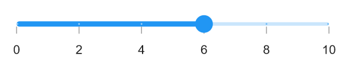

# Interval in .NET MAUI Slider (SfSlider)

This section explains how to add the interval for numeric slider.

## Numeric interval

Slider elements like labels, ticks and dividers are rendered based on the [`Interval`](https://help.syncfusion.com/cr/maui/Syncfusion.Maui.Sliders.RangeView-1.html#Syncfusion_Maui_Sliders_RangeView_1_Interval), [`Minimum`](https://help.syncfusion.com/cr/maui/Syncfusion.Maui.Sliders.SfSlider.html#Syncfusion_Maui_Sliders_SfSlider_Minimum) and [`Maximum`](https://help.syncfusion.com/cr/maui/Syncfusion.Maui.Sliders.SfSlider.html#Syncfusion_Maui_Sliders_SfSlider_Maximum) properties. The default value is `0`.

For example, if the [`Minimum`](https://help.syncfusion.com/cr/maui/Syncfusion.Maui.Sliders.SfSlider.html#Syncfusion_Maui_Sliders_SfSlider_Minimu) is 0.0, the [`Maximum`](https://help.syncfusion.com/cr/maui/Syncfusion.Maui.Sliders.SfSlider.html#Syncfusion_Maui_Sliders_SfSlider_Maximum) is 10.0, and [`Interval`](https://help.syncfusion.com/cr/maui/Syncfusion.Maui.Sliders.RangeView-1.html#Syncfusion_Maui_Sliders_RangeView_1_Interval) is 2.0, the slider will render the labels, major ticks, and dividers at 0.0, 2.0, 4.0, and so on.





<sliders:SfSlider Minimum="0"
                  Maximum="10"
                  Interval="2"
                  Value="5"
                  ShowLabels="True"
                  ShowTicks="True"
                  ShowDividers="True" />





SfSlider slider = new SfSlider()
{
    Minimum = 0,
    Maximum = 10,
    Value = 5,
    Interval = 2,
    ShowDividers = true,
    ShowLabels = true,
    ShowTicks = true,
};





## Auto interval

If the [`ShowTicks`](https://help.syncfusion.com/cr/maui/Syncfusion.Maui.Sliders.RangeView-1.html#Syncfusion_Maui_Sliders_RangeView_1_ShowTicks) or [`ShowLabels`](https://help.syncfusion.com/cr/maui/Syncfusion.Maui.Sliders.RangeView-1.html#Syncfusion_Maui_Sliders_RangeView_1_ShowLabels), or [`ShowDividers`](https://help.syncfusion.com/cr/maui/Syncfusion.Maui.Sliders.RangeView-1.html#Syncfusion_Maui_Sliders_RangeView_1_ShowDividers) properties are `True`, but the [`Interval`](https://help.syncfusion.com/cr/maui/Syncfusion.Maui.Sliders.RangeView-1.html#Syncfusion_Maui_Sliders_RangeView_1_Interval) is `0`, the [`Interval`](https://help.syncfusion.com/cr/maui/Syncfusion.Maui.Sliders.RangeView-1.html#Syncfusion_Maui_Sliders_RangeView_1_Interval) will be calculated from the available size.

For example, if the [`Minimum`](https://help.syncfusion.com/cr/maui/Syncfusion.Maui.Sliders.RangeView-1.html#Syncfusion_Maui_Sliders_RangeView_1_Minimum) is 0, the [`Maximum`](https://help.syncfusion.com/cr/maui/Syncfusion.Maui.Sliders.RangeView-1.html#Syncfusion_Maui_Sliders_RangeView_1_Maximum) is 10.0, [`Interval`](https://help.syncfusion.com/cr/maui/Syncfusion.Maui.Sliders.RangeView-1.html#Syncfusion_Maui_Sliders_RangeView_1_Interval) is 0.0, and consider the screen size as 350, the Range Selector will render the labels, major ticks, and dividers at 0.0, 2.0, 4.0, 6.0, 8.0, and 10.0.





<sliders:SfSlider Minimum="0"
                  Maximum="10"
                  Value="5"
                  ShowLabels="True"
                  ShowTicks="True"
                  ShowDividers="True" />





SfSlider slider = new SfSlider()
{
    Minimum = 0,
    Maximum = 10,
    Value = 5,
    ShowDividers = true,
    ShowLabels = true,
    ShowTicks = true,
};



