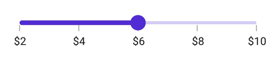
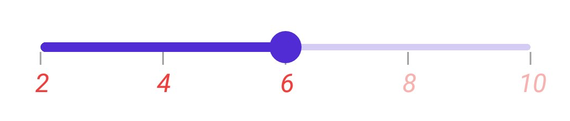
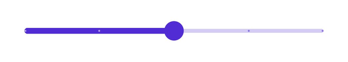
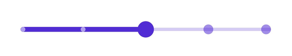
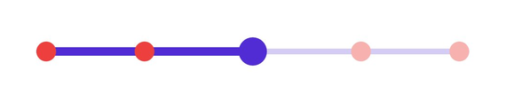

# Labels and Dividers in .NET MAUI Slider (SfSlider)

This section explains about how to add the labels and dividers in the slider.

## Show labels

The `ShowLabels` property is used to render the labels on given interval. The default value of `ShowLabels` property is `False`.





<sliders:SfSlider Minimum="0" 
                  Maximum="10"
                  Interval="2"
                  ShowLabels="True"
                  ShowTicks="True">
</sliders:SfSlider>





SfSlider slider = new SfSlider();
slider.Interval = 0.2;
slider.ShowLabels = true;





## Number format

The `NumberFormat` property is used to format the numeric labels. The default value of `NumberFormat` property is `0.##`.





<sliders:SfSlider Minimum="2" 
                  Maximum="10"
                  Value="6"
		  Interval="2"  
		  NumberFormat="$##" 
		  ShowLabels="True"
            ShowTicks="True">
</sliders:SfSlider>





SfSlider slider = new SfSlider();
slider.Minimum = 2;
slider.Maximum = 10;
slider.Value = 6;
slider.Interval = 2;
slider.NumberFormat = "$##";
slider.ShowLabels = true;





## Date format

The `DateFormat` property is used to format the date labels. It is mandatory for date `SfSlider`. For date values, the slider does not have auto interval support. So, it is mandatory to set `Interval`, `DateIntervalType`, and `DateFormat` for date values. The default value of `DateFormat` property is `yyyy`.





<sliders:SfSlider Minimum="2000-01-01T09:00:00" 
                  Maximum="2000-01-01T17:00:00" 
                  Value="2000-01-01T13:00:00" 
          	  ShowLabels="True"  
		  DateIntervalType="Hours" 
		  Interval="2" 
		  DateFormat="h tt">
</sliders:SfSlider>





SfSlider slider = new SfSlider();
slider.Minimum = new DateTime(2000, 01, 01, 09, 00, 00);
slider.Maximum = new DateTime(2000, 01, 01, 17, 00, 00);
slider.Value = new DateTime(2000, 01, 01, 13, 00, 00);
slider.Interval = 2;
slider.DateIntervalType = SliderDateIntervalType.Hours;
slider.DateFormat = "h tt";
slider.ShowLabels = true;
    




## Label placement

The `LabelsPlacement` property is used to place the labels either between the major ticks or on the major ticks. The default value of the `LabelsPlacement` property is `SliderLabelsPlacement.OnTicks`.





<sliders:SfSlider Minimum="0" 
                  Maximum="10"
                  Value="6"
		  Interval="2"  
		  LabelsPlacement="BetweenTicks" 
		  ShowLabels="True" 
		  ShowTicks="True">
</sliders:SfSlider>





SfSlider slider = new SfSlider();
slider.Minimum = 0;
slider.Maximum = 10;
slider.Value = 6;
slider.Interval = 2;
slider.LabelsPlacement = SliderLabelsPlacement.BetweenTicks;
slider.ShowLabels = true;
slider.ShowTicks = true;





## Customize label text

You can format or change the whole numeric or date label text using the `LabelCreated` event. The `SliderLabelCreatedEventArgs` contains the following parameters,

* Text – Customize the text color using the `Text` parameter.
* Style – Formats the text color, font size, font family, offset using the `Style` parameter.





<sliders:SfSlider Minimum="2" 
                  Maximum="10" 
                  Value="6" 
		  Interval="2" 	           
	          LabelCreated="OnLabelCreated" 
		  ShowLabels="True">
</sliders:SfSlider>





{
   SfSlider slider = new SfSlider();
   slider.Minimum = 2;
   slider.Maximum = 10;
   slider.Value = 6;
   slider.Interval = 2;
   slider.ShowLabels = true;
   sfslider.LabelCreated += OnLabelCreated;
 }

 private void OnLabelCreated(object sender, SliderLabelCreatedEventArgs e)
 {
   e.Text = "$" + e.Text;
 }





## Label style

You can change the active and inactive label appearance of the slider using the `ActiveTextColor`, `ActiveFontSize`, `ActiveFontFamily`, `ActiveFontAttributes`, `InactiveTextColor`, `InactiveFontSize`, `InactiveFontFamily`, `InactiveFontAttributes` and `Offset`  properties of the `LabelStyle` class.

The active side of the slider is between the `Minimum` value and the thumb.

The inactive side of the slider is between the thumb and the `Maximum` value.





<sliders:SfSlider Minimum="2" 
                  Maximum="10" 
                  Interval="2" 
                  ShowTicks="True"  
                  ShowLabels="True">
    <sliders:SfSlider.LabelStyle>
         <sliders:SliderLabelStyle ActiveTextColor="#EE3F3F" 
                                   InactiveTextColor="#F7B1AE" 
	             		   ActiveFontAttributes="Italic" 
				   InactiveFontAttributes="Italic" 
				   ActiveFontSize="16" 
				   InactiveFontSize="16" />
    </sliders:SfSlider.LabelStyle>
</sliders:SfSlider>





SfSlider slider = new SfSlider();
slider.Minimum = 2;
slider.Maximum = 10;
slider.Interval = 2;
slider.ShowLabels = true;
slider.ShowTicks = true;
slider.LabelStyle.ActiveTextColor = Color.FromArgb("#EE3F3F");
slider.LabelStyle.InactiveTextColor = Color.FromArgb("#F7B1AE");
slider.LabelStyle.ActiveFontSize = 16;
slider.LabelStyle.InactiveFontSize = 16;
slider.LabelStyle.ActiveFontAttributes = FontAttributes.Italic;
slider.LabelStyle.InactiveFontAttributes = FontAttributes.Italic;





## Label offset

You can adjust the space between ticks and labels of the slider using the `Offset` property. The default value of the `Offset` property is 5.0 when `ShowTicks` enabled, otherwise it is `15.0` by default.





<sliders:SfSlider Minimum="2" 
                  Maximum="10" 
                  Interval="2" 
                  ShowLabels="True">
    <sliders:SfSlider.LabelStyle>
        <sliders:SliderLabelStyle Offset="10" />
     </sliders:SfSlider.LabelStyle>
</sliders:SfSlider>





SfSlider slider = new SfSlider();
slider.Minimum = 2;
slider.Maximum = 10;
slider.Interval = 2;
slider.ShowLabels = true;
slider.ShowTicks = true;
slider.LabelStyle.Offset = 10;





## Show dividers

The `ShowDividers` property is used to render the dividers on the track. The default value of the `ShowDividers` property is `False`. It is a shape which is used to represent the major interval points of the track.

For example, if `Minimum` is 0.0 and `Maximum` is 10.0 and `Interval` is 2.0, the slider will render the dividers at 0.0, 2.0, 4.0 and so on.





<sliders:SfSlider Interval="0.2" 
                  ShowDividers="True">
</sliders:SfSlider>





SfSlider slider = new SfSlider();
slider.Interval = 0.2;
slider.ShowDividers = true;





## Divider radius

You can change the active and inactive divider radius of the slider using the `ActiveRadius` and the `InactiveRadius` properties of the `DividerStyle` class.





<sliders:SfSlider Interval="0.2" 
                  ShowDividers="True">
    <sliders:SfSlider.DividerStyle>
         <sliders:SliderDividerStyle ActiveRadius="7" 
                                     InactiveRadius="7" />
    </sliders:SfSlider.DividerStyle>
</sliders:SfSlider>





SfSlider slider = new SfSlider();
slider.Interval = 0.2;
slider.ShowDividers = true;
slider.DividerStyle.ActiveRadius = 7;
slider.DividerStyle.InactiveRadius = 7;





## Divider stroke width and stroke color

You can change the active and inactive divider stroke width of the slider using the `ActiveStrokeWidth` and the `InactiveStrokeWidth` properties of the `DividerStyle` class.

Also, you can change the active and inactive divider stroke color of the slider using the `ActiveStrokeColor` and the `InactiveStrokeColor` properties of the `DividerStyle` class.





<sliders:SfSlider Interval="0.2" 
                  ShowDividers="True">
    <sliders:SfSlider.DividerStyle>
         <sliders:SliderDividerStyle ActiveRadius="7" 
                                     InactiveRadius="7" 
            			     ActiveStrokeWidth="2" 
				     InactiveStrokeWidth="2" 
				     ActiveStrokeColor="#EE3F3F" 
				     InactiveStrokeColor="#F7B1AE"/>
     </sliders:SfSlider.DividerStyle>
</sliders:SfSlider>





SfSlider slider = new SfSlider();
slider.Interval = 0.2;
slider.ShowDividers = true;
slider.DividerStyle.ActiveRadius = 7;
slider.DividerStyle.InactiveRadius = 7;
slider.DividerStyle.ActiveStrokeColor = new SolidColorBrush(Color.FromArgb("#EE3F3F"));
slider.DividerStyle.InactiveStrokeColor = new SolidColorBrush(Color.FromArgb("#F7B1AE"));
slider.DividerStyle.ActiveStrokeWidth = 2;
slider.DividerStyle.InactiveStrokeWidth = 2;





## Divider color

You can change the active and inactive divider color of the slider using the `ActiveColor` and `InactiveColor` properties of the `DividerStyle` class.





<sliders:SfSlider Interval="0.2" 
                  ShowDividers="True">
    <sliders:SfSlider.DividerStyle>
       <sliders:SliderDividerStyle ActiveRadius="7" 
                                   InactiveRadius="7" 
				   ActiveColor="#EE3F3F" 
				   InactiveColor="#F7B1AE"/>
      </sliders:SfSlider.DividerStyle>
</sliders:SfSlider>





SfSlider slider = new SfSlider();
slider.Interval = 0.2;
slider.ShowDividers = true;
slider.DividerStyle.ActiveRadius = 7;
slider.DividerStyle.InactiveRadius = 7;
slider.DividerStyle.ActiveColor = new SolidColorBrush(Color.FromArgb("#EE3F3F"));
slider.DividerStyle.InactiveColor = new SolidColorBrush(Color.FromArgb("#F7B1AE"));





