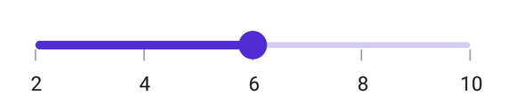
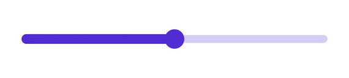

# Labels in .NET MAUI Slider (SfSlider)

This section explains about how to add the labels in the slider.

## Show labels

The [`ShowLabels`](https://help.syncfusion.com/cr/maui/Syncfusion.Maui.Sliders.SliderBase.html#Syncfusion_Maui_Sliders_SliderBase_ShowLabels) property is used to render the labels on given interval. The default value of [`ShowLabels`](https://help.syncfusion.com/cr/maui/Syncfusion.Maui.Sliders.SliderBase.html#Syncfusion_Maui_Sliders_SliderBase_ShowLabels) property is `False`.





<sliders:SfSlider Minimum="0" 
                  Maximum="10"
                  Value="6"
                  Interval="2"
                  ShowLabels="True"
                  ShowTicks="True">
</sliders:SfSlider>





SfSlider slider = new SfSlider();
slider.Minimum = 2;
slider.Maximum = 10;
slider.Value = 6;
slider.Interval = 2;
slider.ShowTicks = true;
slider.ShowLabels = true;





## Number format

The [`NumberFormat`](https://help.syncfusion.com/cr/maui/Syncfusion.Maui.Sliders.SliderBase.html#Syncfusion_Maui_Sliders_SliderBase_NumberFormat) property is used to format the numeric labels. The default value of [`NumberFormat`](https://help.syncfusion.com/cr/maui/Syncfusion.Maui.Sliders.SliderBase.html#Syncfusion_Maui_Sliders_SliderBase_NumberFormat) property is `0.##`.





<sliders:SfSlider Minimum="2" 
                  Maximum="10"
                  Value="6"
		  Interval="2"  
		  NumberFormat="$##" 
		  ShowLabels="True"
                  ShowTicks="True">
</sliders:SfSlider>





SfSlider slider = new SfSlider();
slider.Minimum = 2;
slider.Maximum = 10;
slider.Value = 6;
slider.Interval = 2;
slider.NumberFormat = "$##";
slider.ShowLabels = true;





## Date format

The [`DateFormat`](https://help.syncfusion.com/cr/maui/Syncfusion.Maui.Sliders.SliderBase.html#Syncfusion_Maui_Sliders_SliderBase_DateFormat) property is used to format the date labels. It is mandatory for date [`SfSlider`](https://help.syncfusion.com/cr/maui/Syncfusion.Maui.Sliders.SfSlider.html). For date values, the slider does not have auto interval support. So, it is mandatory to set [`Interval`](https://help.syncfusion.com/cr/maui/Syncfusion.Maui.Sliders.SliderBase.html#Syncfusion_Maui_Sliders_SliderBase_Interval), [`DateIntervalType`](https://help.syncfusion.com/cr/maui/Syncfusion.Maui.Sliders.SliderBase.html#Syncfusion_Maui_Sliders_SliderBase_DateIntervalType), and [`DateFormat`](https://help.syncfusion.com/cr/maui/Syncfusion.Maui.Sliders.SliderBase.html#Syncfusion_Maui_Sliders_SliderBase_DateFormat) for date values. The default value of [`DateFormat`](https://help.syncfusion.com/cr/maui/Syncfusion.Maui.Sliders.SliderBase.html#Syncfusion_Maui_Sliders_SliderBase_DateFormat) property is `yyyy`.





<sliders:SfSlider Minimum="2000-01-01T09:00:00" 
                  Maximum="2000-01-01T17:00:00" 
                  Value="2000-01-01T13:00:00" 
          	  ShowLabels="True"  
		  DateIntervalType="Hours" 
		  Interval="2" 
		  DateFormat="h tt">
</sliders:SfSlider>





SfSlider slider = new SfSlider();
slider.Minimum = new DateTime(2000, 01, 01, 09, 00, 00);
slider.Maximum = new DateTime(2000, 01, 01, 17, 00, 00);
slider.Value = new DateTime(2000, 01, 01, 13, 00, 00);
slider.Interval = 2;
slider.DateIntervalType = SliderDateIntervalType.Hours;
slider.DateFormat = "h tt";
slider.ShowLabels = true;
    




## Label placement

The [`LabelsPlacement`](https://help.syncfusion.com/cr/maui/Syncfusion.Maui.Sliders.SliderBase.html#Syncfusion_Maui_Sliders_SliderBase_LabelsPlacement) property is used to place the labels either between the major ticks or on the major ticks. The default value of the [`LabelsPlacement`](https://help.syncfusion.com/cr/maui/Syncfusion.Maui.Sliders.SliderBase.html#Syncfusion_Maui_Sliders_SliderBase_LabelsPlacement) property is [`SliderLabelsPlacement.OnTicks`](https://help.syncfusion.com/cr/maui/Syncfusion.Maui.Sliders.SliderLabelsPlacement.html#Syncfusion_Maui_Sliders_SliderLabelsPlacement_OnTicks).





<sliders:SfSlider Minimum="0" 
                  Maximum="10"
                  Value="6"
		  Interval="2"  
		  LabelsPlacement="BetweenTicks" 
		  ShowLabels="True" 
		  ShowTicks="True">
</sliders:SfSlider>





SfSlider slider = new SfSlider();
slider.Minimum = 0;
slider.Maximum = 10;
slider.Value = 6;
slider.Interval = 2;
slider.LabelsPlacement = SliderLabelsPlacement.BetweenTicks;
slider.ShowLabels = true;
slider.ShowTicks = true;





N> Refer [here](https://help.syncfusion.com/maui/slider/events) to customize the label text format through slider events.

## Label style

You can change the active and inactive label appearance of the slider using the [`ActiveTextColor`](https://help.syncfusion.com/cr/maui/Syncfusion.Maui.Sliders.SliderLabelStyle.html#Syncfusion_Maui_Sliders_SliderLabelStyle_ActiveTextColor), [`ActiveFontSize`](https://help.syncfusion.com/cr/maui/Syncfusion.Maui.Sliders.SliderLabelStyle.html#Syncfusion_Maui_Sliders_SliderLabelStyle_ActiveFontSize), [`ActiveFontFamily`](https://help.syncfusion.com/cr/maui/Syncfusion.Maui.Sliders.SliderLabelStyle.html#Syncfusion_Maui_Sliders_SliderLabelStyle_ActiveFontFamily), [`ActiveFontAttributes`](https://help.syncfusion.com/cr/maui/Syncfusion.Maui.Sliders.SliderLabelStyle.html#Syncfusion_Maui_Sliders_SliderLabelStyle_ActiveFontAttributes), [`InactiveTextColor`](https://help.syncfusion.com/cr/maui/Syncfusion.Maui.Sliders.SliderLabelStyle.html#Syncfusion_Maui_Sliders_SliderLabelStyle_InactiveTextColor), [`InactiveFontSize`](https://help.syncfusion.com/cr/maui/Syncfusion.Maui.Sliders.SliderLabelStyle.html#Syncfusion_Maui_Sliders_SliderLabelStyle_InactiveFontSize), [`InactiveFontFamily`](https://help.syncfusion.com/cr/maui/Syncfusion.Maui.Sliders.SliderLabelStyle.html#Syncfusion_Maui_Sliders_SliderLabelStyle_InactiveFontFamily), [`InactiveFontAttributes`](https://help.syncfusion.com/cr/maui/Syncfusion.Maui.Sliders.SliderLabelStyle.html#Syncfusion_Maui_Sliders_SliderLabelStyle_InactiveFontAttributes) and [`Offset`](https://help.syncfusion.com/cr/maui/Syncfusion.Maui.Sliders.SliderLabelStyle.html#Syncfusion_Maui_Sliders_SliderLabelStyle_Offset)  properties of the [`LabelStyle`](https://help.syncfusion.com/cr/maui/Syncfusion.Maui.Sliders.SliderLabelStyle.html) class.

The active side of the slider is between the [`Minimum`](https://help.syncfusion.com/cr/maui/Syncfusion.Maui.Sliders.SliderBase.html#Syncfusion_Maui_Sliders_SliderBase_Minimum) value and the thumb.

The inactive side of the slider is between the thumb and the [`Maximum`](https://help.syncfusion.com/cr/maui/Syncfusion.Maui.Sliders.SliderBase.html#Syncfusion_Maui_Sliders_SliderBase_Maximum) value.





<sliders:SfSlider Minimum="2" 
                  Maximum="10" 
                  Interval="2" 
                  ShowTicks="True"  
                  ShowLabels="True">
    <sliders:SfSlider.LabelStyle>
         <sliders:SliderLabelStyle ActiveTextColor="#EE3F3F" 
                                   InactiveTextColor="#F7B1AE" 
	             		   ActiveFontAttributes="Italic" 
				   InactiveFontAttributes="Italic" 
				   ActiveFontSize="16" 
				   InactiveFontSize="16" />
    </sliders:SfSlider.LabelStyle>
</sliders:SfSlider>





SfSlider slider = new SfSlider();
slider.Minimum = 2;
slider.Maximum = 10;
slider.Interval = 2;
slider.ShowLabels = true;
slider.ShowTicks = true;
slider.LabelStyle.ActiveTextColor = Color.FromArgb("#EE3F3F");
slider.LabelStyle.InactiveTextColor = Color.FromArgb("#F7B1AE");
slider.LabelStyle.ActiveFontSize = 16;
slider.LabelStyle.InactiveFontSize = 16;
slider.LabelStyle.ActiveFontAttributes = FontAttributes.Italic;
slider.LabelStyle.InactiveFontAttributes = FontAttributes.Italic;





## Label offset

You can adjust the space between ticks and labels of the slider using the [`Offset`](https://help.syncfusion.com/cr/maui/Syncfusion.Maui.Sliders.SliderLabelStyle.html#Syncfusion_Maui_Sliders_SliderLabelStyle_OffsetProperty) property. The default value of the [`Offset`](https://help.syncfusion.com/cr/maui/Syncfusion.Maui.Sliders.SliderLabelStyle.html#Syncfusion_Maui_Sliders_SliderLabelStyle_OffsetProperty) property is 5.0 when [`ShowTicks`](https://help.syncfusion.com/cr/maui/Syncfusion.Maui.Sliders.SliderBase.html#Syncfusion_Maui_Sliders_SliderBase_ShowTicks) enabled, otherwise it is `15.0` by default.





<sliders:SfSlider Minimum="2" 
                  Maximum="10" 
                  Interval="2" 
                  ShowTicks="True"
                  ShowLabels="True">
    <sliders:SfSlider.LabelStyle>
        <sliders:SliderLabelStyle Offset="10" />
     </sliders:SfSlider.LabelStyle>
</sliders:SfSlider>





SfSlider slider = new SfSlider();
slider.Minimum = 2;
slider.Maximum = 10;
slider.Interval = 2;
slider.ShowLabels = true;
slider.ShowTicks = true;
slider.LabelStyle.Offset = 10;





## Disabled labels

You can change the state of the slider to disabled by setting `false` to the `IsEnabled` property. Using the Visual State Manager (VSM), You can customize the slider labels properties based on the visual states. The applicable visual states are enabled(default) and disabled.





<sliders:SfSlider>
   <sliders:SfSlider.TrackStyle>
       <sliders:SliderTrackStyle ActiveSize="10" InactiveSize="8" />
   </sliders:SfSlider.TrackStyle>
</sliders:SfSlider>





SfSlider slider = new SfSlider();
slider.TrackStyle.ActiveSize = 10;
slider.TrackStyle.InactiveSize = 8;





