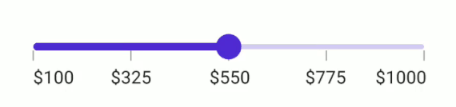
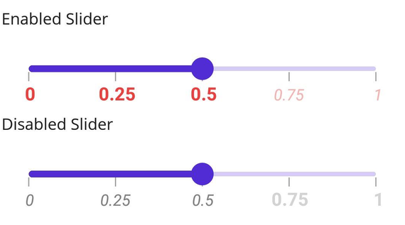

# Labels in .NET MAUI Slider (SfSlider)

This section explains how to add the labels in the slider.

## Show labels

The [`ShowLabels`](https://help.syncfusion.com/cr/maui/Syncfusion.Maui.Sliders.RangeView-1.html#Syncfusion_Maui_Sliders_RangeView_1_ShowLabels) property is used to render the labels on given interval. The default value of the [`ShowLabels`](https://help.syncfusion.com/cr/maui/Syncfusion.Maui.Sliders.RangeView-1.html#Syncfusion_Maui_Sliders_RangeView_1_ShowLabels) property is `False`.





<sliders:SfSlider Minimum="2"
                  Maximum="10"
                  Value="6"
                  Interval="2"
                  ShowLabels="True"
                  ShowTicks="True" />





SfSlider slider = new SfSlider()
{
    Minimum = 2,
    Maximum = 10,
    Value = 6,
    Interval = 2,
    ShowLabels = true,
    ShowTicks = true,
};





## Number format

The [`NumberFormat`](https://help.syncfusion.com/cr/maui/Syncfusion.Maui.Sliders.SfSlider.html#Syncfusion_Maui_Sliders_SfSlider_NumberFormat) property is used to format the numeric labels. The default value of the [`NumberFormat`](https://help.syncfusion.com/cr/maui/Syncfusion.Maui.Sliders.SfSlider.html#Syncfusion_Maui_Sliders_SfSlider_NumberFormat) property is `0.##`.





<sliders:SfSlider Minimum="2"
                  Maximum="10"
                  Value="6"
                  Interval="2"
                  NumberFormat="$##"
                  ShowLabels="True"
                  ShowTicks="True" />





SfSlider slider = new SfSlider()
{
    Minimum = 2,
    Maximum = 10,
    Value = 6,
    Interval = 2,
    NumberFormat = "$##",
    ShowLabels = true,
    ShowTicks = true,
};





## Label placement

The [`LabelsPlacement`](https://help.syncfusion.com/cr/maui/Syncfusion.Maui.Sliders.RangeView-1.html#Syncfusion_Maui_Sliders_RangeView_1_LabelsPlacement) property is used to place the labels either between the major ticks or on the major ticks. The default value of the [`LabelsPlacement`](https://help.syncfusion.com/cr/maui/Syncfusion.Maui.Sliders.RangeView-1.html#Syncfusion_Maui_Sliders_RangeView_1_LabelsPlacement) property is [`SliderLabelsPlacement.OnTicks`](https://help.syncfusion.com/cr/maui/Syncfusion.Maui.Sliders.SliderLabelsPlacement.html#Syncfusion_Maui_Sliders_SliderLabelsPlacement_OnTicks).





<sliders:SfSlider Minimum="0"
                  Maximum="10"
                  Value="5"
                  Interval="2"
                  LabelsPlacement="BetweenTicks"
                  ShowLabels="True"
                  ShowTicks="True" />





SfSlider slider = new SfSlider()
{
    Minimum = 0,
    Maximum = 10,
    Value = 5,
    Interval = 2,
    ShowLabels = true,
    ShowTicks = true,
    LabelsPlacement = SliderLabelsPlacement.BetweenTicks,
};





N> Refer [here](https://help.syncfusion.com/maui/slider/events-and-commands) to customize the label text format through slider events.

## Edge labels placement

The [`EdgeLabelsPlacement`](https://help.syncfusion.com/cr/maui/Syncfusion.Maui.Sliders.RangeView-1.html#Syncfusion_Maui_Sliders_RangeView_1_EdgeLabelsPlacement) property is used to move the first and the last label either inside the track bounds or based on the intervals. The default value of the [`EdgeLabelsPlacement`](https://help.syncfusion.com/cr/maui/Syncfusion.Maui.Sliders.RangeView-1.html#Syncfusion_Maui_Sliders_RangeView_1_EdgeLabelsPlacement) property is [`SliderEdgeLabelPlacement.Default`](https://help.syncfusion.com/cr/maui/Syncfusion.Maui.Sliders.SliderEdgeLabelsPlacement.html#Syncfusion_Maui_Sliders_SliderEdgeLabelsPlacement_Default).

If the [`TrackExtent`](https://help.syncfusion.com/cr/maui/Syncfusion.Maui.Sliders.RangeView-1.html#Syncfusion_Maui_Sliders_RangeView_1_TrackExtent) > 0 and the [`EdgeLabelsPlacement`](https://help.syncfusion.com/cr/maui/Syncfusion.Maui.Sliders.RangeView-1.html#Syncfusion_Maui_Sliders_RangeView_1_EdgeLabelsPlacement) is [`SliderEdgeLabelsPlacement.Inside`](https://help.syncfusion.com/cr/maui/Syncfusion.Maui.Sliders.SliderEdgeLabelsPlacement.html#Syncfusion_Maui_Sliders_SliderEdgeLabelsPlacement_Inside), the labels get placed inside the extended track edges. 





<sliders:SfSlider Minimum="100"
                  Maximum="1000"
                  Value="550"
                  Interval="225"
                  ShowLabels="True"
                  ShowTicks="True"
                  NumberFormat="$##"
                  EdgeLabelsPlacement="Inside" />





SfSlider slider = new SfSlider()
{
    Minimum = 100,
    Maximum = 100,
    Value = 550,
    Interval = 225,
    ShowTicks = true,
    ShowLabels = true,
    ShowDividers = true,
    NumberFormat = "$##",
    EdgeLabelsPlacement = SliderEdgeLabelsPlacement.Inside
};





## Label style

Change the active and inactive label appearance of the slider using the [`ActiveTextColor`](https://help.syncfusion.com/cr/maui/Syncfusion.Maui.Sliders.SliderLabelStyle.html#Syncfusion_Maui_Sliders_SliderLabelStyle_ActiveTextColor), [`ActiveFontSize`](https://help.syncfusion.com/cr/maui/Syncfusion.Maui.Sliders.SliderLabelStyle.html#Syncfusion_Maui_Sliders_SliderLabelStyle_ActiveFontSize), [`ActiveFontFamily`](https://help.syncfusion.com/cr/maui/Syncfusion.Maui.Sliders.SliderLabelStyle.html#Syncfusion_Maui_Sliders_SliderLabelStyle_ActiveFontFamily), [`ActiveFontAttributes`](https://help.syncfusion.com/cr/maui/Syncfusion.Maui.Sliders.SliderLabelStyle.html#Syncfusion_Maui_Sliders_SliderLabelStyle_ActiveFontAttributes), [`InactiveTextColor`](https://help.syncfusion.com/cr/maui/Syncfusion.Maui.Sliders.SliderLabelStyle.html#Syncfusion_Maui_Sliders_SliderLabelStyle_InactiveTextColor), [`InactiveFontSize`](https://help.syncfusion.com/cr/maui/Syncfusion.Maui.Sliders.SliderLabelStyle.html#Syncfusion_Maui_Sliders_SliderLabelStyle_InactiveFontSize), [`InactiveFontFamily`](https://help.syncfusion.com/cr/maui/Syncfusion.Maui.Sliders.SliderLabelStyle.html#Syncfusion_Maui_Sliders_SliderLabelStyle_InactiveFontFamily), [`InactiveFontAttributes`](https://help.syncfusion.com/cr/maui/Syncfusion.Maui.Sliders.SliderLabelStyle.html#Syncfusion_Maui_Sliders_SliderLabelStyle_InactiveFontAttributes) and [`Offset`](https://help.syncfusion.com/cr/maui/Syncfusion.Maui.Sliders.SliderLabelStyle.html#Syncfusion_Maui_Sliders_SliderLabelStyle_Offset)  properties of the [`LabelStyle`](https://help.syncfusion.com/cr/maui/Syncfusion.Maui.Sliders.SliderLabelStyle.html) class.

The active side of the slider is between the [`Minimum`](https://help.syncfusion.com/cr/maui/Syncfusion.Maui.Sliders.SfSlider.html#Syncfusion_Maui_Sliders_SfSlider_Minimum) value and the thumb.

The inactive side of the slider is between the thumb and the [`Maximum`](https://help.syncfusion.com/cr/maui/Syncfusion.Maui.Sliders.SfSlider.html#Syncfusion_Maui_Sliders_SfSlider_Maximum) value.





<sliders:SfSlider Minimum="2"
                  Maximum="10"
                  Value="6"
                  Interval="2"
                  ShowTicks="True"
                  ShowLabels="True">
    
    <sliders:SfSlider.LabelStyle>
        <sliders:SliderLabelStyle ActiveTextColor="#EE3F3F"
                                  InactiveTextColor="#F7B1AE"
                                  ActiveFontAttributes="Italic"
                                  InactiveFontAttributes="Italic"
                                  ActiveFontSize="16"
                                  InactiveFontSize="16" />
    </sliders:SfSlider.LabelStyle>
    
</sliders:SfSlider>





SfSlider slider = new SfSlider()
{
    Minimum = 2,
    Maximum = 10,
    Value = 6,
    Interval = 2,
    ShowLabels = true,
    ShowTicks = true,
};
slider.LabelStyle.ActiveTextColor = Color.FromArgb("#EE3F3F");
slider.LabelStyle.InactiveTextColor = Color.FromArgb("#F7B1AE");
slider.LabelStyle.ActiveFontSize = 16;
slider.LabelStyle.InactiveFontSize = 16;
slider.LabelStyle.ActiveFontAttributes = FontAttributes.Italic;
slider.LabelStyle.InactiveFontAttributes = FontAttributes.Italic;





## Label offset

Adjust the space between ticks and labels of the slider using the [`Offset`](https://help.syncfusion.com/cr/maui/Syncfusion.Maui.Sliders.SliderLabelStyle.html#Syncfusion_Maui_Sliders_SliderLabelStyle_OffsetProperty) property. The default value of the [`Offset`](https://help.syncfusion.com/cr/maui/Syncfusion.Maui.Sliders.SliderLabelStyle.html#Syncfusion_Maui_Sliders_SliderLabelStyle_OffsetProperty) property is 5.0 when [`ShowTicks`](https://help.syncfusion.com/cr/maui/Syncfusion.Maui.Sliders.RangeView-1.html#Syncfusion_Maui_Sliders_RangeView_1_ShowTicks) enabled, otherwise it is `15.0` by default.





<sliders:SfSlider Minimum="2"
                  Maximum="10"
                  Value="6"
                  Interval="2"
                  ShowTicks="True"
                  ShowLabels="True">

    <sliders:SfSlider.LabelStyle>
        <sliders:SliderLabelStyle Offset="10" />
    </sliders:SfSlider.LabelStyle>

</sliders:SfSlider>





SfSlider slider = new SfSlider()
{
    Minimum = 2,
    Maximum = 10,
    Value = 6,
    Interval = 2,
    ShowLabels = true,
    ShowTicks = true,
};
slider.LabelStyle.Offset = 10;





## Disabled labels

Change the state of the slider to disabled by setting `false` to the `IsEnabled` property. Using the Visual State Manager (VSM), customize the slider labels properties based on the visual states. The applicable visual states are enabled(default) and disabled.





<ContentPage.Resources>
    
</ContentPage.Resources>

<ContentPage.Content>
    <VerticalStackLayout>
        <Label Text="Enabled"
               Padding="24,10" />
        <sliders:SfSlider />
        <Label Text="Disabled"
               Padding="24,10" />
        <sliders:SfSlider IsEnabled="False" />
    </VerticalStackLayout>
</ContentPage.Content>





VerticalStackLayout stackLayout = new VerticalStackLayout();
SfSlider defaultSlider = new()
{
    Interval = 0.25,
    ShowTicks = true,
    ShowLabels = true
};
SfSlider disabledSlider = new()
{
    IsEnabled = false,
    Interval = 0.25,
    ShowTicks = true,
    ShowLabels = true
};

VisualStateGroupList visualStateGroupList = new VisualStateGroupList();
VisualStateGroup commonStateGroup = new VisualStateGroup();
// Default State.
VisualState defaultState = new VisualState { Name = "Default" };
defaultState.Setters.Add(new Setter
{
    Property = SfSlider.LabelStyleProperty,
    Value = new SliderLabelStyle
    {
        ActiveFontSize = 16,
        InactiveFontSize = 14,
        ActiveTextColor = Color.FromArgb("#EE3F3F"),
        InactiveTextColor = Color.FromArgb("#F7B1AE"),
        ActiveFontAttributes = FontAttributes.Bold,
        InactiveFontAttributes = FontAttributes.Italic,
    }
});
// Disabled State.
VisualState disabledState = new VisualState { Name = "Disabled" };
disabledState.Setters.Add(new Setter
{
    Property = SfSlider.LabelStyleProperty,
    Value = new SliderLabelStyle
    {
        ActiveFontSize = 14,
        InactiveFontSize = 16,
        ActiveTextColor = Colors.Gray,
        InactiveTextColor = Colors.LightGray,
        ActiveFontAttributes = FontAttributes.Italic,
        InactiveFontAttributes = FontAttributes.Bold,
    }
});
disabledState.Setters.Add(new Setter
{
    Property = SfSlider.ThumbStyleProperty,
    Value = new SliderThumbStyle
    {
        Fill = Colors.Gray,
    }
});
disabledState.Setters.Add(new Setter
{
    Property = SfSlider.TrackStyleProperty,
    Value = new SliderTrackStyle
    {
        ActiveFill = Colors.Gray,
        InactiveFill = Colors.LightGray,
    }
});

commonStateGroup.States.Add(defaultState);
commonStateGroup.States.Add(disabledState);
visualStateGroupList.Add(commonStateGroup);
VisualStateManager.SetVisualStateGroups(defaultSlider, visualStateGroupList);
VisualStateManager.SetVisualStateGroups(disabledSlider, visualStateGroupList);

stackLayout.Children.Add(new Label() { Text = "Enabled", Padding = new Thickness(24, 10) });
stackLayout.Children.Add(defaultSlider);
stackLayout.Children.Add(new Label() { Text = "Disabled", Padding = new Thickness(24, 10) });
stackLayout.Children.Add(disabledSlider);
this.Content = stackLayout;





