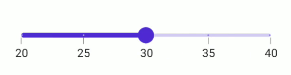

# Value Selection in .NET MAUI Slider

This section helps to learn about the value selection in the Slider.

## Discrete selection

Move the thumb in discrete manner for numeric values using the [`StepSize`](https://help.syncfusion.com/cr/maui/Syncfusion.Maui.Sliders.SfSlider.html#Syncfusion_Maui_Sliders_SfSlider_StepSize) property in the Slider.





<sliders:SfSlider Minimum="20"
                  Maximum="40"
                  Interval="5"
                  Value="30"
                  StepSize="5"
                  ShowLabels="True"
                  ShowTicks="True"
                  ShowDividers="True" />                 





SfSlider slider = new SfSlider()
{
    Minimum = 20,
    Maximum = 40,
    Value = 30,
    Interval = 5,
    ShowTicks = true,
    ShowLabels = true,
    ShowDividers = true,
    StepSize = 5,
};





## Deferred update

You can control when the dependent components are updated while thumbs are being dragged continuously. It can be achieved by setting the `EnableDeferredUpdate` property and the delay in the update can be achieved by setting the `DeferredUpdateDelay` property. The default value of the `DeferredUpdateDelay` property is `500` milliseconds.

It invokes the `ValueChanging` event when the thumb is dragged and held for the duration specified in the `DeferredUpdateDelay`. However, the values are immediately updated in touch-up action.





<sliders:SfSlider Minimum="20"
                  Maximum="40"
                  Interval="5"
                  Value="30"
                  ShowLabels="True"
                  ShowTicks="True"
                  EnableDeferredUpdate="True"
                  DeferredUpdateDelay="1000" />                 





SfSlider slider = new SfSlider()
{
    Minimum = 20,
    Maximum = 40,
    Value = 30,
    Interval = 5,
    ShowTicks = true,
    ShowLabels = true,
    EnableDeferredUpdate = true,
    DeferredUpdateDelay = 1000,
};
         


