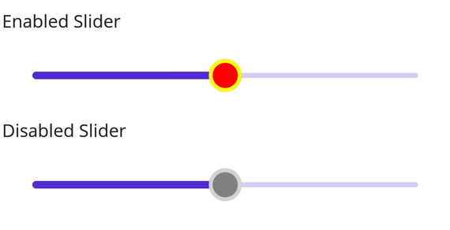

# Thumb and Overlay in .NET MAUI Slider (SfSlider)

This section explains how to customize the thumb and thumb overlay in the slider.

* **Thumb**: A slider element used to drag and change the selected value of the slider.
* **Thumb Overlay**: Rendered around the thumb during interaction.

## Thumb Size

Change the size of the thumb in the slider using the [`Radius`](https://help.syncfusion.com/cr/maui/Syncfusion.Maui.Sliders.SliderThumbStyle.html#Syncfusion_Maui_Sliders_SliderThumbStyle_Radius) property of the [`ThumbStyle`](https://help.syncfusion.com/cr/maui/Syncfusion.Maui.Sliders.SliderThumbStyle.html) class. The default value for `Radius` is `10.0`.





<sliders:SfSlider>
    <sliders:SfSlider.ThumbStyle>
        <sliders:SliderThumbStyle Radius="15" />
     </sliders:SfSlider.ThumbStyle>
</sliders:SfSlider>





SfSlider slider = new SfSlider();
slider.ThumbStyle.Radius = 15;





## Thumb Color

Change the color of the thumb in the slider using the [`Fill`](https://help.syncfusion.com/cr/maui/Syncfusion.Maui.Sliders.SliderThumbStyle.html#Syncfusion_Maui_Sliders_SliderThumbStyle_Fill) property of the [`ThumbStyle`](https://help.syncfusion.com/cr/maui/Syncfusion.Maui.Sliders.SliderThumbStyle.html) class.





<sliders:SfSlider>
   <sliders:SfSlider.ThumbStyle>
       <sliders:SliderThumbStyle Fill="#EE3F3F" />
   </sliders:SfSlider.ThumbStyle>
</sliders:SfSlider>





SfSlider slider = new SfSlider();
slider.ThumbStyle.Fill = new SolidColorBrush(Color.FromArgb("#EE3F3F"));





## Thumb Stroke Thickness and Stroke

Change the thumb stroke width using the [`StrokeThickness`](https://help.syncfusion.com/cr/maui/Syncfusion.Maui.Sliders.SliderThumbStyle.html#Syncfusion_Maui_Sliders_SliderThumbStyle_StrokeThickness) property and thumb stroke color using the [`Stroke`](https://help.syncfusion.com/cr/maui/Syncfusion.Maui.Sliders.SliderThumbStyle.html#Syncfusion_Maui_Sliders_SliderThumbStyle_Stroke) property of the [`ThumbStyle`](https://help.syncfusion.com/cr/maui/Syncfusion.Maui.Sliders.SliderThumbStyle.html) class.





<sliders:SfSlider>
    <sliders:SfSlider.ThumbStyle>
        <sliders:SliderThumbStyle Stroke="#EE3F3F" 
                                  StrokeThickness="2"/>
    </sliders:SfSlider.ThumbStyle>
</sliders:SfSlider>





SfSlider slider = new SfSlider();
slider.ThumbStyle.Stroke = new SolidColorBrush(Color.FromArgb("#EE3F3F"));
slider.ThumbStyle.StrokeThickness = 2;





## Thumb Overlay Size

Adjust the size of the thumb overlay using the [`Radius`](https://help.syncfusion.com/cr/maui/Syncfusion.Maui.Sliders.SliderThumbOverlayStyle.html#Syncfusion_Maui_Sliders_SliderThumbOverlayStyle_Radius) property of the [`ThumbOverlayStyle`](https://help.syncfusion.com/cr/maui/Syncfusion.Maui.Sliders.SliderThumbOverlayStyle.html) class. The default value for `Radius` is `24.0`.





<sliders:SfSlider>
   <sliders:SfSlider.ThumbOverlayStyle>
      <sliders:SliderThumbOverlayStyle Radius="18"/>
   </sliders:SfSlider.ThumbOverlayStyle>
</sliders:SfSlider>






SfSlider slider = new SfSlider();
slider.ThumbOverlayStyle.Radius = 18;





## Thumb Overlay Color
Change the color of the thumb overlay in the slider using the [`Fill`](https://help.syncfusion.com/cr/maui/Syncfusion.Maui.Sliders.SliderThumbOverlayStyle.html#Syncfusion_Maui_Sliders_SliderThumbOverlayStyle_Fill) property of the [`ThumbOverlayStyle`](https://help.syncfusion.com/cr/maui/Syncfusion.Maui.Sliders.SliderThumbOverlayStyle.html) class.
Change the color of the thumb overlay using the [`Fill`](https://help.syncfusion.com/cr/maui/Syncfusion.Maui.Sliders.SliderThumbOverlayStyle.html#Syncfusion_Maui_Sliders_SliderThumbOverlayStyle_Fill) property of the `ThumbOverlayStyle` class.





<sliders:SfSlider>
   <sliders:SfSlider.ThumbOverlayStyle>
       <sliders:SliderThumbOverlayStyle Fill="#66FFD700"/>
   </sliders:SfSlider.ThumbOverlayStyle>
</sliders:SfSlider>





SfSlider slider = new SfSlider();
slider.ThumbOverlayStyle.Fill = new SolidColorBrush(Color.FromArgb("#66FFD700")); 





## Disabled Thumb

Disable the slider by setting the `IsEnabled` property to `false`. Use the Visual State Manager (VSM) to customize slider thumb properties based on visual states. The applicable visual states are enabled (default) and disabled.





<ContentPage.Resources>
    
</ContentPage.Resources>

<ContentPage.Content>
    <VerticalStackLayout>
        <Label Text="Enabled"
               Padding="24,10" />
        <sliders:SfSlider />
        <Label Text="Disabled"
               Padding="24,10" />
        <sliders:SfSlider IsEnabled="False" />
    </VerticalStackLayout>
</ContentPage.Content>





VerticalStackLayout stackLayout = new();
SfSlider defaultSlider = new();
SfSlider disabledSlider = new() { IsEnabled = false };

VisualStateGroupList visualStateGroupList = new();
VisualStateGroup commonStateGroup = new();
// Default State.
VisualState defaultState = new() { Name = "Default" };
defaultState.Setters.Add(new Setter
{
    Property = SfSlider.ThumbStyleProperty,
    Value = new SliderThumbStyle
    {
        Radius = 13,
        Fill = Colors.Red,
        Stroke = Colors.Yellow,
        StrokeThickness = 3,
    }
});
// Disabled State.
VisualState disabledState = new() { Name = "Disabled" };
disabledState.Setters.Add(new Setter
{
    Property = SfSlider.ThumbStyleProperty,
    Value = new SliderThumbStyle
    {
        Radius = 13,
        Fill = Colors.Gray,
        Stroke = Colors.LightGray,
        StrokeThickness = 3,
    }
});
disabledState.Setters.Add(new Setter
{
    Property = SfSlider.TrackStyleProperty,
    Value = new SliderTrackStyle
    {
        ActiveFill = Colors.Gray,
        InactiveFill = Colors.LightGray,
    }
});

commonStateGroup.States.Add(defaultState);
commonStateGroup.States.Add(disabledState);
visualStateGroupList.Add(commonStateGroup);
VisualStateManager.SetVisualStateGroups(defaultSlider, visualStateGroupList);
VisualStateManager.SetVisualStateGroups(disabledSlider, visualStateGroupList);

stackLayout.Children.Add(new Label() { Text = "Enabled", Padding = new Thickness(24, 10) });
stackLayout.Children.Add(defaultSlider);
stackLayout.Children.Add(new Label() { Text = "Disabled", Padding = new Thickness(24, 10) });
stackLayout.Children.Add(disabledSlider);
this.Content = stackLayout;





