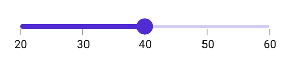
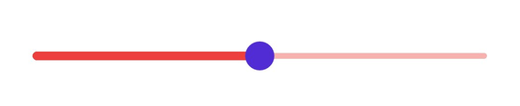
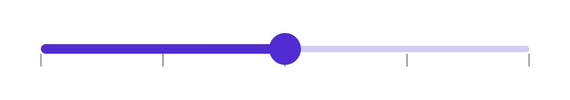
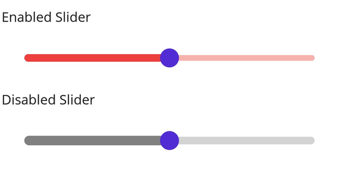

# Track in .NET MAUI Slider (SfSlider)

This section helps to learn about how to customize the track in the slider.

## Minimum

The minimum value that the user can select. The default value of the [`Minimum`](https://help.syncfusion.com/cr/maui/Syncfusion.Maui.Sliders.SfSlider.html#Syncfusion_Maui_Sliders_SfSlider_Minimum) property is `0` and it must be less than the [`Maximum`](https://help.syncfusion.com/cr/maui/Syncfusion.Maui.Sliders.SfSlider.html#Syncfusion_Maui_Sliders_SfSlider_Maximum) value.

## Maximum

The maximum value that the user can select. The default value of the [`Maximum`](https://help.syncfusion.com/cr/maui/Syncfusion.Maui.Sliders.SfSlider.html#Syncfusion_Maui_Sliders_SfSlider_Minimum) property is `1` and it must be greater than the [`Minimum`](https://help.syncfusion.com/cr/maui/Syncfusion.Maui.Sliders.SfSlider.html#Syncfusion_Maui_Sliders_SfSlider_Maximum) value.

## Value

It represents the value currently selected in the slider. The slider's thumb is drawn corresponding to this value.





<sliders:SfSlider Minimum="20"
                  Maximum="60"
                  Value="40"
                  Interval="10"
                  ShowTicks="True"
                  ShowLabels="True" />





SfSlider slider = new SfSlider()
{
    Minimum = 20,
    Maximum = 60,
    Value = 40,
    Interval = 10,
    ShowTicks = true,
    ShowLabels = true,
};





## Track color

Change the active and inactive track color of the slider using the [`ActiveFill`](https://help.syncfusion.com/cr/maui/Syncfusion.Maui.Sliders.SliderTrackStyle.html#Syncfusion_Maui_Sliders_SliderTrackStyle_ActiveFill) and [`InactiveFill`](https://help.syncfusion.com/cr/maui/Syncfusion.Maui.Sliders.SliderTrackStyle.html#Syncfusion_Maui_Sliders_SliderTrackStyle_InactiveFill) properties of the [`TrackStyle`](https://help.syncfusion.com/cr/maui/Syncfusion.Maui.Sliders.RangeView-1.html#Syncfusion_Maui_Sliders_RangeView_1_TrackStyle) class.

The active side of the slider is between the [`Minimum`](https://help.syncfusion.com/cr/maui/Syncfusion.Maui.Sliders.SfSlider.html#Syncfusion_Maui_Sliders_SfSlider_Minimum) value and the thumb.

The inactive side of the slider is between the thumb and the [`Maximum`](https://help.syncfusion.com/cr/maui/Syncfusion.Maui.Sliders.SfSlider.html#Syncfusion_Maui_Sliders_SfSlider_Maximum) value.





<sliders:SfSlider>
    <sliders:SfSlider.TrackStyle>
        <sliders:SliderTrackStyle ActiveFill="#EE3F3F"
                                  InactiveFill="#F7B1AE" />
    </sliders:SfSlider.TrackStyle>
</sliders:SfSlider>





SfSlider slider = new SfSlider();
slider.TrackStyle.ActiveFill = new SolidColorBrush(Color.FromArgb("#EE3F3F"));
slider.TrackStyle.InactiveFill = new SolidColorBrush(Color.FromArgb("#F7B1AE"));





## Track height

Change the active and inactive track height of the slider using the [`ActiveSize`](https://help.syncfusion.com/cr/maui/Syncfusion.Maui.Sliders.SliderTrackStyle.html#Syncfusion_Maui_Sliders_SliderTrackStyle_ActiveSize) and [`InactiveSize`](https://help.syncfusion.com/cr/maui/Syncfusion.Maui.Sliders.SliderTrackStyle.html#Syncfusion_Maui_Sliders_SliderTrackStyle_InactiveSize) properties of the [`TrackStyle`](https://help.syncfusion.com/cr/maui/Syncfusion.Maui.Sliders.RangeView-1.html#Syncfusion_Maui_Sliders_RangeView_1_TrackStyle) class. The default value of the [`ActiveSize`](https://help.syncfusion.com/cr/maui/Syncfusion.Maui.Sliders.SliderTrackStyle.html#Syncfusion_Maui_Sliders_SliderTrackStyle_ActiveSize) and the [`InactiveSize`](https://help.syncfusion.com/cr/maui/Syncfusion.Maui.Sliders.SliderTrackStyle.html#Syncfusion_Maui_Sliders_SliderTrackStyle_InactiveSize) properties are `8.0` and `6.0` respectively.





<sliders:SfSlider>
    <sliders:SfSlider.TrackStyle>
        <sliders:SliderTrackStyle ActiveSize="10"
                                  InactiveSize="8" />
    </sliders:SfSlider.TrackStyle>
</sliders:SfSlider>





SfSlider slider = new SfSlider();
slider.TrackStyle.ActiveSize = 10;
slider.TrackStyle.InactiveSize = 8;





## Track extent

Extend the track at the edges using the [`TrackExtent`](https://help.syncfusion.com/cr/maui/Syncfusion.Maui.Sliders.RangeView-1.html#Syncfusion_Maui_Sliders_RangeView_1_TrackExtent) property. The default value is `0` and it should be in pixels.





<sliders:SfSlider Interval="0.25"
                  ShowTicks="True"
                  TrackExtent="25" />





SfSlider slider = new SfSlider()
{
    Interval = 0.25,
    TrackExtent = 25,
    ShowTicks = true,
};





**Without track extent**

**With track extent**

## Disabled track

Change the state of the slider to disabled by setting `false` to the `IsEnabled` property. Using the Visual State Manager (VSM), customize the slider track properties based on the visual states. The applicable visual states are enabled(default) and disabled.





<ContentPage.Resources>
    
</ContentPage.Resources>

<ContentPage.Content>
    <VerticalStackLayout>
        <Label Text="Enabled"
               Padding="24,10" />
        <sliders:SfSlider />
        <Label Text="Disabled"
               Padding="24,10" />
        <sliders:SfSlider IsEnabled="False" />
    </VerticalStackLayout>
</ContentPage.Content>





VerticalStackLayout stackLayout = new();
SfSlider defaultSlider = new();
defaultSlider.ThumbStyle.Radius = 0;
SfSlider disabledSlider = new() { IsEnabled = false };
disabledSlider.ThumbStyle.Radius = 0;

VisualStateGroupList visualStateGroupList = new();
VisualStateGroup commonStateGroup = new();
// Default State.
VisualState defaultState = new() { Name = "Default" };
defaultState.Setters.Add(new Setter
{
    Property = SfSlider.TrackStyleProperty,
    Value = new SliderTrackStyle
    {
        ActiveFill = Color.FromArgb("#EE3F3F"),
        InactiveFill = Color.FromArgb("#F7B1AE"),
        ActiveSize = 8,
        InactiveSize = 6,
    }
});
// Disabled State.
VisualState disabledState = new() { Name = "Disabled" };
disabledState.Setters.Add(new Setter
{
    Property = SfSlider.TrackStyleProperty,
    Value = new SliderTrackStyle
    {
        ActiveFill = Colors.Gray,
        InactiveFill = Colors.LightGray,
        ActiveSize = 10,
        InactiveSize = 8,
    }
});

commonStateGroup.States.Add(defaultState);
commonStateGroup.States.Add(disabledState);
visualStateGroupList.Add(commonStateGroup);
VisualStateManager.SetVisualStateGroups(defaultSlider, visualStateGroupList);
VisualStateManager.SetVisualStateGroups(disabledSlider, visualStateGroupList);

stackLayout.Children.Add(new Label() { Text = "Enabled", Padding = new Thickness(24, 10) });
stackLayout.Children.Add(defaultSlider);
stackLayout.Children.Add(new Label() { Text = "Disabled", Padding = new Thickness(24, 10) });
stackLayout.Children.Add(disabledSlider);
this.Content = stackLayout;





