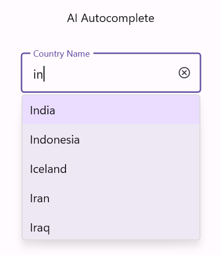
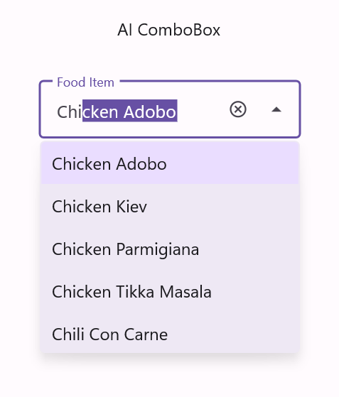
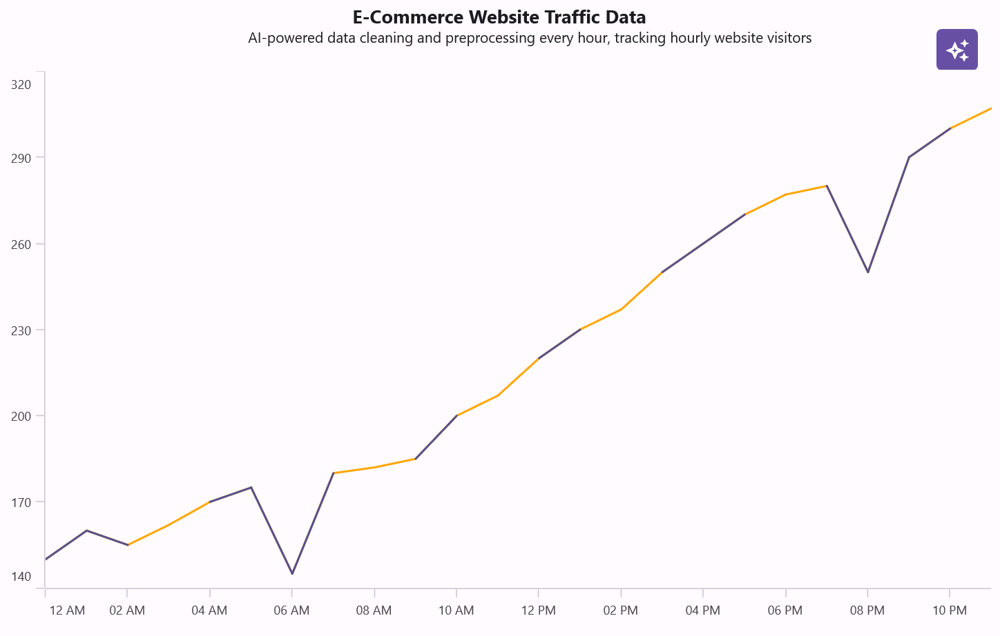
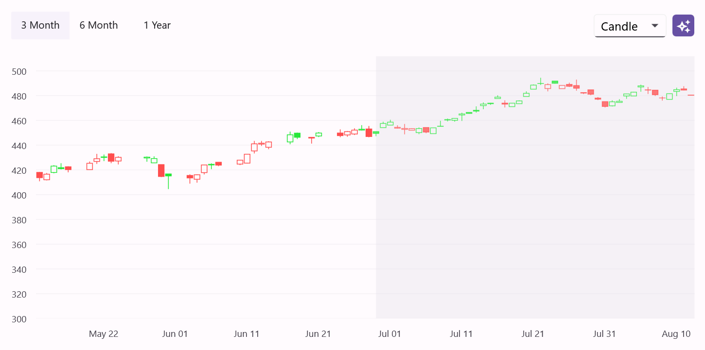
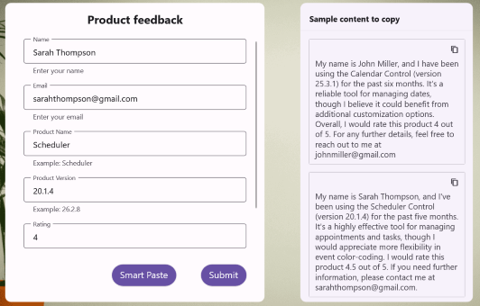
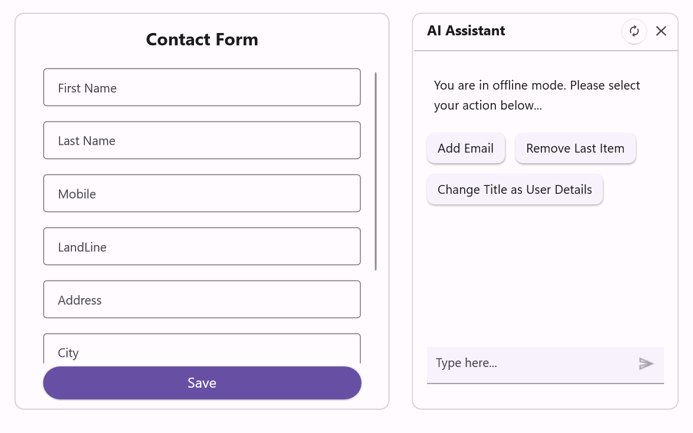
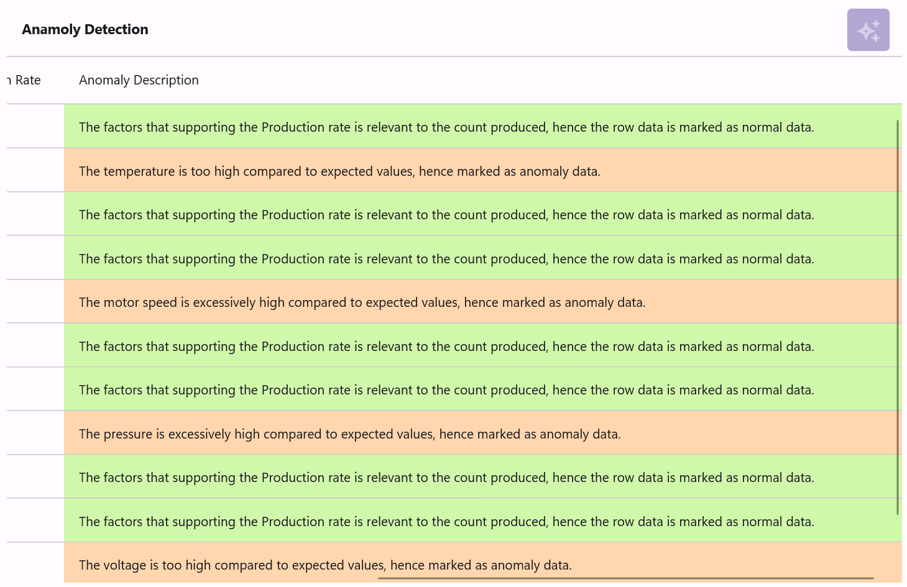
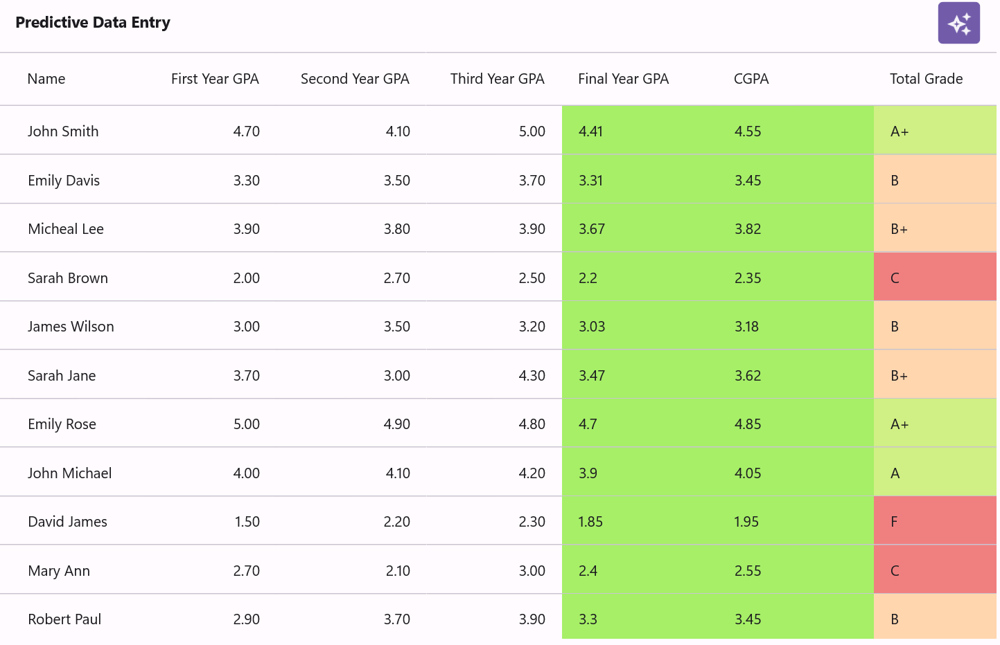
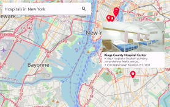

# Explore Syncfusion® Smart AI Solutions for .NET MAUI

Add AI features to your .NET MAUI apps without building models or services from scratch. The Smart AI Solutions combine familiar Syncfusion&reg; .NET MAUI controls with language models so you can ship intelligent search, predictive input, chart insights, anomaly detection, and smart scheduling in a few steps.

Each solution is a runnable sample backed by step‑by‑step guidance, so you can adapt it to your data and your domain.

## Available Smart AI Solutions

Explore these AI-powered solutions for .NET MAUI and see how they can improve common app workflows.

### AutoComplete

<!-- Card 1 -->
<a href="/maui/Autocomplete/AI-Powered-Smart-Searching" class="form-card">

<h3 class="form-title">AI-Powered Smart Searching</h3>

               Deliver faster, more relevant search experiences with AI-assisted suggestions that respond as users type.

</a>

### ComboBox

<!-- Card 2 -->
<a href="/maui/ComboBox/AI-Powered-Smart-Searching" class="form-card">

<h3 class="form-title">AI-Powered Smart Searching</h3>

               Help users find the right option faster with contextual, AI-driven recommendations.

</a>

### Cartesian Charts

<!-- Card 3 -->
<a href="/maui/cartesian-charts/AI-Powered-Data-Processing" class="form-card">

<h3 class="form-title">Data Cleaning and Preprocessing</h3>

               Use AI to clean and prepare visualized data, making it ready for accurate analysis and reporting.

</a>
<!-- Card 4 -->
<a href="/maui/cartesian-charts/AI-Powered-Stock-forecasting-in-Candle-Chart" class="form-card">

<h3 class="form-title">Stock Forecasting</h3>

               Generate AI-driven summaries and forecasts from stock data to support better decision-making.

</a>

### DataForm

<!-- Card 5 -->
<a href="/maui/dataform/AI-Powered-Smart-Paste-DataForm" class="form-card">

<h3 class="form-title">AI-Powered Smart Paste</h3>

               Speed up data entry by intelligently parsing and mapping pasted content into the correct form fields.

</a>
<!-- Card 6 -->
<a href="/maui/dataform/AI-Powered-Smart-DataForm" class="form-card">

<h3 class="form-title">AI-Powered Smart Data Entry</h3>

               Reduce manual entry with AI-assisted form completion and smart field suggestions for improved accuracy.

</a>

### DataGrid

<!-- Card 7 -->
<a href="/maui/DataGrid/AI-driven-anomaly-detection" class="form-card">

<h3 class="form-title">AI-Driven Anomaly Detection</h3>

               Automatically detect unusual patterns in tabular data with AI-powered analysis and clear visual cues.

</a>
<!-- Card 8 -->
<a href="/maui/DataGrid/AI-driven-predictive-data-entry" class="form-card">

<h3 class="form-title">AI-Driven Predictive Data Entry</h3>

               Get predictive assistance for tabular input, letting AI suggest the most likely next values as users type.

</a>

### Maps

<!-- Card 9 -->
<a href="/maui/Maps/AI-driven-smart-location-search" class="form-card">

<h3 class="form-title">AI-Driven Smart Location Search</h3>

               Add intelligence to map experiences with location-aware search and geographically relevant insights.

</a>

### Scheduler

<!-- Card 10 -->
<a href="/maui/Scheduler/AI-Powered-Smart-Scheduler" class="form-card">

<h3 class="form-title">AI-Powered Smart Appointment Booking</h3>

               Make scheduling easier with AI-assisted appointment creation, recommendations, and conflict-aware planning.

</a>

## See Also

- [Syncfusion® Essential Studio® for .NET MAUI](https://help.syncfusion.com/maui/introduction/overview) 

- [Syncfusion® Licensing in .NET MAUI](https://help.syncfusion.com/maui/licensing/overview)  

- [Essential Studio UI Kit for .NET MAUI](https://help.syncfusion.com/maui/uikit/overview) 

- [Future Release Plans in .NET MAUI](https://www.syncfusion.com/products/roadmap/maui-controls)