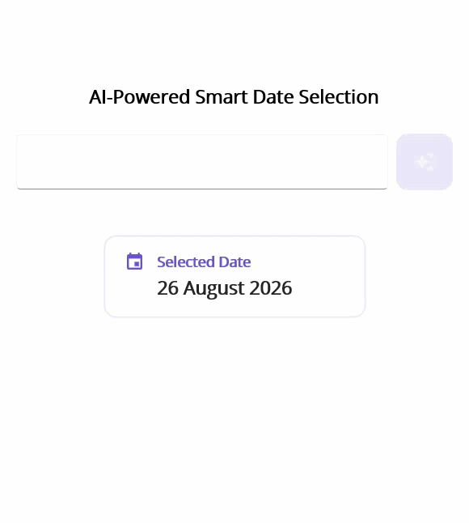

# AI-Powered Natural-Language Date Selection in .NET MAUI Date Picker

This guide explains how to add natural-language date search to the Syncfusion [.NET MAUI Date Picker](https://www.syncfusion.com/maui-controls/maui-datepicker) control. Users can enter requests such as `next leap day`, `next Christmas`, or `the start of World War I`. The app sends the request to Azure OpenAI, converts the response to a specific Gregorian date, and displays that date in the [SfDatePicker](https://help.syncfusion.com/cr/maui/Syncfusion.Maui.Picker.SfDatePicker.html).

The sample uses the MVVM pattern. The view model coordinates the search request, the Azure OpenAI service communicates with the model, and the Date Picker displays the resolved date. A small offline fallback handles common requests when the model does not return a valid date.

## Prerequisites

Before you begin, ensure that you have the following:

- A working .NET MAUI application that targets .NET 9 or later.
- The [Syncfusion.Maui.Picker](https://www.nuget.org/packages/Syncfusion.Maui.Picker) NuGet package installed in the application.
- An Azure subscription with access to [Azure OpenAI](https://learn.microsoft.com/en-us/azure/ai-foundry/openai/overview) and a deployed chat model. Note the deployment name, endpoint URL, and API key.
- Familiarity with data binding and the MVVM pattern in .NET MAUI.

N> **Security:** Do not store an Azure OpenAI API key in a production mobile application. Use a secure backend or another protected credential flow. The placeholders in this guide are for demonstration only.

## Integrating Azure OpenAI with the .NET MAUI app

The sample calls the Azure OpenAI chat completions endpoint directly with `HttpClient`. The service sends a system message that instructs the model to resolve date-related requests, including historical events, holidays, weekdays, leap days, and relative dates. It asks the model to return either one date in `yyyy-MM-dd` format or `INVALID_REQUEST`. A strict response format makes the result easier to validate before it is assigned to the Date Picker.

### Step 1: Create the Azure OpenAI service interface

Create an interface that exposes one method for sending a prompt to Azure OpenAI. Registering the interface instead of the concrete service keeps the view model independent of the HTTP implementation.



namespace SmartAIDatePicker.AIService;

public interface IAzureOpenAIService
{
	Task<string> GetCompletion(
		string prompt,
		CancellationToken cancellationToken = default);
}



### Step 2: Implement the Azure OpenAI service

Create the `AzureOpenAIService` class and replace `ENDPOINT_URL`, `gpt-5-mini`, and `API_KEY` with values from your Azure OpenAI resource. The endpoint should be the base URL of your Azure OpenAI resource, without the `/chat/completions` path.

The service creates a JSON request containing the system and user messages, adds the API key to the request header, and reads the first response choice. The complete sample also stores the raw response and the last error in `LastRawResponse` and `LastError` for debugging. It returns the model content to the view model for validation.



using System.Text;
using System.Text.Json;

namespace SmartAIDatePicker.AIService;

public sealed class AzureOpenAIService : IAzureOpenAIService
{
	private const string BaseEndpoint = "ENDPOINT_URL";
	private const string DeploymentName = "gpt-5-mini";
	private const string ApiKey = "API_KEY";

	private static readonly HttpClient Http = new()
	{
		Timeout = TimeSpan.FromSeconds(30)
	};

	public async Task<string> GetCompletion(
		string prompt,
		CancellationToken cancellationToken = default)
	{
		var requestBody = new
		{
			model = DeploymentName,
			messages = new object[]
			{
				new
				{
					role = "system",
					content =
						"Resolve the request to one specific Gregorian calendar date. " +
						"Return exactly one date in yyyy-MM-dd format or INVALID_REQUEST."
				},
				new { role = "user", content = prompt }
			},
			max_completion_tokens = 100,
			reasoning_effort = "minimal"
		};

		using var request = new HttpRequestMessage(
			HttpMethod.Post,
			$"{BaseEndpoint}/chat/completions");

		request.Headers.Add("api-key", ApiKey);
		request.Content = new StringContent(
			JsonSerializer.Serialize(requestBody),
			Encoding.UTF8,
			"application/json");

		using var response = await Http.SendAsync(request, cancellationToken);
		var rawResponse = await response.Content.ReadAsStringAsync(cancellationToken);
		response.EnsureSuccessStatusCode();

		using var document = JsonDocument.Parse(rawResponse);
		return document.RootElement
			.GetProperty("choices")[0]
			.GetProperty("message")
			.GetProperty("content")
			.GetString()?.Trim() ?? string.Empty;
	}
}



## Implementing AI-powered date search

### Step 1: Define the view model state and bindings

Create a view model that implements `INotifyPropertyChanged`. Start by adding the service dependency, the fields that store the page state, the commands, and the bindable properties. These properties connect the input editor, loading indicator, selected-date summary, and `SfDatePicker` to the view model. The code is shown in focused blocks so that each responsibility is easier to understand; add the blocks to the same `DatePickerViewModel` class.

The `PickerDate` property is bound to `SfDatePicker.SelectedDate`. When a user selects a date manually, the value is copied to `SelectedDate`. During an AI update, the `isApplyingAIResult` flag prevents the intermediate binding update from closing or overwriting the AI result.



using System.ComponentModel;
using System.Globalization;
using System.Runtime.CompilerServices;
using System.Text.RegularExpressions;
using System.Windows.Input;
using SmartAIDatePicker.AIService;

namespace SmartAIDatePicker.ViewModels;

public sealed class DatePickerViewModel : INotifyPropertyChanged
{
	private readonly IAzureOpenAIService azureAIService;
	private string dateRequest = string.Empty;
	private DateTime? selectedDate = DateTime.Today;
	private DateTime? pickerDate = DateTime.Today;
	private bool isBusy;
	private bool isPickerOpen;
	private bool isApplyingAIResult;
	private string placeholder = "Try: next leap day, Next christmas...";

	public DatePickerViewModel(IAzureOpenAIService azureAIService)
	{
		this.azureAIService = azureAIService;
		SearchCommand = new Command(async () => await ResolveDateRequestAsync());
		OpenPickerCommand = new Command(() => IsPickerOpen = true);
	}

	public event PropertyChangedEventHandler? PropertyChanged;
	public ICommand SearchCommand { get; }
	public ICommand OpenPickerCommand { get; }

	public string DateRequest
	{
		get => dateRequest;
		set => SetProperty(ref dateRequest, value ?? string.Empty);
	}

	public DateTime? SelectedDate
	{
		get => selectedDate;
		set
		{
			if (SetProperty(ref selectedDate, value) && value.HasValue)
			{
				OnPropertyChanged(nameof(SelectedDateText));
			}
		}
	}

	public DateTime? PickerDate
	{
		get => pickerDate;
		set
		{
			if (SetProperty(ref pickerDate, value) &&
				!isApplyingAIResult && value.HasValue)
			{
				SelectedDate = value;
			}
		}
	}

	public string SelectedDateText =>
		SelectedDate?.ToString("dd MMMM yyyy", CultureInfo.CurrentCulture) ?? string.Empty;

	public bool IsBusy
	{
		get => isBusy;
		private set
		{
			if (SetProperty(ref isBusy, value))
			{
				OnPropertyChanged(nameof(IsSearchIconVisible));
				OnPropertyChanged(nameof(IsLoadingVisible));
				OnPropertyChanged(nameof(IsEditorEnabled));
			}
		}
	}

	public bool IsPickerOpen
	{
		get => isPickerOpen;
		set => SetProperty(ref isPickerOpen, value);
	}

	public string Placeholder
	{
		get => placeholder;
		private set => SetProperty(ref placeholder, value);
	}

	public bool IsSearchIconVisible => !IsBusy;
	public bool IsLoadingVisible => IsBusy;
	public bool IsEditorEnabled => !IsBusy;



### Step 2: Process the search command

Add the method that runs when the user taps the search icon. It trims the request, prevents duplicate searches, updates the busy state, and applies the resolved date to the picker. The `isApplyingAIResult` flag prevents the two-way binding from treating the temporary AI update as a manual picker selection.




	private async Task ResolveDateRequestAsync()
	{
		var request = DateRequest.Trim();
		if (IsBusy || string.IsNullOrWhiteSpace(request))
		{
			return;
		}

		IsBusy = true;
		DateRequest = string.Empty;
		Placeholder = "Finding date...";

		var date = await GetDateFromAIAsync(request);
		if (date.HasValue)
		{
			isApplyingAIResult = true;
			PickerDate = date.Value;
			IsPickerOpen = true;
			await Task.Delay(1200);
			IsPickerOpen = false;
			isApplyingAIResult = false;
			SelectedDate = date.Value;
		}

		isApplyingAIResult = false;
		Placeholder = "Try: next leap day, Next christmas...";
		IsBusy = false;
	}



### Step 3: Resolve and validate the AI response

Create the method that builds the prompt and sends it to the injected Azure OpenAI service. Include the current date in the prompt so that relative requests can be resolved consistently. The sample first accepts an exact invariant `yyyy-MM-dd` response and then searches the response for a date when the model adds extra text. Future-oriented requests containing `next`, `upcoming`, or `coming` are checked to ensure that the returned date is actually in the future.




	private async Task<DateTime?> GetDateFromAIAsync(string request)
	{
		var prompt =
			$"Reference date (today): {DateTime.Today:yyyy-MM-dd} ({DateTime.Today:dddd}). " +
			"Resolve the following natural-language question to one specific Gregorian calendar date. " +
			"For a war, use its start date unless the user asks for its end. " +
			"Use the next occurrence for recurring holidays without a year. " +
			"Return only yyyy-MM-dd or INVALID_REQUEST. " +
			$"Question: {request}";

		var completion = await azureAIService.GetCompletion(prompt);
		var match = Regex.Match(completion.Trim(), @"\d{4}-\d{2}-\d{2}");

		if (match.Success && DateTime.TryParseExact(
				match.Value,
				"yyyy-MM-dd",
				CultureInfo.InvariantCulture,
				DateTimeStyles.None,
				out var date) && IsValidAIResult(request, date))
		{
			return date;
		}

		return CalculateDate(request);
	}



### Step 4: Add fallback date rules and notification helpers

Add a local fallback for common requests. This keeps the sample useful when Azure OpenAI returns an invalid or non-date response. The complete sample includes relative dates, working-day calculations, holidays, Thanksgiving, and Diwali. Extend `CalculateDate` with the phrases and business rules required by your application.




	private static bool IsValidAIResult(string request, DateTime date) =>
		(!request.Contains("next", StringComparison.OrdinalIgnoreCase) &&
		 !request.Contains("upcoming", StringComparison.OrdinalIgnoreCase) &&
		 !request.Contains("coming", StringComparison.OrdinalIgnoreCase)) ||
		date.Date > DateTime.Today;

	private static DateTime? CalculateDate(string request)
	{
		var text = request.ToLowerInvariant();
		var today = DateTime.Today;
		if (text.Contains("today")) return today;
		if (text.Contains("tomorrow")) return today.AddDays(1);
		if (text.Contains("next friday")) return NextWeekday(today, DayOfWeek.Friday);
		if (text.Contains("christmas")) return Holiday(today.Year, 12, 25);
		return null;
	}

	private static DateTime NextWeekday(DateTime date, DayOfWeek weekday)
	{
		var days = ((int)weekday - (int)date.DayOfWeek + 7) % 7;
		return date.AddDays(days == 0 ? 7 : days);
	}

	private static DateTime Holiday(int year, int month, int day)
	{
		var date = new DateTime(year, month, day);
		return date < DateTime.Today ? date.AddYears(1) : date;
	}

	private bool SetProperty<T>(ref T storage, T value, [CallerMemberName] string? propertyName = null)
	{
		if (EqualityComparer<T>.Default.Equals(storage, value)) return false;
		storage = value;
		OnPropertyChanged(propertyName);
		return true;
	}

	private void OnPropertyChanged([CallerMemberName] string? propertyName = null) =>
		PropertyChanged?.Invoke(this, new PropertyChangedEventArgs(propertyName));
}



N> The fallback in this example shows only a few common requests. Extend `CalculateDate` with the phrases your application needs, or use the complete sample implementation for additional holidays and business-day calculations.

### Step 5: Design the natural-language search UI

Add an `Editor` for the natural-language request, a search gesture that invokes `SearchCommand`, and a selected-date summary that invokes `OpenPickerCommand`. The search button switches between a Material icon and an activity indicator while the request is being processed.

The `SfDatePicker` is configured in dialog mode. Its size and opacity are minimized because the selected-date summary opens it programmatically. The `IsOpen` property is bound to `IsPickerOpen`, and the picker’s `SelectedDate` property is bound to the view model’s `PickerDate` property.



<ContentPage
	xmlns="http://schemas.microsoft.com/dotnet/2021/maui"
	xmlns:x="http://schemas.microsoft.com/winfx/2009/xaml"
	xmlns:picker="clr-namespace:Syncfusion.Maui.Picker;assembly=Syncfusion.Maui.Picker"
	xmlns:viewmodels="clr-namespace:SmartAIDatePicker.ViewModels"
	x:DataType="viewmodels:DatePickerViewModel"
	x:Class="SmartAIDatePicker.MainPage">

	<ScrollView>
		<VerticalStackLayout Padding="20" Margin="0,80,0,0" Spacing="24">
			<Label Text="AI-Powered Smart Date Selection"
				   FontSize="18" FontAttributes="Bold"
				   HorizontalOptions="Center" />

			<Grid ColumnDefinitions="*,Auto" ColumnSpacing="8" HeightRequest="56">
				<Editor Placeholder="{Binding Placeholder}"
						Text="{Binding DateRequest, Mode=TwoWay}"
						IsEnabled="{Binding IsEditorEnabled}"
						AutoSize="Disabled" HeightRequest="54"
						VerticalTextAlignment="Center" />

				<Border Grid.Column="1" BackgroundColor="#6B4FD3"
						StrokeThickness="0" StrokeShape="RoundRectangle 12">
					<Border.GestureRecognizers>
						<TapGestureRecognizer Command="{Binding SearchCommand}" />
					</Border.GestureRecognizers>
					<Grid WidthRequest="56" HeightRequest="56">
						<Label Text="&#xE65F;" FontFamily="MaterialIcons"
							   IsVisible="{Binding IsSearchIconVisible}"
							   FontSize="22" TextColor="White"
							   HorizontalTextAlignment="Center"
							   VerticalTextAlignment="Center" />
						<ActivityIndicator IsVisible="{Binding IsLoadingVisible}"
										   IsRunning="{Binding IsLoadingVisible}"
										   Color="White" />
					</Grid>
				</Border>
			</Grid>

			<Border Padding="20,16" BackgroundColor="White"
					StrokeThickness="1" StrokeShape="RoundRectangle 12">
				<Border.GestureRecognizers>
					<TapGestureRecognizer Command="{Binding OpenPickerCommand}" />
				</Border.GestureRecognizers>
				<VerticalStackLayout Spacing="4">
					<Label Text="Selected Date" FontAttributes="Bold" />
					<Label Text="{Binding SelectedDateText}"
						   FontSize="18" FontAttributes="Bold" />
				</VerticalStackLayout>
			</Border>

			<picker:SfDatePicker Mode="Dialog"
								  IsOpen="{Binding IsPickerOpen, Mode=TwoWay}"
								  SelectedDate="{Binding PickerDate, Mode=TwoWay}"
								  Opacity="0" WidthRequest="1"
								  HeightRequest="1" Format="dd_MM_yyyy">
				<picker:SfDatePicker.HeaderView>
					<picker:PickerHeaderView Text="Select Date" Height="44" />
				</picker:SfDatePicker.HeaderView>
			</picker:SfDatePicker>
		</VerticalStackLayout>
	</ScrollView>
</ContentPage>



### Step 6: Set the page binding context

Accept the view model through the page constructor. The .NET MAUI dependency injection container supplies the registered service and view model when it creates the page.



using SmartAIDatePicker.ViewModels;

namespace SmartAIDatePicker;

public partial class MainPage : ContentPage
{
	public MainPage(DatePickerViewModel viewModel)
	{
		InitializeComponent();
		BindingContext = viewModel;
	}
}



### Step 7: Register the service and view model

Register the Syncfusion core handler, the Azure OpenAI service, and the view model in `MauiProgram.cs`. The sample registers the Azure OpenAI service as a singleton and the page view model as transient.



using Microsoft.Extensions.Logging;
using SmartAIDatePicker.AIService;
using SmartAIDatePicker.ViewModels;
using Syncfusion.Maui.Core.Hosting;

namespace SmartAIDatePicker;

public static class MauiProgram
{
	public static MauiApp CreateMauiApp()
	{
		var builder = MauiApp.CreateBuilder();
		builder
			.UseMauiApp<App>()
			.ConfigureSyncfusionCore()
			.ConfigureFonts(fonts =>
			{
				fonts.AddFont("OpenSans-Regular.ttf", "OpenSansRegular");
				fonts.AddFont("OpenSans-Semibold.ttf", "OpenSansSemibold");
				fonts.AddFont("MauiMaterialAssets.ttf", "MauiMaterialAssets");
				fonts.AddFont("MaterialIcons-Regular.ttf", "MaterialIcons");
			});

		builder.Services.AddSingleton<IAzureOpenAIService, AzureOpenAIService>();
		builder.Services.AddTransient<DatePickerViewModel>();

#if DEBUG
		builder.Logging.AddDebug();
#endif

		return builder.Build();
	}
}



## Demo

The following GIF shows the AI-powered natural-language date selection experience in the .NET MAUI Date Picker.

You can find the complete sample from this [GitHub repository](https://github.com/syncfusion/maui-ai-usecase-demos/tree/master/AI-Solution-Samples).

## How the sample works

1. The user enters a natural-language date request and taps the search icon.
2. The view model disables the editor, clears the request, and shows a loading indicator.
3. The prompt includes the current date so that relative phrases such as `next` and `upcoming` can be resolved correctly.
4. The Azure OpenAI service returns a completion. The view model extracts a `yyyy-MM-dd` value and checks that future-oriented requests produce a future date.
5. If the AI response cannot be used, the view model tries its local fallback rules.
6. The valid date is assigned to `PickerDate`, the Date Picker opens in dialog mode, and the selected-date label is updated after the dialog closes.

This approach combines the flexibility of natural-language input with the familiar date selection experience of the Syncfusion .NET MAUI Date Picker.
