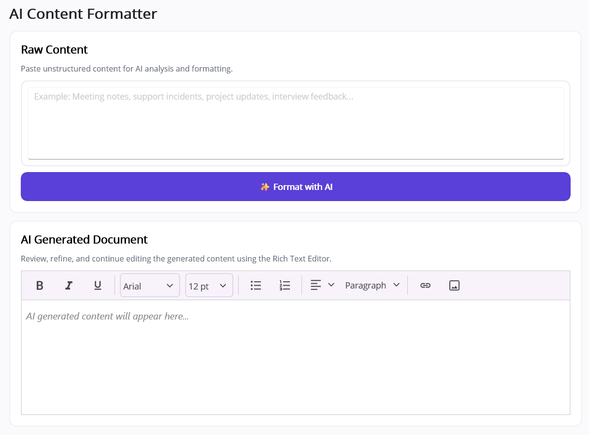

# AI-Powered Smart Formatting in .NET MAUI Rich Text Editor

This document demonstrates how to integrate Azure OpenAI with the Syncfusion [.NET MAUI Rich Text Editor](https://help.syncfusion.com/cr/maui/Syncfusion.Maui.RichTextEditor.SfRichTextEditor.html) control to transform raw or semi-structured content into a professional, structured business document. The sample accepts user-provided notes, sends them to an AI model, and then renders the output as rich HTML inside the editor.

The implementation is designed for practical business scenarios such as meeting notes, support tickets, project updates, and interview transcripts. It automatically creates polished headings, paragraphs, bullet points, numbered steps, and action items while preserving the source information.

N> **Prerequisite:** Before starting, ensure that the required Syncfusion NuGet packages are installed, the .NET MAUI project is configured correctly, and the [Rich Text Editor getting started](https://help.syncfusion.com/maui/rich-text-editor/getting-started) steps are completed.

## Step 1: Create a .NET MAUI app

Open Visual Studio and create a new .NET MAUI app. Choose a blank or basic project template and then add the Syncfusion .NET MAUI Rich Text Editor control to the project.

For this sample, the app can be structured in a simple way:

- A service folder for AI logic
- A models folder for the structured response
- A main page for the input and output UI

This keeps the sample easy to follow and makes it easier for beginners to understand the responsibilities of each file.

## Step 2: Install the required packages

This sample uses the Syncfusion Rich Text Editor control and the built-in .NET HTTP stack to call the Azure OpenAI REST endpoint.

Install the following package if it is not already available in the project:

- Syncfusion .NET MAUI Rich Text Editor package

You do not need a large AI SDK for this example because the code calls the Azure OpenAI chat completions API directly using `HttpClient`.

N> If you are using this sample in a real environment, replace the placeholder values with your Azure OpenAI endpoint, deployment name, and API key.

## Step 3: Create the model for the AI response

The AI service returns JSON data in a strict format. To make that response easy to handle, create a model that matches the JSON structure expected by the app.

This document model contains information such as the document title and individual sections. Each section can include paragraphs, bullet points, numbered items, and action items.



using System.Text.Json.Serialization;

namespace SmartRTEAutoComplete.Models;

public sealed class FormattedDocument
{
    [JsonPropertyName("title")]
    public string Title { get; set; } = string.Empty;

    [JsonPropertyName("sections")]
    public List<FormattedSection> Sections { get; set; } = new();
}

public sealed class FormattedSection
{
    [JsonPropertyName("heading")]
    public string Heading { get; set; } = string.Empty;

    [JsonPropertyName("paragraphs")]
    public List<string> Paragraphs { get; set; } = new();

    [JsonPropertyName("bulletItems")]
    public List<string> BulletItems { get; set; } = new();

    [JsonPropertyName("numberedItems")]
    public List<string> NumberedItems { get; set; } = new();

    [JsonPropertyName("actionItems")]
    public List<string> ActionItems { get; set; } = new();
}

public sealed class FormattingResult
{
    public required string HtmlContent { get; init; }

    public required string StructuredJson { get; init; }
}



This model is simple and clear. It keeps the application logic readable and helps avoid errors when parsing the response returned by Azure OpenAI.

## Step 4: Define the formatter contract

The UI should not directly depend on Azure OpenAI logic. To keep the application clean, create an interface that defines the method used to format text.



using SmartRTEAutoComplete.Models;

namespace SmartRTEAutoComplete.Services;

public interface IAIFormattingService
{
    Task<FormattingResult> FormatAsync(string content, CancellationToken cancellationToken = default);
}



This gives you a clear separation between:

- the user interface
- the AI formatting service
- the structured data model

That separation makes the sample easier to maintain and easier to extend later.

## Step 5: Add the Azure OpenAI formatter service

Create a service class that accepts user content, sends it to Azure OpenAI, and then converts the model response into the document model. The service is responsible for the actual communication with the AI backend.

The sample includes a strict prompt that tells the model to return valid JSON only. This prevents malformed output and makes the response easier to parse safely.



using System.Text;
using System.Text.Json;
using SmartRTEAutoComplete.Models;

namespace SmartRTEAutoComplete.Services;

public sealed class AzureOpenAIFormattingService : IAIFormattingService
{
    private const string BaseEndpoint = "https://YOUR_RESOURCE_NAME.services.ai.azure.com/openai/v1";
    private const string DeploymentName = "gpt-4o-mini";
    private readonly string? apiKey = "YOUR_AZURE_OPENAI_KEY";
    private readonly HttpClient httpClient = new();

    private const string SystemPrompt =
    """
    You are an enterprise-grade document formatting assistant.

    Transform unstructured or semi-structured content into a professional document structure.

    Rules:

    1. Return ONLY valid JSON.
    2. Do not return HTML.
    3. Do not return Markdown.
    4. Do not return explanations.
    5. Do not duplicate information across sections.
    6. Preserve all information from the source.
    7. Do not invent facts.
    8. Create meaningful section headings.
    9. Extract metrics, achievements and highlights into bulletItems.
    10. Use numberedItems only when sequence or order matters.
    11. Use actionItems only for tasks, responsibilities or follow-up activities.
    12. Keep paragraphs concise and professional.
    13. Consolidate repeated information into a single section.
    14. Use empty arrays when a category does not apply.

    Return exactly this JSON structure:

    {
      "title":"string",
      "sections":[
        {
          "heading":"string",
          "paragraphs":["string"],
          "bulletItems":["string"],
          "numberedItems":["string"],
          "actionItems":["string"]
        }
      ]
    }
    """;

    public async Task<FormattingResult> FormatAsync(
        string content,
        CancellationToken cancellationToken = default)
    {
        if (string.IsNullOrWhiteSpace(apiKey))
        {
            var demoDocument = CreateDemoDocument(content);

            return new FormattingResult
            {
                HtmlContent = CreateHtml(demoDocument),
                StructuredJson = SerializeDocument(demoDocument)
            };
        }

        var requestUri = $"{BaseEndpoint}/chat/completions";

        using var request = new HttpRequestMessage(
            HttpMethod.Post,
            requestUri);

        request.Headers.Add("api-key", apiKey);

        request.Content = new StringContent(
            JsonSerializer.Serialize(new
            {
                model = DeploymentName,
                messages = new[]
                {
                    new
                    {
                        role = "system",
                        content = SystemPrompt
                    },
                    new
                    {
                        role = "user",
                        content =
                        $"""
                        Convert the following content into a structured business document.

                        Requirements:

                        - Create logical sections.
                        - Preserve all facts.
                        - Remove duplicated information.
                        - Group metrics under bulletItems.
                        - Use numberedItems only when sequence matters.
                        - Use actionItems for tasks and responsibilities.
                        - Create professional section headings.
                        - Return valid JSON only.

                        Content:

                        {content}
                        """
                    }
                },
                max_completion_tokens = 2500,
                reasoning_effort = "minimal"
            }),
            Encoding.UTF8,
            "application/json");

        using var response =
            await httpClient.SendAsync(request, cancellationToken);

        var responseBody =
            await response.Content.ReadAsStringAsync(cancellationToken);

        if (!response.IsSuccessStatusCode)
        {
            throw new HttpRequestException(
                $"HTTP {(int)response.StatusCode}: {responseBody}");
        }

        using var responseDocument =
            JsonDocument.Parse(responseBody);

        var structuredContent =
            responseDocument.RootElement
                .GetProperty("choices")[0]
                .GetProperty("message")
                .GetProperty("content")
                .GetString();

        if (string.IsNullOrWhiteSpace(structuredContent))
        {
            throw new InvalidOperationException(
                "Azure OpenAI returned no formatted content.");
        }

        var cleanedJson = RemoveCodeFence(structuredContent);

        var formattedDocument =
            JsonSerializer.Deserialize<FormattedDocument>(
                cleanedJson,
                new JsonSerializerOptions
                {
                    PropertyNameCaseInsensitive = true
                });

        if (formattedDocument is null)
        {
            throw new JsonException(
                "Azure OpenAI returned an invalid structured document.");
        }

        return new FormattingResult
        {
            HtmlContent = CreateHtml(formattedDocument),
            StructuredJson = SerializeDocument(formattedDocument)
        };
    }

    private static string RemoveCodeFence(string content)
    {
        return content
            .Replace("```json", string.Empty, StringComparison.OrdinalIgnoreCase)
            .Replace("```", string.Empty, StringComparison.OrdinalIgnoreCase)
            .Trim();
    }

    private static FormattedDocument CreateDemoDocument(string content)
    {
        return new FormattedDocument
        {
            Title = "Formatted Document",
            Sections =
            [
                new FormattedSection
                {
                    Heading = "Content",
                    Paragraphs = content
                        .Split(
                            ['\r', '\n'],
                            StringSplitOptions.RemoveEmptyEntries)
                        .Select(x => x.Trim())
                        .ToList(),
                    BulletItems = [],
                    NumberedItems = [],
                    ActionItems = []
                }
            ]
        };
    }

    private static string SerializeDocument(FormattedDocument document)
    {
        return JsonSerializer.Serialize(
            document,
            new JsonSerializerOptions
            {
                WriteIndented = true
            });
    }

    private static string CreateHtml(FormattedDocument document)
    {
        var html = new StringBuilder();

        AppendHeading(html, document.Title, 1);

        foreach (var section in document.Sections)
        {
            AppendHeading(html, section.Heading, 2);
            AppendParagraphs(html, section.Paragraphs);
            AppendSectionList(html, "Key Points", section.BulletItems, "ul");
            AppendSectionList(html, "Steps", section.NumberedItems, "ol");
            AppendSectionList(html, "Action Items", section.ActionItems, "ul", "action-items");
        }

        return html.ToString();
    }
}



The important part of this service is the strict JSON contract. The AI model is instructed to return a consistent document schema, which reduces parsing issues and makes the Rich Text Editor output predictable.

## Step 6: Register the formatter in the app

In a .NET MAUI app, the simplest and most maintainable pattern is dependency injection. Register the formatter service in `MauiProgram.cs` so it can be injected into the page.



using SmartRTEAutoComplete.Services;

namespace SmartRTEAutoComplete;

public static class MauiProgram
{
    public static MauiApp CreateMauiApp()
    {
        var builder = MauiApp.CreateBuilder();
        builder
            .UseMauiApp<App>();

        builder.Services.AddSingleton<IAIFormattingService, AzureOpenAIFormattingService>();

        return builder.Build();
    }
}



This step is important because the page constructor expects an instance of `IAIFormattingService`.

## Step 7: Add the Rich Text Editor input page

Create the page layout with two sections:

- raw text input
- generated document output

The XAML below shows a simple interface for testing the AI formatting flow.



<?xml version="1.0" encoding="utf-8" ?>

<ContentPage
    xmlns="http://schemas.microsoft.com/dotnet/2021/maui"
    xmlns:x="http://schemas.microsoft.com/winfx/2009/xaml"
    xmlns:rte="clr-namespace:Syncfusion.Maui.RichTextEditor;assembly=Syncfusion.Maui.RichTextEditor"
    x:Class="SmartRTEAutoComplete.MainPage"
    BackgroundColor="#FAFAFC">

    <ScrollView>

        <Grid
            Padding="24"
            RowSpacing="12"
            RowDefinitions="Auto,Auto,Auto">

            <Label
                Text="AI Content Formatter"
                FontSize="24"
                FontAttributes="Bold"
                TextColor="#202124" />

            <Border
                Grid.Row="1"
                Padding="18"
                Stroke="#E5E7EB"
                StrokeShape="RoundRectangle 12"
                Background="White">

                <VerticalStackLayout Spacing="10">

                    <Label
                        Text="Raw Content"
                        FontAttributes="Bold"
                        FontSize="18" />

                    <Border
                        Padding="10"
                        Stroke="#D7DEE8"
                        StrokeShape="RoundRectangle 10">

                        <Editor
                            x:Name="InputEditor"
                            HeightRequest="120"
                            AutoSize="TextChanges"
                            Placeholder="Example: Meeting notes, support incidents, project updates, interview feedback..." />

                    </Border>

                    <Grid>

                        <Button
                            x:Name="FormatButton"
                            HeightRequest="48"
                            FontAttributes="Bold"
                            CornerRadius="10"
                            BackgroundColor="#5B3FD8"
                            TextColor="White"
                            Text="✨ Format with AI"
                            Clicked="OnFormatTextClicked"
                            SemanticProperties.Hint="Formats the entered text using AI." />

                        <ActivityIndicator
                            x:Name="ButtonLoadingIndicator"
                            HorizontalOptions="Center"
                            VerticalOptions="Center"
                            Color="White"
                            IsVisible="False"
                            IsRunning="False" />

                    </Grid>

                </VerticalStackLayout>

            </Border>

            <Border
                Grid.Row="2"
                Padding="18"
                Stroke="#E5E7EB"
                StrokeShape="RoundRectangle 12"
                Background="White">

                <VerticalStackLayout Spacing="10">

                    <Label
                        Text="AI Generated Document"
                        FontAttributes="Bold"
                        FontSize="18" />

                    <rte:SfRichTextEditor
                        x:Name="RichTextEditor"
                        HeightRequest="240"
                        ShowToolbar="True"
                        Placeholder="AI generated content will appear here..." />

                </VerticalStackLayout>

            </Border>

        </Grid>

    </ScrollView>

</ContentPage>



This layout is intentionally simple so that beginners can focus on the AI data flow instead of being distracted by complex UI logic.

## Step 8: Connect the page logic to the formatter

The code-behind file reads the text from the `Editor`, validates it, and sends it to the formatter service. Once the AI result is returned, the HTML content is loaded into the `SfRichTextEditor` control.



using SmartRTEAutoComplete.Services;

namespace SmartRTEAutoComplete;

public partial class MainPage : ContentPage
{
    private readonly IAIFormattingService formattingService;

    public MainPage(IAIFormattingService formattingService)
    {
        InitializeComponent();

        this.formattingService = formattingService;
    }

    private async void OnFormatTextClicked(object? sender, EventArgs e)
    {
        var input = InputEditor.Text?.Trim();

        if (string.IsNullOrWhiteSpace(input))
        {
            await DisplayAlert(
                "Input Required",
                "Please enter some content to format.",
                "OK");

            return;
        }

        FormatButton.IsEnabled = false;
        FormatButton.Text = "Analyzing content...";

        ButtonLoadingIndicator.IsVisible = true;
        ButtonLoadingIndicator.IsRunning = true;

        try
        {
            var result = await formattingService.FormatAsync(input);

            RichTextEditor.Opacity = 0;
            RichTextEditor.HtmlText = result.HtmlContent;

            await RichTextEditor.FadeTo(
                1,
                250,
                Easing.CubicIn);
        }
        catch (Exception ex)
        {
            await DisplayAlert(
                "Error",
                ex.Message,
                "OK");
        }
        finally
        {
            ButtonLoadingIndicator.IsRunning = false;
            ButtonLoadingIndicator.IsVisible = false;

            FormatButton.Text = "✨ Format with AI";
            FormatButton.IsEnabled = true;
        }
    }
}



This is the core interaction of the sample. The flow is simple:

1. User enters raw text.
2. The app calls `FormatAsync`.
3. Azure OpenAI returns a well-structured JSON document.
4. The app converts it to HTML.
5. The Rich Text Editor displays the formatted result.

## Step 9: Understand what the sample produces

When the user enters unstructured notes, the AI service organizes the content into a clean document structure.

The result typically includes:

- a professional title
- meaningful section headings
- short paragraphs for context
- bullet items for key achievements or metrics
- numbered items when order matters
- action items for responsibilities or follow-up tasks

This is useful for workflows such as:

- meeting summaries
- interview notes
- support ticket cleanup
- executive summary creation
- internal documentation drafting

## Step 10: Run the sample

After assembling the files and configuring the Azure OpenAI credentials, run the application on an emulator, simulator, or device.

- Paste unstructured content into the input area.
- Tap the Format with AI button.
- The app sends the content to Azure OpenAI.
- The generated HTML is displayed in the Rich Text Editor.
- You can continue editing the output in the editor toolbar.

If the API key is missing, the sample automatically falls back to a demo document so the UI remains usable during testing or development.

## Output and behavior

When the user enters plain text and taps the format button, the sample sends the input to Azure OpenAI. The AI model identifies the document structure and returns a valid JSON payload that includes the final title, logical headings, concise paragraphs, bullet list items, numbered steps, and action items.

The generated HTML is then assigned to the `SfRichTextEditor`, allowing the user to review and edit the final polished content in a rich text environment.

## Output and behavior

When the user enters unstructured notes and taps the format button, the sample sends the data to Azure OpenAI. The AI model identifies the document structure and returns a JSON payload that includes:

- The final document title.
- Logical sections with meaningful headings.
- Concise paragraphs for business context.
- Highlight items grouped in `bulletItems`.
- Ordered steps in `numberedItems` when sequence matters.
- Follow-up tasks and responsibilities in `actionItems`.

The generated HTML is then assigned to the `SfRichTextEditor`, enabling the user to review and edit the final result in a rich text environment.



You can find the complete sample from this [link](https://github.com/syncfusion/maui-ai-usecase-demos/tree/master).

## See also

- [Getting Started](https://help.syncfusion.com/maui/rich-text-editor/getting-started) explains how to configure the Rich Text Editor control in a .NET MAUI application.
- [Overview](https://help.syncfusion.com/maui/rich-text-editor/overview) provides the core capabilities and features of the Rich Text Editor.
- [Smart Text Editor](https://help.syncfusion.com/maui/smarttexteditor/overview) helps when you need AI-assisted editing and predictive text entry in .NET MAUI apps.
- [Smart AI Solutions](https://help.syncfusion.com/maui/SmartAISolutions/Overview) showcases related AI-powered sample implementations across Syncfusion .NET MAUI controls.
