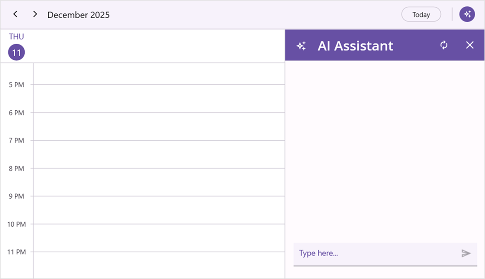

# Styles in .NET MAUI AI-Powered Scheduler (SfSmartScheduler)

You can style the elements of the [.NET MAUI Smart Scheduler](https://help.syncfusion.com/cr/maui/Syncfusion.Maui.SmartComponents.SfSmartScheduler.html) assist view using the [PlaceholderColor](https://help.syncfusion.com/cr/maui/Syncfusion.Maui.SmartComponents.SmartSchedulerAssistStyle.html#Syncfusion_Maui_SmartComponents_SmartSchedulerAssistStyle_PlaceholderColor), [AssistViewHeaderTextColor](https://help.syncfusion.com/cr/maui/Syncfusion.Maui.SmartComponents.SmartSchedulerAssistStyle.html#Syncfusion_Maui_SmartComponents_SmartSchedulerAssistStyle_AssistViewHeaderTextColor), [AssistViewHeaderBackground](https://help.syncfusion.com/cr/maui/Syncfusion.Maui.SmartComponents.SmartSchedulerAssistStyle.html#Syncfusion_Maui_SmartComponents_SmartSchedulerAssistStyle_AssistViewHeaderBackground), [AssistViewHeaderFontSize](https://help.syncfusion.com/cr/maui/Syncfusion.Maui.SmartComponents.SmartSchedulerAssistStyle.html#Syncfusion_Maui_SmartComponents_SmartSchedulerAssistStyle_AssistViewHeaderFontSize), [AssistViewHeaderFontFamily](https://help.syncfusion.com/cr/maui/Syncfusion.Maui.SmartComponents.SmartSchedulerAssistStyle.html#Syncfusion_Maui_SmartComponents_SmartSchedulerAssistStyle_AssistViewHeaderFontFamily), [AssistViewHeaderFontAttributes](https://help.syncfusion.com/cr/maui/Syncfusion.Maui.SmartComponents.SmartSchedulerAssistStyle.html#Syncfusion_Maui_SmartComponents_SmartSchedulerAssistStyle_AssistViewHeaderFontAttributes) and [AssistViewHeaderFontAutoScalingEnabled](https://help.syncfusion.com/cr/maui/Syncfusion.Maui.SmartComponents.SmartSchedulerAssistStyle.html#Syncfusion_Maui_SmartComponents_SmartSchedulerAssistStyle_AssistViewHeaderFontAutoScalingEnabled) properties of the [AssistStyle](https://help.syncfusion.com/cr/maui/Syncfusion.Maui.SmartComponents.SchedulerAssistViewSettings.html#Syncfusion_Maui_SmartComponents_SchedulerAssistViewSettings_AssistStyle).




<smartScheduler:SfSmartScheduler x:Name="smartScheduler">
    <smartScheduler:SfSmartScheduler.AssistViewSettings>
        <smartScheduler:SchedulerAssistViewSettings>
            <smartScheduler:SchedulerAssistViewSettings.AssistStyle>
                <smartScheduler:SmartSchedulerAssistStyle PlaceholderColor="#6750A4" 
                                                          AssistViewHeaderBackground="#6750A4"
                                                          AssistViewHeaderTextColor="#FFFFFF"
                                                          AssistViewHeaderFontSize="24"
                                                          AssistViewHeaderFontAttributes="Bold"
                                                          AssistViewHeaderFontFamily="OpenSansSemibold"
                                                          AssistViewHeaderFontAutoScalingEnabled="True" />
            </smartScheduler:SchedulerAssistViewSettings.AssistStyle>
        </smartScheduler:SchedulerAssistViewSettings>
    </smartScheduler:SfSmartScheduler.AssistViewSettings>
</smartScheduler:SfSmartScheduler>




SfSmartScheduler smartScheduler = new SfSmartScheduler();
smartScheduler.AssistViewSettings.AssistStyle = new SmartSchedulerAssistStyle()
{
    PlaceholderColor = Color.FromArgb("#6750A4"),
    AssistViewHeaderBackground = Color.FromArgb("#6750A4"),
    AssistViewHeaderTextColor = Color.FromArgb("#FFFFFF"),
    AssistViewHeaderFontSize = 24,
    AssistViewHeaderFontAutoScalingEnabled = true,
    AssistViewHeaderFontAttributes = FontAttributes.Italic,
    AssistViewHeaderFontFamily = "OpenSansSemibold",
};
this.Content = smartScheduler;




