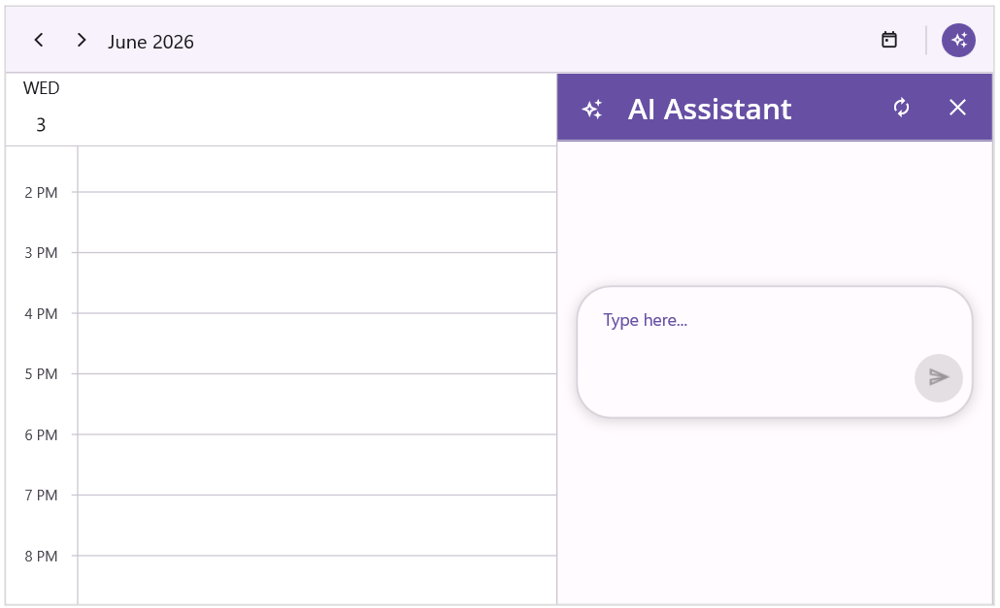

# Styles in .NET MAUI AI-Powered Scheduler (SfSmartScheduler)

You can style the elements of the [.NET MAUI Smart Scheduler](https://www.syncfusion.com/scheduler-sdk/maui-smart-scheduler) assist view using the [PlaceholderColor](https://help.syncfusion.com/cr/maui/Syncfusion.Maui.SmartScheduler.SmartSchedulerAssistStyle.html#Syncfusion_Maui_SmartScheduler_SmartSchedulerAssistStyle_PlaceholderColor), [AssistViewHeaderTextColor](https://help.syncfusion.com/cr/maui/Syncfusion.Maui.SmartScheduler.SmartSchedulerAssistStyle.html#Syncfusion_Maui_SmartScheduler_SmartSchedulerAssistStyle_AssistViewHeaderTextColor), [AssistViewHeaderBackground](https://help.syncfusion.com/cr/maui/Syncfusion.Maui.SmartScheduler.SmartSchedulerAssistStyle.html#Syncfusion_Maui_SmartScheduler_SmartSchedulerAssistStyle_AssistViewHeaderBackground), [AssistViewHeaderFontSize](https://help.syncfusion.com/cr/maui/Syncfusion.Maui.SmartScheduler.SmartSchedulerAssistStyle.html#Syncfusion_Maui_SmartScheduler_SmartSchedulerAssistStyle_AssistViewHeaderFontSize), [AssistViewHeaderFontFamily](https://help.syncfusion.com/cr/maui/Syncfusion.Maui.SmartScheduler.SmartSchedulerAssistStyle.html#Syncfusion_Maui_SmartScheduler_SmartSchedulerAssistStyle_AssistViewHeaderFontFamily), [AssistViewHeaderFontAttributes](https://help.syncfusion.com/cr/maui/Syncfusion.Maui.SmartScheduler.SmartSchedulerAssistStyle.html#Syncfusion_Maui_SmartScheduler_SmartSchedulerAssistStyle_AssistViewHeaderFontAttributes) and [AssistViewHeaderFontAutoScalingEnabled](https://help.syncfusion.com/cr/maui/Syncfusion.Maui.SmartScheduler.SmartSchedulerAssistStyle.html#Syncfusion_Maui_SmartScheduler_SmartSchedulerAssistStyle_AssistViewHeaderFontAutoScalingEnabled) properties of the [AssistStyle](https://help.syncfusion.com/cr/maui/Syncfusion.Maui.SmartScheduler.SchedulerAssistViewSettings.html#Syncfusion_Maui_SmartScheduler_SchedulerAssistViewSettings_AssistStyle).




<ContentPage   
    . . .
    xmlns:smartScheduler="clr-namespace:Syncfusion.Maui.SmartScheduler;assembly=Syncfusion.Maui.SmartScheduler">
    <smartScheduler:SfSmartScheduler x:Name="smartScheduler">
        <smartScheduler:SfSmartScheduler.AssistViewSettings>
            <smartScheduler:SchedulerAssistViewSettings>
                <smartScheduler:SchedulerAssistViewSettings.AssistStyle>
                    <smartScheduler:SmartSchedulerAssistStyle PlaceholderColor="#6750A4" 
                                                            AssistViewHeaderBackground="#6750A4"
                                                            AssistViewHeaderTextColor="#FFFFFF"
                                                            AssistViewHeaderFontSize="24"
                                                            AssistViewHeaderFontAttributes="Bold"
                                                            AssistViewHeaderFontFamily="OpenSansSemibold"
                                                            AssistViewHeaderFontAutoScalingEnabled="True" />
                </smartScheduler:SchedulerAssistViewSettings.AssistStyle>
            </smartScheduler:SchedulerAssistViewSettings>
        </smartScheduler:SfSmartScheduler.AssistViewSettings>
    </smartScheduler:SfSmartScheduler>
</ContentPage>




using Syncfusion.Maui.SmartScheduler;

. . .
SfSmartScheduler smartScheduler = new SfSmartScheduler();
smartScheduler.AssistViewSettings.AssistStyle = new SmartSchedulerAssistStyle()
{
    PlaceholderColor = Color.FromArgb("#6750A4"),
    AssistViewHeaderBackground = Color.FromArgb("#6750A4"),
    AssistViewHeaderTextColor = Color.FromArgb("#FFFFFF"),
    AssistViewHeaderFontSize = 24,
    AssistViewHeaderFontAutoScalingEnabled = true,
    AssistViewHeaderFontAttributes = FontAttributes.Italic,
    AssistViewHeaderFontFamily = "OpenSansSemibold",
};
this.Content = smartScheduler;




