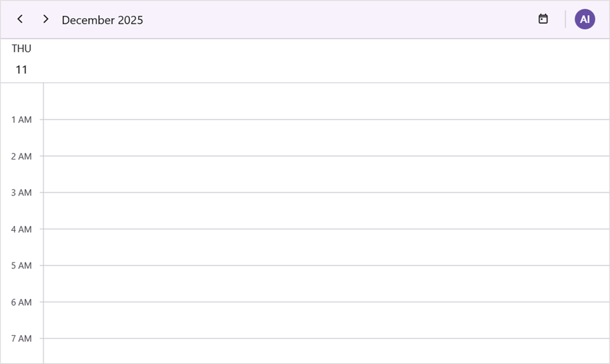
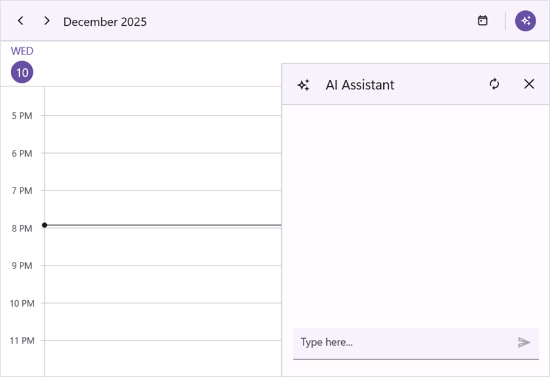
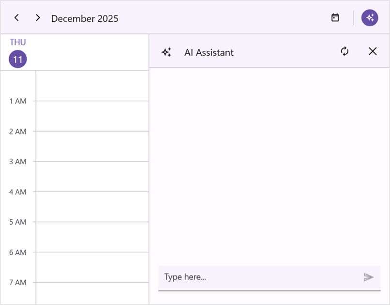
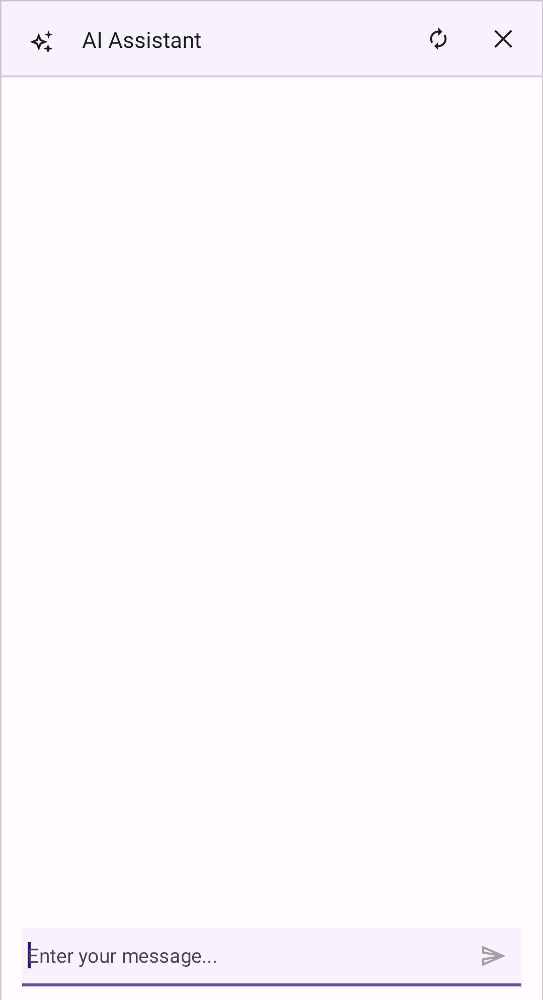
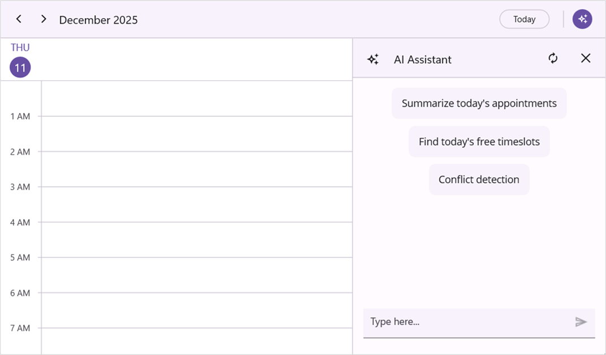
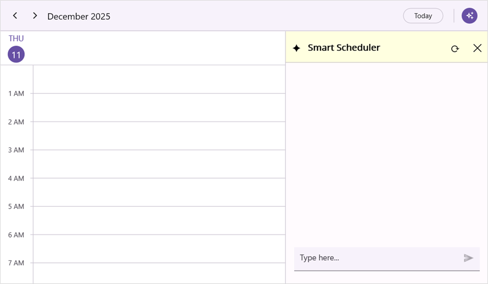
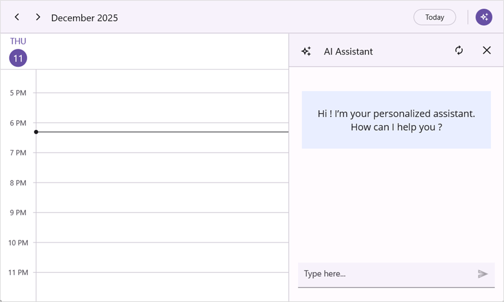

# Working with .NET MAUI AI-Powered Scheduler (SfSmartScheduler)

## Assist Button

The assist button interaction and the default appearance of assist button can be customized by setting the [EnableAssistButton](https://help.syncfusion.com/cr/maui/Syncfusion.Maui.SmartComponents.SfSmartScheduler.html#Syncfusion_Maui_SmartComponents_SfSmartScheduler_EnableAssistButton) and [AssistButtonTemplate](https://help.syncfusion.com/cr/maui/Syncfusion.Maui.SmartComponents.SfSmartScheduler.html#Syncfusion_Maui_SmartComponents_SfSmartScheduler_AssistButtonTemplate) properties of [SfSmartScheduler](https://help.syncfusion.com/cr/maui/Syncfusion.Maui.SmartComponents.SfSmartScheduler.html) control.

### Enable assist button

The assist button interaction can be enabled or disabled by setting the [EnableAssistButton](https://help.syncfusion.com/cr/maui/Syncfusion.Maui.SmartComponents.SfSmartScheduler.html#Syncfusion_Maui_SmartComponents_SfSmartScheduler_EnableAssistButton) property of the [SfSmartScheduler](https://help.syncfusion.com/cr/maui/Syncfusion.Maui.SmartComponents.SfSmartScheduler.html) control. By default, the [EnableAssistButton](https://help.syncfusion.com/cr/maui/Syncfusion.Maui.SmartComponents.SfSmartScheduler.html#Syncfusion_Maui_SmartComponents_SfSmartScheduler_EnableAssistButton) property is set to true.




 <smartScheduler:SfSmartScheduler x:Name="Scheduler" EnableAssistButton="False"/>




SfSmartScheduler scheduler = new SfSmartScheduler();
smartScheduler.EnableAssistButton = false;
this.Content = scheduler;




### Customize assist button appearance using DataTemplate

The assist button appearance can be customized by using the [AssistButtonTemplate](https://help.syncfusion.com/cr/maui/Syncfusion.Maui.SmartComponents.SfSmartScheduler.html#Syncfusion_Maui_SmartComponents_SfSmartScheduler_AssistButtonTemplate) property of [SfSmartScheduler](https://help.syncfusion.com/cr/maui/Syncfusion.Maui.SmartComponents.SfSmartScheduler.html) control.




 <smartScheduler:SfSmartScheduler x:Name="Scheduler">
    <smartScheduler:SfSmartScheduler.AssistButtonTemplate>
     <DataTemplate>
         <Grid BackgroundColor="#6750A4">
             <Label Text="AI"
                FontAttributes="Bold"
                TextColor="#FFFFFF"
                VerticalOptions="Center"
                HorizontalOptions="Center" />
         </Grid>
     </DataTemplate>
 </smartScheduler:SfSmartScheduler.AssistButtonTemplate>
 </scheduler:SfSmartScheduler>




SfSmartScheduler smartScheduler = new SfSmartScheduler();
smartScheduler.AssistButtonTemplate = new DataTemplate(() =>
{
    var grid = new Grid
    {
        BackgroundColor = Color.FromArgb("#6750A4")
    };

    var label = new Label
    {
        Text = "AI",
        FontAttributes = FontAttributes.Bold,
        TextColor = Color.FromArgb("#FFFFFF"),
        HorizontalOptions = LayoutOptions.Center,
        VerticalOptions = LayoutOptions.Center
    };

    grid.Add(label);
    return grid;
});
this.Content = smartScheduler;




## Assist View

The default appearance of the assist view can be customized by setting the [AssistViewHeight](https://help.syncfusion.com/cr/maui/Syncfusion.Maui.SmartComponents.SchedulerAssistViewSettings.html#Syncfusion_Maui_SmartComponents_SchedulerAssistViewSettings_AssistViewHeight), [AssistViewWidth](https://help.syncfusion.com/cr/maui/Syncfusion.Maui.SmartComponents.SchedulerAssistViewSettings.html#Syncfusion_Maui_SmartComponents_SchedulerAssistViewSettings_AssistViewWidth), [AssistViewHeaderText](https://help.syncfusion.com/cr/maui/Syncfusion.Maui.SmartComponents.SchedulerAssistViewSettings.html#Syncfusion_Maui_SmartComponents_SchedulerAssistViewSettings_AssistViewHeaderText), [Placeholder](https://help.syncfusion.com/cr/maui/Syncfusion.Maui.SmartComponents.SchedulerAssistViewSettings.html#Syncfusion_Maui_SmartComponents_SchedulerAssistViewSettings_Placeholder), [Prompt](https://help.syncfusion.com/cr/maui/Syncfusion.Maui.SmartComponents.SchedulerAssistViewSettings.html#Syncfusion_Maui_SmartComponents_SchedulerAssistViewSettings_Prompt), [SuggestedPrompts](https://help.syncfusion.com/cr/maui/Syncfusion.Maui.SmartComponents.SchedulerAssistViewSettings.html#Syncfusion_Maui_SmartComponents_SchedulerAssistViewSettings_SuggestedPrompts) and [ShowAssistViewBanner](https://help.syncfusion.com/cr/maui/Syncfusion.Maui.SmartComponents.SchedulerAssistViewSettings.html#Syncfusion_Maui_SmartComponents_SchedulerAssistViewSettings_ShowAssistViewBanner) properties of [SfSmartScheduler](https://help.syncfusion.com/cr/maui/Syncfusion.Maui.SmartComponents.SfSmartScheduler.html) control.

### Assist view height

The assist view height can be customized by using the [AssistViewHeight](https://help.syncfusion.com/cr/maui/Syncfusion.Maui.SmartComponents.SchedulerAssistViewSettings.html#Syncfusion_Maui_SmartComponents_SchedulerAssistViewSettings_AssistViewHeight) property of the [AssistViewSettings](https://help.syncfusion.com/cr/maui/Syncfusion.Maui.SmartComponents.SchedulerAssistViewSettings.html).




<smartScheduler:SfSmartScheduler  x:Name="smartScheduler">
    <smartScheduler:SfSmartScheduler.AssistViewSettings>
        <smartScheduler:SchedulerAssistViewSettings AssistViewHeight="420"/>
    </smartScheduler:SfSmartScheduler.AssistViewSettings>
</smartScheduler:SfSmartScheduler>




SfSmartScheduler scheduler = new SfSmartScheduler();
smartScheduler.AssistViewSettings.AssistViewHeight = 420;
this.Content = scheduler;




### Assist view width

The assist view width can be customized by using the [AssistViewWidth](https://help.syncfusion.com/cr/maui/Syncfusion.Maui.SmartComponents.SchedulerAssistViewSettings.html#Syncfusion_Maui_SmartComponents_SchedulerAssistViewSettings_AssistViewWidth) property of the [AssistViewSettings](https://help.syncfusion.com/cr/maui/Syncfusion.Maui.SmartComponents.SchedulerAssistViewSettings.html).




<smartScheduler:SfSmartScheduler  x:Name="smartScheduler">
    <smartScheduler:SfSmartScheduler.AssistViewSettings>
        <smartScheduler:SchedulerAssistViewSettings AssistViewWidth="500"/>
    </smartScheduler:SfSmartScheduler.AssistViewSettings>
</smartScheduler:SfSmartScheduler>




SfSmartScheduler scheduler = new SfSmartScheduler();
smartScheduler.AssistViewSettings.AssistViewWidth = 500;
this.Content = scheduler;




### Assist view header text

The assist view header text can be customized by using the [AssistViewHeaderText](https://help.syncfusion.com/cr/maui/Syncfusion.Maui.SmartComponents.SchedulerAssistViewSettings.html#Syncfusion_Maui_SmartComponents_SchedulerAssistViewSettings_AssistViewHeaderText) property of the [AssistViewSettings](https://help.syncfusion.com/cr/maui/Syncfusion.Maui.SmartComponents.SchedulerAssistViewSettings.html).




<smartScheduler:SfSmartScheduler  x:Name="smartScheduler">
    <smartScheduler:SfSmartScheduler.AssistViewSettings>
        <smartScheduler:SchedulerAssistViewSettings AssistViewHeaderText="Smart Scheduler"/>
    </smartScheduler:SfSmartScheduler.AssistViewSettings>
</smartScheduler:SfSmartScheduler>




SfSmartScheduler smartScheduler = new SfSmartScheduler();
smartScheduler.AssistViewSettings.AssistViewHeaderText = "Smart Scheduler";
this.Content = smartScheduler;




### Placeholder

The assist view placeholder text can be customized by using the [Placeholder](https://help.syncfusion.com/cr/maui/Syncfusion.Maui.SmartComponents.SchedulerAssistViewSettings.html#Syncfusion_Maui_SmartComponents_SchedulerAssistViewSettings_Placeholder) property of the [AssistViewSettings](https://help.syncfusion.com/cr/maui/Syncfusion.Maui.SmartComponents.SchedulerAssistViewSettings.html).




<smartScheduler:SfSmartScheduler  x:Name="smartScheduler">
    <smartScheduler:SfSmartScheduler.AssistViewSettings>
        <smartScheduler:SchedulerAssistViewSettings Placeholder="Enter your message..."/>
    </smartScheduler:SfSmartScheduler.AssistViewSettings>
</smartScheduler:SfSmartScheduler>




SfSmartScheduler smartScheduler = new SfSmartScheduler();
smartScheduler.AssistViewSettings.Placeholder = "Enter your message...";
this.Content = smartScheduler;




### Prompt

The assist view prompt text can be customized by using the [Prompt](https://help.syncfusion.com/cr/maui/Syncfusion.Maui.SmartComponents.SchedulerAssistViewSettings.html#Syncfusion_Maui_SmartComponents_SchedulerAssistViewSettings_Prompt) property of the [AssistViewSettings](https://help.syncfusion.com/cr/maui/Syncfusion.Maui.SmartComponents.SchedulerAssistViewSettings.html). By default, the [Prompt](https://help.syncfusion.com/cr/maui/Syncfusion.Maui.SmartComponents.SchedulerAssistViewSettings.html#Syncfusion_Maui_SmartComponents_SchedulerAssistViewSettings_Prompt) property is set to empty.




<smartScheduler:SfSmartScheduler  x:Name="smartScheduler">
    <smartScheduler:SfSmartScheduler.AssistViewSettings>
        <smartScheduler:SchedulerAssistViewSettings Prompt="Find 30-minute slots this week"/>
    </smartScheduler:SfSmartScheduler.AssistViewSettings>
</smartScheduler:SfSmartScheduler>




SfSmartScheduler smartScheduler = new SfSmartScheduler();
smartScheduler.AssistViewSettings.Prompt = "Find 30-minute slots this week";
this.Content = smartScheduler;




### Suggested Prompts

The assist view suggested prompts can be customized by using the [SuggestedPrompts](https://help.syncfusion.com/cr/maui/Syncfusion.Maui.SmartComponents.SchedulerAssistViewSettings.html#Syncfusion_Maui_SmartComponents_SchedulerAssistViewSettings_SuggestedPrompts) property of the [AssistViewSettings](https://help.syncfusion.com/cr/maui/Syncfusion.Maui.SmartComponents.SchedulerAssistViewSettings.html). By default, the [SuggestedPrompts](https://help.syncfusion.com/cr/maui/Syncfusion.Maui.SmartComponents.SchedulerAssistViewSettings.html#Syncfusion_Maui_SmartComponents_SchedulerAssistViewSettings_SuggestedPrompts) property is set to null.




<ContentPage.BindingContext>
    <local:ViewModel/>
</ContentPage.BindingContext>

<smartScheduler:SfSmartScheduler x:Name="smartScheduler">
    <smartScheduler:SfSmartScheduler.AssistViewSettings >
        <smartScheduler:SchedulerAssistViewSettings ShowAssistViewBanner="True" SuggestedPrompts="{Binding SuggestedPrompts}"/>
    </smartScheduler:SfSmartScheduler.AssistViewSettings>
</smartScheduler:SfSmartScheduler>




public class ViewModel
{
    private List<string> suggestedPrompts;
    
    public List<string> SuggestedPrompts
    {
        get { return suggestedPrompts; }
        set { suggestedPrompts = value; }
    }

    public ViewModel()
    {
        this.suggestedPrompts = new List<string>()
        {
            "Summarize today's appointments",
            "Find today's free timeslots",
            "Conflict detection"
        };
    }
}




 SfSmartScheduler smartScheduler = new SfSmartScheduler();
 smartScheduler.AssistViewSettings.ShowAssistViewBanner = true;
 smartScheduler.AssistViewSettings.SuggestedPrompts = new List<string>
 {
    "Summarize today's appointments",
    "Find today's free timeslots",
    "Conflict detection"
 };
 this.Content = smartScheduler;




### Show assist view banner

The assist view banner visibility can be customized by using the [ShowAssistViewBanner](https://help.syncfusion.com/cr/maui/Syncfusion.Maui.SmartComponents.SchedulerAssistViewSettings.html#Syncfusion_Maui_SmartComponents_SchedulerAssistViewSettings_ShowAssistViewBanner) property of the [AssistViewSettings](https://help.syncfusion.com/cr/maui/Syncfusion.Maui.SmartComponents.SchedulerAssistViewSettings.html). By default, the [ShowAssistViewBanner](https://help.syncfusion.com/cr/maui/Syncfusion.Maui.SmartComponents.SchedulerAssistViewSettings.html#Syncfusion_Maui_SmartComponents_SchedulerAssistViewSettings_ShowAssistViewBanner) property is set to false.




<smartScheduler:SfSmartScheduler  x:Name="smartScheduler">
    <smartScheduler:SfSmartScheduler.AssistViewSettings>
        <smartScheduler:SchedulerAssistViewSettings ShowAssistViewBanner="True"/>
    </smartScheduler:SfSmartScheduler.AssistViewSettings>
</smartScheduler:SfSmartScheduler>




this.smartScheduler.AssistViewSettings.AssistViewBannerTemplate = new DataTemplate(() =>
{
    var grid = new Grid
    {
        Padding = new Thickness(16),
        Margin = new Thickness(0, 40, 0, 0),
        BackgroundColor = Color.FromArgb("#E9EEFF"),
        HorizontalOptions = LayoutOptions.Center,
        VerticalOptions = LayoutOptions.Start
    };

    var label = new Label
    {
        Text = "Hi! I’m your personalized assistant.\nHow can I help you?",
        HorizontalTextAlignment = TextAlignment.Center,
        VerticalTextAlignment = TextAlignment.Center,
        TextColor = Color.FromArgb("#1C1B1F"),
        FontSize = 16,
        Padding = new Thickness(10),
        FontAttributes = FontAttributes.None
    };

    grid.Children.Add(label);

    return grid;
});




## Template Customization

The [SfSmartScheduler](https://help.syncfusion.com/cr/maui/Syncfusion.Maui.SmartComponents.SfSmartScheduler.html) facilitates the customization of both header and banner templates according to specific requirements. This feature enhances flexibility and provides a higher degree of control over the display of assist view.

### Customize assist view header appearance using DataTemplate

The assist view header appearance can be customized by using the [AssistViewHeaderTemplate](https://help.syncfusion.com/cr/maui/Syncfusion.Maui.SmartComponents.SchedulerAssistViewSettings.html#Syncfusion_Maui_SmartComponents_SchedulerAssistViewSettings_AssistViewHeaderTemplate) property of the [AssistViewSettings](https://help.syncfusion.com/cr/maui/Syncfusion.Maui.SmartComponents.SchedulerAssistViewSettings.html).




<smartScheduler:SfSmartScheduler x:Name="smartScheduler">
    <smartScheduler:SfSmartScheduler.AssistViewSettings>
        <smartScheduler:SchedulerAssistViewSettings>
            <smartScheduler:SchedulerAssistViewSettings.AssistViewHeaderTemplate>
                <DataTemplate>
                    <Grid BackgroundColor="LightYellow"
                        ColumnDefinitions="40,*,40,40">
                        <Label Text="✦"
                            FontSize="20"
                            VerticalTextAlignment="Center"
                            HorizontalTextAlignment="Center"
                            Grid.Column="0" />
                        <Label Text="Smart Scheduler"
                            FontAttributes="Bold"
                            FontSize="16"
                            VerticalTextAlignment="Center"
                            HorizontalTextAlignment="Start"
                            Grid.Column="1" />
                        <Label Text="⟳"
                            FontSize="20"
                            VerticalTextAlignment="Center"
                            HorizontalTextAlignment="Center"
                            Grid.Column="2" />
                        <Label Text="✕"
                            FontSize="20"
                            VerticalTextAlignment="Center"
                            HorizontalTextAlignment="Center"
                            Grid.Column="3" />
                    </Grid>
                </DataTemplate>
            </smartScheduler:SchedulerAssistViewSettings.AssistViewHeaderTemplate>
        </smartScheduler:SchedulerAssistViewSettings>
    </smartScheduler:SfSmartScheduler.AssistViewSettings>
</smartScheduler:SfSmartScheduler>




SfSmartScheduler smartScheduler = new SfSmartScheduler();
smartScheduler.AssistViewSettings = new SchedulerAssistViewSettings();
smartScheduler.AssistViewSettings.AssistViewHeaderTemplate = new DataTemplate(() =>
{
    var grid = new Grid
    {
        BackgroundColor = Colors.LightYellow,
        ColumnDefinitions =
        {
            new ColumnDefinition { Width = 40 },
            new ColumnDefinition { Width = GridLength.Star },
            new ColumnDefinition { Width = 40 },
            new ColumnDefinition { Width = 40 }
        }
    };

    var symbol = new Label
    {
        Text = "✦",
        FontSize = 20,
        VerticalTextAlignment = TextAlignment.Center,
        HorizontalTextAlignment = TextAlignment.Center
    };
    grid.Children.Add(symbol);
    Grid.SetColumn(symbol, 0);

    var title = new Label
    {
        Text = "Smart Scheduler",
        FontAttributes = FontAttributes.Bold,
        FontSize = 16,
        VerticalTextAlignment = TextAlignment.Center,
        HorizontalTextAlignment = TextAlignment.Start
    };
    grid.Children.Add(title);
    Grid.SetColumn(title, 1);

    var reset = new Label
    {
        Text = "⟳",
        FontSize = 20,
        VerticalTextAlignment = TextAlignment.Center,
        HorizontalTextAlignment = TextAlignment.Center
    };
    grid.Children.Add(reset);
    Grid.SetColumn(reset, 2);

    var close = new Label
    {
        Text = "✕",
        FontSize = 20,
        VerticalTextAlignment = TextAlignment.Center,
        HorizontalTextAlignment = TextAlignment.Center
    };
    grid.Children.Add(close);
    Grid.SetColumn(close, 3);

    return grid;
});
this.Content = smartScheduler;




### Customize assist view banner appearance using DataTemplate

The assist view banner appearance can be customized by using the [AssistViewBannerTemplate](https://help.syncfusion.com/cr/maui/Syncfusion.Maui.SmartComponents.SchedulerAssistViewSettings.html#Syncfusion_Maui_SmartComponents_SchedulerAssistViewSettings_AssistViewBannerTemplate) property of the [AssistViewSettings](https://help.syncfusion.com/cr/maui/Syncfusion.Maui.SmartComponents.SchedulerAssistViewSettings.html).




<smartScheduler:SfSmartScheduler x:Name="smartScheduler">
    <smartScheduler:SfSmartScheduler.AssistViewSettings>
        <smartScheduler:SchedulerAssistViewSettings ShowAssistViewBanner="True">
             <smartScheduler:SchedulerAssistViewSettings.AssistViewBannerTemplate>
                <DataTemplate>
                    <Grid Padding="16"
                        Margin="0,40,0,0"
                        BackgroundColor="#E9EEFF"
                        HorizontalOptions="Center"
                        VerticalOptions="Start">
                        <Label Text="Hi ! I’m your personalized assistant.&#10;How can I help you ?"
                                HorizontalTextAlignment="Center"
                                VerticalTextAlignment="Center"
                                TextColor="#1C1B1F"
                                FontSize="16"
                                Padding="10" />
                    </Grid>
                </DataTemplate>
            </smartScheduler:SchedulerAssistViewSettings.AssistViewBannerTemplate>
        </smartScheduler:SchedulerAssistViewSettings>
    </smartScheduler:SfSmartScheduler.AssistViewSettings>
</smartScheduler:SfSmartScheduler>




SfSmartScheduler smartScheduler = new SfSmartScheduler();
smartScheduler.AssistViewSettings = new SchedulerAssistViewSettings();
smartScheduler.AssistViewSettings.ShowAssistViewBanner = true;
smartScheduler.AssistViewSettings.AssistViewBannerTemplate = new DataTemplate(() =>
{
    var grid = new Grid
    {
        Padding = new Thickness(16),
        Margin = new Thickness(0, 40, 0, 0),
        BackgroundColor = Color.FromArgb("#E9EEFF"),
        HorizontalOptions = LayoutOptions.Center,
        VerticalOptions = LayoutOptions.Start
    };

    var label = new Label
    {
        Text = "Hi! I’m your personalized assistant.\nHow can I help you?",
        HorizontalTextAlignment = TextAlignment.Center,
        VerticalTextAlignment = TextAlignment.Center,
        TextColor = Color.FromArgb("#1C1B1F"),
        FontSize = 16,
        Padding = new Thickness(10),
        FontAttributes = FontAttributes.None
    };
    
    grid.Children.Add(label);
    return grid;
});
this.Content = smartScheduler;




