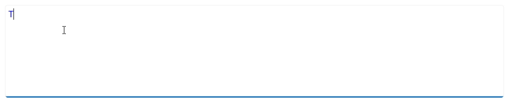
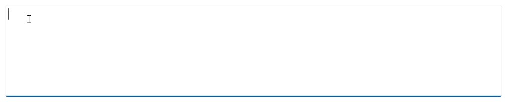

# Customization in .NET MAUI AI-Powered Text Editor (SfSmartTextEditor)
This section explains how to change the AI-Powered Text Editor’s appearance and suggestion behavior. You can set text styles, placeholder options, and customize how suggestions are shown.

## Text customization
Set or bind the smart text editor’s text using the [Text]() property. You can use this to preloaded content or bind it to a field in your view model for data binding.




<smarttexteditor:SfSmartTextEditor
    Text="Thank you for contacting us." />




var smarttexteditor = new SfSmartTextEditor
{
    Text = "Thank you for contacting us."
};




## Text style customization
You can change the text style and font using the [TextStyle]() property to make the editor look the way you want.




<ContentPage
    xmlns="http://schemas.microsoft.com/dotnet/2021/maui"
    xmlns:x="http://schemas.microsoft.com/winfx/2009/xaml"
    xmlns:smarttexteditor="clr-namespace:Syncfusion.Maui.SmartComponents;assembly=Syncfusion.Maui.SmartComponents">

    <smarttexteditor:SfSmartTextEditor>
        <smarttexteditor:SfSmartTextEditor.TextStyle>
            <smarttexteditor:SmartTextEditorStyle
                FontSize="16"
                TextColor="Blue" />
        </smarttexteditor:SfSmartTextEditor.TextStyle>
    </smarttexteditor:SfSmartTextEditor>
</ContentPage>




using Syncfusion.Maui.SmartComponents;

var smarttexteditor = new SfSmartTextEditor
{
    TextStyle = new SmartTextEditorStyle
    {
        FontSize = 16,
        TextColor = Colors.Blue,
    }
};




## Placeholder text and color customization
Add a helpful placeholder to guide users and use [PlaceholderColor]() to make sure the text is easy to read.




<smarttexteditor:SfSmartTextEditor
    Placeholder="Type your message..."
    PlaceholderColor="#49454F" />




var editor = new SfSmartTextEditor
{
    Placeholder = "Type your message...",
    PlaceholderColor = Color.FromArgb("#49454F")
};




## Suggestion text color
Customize the color of the suggestion text using the [SuggestionTextColor]() property to match your theme and improves readability.




<smarttexteditor:SfSmartTextEditor
    SuggestionTextColor="Skyblue" />




var smarttexteditor = new SfSmartTextEditor
{
    SuggestionTextColor = Colors.Skyblue
};




## Suggestion popup background
Change the background color of the suggestion popup using the [SuggestionPopupBackground]() property in Popup mode to align with your app's design.




<smarttexteditor:SfSmartTextEditor
    SuggestionDisplayMode="Popup"
    SuggestionPopupBackground="#0078D4" />




var smarttexteditor = new SfSmartTextEditor
{
    SuggestionDisplayMode = SuggestionDisplayMode.Popup,
    SuggestionPopupBackground = Color.FromArgb("#0078D4"),
};




## Maximum input length
Set a limit on the number of characters the user can enter in the smart text editor using the [MaxLength]() property.




<smarttexteditor:SfSmartTextEditor
    MaxLength="500" />




var smarttexteditor = new SfSmartTextEditor
{
    MaxLength = 500
};


