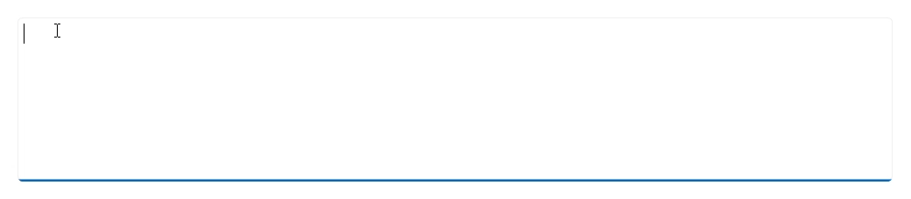

# Getting started with .NET MAUI Smart Text Editor
This section explains how to add the [.NET MAUI SmartTextEditor]() control. It covers only the basic features needed to get started with the Syncfusion AI-Powered Text Editor. Follow the steps below to add a .NET MAUI AI-Powered Text Editor control to your project.

N> The Smart Text Editor is distributed as part of the `Syncfusion.Maui.SmartComponents` package provides advanced AI-assisted features to enhance text editing and content management. Ensure your application has the required AI service configuration to enable these features.




## Prerequisites

Before proceeding, ensure the following are set up:
1. Install [.NET 8 SDK](https://dotnet.microsoft.com/en-us/download/dotnet/8.0) or later is installed.
2. Set up a .NET MAUI environment with Visual Studio 2022 (v17.3 or later).

## Step 1: Create a New .NET MAUI Project

1. Go to **File > New > Project** and choose the **.NET MAUI App** template.
2. Name the project and choose a location. Then click **Next**.
3. Select the .NET framework version and click **Create**.

## Step 2: Install the Syncfusion&reg; .NET MAUI SmartComponents NuGet Package

1. In **Solution Explorer,** right-click the project and choose **Manage NuGet Packages.**
2. Search for [Syncfusion.Maui.SmartComponents]() and install the latest version.
3. Ensure the necessary dependencies are installed correctly, and the project is restored.

## Step 3: Register the handler

The [Syncfusion.Maui.Core](https://www.nuget.org/packages/Syncfusion.Maui.Core/) NuGet is a dependent package for all Syncfusion&reg; controls of .NET MAUI. In the **MauiProgram.cs** file, register the handler for Syncfusion&reg; core.




using Syncfusion.Maui.Core.Hosting;
namespace GettingStarted
{
    public static class MauiProgram
    {
        public static MauiApp CreateMauiApp()
        {
            var builder = MauiApp.CreateBuilder();

            builder.ConfigureSyncfusionCore();
            builder
            .UseMauiApp<App>()
            .ConfigureFonts(fonts =>
            {
                fonts.AddFont("OpenSans-Regular.ttf", "OpenSansRegular");
            });

            return builder.Build();
        }
    }
}




## Step 4: Add .NET MAUI Smart Text Editor control

1. To initialize the control, import the `Syncfusion.Maui.SmartComponents` namespace into your code.
2. Initialize [SfSmartTextEditor]().




<ContentPage   
    . . .
    xmlns:smarttexteditor="clr-namespace:Syncfusion.Maui.SmartComponents;assembly=Syncfusion.Maui.SmartComponents">

    <smarttexteditor:SfSmartTextEditor />
</ContentPage>




using Syncfusion.Maui.SmartComponents;
. . .

public partial class MainPage : ContentPage
{
    public MainPage()
    {
        InitializeComponent();
        SfSmartTextEditor smarttexteditor = new SfSmartTextEditor();
        this.Content = smarttexteditor;
    }
}







## Prerequisites

Before proceeding, ensure the following are set up:
1. Install [.NET 8 SDK](https://dotnet.microsoft.com/en-us/download/dotnet/8.0) or later is installed.
2. Set up a .NET MAUI environment with Visual Studio Code. 
3. Ensure that the .NET MAUI extension is installed and configured as described [here.](https://learn.microsoft.com/en-us/dotnet/maui/get-started/installation?view=net-maui-8.0&tabs=visual-studio-code)

## Step 1: Create a New .NET MAUI Project
1. Open the command palette by pressing `Ctrl+Shift+P` and type **.NET:New Project** and enter.
2. Choose the **.NET MAUI App** template.
3. Select the project location, type the project name and press **Enter**.
4. Then choose **Create project.**

## Step 2: Install the Syncfusion&reg; .NET MAUI SmartComponents NuGet Package

1. Press <kbd>Ctrl</kbd> + <kbd>`</kbd> (backtick) to open the integrated terminal in Visual Studio Code.
2. Ensure you're in the project root directory where your .csproj file is located.
3. Run the command `dotnet add package Syncfusion.Maui.SmartComponents` to install the Syncfusion® .NET MAUI SmartComponents NuGet package.
4. To ensure all dependencies are installed, run `dotnet restore`.

## Step 3: Register the handler

The [Syncfusion.Maui.Core](https://www.nuget.org/packages/Syncfusion.Maui.Core/) NuGet is a dependent package for all Syncfusion&reg; controls of .NET MAUI. In the **MauiProgram.cs** file, register the handler for Syncfusion&reg; core.




using Syncfusion.Maui.Core.Hosting;
namespace GettingStarted
{
    public static class MauiProgram
    {
        public static MauiApp CreateMauiApp()
        {
            var builder = MauiApp.CreateBuilder();

            builder.ConfigureSyncfusionCore();
            builder
            .UseMauiApp<App>()
            .ConfigureFonts(fonts =>
            {
                fonts.AddFont("OpenSans-Regular.ttf", "OpenSansRegular");
            });

            return builder.Build();
        }
    }
}




## Step 4: Add .NET MAUI Smart Text Editor control

1. To initialize the control, import the `Syncfusion.Maui.SmartComponents` namespace into your code.
2. Initialize [SfSmartTextEditor]().




<ContentPage   
    . . .
    xmlns:smarttexteditor="clr-namespace:Syncfusion.Maui.SmartComponents;assembly=Syncfusion.Maui.SmartComponents">

    <smarttexteditor:SfSmartTextEditor />
</ContentPage>




using Syncfusion.Maui.SmartComponents;
. . .

public partial class MainPage : ContentPage
{
    public MainPage()
    {
        InitializeComponent();
        SfSmartTextEditor smarttexteditor = new SfSmartTextEditor();
        this.Content = smarttexteditor;
    }
}








## Prerequisites

Before proceeding, ensure the following are set up:

1. Ensure you have the latest version of JetBrains Rider.
2. Install [.NET 8 SDK](https://dotnet.microsoft.com/en-us/download/dotnet/8.0) or later is installed.
3. Make sure the MAUI workloads are installed and configured as described [here.](https://www.jetbrains.com/help/rider/MAUI.html#before-you-start)

## Step 1: Create a new .NET MAUI Project

1. Go to **File > New Solution,** Select .NET (C#) and choose the .NET MAUI App template.
2. Enter the Project Name, Solution Name, and Location.
3. Select the .NET framework version and click Create.

## Step 2: Install the Syncfusion® MAUI SmartComponents NuGet Package

1. In **Solution Explorer,** right-click the project and choose **Manage NuGet Packages.**
2. Search for [Syncfusion.Maui.SmartComponents]() and install the latest version.
3. Ensure the necessary dependencies are installed correctly, and the project is restored. If not, Open the Terminal in Rider and manually run: `dotnet restore`

## Step 3: Register the handler

The [Syncfusion.Maui.Core](https://www.nuget.org/packages/Syncfusion.Maui.Core/) NuGet is a dependent package for all Syncfusion&reg; controls of .NET MAUI. In the **MauiProgram.cs** file, register the handler for Syncfusion&reg; core.




using Syncfusion.Maui.Core.Hosting;
namespace GettingStarted
{
    public static class MauiProgram
    {
        public static MauiApp CreateMauiApp()
        {
            var builder = MauiApp.CreateBuilder();

            builder.ConfigureSyncfusionCore();
            builder
            .UseMauiApp<App>()
            .ConfigureFonts(fonts =>
            {
                fonts.AddFont("OpenSans-Regular.ttf", "OpenSansRegular");
            });

            return builder.Build();
        }
    }
}




## Step 4: Add .NET MAUI Smart Text Editor control

1. To initialize the control, import the `Syncfusion.Maui.SmartComponents` namespace into your code.
2. Initialize [SfSmartTextEditor]().




<ContentPage
    . . .
    xmlns:smarttexteditor="clr-namespace:Syncfusion.Maui.SmartComponents;assembly=Syncfusion.Maui.SmartComponents">

    <smarttexteditor:SfSmartTextEditor />
</ContentPage>




using Syncfusion.Maui.SmartComponents;
. . .

public partial class MainPage : ContentPage
{
    public MainPage()
    {
        InitializeComponent();
        SfSmartTextEditor smarttexteditor = new SfSmartTextEditor();
        this.Content = smarttexteditor;
    }
}






## Step 5: Configure AI Service

The Smart Text Editor uses a chat inference service resolved from dependency injection to generate contextual suggestions. Register a compatible chat client and an inference adapter in `MauiProgram.cs`. If no AI inference service is configured, the editor generates offline suggestions from your UserPhrases.

### Azure OpenAI

For **Azure OpenAI**, first [deploy an Azure OpenAI Service resource and model](https://learn.microsoft.com/en-us/azure/ai-services/openai/how-to/create-resource), then values for `azureOpenAIKey`, `azureOpenAIEndpoint` and `azureOpenAIModel` will all be provided to you.

* Install the following NuGet packages to your project:





Install-Package Microsoft.Extensions.AI
Install-Package Microsoft.Extensions.AI.OpenAI
Install-Package Azure.AI.OpenAI





* To configure the AI service, add the following settings to the **MauiProgram.cs** file in your application.




using Azure.AI.OpenAI;
using Microsoft.Extensions.AI;
using Microsoft.Extensions.Logging;
using System.ClientModel;
using Syncfusion.Maui.SmartComponents.Hosting;

var builder = MauiApp.CreateBuilder();

....

string azureOpenAIKey = "AZURE_OPENAI_KEY";
string azureOpenAIEndpoint = "AZURE_OPENAI_ENDPOINT";
string azureOpenAIModel = "AZURE_OPENAI_MODEL";
AzureOpenAIClient azureOpenAIClient = new AzureOpenAIClient(
     new Uri(azureOpenAIEndpoint),
     new ApiKeyCredential(azureOpenAIKey)
);
IChatClient azureOpenAIChatClient = azureOpenAIClient.GetChatClient(azureOpenAIModel).AsIChatClient();
builder.Services.AddChatClient(azureOpenAIChatClient);

builder.ConfigureSyncfusionAIServices();




### Ollama

To use Ollama for running self hosted models:

1. **Download and install Ollama**  
   Visit [Ollama's official website](https://ollama.com) and install the application appropriate for your operating system.

2. **Install the desired model from the Ollama library**  
   You can browse and install models from the [Ollama Library](https://ollama.com/library) (e.g., `llama2:13b`, `mistral:7b`, etc.).

3. **Configure your application**

   - Provide the `Endpoint` URL where the model is hosted (e.g., `http://localhost:11434`).
   - Set `ModelName` to the specific model you installed (e.g., `llama2:13b`).

* Install the following NuGet packages to your project:





Install-Package Microsoft.Extensions.AI
Install-Package OllamaSharp





* Add the following settings to the **MauiProgram.cs** file in your application.




using Microsoft.Extensions.AI;
using OllamaSharp;
using Syncfusion.Maui.SmartComponents.Hosting;

var builder = MauiApp.CreateBuilder();

....

string ModelName = "MODEL_NAME";
IChatClient chatClient = new OllamaApiClient("http://localhost:11434", ModelName);
builder.Services.AddChatClient(chatClient);

builder.ConfigureSyncfusionAIServices();




## Step 6: Configure user role and phrases for suggestions

Set the writing context and preferred expressions to guide completions:
- **UserRole** (required): Describes who is typing and the intent, shaping the tone and relevance of suggestions.
- **UserPhrases** (optional): A list of reusable statements that reflect your brand or frequent responses. Used for offline suggestions and to bias completions.




<ContentPage
    .....
    xmlns:smarttexteditor="clr-namespace:Syncfusion.Maui.SmartComponents;assembly=Syncfusion.Maui.SmartComponents">

    <smarttexteditor:SfSmartTextEditor
        Placeholder="Type your reply..."
        UserRole="Support engineer responding to customer tickets">
        <smarttexteditor:SfSmartTextEditor.UserPhrases>
            <x:String>Thanks for reaching out.</x:String>
            <x:String>Please share a minimal reproducible sample.</x:String>
            <x:String>We’ll update you as soon as we have more details.</x:String>
        </smarttexteditor:SfSmartTextEditor.UserPhrases>
    </smarttexteditor:SfSmartTextEditor>
</ContentPage>




N> If no AI inference service is configured, the editor generates offline suggestions from your UserPhrases.

## Step 7: Running the Application

Press **F5** to build and run the application. Once compiled, the Smart Text Editor will be displayed with the provided content, and AI-powered editing features will be available after configuration.

Here is the result of the previous codes,

N> You can refer to our [.NET MAUI Smart Text Editor]() feature tour page for its groundbreaking feature representations. You can also explore our [.NET MAUI Smart Text Editor Example]() that shows you how to render the Smart Text Editor in .NET MAUI.