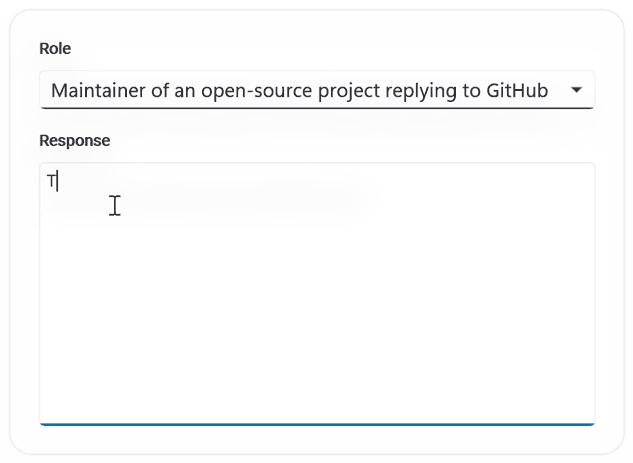

# Overview of .NET MAUI Smart Text Editor

Syncfusion [.NET MAUI AI-Powered Text Editor]() (SfSmartTextEditor) is a multiline input control that accelerates typing with predictive suggestions. It supports inline and popup suggestion display, can integrate with an AI inference service for context aware completions, and falls back to your custom phrase list when AI is unavailable. The control provides full text styling, placeholder customization, and command/event hooks for text changes.

## Key features

* **Suggestion display modes**: Allows customizing suggestions in both inline and popup modes.

* **AI powered suggestions**: Uses IChatInferenceService for intelligent, context aware completions.

* **Custom phrase library**: Maintains fallback phrases when AI suggestions are unavailable.

* **Maximum length validation**: Enforces character limits to ensure precise input control.

* **Keyboard integration**: Allows quick acceptance of suggestions using Tab or Right Arrow keys.

* **Gesture support**: Enables touch users to tap or click suggestions in the pop up for instant insertion.

* **Placeholder text**: Allows configuration of placeholders with customizable color styling.

* **Customization**: Gives users full control over fonts, colors, sizes, and styles for complete UI customization.