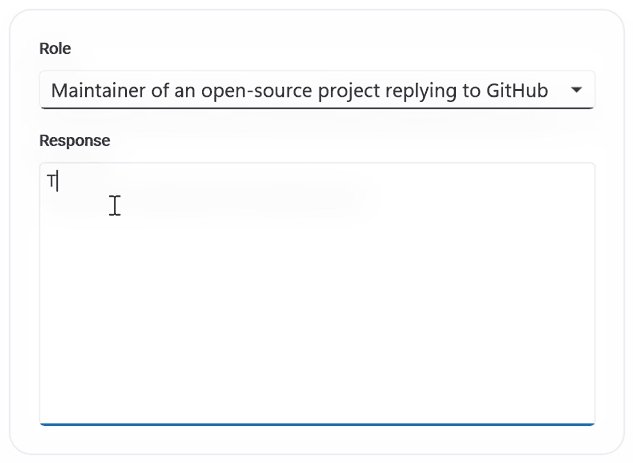

# Overview of .NET MAUI Smart Text Editor

Syncfusion [.NET MAUI AI-Powered Text Editor](https://www.syncfusion.com/maui-controls/maui-smart-texteditor) (SfSmartTextEditor) is a multiline input control that accelerates typing with predictive suggestions. It supports inline and popup suggestion display, can integrate with an AI inference service for context aware completions, and falls back to your custom phrase list when AI is unavailable. The control provides full text styling, placeholder customization, and command/event hooks for text changes.

## Business use cases

- Messaging and chat applications that require predictive text suggestions for faster communication.  
- Content creation tools that support AI-assisted writing and text completion.  
- Form-based applications that enhance user input experience with intelligent suggestions.  
- Productivity applications that require context-aware text entry with improved accuracy and speed.  

## Key features

- **Suggestion display mode** allows presenting suggestions inline or in popup mode based on user interaction.  
- **AI-powered suggestion** allows generating context-aware completions using AI inference services.  
- **Custom phrase fallback** allows using predefined phrases when AI suggestions are not available.  
- **Maximum length validation** allows restricting input length for controlled data entry.  
- **Keyboard interaction** allows accepting suggestions quickly using keys such as Tab or arrow keys.  
- **Touch interaction** allows selecting suggestions through tap or click gestures.  
- **Placeholder text** allows configuring placeholder text with style options.  
- **Customization** allows modifying fonts, colors, sizes, and layout for consistent UI design.  

## Globalization

The following table summarizes the globalization support available in this control.

    
    Full Support

    
    Not Applicable

<table>
<tr>
<th align="center">Control</th>
<th align="center">Localization</th>
<th align="center">RTL</th>
<th align="center">Time zone</th>
<th align="center">Screen reader</th>
<th align="center">Keyboard navigation</th>
</tr>
<tr>
<td><a href="/maui/smarttexteditor/overview">Smart Text Editor</a></td>
<td align="center"></td>
<td align="center"></td>
<td align="center"></td>
<td align="center"></td>
<td align="center"></td>
</tr> 
</table>

## Related controls

- [RichTextEditor](https://help.syncfusion.com/maui/rich-text-editor/overview) for editing and formatting rich text content.
- [MarkDownViewer](https://help.syncfusion.com/maui/markdownviewer/overview) for displaying formatted Markdown content.
- [TextInputLayout](https://help.syncfusion.com/maui/textinputlayout/overview) for enhancing input fields with labels and validation UI.

## See Also

Explore further resources:

- [Getting Started](https://help.syncfusion.com/maui/smarttexteditor/getting-started) shows a step‑by‑step guide to begin using the Smart Text Editor control.  
- [Suggestions](https://help.syncfusion.com/maui/smarttexteditor/suggestion-display-mode) explains how to configure suggestion behavior and AI integration.  
- [Customization](https://help.syncfusion.com/maui/smarttexteditor/customization) helps customize appearance and interaction settings.  
- [UI Kit](https://www.syncfusion.com/demos/maui#maui-ui-control) provides interactive demos and ready‑made UI examples. 

## Resources

<!-- Card 1 -->
<a href="https://www.syncfusion.com/maui-controls/maui-smart-texteditor" class="form-card" target="_blank">
  

    <h3 class="form-title">Feature Tour</h3>
    

      Walk through highlights and core capabilities.
    

  

</a>
<!-- Card 2 -->
<a href="https://github.com/syncfusion/maui-demos/tree/master/MAUI/SmartComponents" class="form-card" target="_blank">
  

    <h3 class="form-title">Showcase Samples</h3>
    

      Explore sample scenarios for real apps.
    

  

</a>
<!-- Card 3 -->
<a href="https://www.syncfusion.com/blogs/category/net-maui" class="form-card" target="_blank">
  

    <h3 class="form-title">Explore Blogs</h3>
    

      Read insights, tutorials, and developer journeys.
    

  

</a>
<!-- Card 4 -->
<a href="https://support.syncfusion.com/kb/cross-platforms/category/76" class="form-card" target="_blank">
  

    <h3 class="form-title">Explore KB's</h3>
    

      Find quick solutions and step‑by‑step guidance.
    

  

</a>
