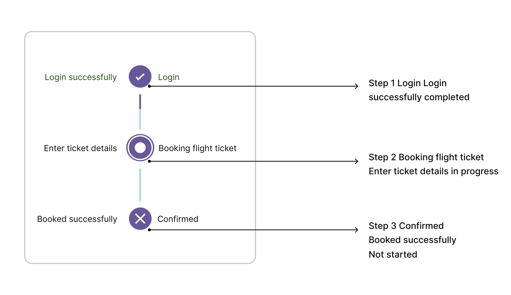

# Accessibility in .NET MAUI SfStepProgressBar

Enhance the accessibility of .NET MAUI Step Progress Bar with a user-friendly design that provides inclusive features for seamless navigation and usability for all users. The following table lists the elements along with their formats and examples.

<table>
<tr>
<th>Element</th>
<th>Format</th>
<th>Example</th>
</tr>
<tr>
<td>Step</td>
<td>Step Number PrimaryText/SecondaryText Stepstatus</td>
<td>Step 1 Login Login successfully completed </td>
</tr>
<tr>
<td>Step</td>
<td>Step Number PrimaryFormattedText/SecondaryFormattedText Stepstatus</td>
<td>Step 1 Login Login successfully Completed </td>
</tr>
</table>

 
