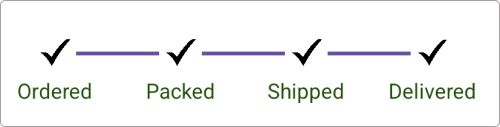
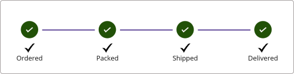

# Customizations in .NET MAUI StepProgressBar (SfStepProgressBar)
You can highly customize the appearance of the Step progress bar background color, step size, content size, animations, and more.

## Customize step shape
Customize the shape of the step by using the [ShapeType](https://help.syncfusion.com/cr/maui/Syncfusion.Maui.ProgressBar.StepSettings.html#Syncfusion_Maui_ProgressBar_StepSettings_ShapeType) property from `StepSettings`. By default the value of `ShapeType` is `Circle`. 




<progressBar:SfStepProgressBar x:Name = "stepProgressBar" ItemsSource="{Binding ShipmentInfoCollection}"
                ActiveStepIndex="2" ActiveStepProgressValue="50">
    <progressBar:SfStepProgressBar.InProgressStepSettings>
        <progressBar:StepSettings Background="#ff67579c" ContentType="Dot" ShapeType="Square" ContentFillColor="White"/>
    </progressBar:SfStepProgressBar.InProgressStepSettings>
    <progressBar:SfStepProgressBar.CompletedStepSettings>
        <progressBar:StepSettings Background="#ff67579c" ContentType="Tick" ShapeType="Square" ContentFillColor="White"/>
    </progressBar:SfStepProgressBar.CompletedStepSettings>
    <progressBar:SfStepProgressBar.NotStartedStepSettings>
        <progressBar:StepSettings Background="#ff67579c" ContentType="Cross" ShapeType="Square" ContentFillColor="White"/>
    </progressBar:SfStepProgressBar.NotStartedStepSettings>
</progressBar:SfStepProgressBar>





public MainPage()
{
    InitializeComponent();
    SfStepProgressBar sfstepProgressbar = new SfStepProgressBar()
    {
        ActiveStepIndex = 2,
        ActiveStepProgressValue=50,
    };
          
    StepSettings inProgressStepSettings = new StepSettings();
    inProgressStepSettings.Background = Color.FromHex("#ff67579c");
    inProgressStepSettings.ContentType = StepContentType.Dot;
    inProgressStepSettings.ShapeType = StepShapeType.Square;
    inProgressStepSettings.ContentFillColor = Colors.White;

    StepSettings completedStepSettings = new StepSettings();
    completedStepSettings.Background = Color.FromHex("#ff67579c");
    completedStepSettings.ContentType = StepContentType.Tick;
    completedStepSettings.ShapeType = StepShapeType.Square;
    completedStepSettings.ContentFillColor = Colors.White;

    StepSettings notStartedStepSettings = new StepSettings();
    notStartedStepSettings.Background = Color.FromHex("#ff67579c");
    notStartedStepSettings.ContentType = StepContentType.Cross;
    notStartedStepSettings.ShapeType = StepShapeType.Square;
    notStartedStepSettings.ContentFillColor = Colors.White;

    sfstepProgressbar.InProgressStepSettings = inProgressStepSettings;
    sfstepProgressbar.NotStartedStepSettings = notStartedStepSettings;
    sfstepProgressbar.CompletedStepSettings = completedStepSettings;

    this.Content = sfstepProgressbar;
}




 {:width="286" height="351"}

## Customize step content 
Customize the step content type by using the [ContentType](https://help.syncfusion.com/cr/maui/Syncfusion.Maui.ProgressBar.StepSettings.html#Syncfusion_Maui_ProgressBar_StepSettings_ContentType) property with [Numbering](https://help.syncfusion.com/cr/maui/Syncfusion.Maui.ProgressBar.StepContentType.html#Syncfusion_Maui_ProgressBar_StepContentType_Numbering), [Tick](https://help.syncfusion.com/cr/maui/Syncfusion.Maui.ProgressBar.StepContentType.html#Syncfusion_Maui_ProgressBar_StepContentType_Tick), [Cross](https://help.syncfusion.com/cr/maui/Syncfusion.Maui.ProgressBar.StepContentType.html#Syncfusion_Maui_ProgressBar_StepContentType_Cross), [Dot](https://help.syncfusion.com/cr/maui/Syncfusion.Maui.ProgressBar.StepContentType.html#Syncfusion_Maui_ProgressBar_StepContentType_Dot) and [Images](https://help.syncfusion.com/cr/maui/Syncfusion.Maui.ProgressBar.StepProgressBarItem.html#Syncfusion_Maui_ProgressBar_StepProgressBarItem_ImageSource). 




<progressBar:SfStepProgressBar x:Name = "stepProgressBar"
                        StepSize="40"
                        StepContentSize="25"
						ActiveStepIndex="1"
						StepStrokeWidth="10"    
                        ActiveStepProgressValue="60">

    <progressBar:SfStepProgressBar.InProgressStepSettings>
        <progressBar:StepSettings Background="#ff67579c" ContentType="Dot" ContentFillColor="White"/>
    </progressBar:SfStepProgressBar.InProgressStepSettings>
    <progressBar:SfStepProgressBar.CompletedStepSettings>
        <progressBar:StepSettings Background="#ff67579c" ContentType="Tick" ContentFillColor="White"/>
    </progressBar:SfStepProgressBar.CompletedStepSettings>
    <progressBar:SfStepProgressBar.NotStartedStepSettings>
        <progressBar:StepSettings Background="#ff67579c" ContentType="Cross" ContentFillColor="White"/>
    </progressBar:SfStepProgressBar.NotStartedStepSettings>
</progressBar:SfStepProgressBar>





SfStepProgressBar sfstepProgressbar = new SfStepProgressBar()
{
    StepContentSize = 25,
    StepSize = 40
};
          
StepSettings inProgressStepSettings = new StepSettings();
inProgressStepSettings.Background = Color.FromHex("#ff67579c");
inProgressStepSettings.ContentType = StepContentType.Dot;
inProgressStepSettings.ContentFillColor = Colors.White;

StepSettings completedStepSettings = new StepSettings();
completedStepSettings.Background = Color.FromHex("#ff67579c");
completedStepSettings.ContentType = StepContentType.Tick;
completedStepSettings.ContentFillColor = Colors.White;

StepSettings notStartedStepSettings = new StepSettings();
notStartedStepSettings.Background = Color.FromHex("#ff67579c");
notStartedStepSettings.ContentType = StepContentType.Cross;
notStartedStepSettings.ContentFillColor = Colors.White;

sfstepProgressbar.InProgressStepSettings = inProgressStepSettings;
sfstepProgressbar.NotStartedStepSettings = notStartedStepSettings;
sfstepProgressbar.CompletedStepSettings = completedStepSettings;

this.Content = sfstepProgressbar;




 {:width="286" height="351"}
 
## Animation duration
Customize the progress animation duration by using the [ProgressAnimationDuration](https://help.syncfusion.com/cr/maui/Syncfusion.Maui.ProgressBar.SfStepProgressBar.html#Syncfusion_Maui_ProgressBar_SfStepProgressBar_ProgressAnimationDuration) property in `SfStepProgressBar`. By default the value of the animation duration is `1000`.




<progressBar:SfStepProgressBar x:Name = "stepProgressBar" 
                        ProgressBarBackground="LightBlue" 
						ProgressAnimationDuration="2000"
						ActiveStepIndex="1" 
						ActiveStepProgressValue="40">
</progressBar:SfStepProgressBar>





public MainPage()
{
    InitializeComponent();
    SfStepProgressBar sfstepProgressbar = new SfStepProgressBar()
    {
        ActiveStepIndex = 1,
        ActiveStepProgressValue=50,
        ProgressBarBackground=Colors.LightBlue,
        ProgressAnimationDuration=2000
    };
          
    this.Content = sfstepProgressbar;
}




## Progress bar background
You can customize the progress bar background of the step progress bar by using the [ProgressBarBackground](https://help.syncfusion.com/cr/maui/Syncfusion.Maui.ProgressBar.SfStepProgressBar.html#Syncfusion_Maui_ProgressBar_SfStepProgressBar_ProgressBarBackground) property in `SfStepProgressBar`.




<progressBar:SfStepProgressBar x:Name = "stepProgressBar" 
                        ProgressBarBackground="LightBlue">
</progressBar:SfStepProgressBar>





public MainPage()
{
    InitializeComponent();
    SfStepProgressBar sfstepProgressbar = new SfStepProgressBar()
    {
        ProgressBarBackground=Colors.LightBlue,
    };
          
    this.Content = sfstepProgressbar;
}




## Customize Progress Track Size for each step
The `SfStepProgressBar` control provides customization of progress track size for each step. You can customize the height of each step progress bar using [ProgressTrackSize](https://help.syncfusion.com/cr/maui/Syncfusion.Maui.ProgressBar.StepProgressBarItem.html#Syncfusion_Maui_ProgressBar_StepProgressBarItem_ProgressTrackSize) property in the `StepProgressBarItem`.

*The default value of the `ProgressTrackSize` property is 50.




<stepProgressBar:SfStepProgressBar
                    x:Name="stepProgress"
                    VerticalOptions="Center"
                    HorizontalOptions="Center"                                        
                    Orientation="Vertical"                                                                                       
                    LabelSpacing="12"
                    ActiveStepIndex="3"
                    ActiveStepProgressValue="50"
                    ItemsSource="{Binding StepProgressItem}">
</stepProgressBar:SfStepProgressBar>

<ContentPage.BindingContext>
    <local:ViewModel />
</ContentPage.BindingContext>




ViewModel viewModel = new ViewModel();
SfStepProgressBar stepProgressBar = new SfStepProgressBar()
{
    VerticalOptions = LayoutOptions.Center,
    HorizontalOptions = LayoutOptions.Center,
    Orientation = StepProgressBarOrientation.Vertical,
    LabelSpacing = 12,
    ActiveStepIndex = 3,
    ActiveStepProgressValue = 50,
    ItemsSource = viewModel.StepProgressItem,
};

this.Content = stepProgressBar;




public class ViewModel
{
    /// 

    /// The Step progress bar item collection.
    /// 

    private ObservableCollection<StepProgressBarItem> stepProgressItem;

    /// 

    /// The Step progress bar item collection.
    /// 

    public ObservableCollection<StepProgressBarItem> StepProgressItem
    {
        get
        {
            return stepProgressItem;
        }
        set
        {
            stepProgressItem = value;
        }
    }

    public ViewModel()
    {
        stepProgressItem = new ObservableCollection<StepProgressBarItem>();
        stepProgressItem.Add(new StepProgressBarItem() { PrimaryText = "Requirement Gathering", ProgressTrackSize = 150 });
        stepProgressItem.Add(new StepProgressBarItem() { PrimaryText = "Design", ProgressTrackSize = 30 });
        stepProgressItem.Add(new StepProgressBarItem() { PrimaryText = "Development", ProgressTrackSize = 80 });
        stepProgressItem.Add(new StepProgressBarItem() { PrimaryText = "Testing", ProgressTrackSize = 50 });
        stepProgressItem.Add(new StepProgressBarItem() { PrimaryText = "Deployment"});
    }
}




 

 N> 
* If the [ProgressTrackSize](https://help.syncfusion.com/cr/maui/Syncfusion.Maui.ProgressBar.StepProgressBarItem.html#Syncfusion_Maui_ProgressBar_StepProgressBarItem_ProgressTrackSize) property value of the StepProgressBarItem is less than 1, the height of the progress bar will be rendered using the default value.
* Providing the [ProgressTrackSize](https://help.syncfusion.com/cr/maui/Syncfusion.Maui.ProgressBar.StepProgressBarItem.html#Syncfusion_Maui_ProgressBar_StepProgressBarItem_ProgressTrackSize) property value for the last step will have no effect because the last step doesn't have a progress bar.
 

## Customize step appearance
You can customize the appearance of the steps by using the [ShapeType](https://help.syncfusion.com/cr/maui/Syncfusion.Maui.ProgressBar.StepSettings.html#Syncfusion_Maui_ProgressBar_StepSettings_ShapeType), [Background](https://help.syncfusion.com/cr/maui/Syncfusion.Maui.ProgressBar.StepSettings.html#Syncfusion_Maui_ProgressBar_StepSettings_Background), [ContentType](https://help.syncfusion.com/cr/maui/Syncfusion.Maui.ProgressBar.StepSettings.html#Syncfusion_Maui_ProgressBar_StepSettings_ContentType), [ContentFillColor](https://help.syncfusion.com/cr/maui/Syncfusion.Maui.ProgressBar.StepSettings.html#Syncfusion_Maui_ProgressBar_StepSettings_ContentFillColor), [ProgressColor](https://help.syncfusion.com/cr/maui/Syncfusion.Maui.ProgressBar.StepSettings.html#Syncfusion_Maui_ProgressBar_StepSettings_ProgressColor), [Stroke](https://help.syncfusion.com/cr/maui/Syncfusion.Maui.ProgressBar.StepSettings.html#Syncfusion_Maui_ProgressBar_StepSettings_Stroke), and [TextStyle](https://help.syncfusion.com/cr/maui/Syncfusion.Maui.ProgressBar.StepSettings.html#Syncfusion_Maui_ProgressBar_StepSettings_TextStyle) properties from the [InProgressStepSettings](https://help.syncfusion.com/cr/maui/Syncfusion.Maui.ProgressBar.SfStepProgressBar.html#Syncfusion_Maui_ProgressBar_SfStepProgressBar_InProgressStepSettings) for the in-progress state, [CompletedStepSettings](https://help.syncfusion.com/cr/maui/Syncfusion.Maui.ProgressBar.SfStepProgressBar.html#Syncfusion_Maui_ProgressBar_SfStepProgressBar_CompletedStepSettings) for the completed state, and [NotStartedStepSettings](https://help.syncfusion.com/cr/maui/Syncfusion.Maui.ProgressBar.SfStepProgressBar.html#Syncfusion_Maui_ProgressBar_SfStepProgressBar_NotStartedStepSettings) for the not-started state. 




<progressBar:SfStepProgressBar x:Name = "stepProgressBar" ItemsSource="{Binding ShipmentInfoCollection}"
                ActiveStepIndex="2" ActiveStepProgressValue="50">
    <progressBar:SfStepProgressBar.InProgressStepSettings>
            <progressBar:StepSettings Background="#ff67579c" ContentType="Dot" ShapeType="Circle" ProgressColor="Orange" ContentFillColor="White" Stroke="DarkViolet">
                <progressBar:StepSettings.TextStyle>
                    <progressBar:StepTextStyle TextColor="CadetBlue" FontAttributes="Bold"/>
                </progressBar:StepSettings.TextStyle>
            </progressBar:StepSettings>
        </progressBar:SfStepProgressBar.InProgressStepSettings>
    <progressBar:SfStepProgressBar.CompletedStepSettings>
            <progressBar:StepSettings Background="#ff67579c" ContentType="Tick" ShapeType="Circle" ProgressColor="Orange" ContentFillColor="White" Stroke="DarkViolet">
                <progressBar:StepSettings.TextStyle>
                    <progressBar:StepTextStyle TextColor="CadetBlue" FontAttributes="Bold"/>
                </progressBar:StepSettings.TextStyle>
            </progressBar:StepSettings>
        </progressBar:SfStepProgressBar.CompletedStepSettings>
    <progressBar:SfStepProgressBar.NotStartedStepSettings>
            <progressBar:StepSettings Background="#ff67579c" ContentType="Cross" ShapeType="Circle" ProgressColor="Orange" ContentFillColor="White"  Stroke="DarkViolet">
                <progressBar:StepSettings.TextStyle>
                    <progressBar:StepTextStyle TextColor="CadetBlue" FontAttributes="Bold"/>
                </progressBar:StepSettings.TextStyle>
            </progressBar:StepSettings>
        </progressBar:SfStepProgressBar.NotStartedStepSettings>
</progressBar:SfStepProgressBar>





public MainPage()
{
    InitializeComponent();
        SfStepProgressBar sfstepProgressbar = new SfStepProgressBar()
        {
            ActiveStepIndex = 2,
            ActiveStepProgressValue = 50,
    };

    StepTextStyle inprogressTextStyle = new StepTextStyle();
    inprogressTextStyle.TextColor = Colors.CadetBlue;
    inprogressTextStyle.FontAttributes = FontAttributes.Bold;

    StepTextStyle completedTextStyle = new StepTextStyle();
    completedTextStyle.TextColor = Colors.CadetBlue;
    completedTextStyle.FontAttributes = FontAttributes.Bold;

    StepTextStyle notStartedTextStyle = new StepTextStyle();
    notStartedTextStyle.TextColor = Colors.CadetBlue;
    notStartedTextStyle.FontAttributes = FontAttributes.Bold;

    StepSettings inProgressStepSettings = new StepSettings();
    inProgressStepSettings.Background = Color.FromHex("#ff67579c");
    inProgressStepSettings.ContentType = StepContentType.Dot;
    inProgressStepSettings.ShapeType = StepShapeType.Square;
    inProgressStepSettings.ContentFillColor = Colors.White;
    inProgressStepSettings.Stroke= Colors.DarkViolet;
    inProgressStepSettings.TextStyle = inprogressTextStyle;

    StepSettings completedStepSettings = new StepSettings();
    completedStepSettings.Background = Color.FromHex("#ff67579c");
    completedStepSettings.ContentType = StepContentType.Tick;
    completedStepSettings.ShapeType = StepShapeType.Square;
    completedStepSettings.ContentFillColor = Colors.White;
    completedStepSettings.Stroke = Colors.DarkViolet;
    completedStepSettings.TextStyle = completedTextStyle;

    StepSettings notStartedStepSettings = new StepSettings();
    notStartedStepSettings.Background = Color.FromHex("#ff67579c");
    notStartedStepSettings.ContentType = StepContentType.Cross;
    notStartedStepSettings.ShapeType = StepShapeType.Square;
    notStartedStepSettings.ContentFillColor = Colors.White;
    notStartedStepSettings.Stroke = Colors.DarkViolet;
    notStartedStepSettings.TextStyle = notStartedTextStyle;

    sfstepProgressbar.InProgressStepSettings = inProgressStepSettings;
    sfstepProgressbar.NotStartedStepSettings = notStartedStepSettings;
    sfstepProgressbar.CompletedStepSettings = completedStepSettings;

    this.Content = sfstepProgressbar;
}




 {:width="286" height="351"}

## Customize step appearance using DataTemplate
You can customize the step appearance using the [StepTemplate](https://help.syncfusion.com/cr/maui/Syncfusion.Maui.ProgressBar.SfStepProgressBar.html#Syncfusion_Maui_ProgressBar_SfStepProgressBar_StepTemplate) property in [SfStepProgressBar](https://help.syncfusion.com/cr/maui/Syncfusion.Maui.ProgressBar.SfStepProgressBar.html).




<progressBar:SfStepProgressBar x:Name="stepProgress"
                               Orientation="Horizontal"
                               ActiveStepIndex="3"
                               ItemsSource="{Binding StepProgressItem}">
    <progressBar:SfStepProgressBar.StepTemplate>
        <DataTemplate>
            <Grid>
                <Image Source="tick.png"/>
            </Grid>
        </DataTemplate>
    </progressBar:SfStepProgressBar.StepTemplate>
</progressBar:SfStepProgressBar>





SfStepProgressBar stepProgressBar = new SfStepProgressBar();
ViewModel viewModel = new ViewModel();
stepProgressBar.ActiveStepIndex = 3;
stepProgressBar.Orientation = StepProgressBarOrientation.Horizontal;
stepProgressBar.ItemsSource = viewModel.StepProgressItem;
var stepTemplate = new DataTemplate(() =>
{
    var grid = new Grid();
    var image = new Image { Source = "tick.png" };
    grid.Children.Add(image);
    return grid;
});
stepProgressBar.StepTemplate = stepTemplate;
this.Content = stepProgressBar;





public class ViewModel
{
    /// 

    /// The Step progress bar item collection.
    /// 

    private ObservableCollection<StepProgressBarItem> stepProgressItem;

    /// 

    /// The Step progress bar item collection.
    /// 

    public ObservableCollection<StepProgressBarItem> StepProgressItem
    {
        get
        {
            return stepProgressItem;
        }
        set
        {
            stepProgressItem = value;
        }
    }

    public ViewModel()
    {
        stepProgressItem = new ObservableCollection<StepProgressBarItem>();
        stepProgressItem.Add(new StepProgressBarItem() { PrimaryText = "Ordered" });
        stepProgressItem.Add(new StepProgressBarItem() { PrimaryText = "Packed" });
        stepProgressItem.Add(new StepProgressBarItem() { PrimaryText = "Shipped" });
        stepProgressItem.Add(new StepProgressBarItem() { PrimaryText = "Delivered" });
    }
}




## Customize step appearance using DataTemplateSelector
You can customize the step appearance using the [StepTemplate](https://help.syncfusion.com/cr/maui/Syncfusion.Maui.ProgressBar.SfStepProgressBar.html#Syncfusion_Maui_ProgressBar_SfStepProgressBar_StepTemplate) property in [SfStepProgressBar](https://help.syncfusion.com/cr/maui/Syncfusion.Maui.ProgressBar.SfStepProgressBar.html). The DataTemplateSelector can be used to choose a different data template for each step in the step progress bar based on the step’s data. This allows you to customize the appearance of a particular step based on certain conditions.




<Grid>
    <Grid.Resources>
        <DataTemplate x:Key="template1">
            <Grid>
                <Image Source="ordered.png" HorizontalOptions="Center" VerticalOptions="Center"/>
            </Grid>
        </DataTemplate>
        <DataTemplate x:Key="template2">
            <Grid>
                <Image Source="packed.png" HorizontalOptions="Center" VerticalOptions="Center"/>
            </Grid>
        </DataTemplate>
        <DataTemplate x:Key="template3">
            <Grid>
                <Image Source="shipped.png" HorizontalOptions="Center" VerticalOptions="Center"/>
            </Grid>
        </DataTemplate>
        <DataTemplate x:Key="template4">
            <Grid>
                <Image Source="delivered.png" HorizontalOptions="Center" VerticalOptions="Center"/>
            </Grid>
        </DataTemplate>
        <local:StepTemplateSelector x:Key="stepTemplateSelector" 
                                    Template1="{StaticResource template1}" 
                                    Template2="{StaticResource template2}" 
                                    Template3="{StaticResource template3}"
                                    Template4="{StaticResource template4}"/>
    </Grid.Resources>
    <progressBar:SfStepProgressBar HorizontalOptions="Center" VerticalOptions="Center"
                                   x:Name="stepProgress"
                                   Orientation="Horizontal"
                                   ActiveStepIndex="3"
                                   ItemsSource="{Binding StepProgressItem}"
                                   StepTemplate="{StaticResource stepTemplateSelector}"/>
</Grid>





public class ViewModel
{
    /// 

    /// The Step progress bar item collection.
    /// 

    private ObservableCollection<StepProgressBarItem> stepProgressItem;

    /// 

    /// The Step progress bar item collection.
    /// 

    public ObservableCollection<StepProgressBarItem> StepProgressItem
    {
        get
        {
            return stepProgressItem;
        }
        set
        {
            stepProgressItem = value;
        }
    }

    public ViewModel()
    {
        stepProgressItem = new ObservableCollection<StepProgressBarItem>();
        stepProgressItem.Add(new StepProgressBarItem() { PrimaryText = "Ordered" });
        stepProgressItem.Add(new StepProgressBarItem() { PrimaryText = "Packed" });
        stepProgressItem.Add(new StepProgressBarItem() { PrimaryText = "Shipped" });
        stepProgressItem.Add(new StepProgressBarItem() { PrimaryText = "Delivered" });
    }
}





 public class StepTemplateSelector : DataTemplateSelector
 {
     public StepTemplateSelector()
     {
     }
     public DataTemplate Template1 { get; set; }
     public DataTemplate Template2 { get; set; }
     public DataTemplate Template3 { get; set; }
     public DataTemplate Template4 { get; set; }

     protected override DataTemplate OnSelectTemplate(object item, BindableObject container)
     {
         var stepDetails = item as StepProgressBarItem;
         if (stepDetails.PrimaryText == "Ordered")
             return Template1;
         else if (stepDetails.PrimaryText == "Packed")
             return Template2;
         else if (stepDetails.PrimaryText == "Shipped")
             return Template3;
         else
             return Template4;
     }
 }




N> 
* The [StepTemplate](https://help.syncfusion.com/cr/maui/Syncfusion.Maui.ProgressBar.SfStepProgressBar.html#Syncfusion_Maui_ProgressBar_SfStepProgressBar_StepTemplate) will be rendered based on the [StepSize](https://help.syncfusion.com/cr/maui/Syncfusion.Maui.ProgressBar.SfStepProgressBar.html#Syncfusion_Maui_ProgressBar_SfStepProgressBar_StepSize) property in [SfStepProgressBar](https://help.syncfusion.com/cr/maui/Syncfusion.Maui.ProgressBar.SfStepProgressBar.html).
* The `StepSettings` properties such as [ShapeType](https://help.syncfusion.com/cr/maui/Syncfusion.Maui.ProgressBar.StepSettings.html#Syncfusion_Maui_ProgressBar_StepSettings_ShapeType), [Background](https://help.syncfusion.com/cr/maui/Syncfusion.Maui.ProgressBar.StepSettings.html#Syncfusion_Maui_ProgressBar_StepSettings_Background), [ContentType](https://help.syncfusion.com/cr/maui/Syncfusion.Maui.ProgressBar.StepSettings.html#Syncfusion_Maui_ProgressBar_StepSettings_ContentType), [ContentFillColor](https://help.syncfusion.com/cr/maui/Syncfusion.Maui.ProgressBar.StepSettings.html#Syncfusion_Maui_ProgressBar_StepSettings_ContentFillColor), [Stroke](https://help.syncfusion.com/cr/maui/Syncfusion.Maui.ProgressBar.StepSettings.html#Syncfusion_Maui_ProgressBar_StepSettings_Stroke) are not applicable when [StepTemplate](https://help.syncfusion.com/cr/maui/Syncfusion.Maui.ProgressBar.SfStepProgressBar.html#Syncfusion_Maui_ProgressBar_SfStepProgressBar_StepTemplate) is provided.

## Customize primary and secondary text appearance using DataTemplate
You can customize the appearance of the step descriptions by using the [PrimaryTextTemplate](https://help.syncfusion.com/cr/maui/Syncfusion.Maui.ProgressBar.SfStepProgressBar.html#Syncfusion_Maui_ProgressBar_SfStepProgressBar_PrimaryTextTemplate) and [SecondaryTextTemplate](https://help.syncfusion.com/cr/maui/Syncfusion.Maui.ProgressBar.SfStepProgressBar.html#Syncfusion_Maui_ProgressBar_SfStepProgressBar_SecondaryTextTemplate) properties in [SfStepProgressBar](https://help.syncfusion.com/cr/maui/Syncfusion.Maui.ProgressBar.SfStepProgressBar.html).




<progressBar:SfStepProgressBar x:Name="stepProgress"
                           Orientation="Horizontal"
                           ActiveStepIndex="3"
                           ItemsSource="{Binding StepProgressItem}">
    <progressBar:SfStepProgressBar.PrimaryTextTemplate>
        <DataTemplate>
            <StackLayout Orientation="Vertical">
                <Image Source="tick.png" HorizontalOptions="Center" WidthRequest="20" HeightRequest="20"/>
                <Label Text="{Binding PrimaryText}" HorizontalOptions="Center"/>
            </StackLayout>
        </DataTemplate>
    </progressBar:SfStepProgressBar.PrimaryTextTemplate>
</progressBar:SfStepProgressBar>





SfStepProgressBar stepProgressBar = new SfStepProgressBar();
ViewModel viewModel = new ViewModel();
stepProgressBar.ItemsSource = viewModel.StepProgressItem;
stepProgressBar.Orientation = StepProgressBarOrientation.Horizontal;
stepProgressBar.ActiveStepIndex = 3;
var primaryTextTemplate = new DataTemplate(() =>
{
    var stackLayout = new StackLayout
    {
        Orientation = StackOrientation.Vertical
    };

    var image = new Image
    {
        Source = "tick.png",
        HorizontalOptions = LayoutOptions.Center,
        WidthRequest = 20,
        HeightRequest = 20
    };

    var label = new Label
    {
        HorizontalOptions = LayoutOptions.Center
    };
    label.SetBinding(Label.TextProperty, "PrimaryText");

    stackLayout.Children.Add(image);
    stackLayout.Children.Add(label);

    return stackLayout;
});

stepProgressBar.PrimaryTextTemplate = primaryTextTemplate;
this.Content = stepProgressBar;





public class ViewModel
{
    /// 

    /// The Step progress bar item collection.
    /// 

    private ObservableCollection<StepProgressBarItem> stepProgressItem;

    /// 

    /// The Step progress bar item collection.
    /// 

    public ObservableCollection<StepProgressBarItem> StepProgressItem
    {
        get
        {
            return stepProgressItem;
        }
        set
        {
            stepProgressItem = value;
        }
    }

    public ViewModel()
    {
        stepProgressItem = new ObservableCollection<StepProgressBarItem>();
        stepProgressItem.Add(new StepProgressBarItem() { PrimaryText = "Ordered" });
        stepProgressItem.Add(new StepProgressBarItem() { PrimaryText = "Packed" });
        stepProgressItem.Add(new StepProgressBarItem() { PrimaryText = "Shipped" });
        stepProgressItem.Add(new StepProgressBarItem() { PrimaryText = "Delivered" });
    }
}




## Customize primary and secondary text appearance using DataTemplateSelector
You can customize the appearance of the step descriptions using the [PrimaryTextTemplate](https://help.syncfusion.com/cr/maui/Syncfusion.Maui.ProgressBar.SfStepProgressBar.html#Syncfusion_Maui_ProgressBar_SfStepProgressBar_PrimaryTextTemplate) and [SecondaryTextTemplate](https://help.syncfusion.com/cr/maui/Syncfusion.Maui.ProgressBar.SfStepProgressBar.html#Syncfusion_Maui_ProgressBar_SfStepProgressBar_SecondaryTextTemplate) properties in [SfStepProgressBar](https://help.syncfusion.com/cr/maui/Syncfusion.Maui.ProgressBar.SfStepProgressBar.html). The DataTemplateSelector can be used to choose a different data template for each step description in the step progress bar based on the step’s data. This allows you to customize the appearance of a particular step description based on certain conditions.




<Grid>
    <Grid.Resources>
        <DataTemplate x:Key="primaryTemplate1">
            <StackLayout Orientation="Vertical">
                <Image Source="ordered.png" HorizontalOptions="Center" WidthRequest="30" HeightRequest="30"/>
                <Label Text="{Binding PrimaryText}" HorizontalOptions="Center"/>
            </StackLayout>
        </DataTemplate>
        <DataTemplate x:Key="primaryTemplate2">
            <StackLayout Orientation="Vertical">
                <Image Source="packed.png" HorizontalOptions="Center" WidthRequest="30" HeightRequest="30"/>
                <Label Text="{Binding PrimaryText}" HorizontalOptions="Center"/>
            </StackLayout>
        </DataTemplate>
        <DataTemplate x:Key="primaryTemplate3">
            <StackLayout Orientation="Vertical">
                <Image Source="shipped.png" HorizontalOptions="Center" WidthRequest="30" HeightRequest="30"/>
                <Label Text="{Binding PrimaryText}" HorizontalOptions="Center"/>
            </StackLayout>
        </DataTemplate>
        <DataTemplate x:Key="primaryTemplate4">
            <StackLayout Orientation="Vertical">
                <Image Source="delivered.png" HorizontalOptions="Center" WidthRequest="30" HeightRequest="30"/>
                <Label Text="{Binding PrimaryText}" HorizontalOptions="Center"/>
            </StackLayout>
        </DataTemplate>
        <local:PrimaryTemplateSelector x:Key="primaryTemplateSelector" 
                                       PrimaryTemplate1="{StaticResource primaryTemplate1}" 
                                       PrimaryTemplate2="{StaticResource primaryTemplate2}" 
                                       PrimaryTemplate3="{StaticResource primaryTemplate3}"
                                       PrimaryTemplate4="{StaticResource primaryTemplate4}"/>
    </Grid.Resources>
    <progressBar:SfStepProgressBar x:Name="stepProgress"
                       Orientation="Horizontal"
                       ActiveStepIndex="3"
                       ItemsSource="{Binding StepProgressItem}"
                       PrimaryTextTemplate="{StaticResource primaryTemplateSelector}">
    </progressBar:SfStepProgressBar>
</Grid>





public class ViewModel
{
    /// 

    /// The Step progress bar item collection.
    /// 

    private ObservableCollection<StepProgressBarItem> stepProgressItem;

    /// 

    /// The Step progress bar item collection.
    /// 

    public ObservableCollection<StepProgressBarItem> StepProgressItem
    {
        get
        {
            return stepProgressItem;
        }
        set
        {
            stepProgressItem = value;
        }
    }

    public ViewModel()
    {
        stepProgressItem = new ObservableCollection<StepProgressBarItem>();
        stepProgressItem.Add(new StepProgressBarItem() { PrimaryText = "Ordered" });
        stepProgressItem.Add(new StepProgressBarItem() { PrimaryText = "Packed" });
        stepProgressItem.Add(new StepProgressBarItem() { PrimaryText = "Shipped" });
        stepProgressItem.Add(new StepProgressBarItem() { PrimaryText = "Delivered" });
    }
}





public class PrimaryTemplateSelector : DataTemplateSelector
{
    public PrimaryTemplateSelector()
    {
    }
    public DataTemplate PrimaryTemplate1 { get; set; }
    public DataTemplate PrimaryTemplate2 { get; set; }
    public DataTemplate PrimaryTemplate3 { get; set; }
    public DataTemplate PrimaryTemplate4 { get; set; }

    protected override DataTemplate OnSelectTemplate(object item, BindableObject container)
    {
        var stepDetails = item as StepProgressBarItem;
        if (stepDetails.PrimaryText == "Ordered")
            return PrimaryTemplate1;
        else if (stepDetails.PrimaryText == "Packed")
            return PrimaryTemplate2;
        else if (stepDetails.PrimaryText == "Shipped")
            return PrimaryTemplate3;
        else
            return PrimaryTemplate4;
    }
}




N> The `StepTextStyle` properties such as [TextColor](https://help.syncfusion.com/cr/maui/Syncfusion.Maui.ProgressBar.StepTextStyle.html#Syncfusion_Maui_ProgressBar_StepTextStyle_TextColor), [FontSize](https://help.syncfusion.com/cr/maui/Syncfusion.Maui.ProgressBar.StepTextStyle.html#Syncfusion_Maui_ProgressBar_StepTextStyle_FontSize), [FontFamily](https://help.syncfusion.com/cr/maui/Syncfusion.Maui.ProgressBar.StepTextStyle.html#Syncfusion_Maui_ProgressBar_StepTextStyle_FontFamily), and [FontAttributes](https://help.syncfusion.com/cr/maui/Syncfusion.Maui.ProgressBar.StepTextStyle.html#Syncfusion_Maui_ProgressBar_StepTextStyle_FontAttributes) are not applicable when [PrimaryTextTemplate](https://help.syncfusion.com/cr/maui/Syncfusion.Maui.ProgressBar.SfStepProgressBar.html#Syncfusion_Maui_ProgressBar_SfStepProgressBar_PrimaryTextTemplate) or [SecondaryTextTemplate](https://help.syncfusion.com/cr/maui/Syncfusion.Maui.ProgressBar.SfStepProgressBar.html#Syncfusion_Maui_ProgressBar_SfStepProgressBar_SecondaryTextTemplate) is provided.

