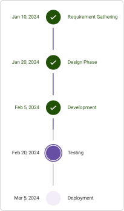

# Description in .NET MAUI StepProgressBar (Step Progress Bar)
Each step in a multi-step process has a different operation. To display information about a step's status can be shown on either side. A primary description will be on the right or bottom of the step, and a secondary description will be on the left or top of the step.

## Text 
The primary and secondary descriptions for a step view can be set using the [PrimaryText](https://help.syncfusion.com/cr/maui/Syncfusion.Maui.ProgressBar.StepProgressBarItem.html#Syncfusion_Maui_ProgressBar_StepProgressBarItem_PrimaryText) and [SecondaryText](https://help.syncfusion.com/cr/maui/Syncfusion.Maui.ProgressBar.StepProgressBarItem.html#Syncfusion_Maui_ProgressBar_StepProgressBarItem_SecondaryText) properties, as demonstrated in the following code example.

* Create a simple Observable Collection that contain the `PrimaryText` and `SecondaryText` by using the `StepProgressBarItem` collection, which is bound to the `ItemSource` property.




<stepProgressBar:SfStepProgressBar
                    x:Name="stepProgress"
                    VerticalOptions="Center"
                    HorizontalOptions="Center"                                        
                    Orientation="Vertical"                                                                                       
                    LabelSpacing="12"
                    ActiveStepIndex="3"
                    ActiveStepProgressValue="50"
                    ItemsSource="{Binding StepProgressItem}">
</stepProgressBar:SfStepProgressBar>

<ContentPage.BindingContext>
    <local:ViewModel />
</ContentPage.BindingContext>




ViewModel viewModel = new ViewModel();
SfStepProgressBar stepProgressBar = new SfStepProgressBar()
{
    VerticalOptions = LayoutOptions.Center,
    HorizontalOptions = LayoutOptions.Center,
    Orientation = StepProgressBarOrientation.Vertical,
    LabelSpacing = 12,
    ActiveStepIndex = 3,
    ActiveStepProgressValue = 50,
    ItemsSource = viewModel.StepProgressItem,
};

this.Content = stepProgressBar;




public class ViewModel
{
    /// 

    /// The Step progress bar item collection.
    /// 

    private ObservableCollection<StepProgressBarItem> stepProgressItem;

    /// 

    /// The Step progress bar item collection.
    /// 

    public ObservableCollection<StepProgressBarItem> StepProgressItem
    {
        get
        {
            return stepProgressItem;
        }
        set
        {
            stepProgressItem = value;
        }
    }

    public ViewModel()
    {
        stepProgressItem = new ObservableCollection<StepProgressBarItem>();
        stepProgressItem.Add(new StepProgressBarItem() { PrimaryText = "Requirement Gathering", SecondaryText = "Jan 10, 2024" });
        stepProgressItem.Add(new StepProgressBarItem() { PrimaryText = "Design Phase", SecondaryText = "Jan 20, 2024" });
        stepProgressItem.Add(new StepProgressBarItem() { PrimaryText = "Development", SecondaryText = "Feb 5, 2024" });
        stepProgressItem.Add(new StepProgressBarItem() { PrimaryText = "Testing", SecondaryText = "Feb 20, 2024" });
        stepProgressItem.Add(new StepProgressBarItem() { PrimaryText = "Deployment", SecondaryText = "Mar 5, 2024" });
    }
}




 
 
## Formatted text
[PrimaryFormattedText](https://help.syncfusion.com/cr/maui/Syncfusion.Maui.ProgressBar.StepProgressBarItem.html#Syncfusion_Maui_ProgressBar_StepProgressBarItem_PrimaryFormattedText) and [SecondaryFormattedText](https://help.syncfusion.com/cr/maui/Syncfusion.Maui.ProgressBar.StepProgressBarItem.html#Syncfusion_Maui_ProgressBar_StepProgressBarItem_SecondaryFormattedText) can be used to customize the description with different formatting style. The following code example explains how to set `PrimaryFormattedText` and `SecondaryFormattedText` to a step view.

* Create a simple Observable Collection that contain the `PrimaryFormattedText` and `SecondaryFormattedText` by using the `StepProgressBarItem` collection, which is bound to the `ItemSource` property.




<stepProgressBar:SfStepProgressBar
                    x:Name="stepProgress"
                    VerticalOptions="Center"
                    HorizontalOptions="Center"                                        
                    Orientation="Vertical"                                                                                       
                    LabelSpacing="12"
                    ActiveStepIndex="1"
                    ActiveStepProgressValue="50"
                    ItemsSource="{Binding StepProgressItem}">
</stepProgressBar:SfStepProgressBar>                                                                                             

<ContentPage.BindingContext>
    <local:ViewModel />
</ContentPage.BindingContext>




ViewModel viewModel = new ViewModel();
SfStepProgressBar stepProgressBar = new SfStepProgressBar()
{
    VerticalOptions = LayoutOptions.Center,
    HorizontalOptions = LayoutOptions.Center,
    Orientation = StepProgressBarOrientation.Vertical,
    LabelSpacing = 12,
    ActiveStepIndex = 1,
    ActiveStepProgressValue = 50,
    ItemsSource = viewModel.StepProgressItem,
};

this.Content = stepProgressBar;




public class ViewModel
{
    /// 

    /// The Step progress bar item collection.
    /// 

    private ObservableCollection<StepProgressBarItem> stepProgressItem;

    /// 

    /// The Step progress bar item collection.
    /// 

    public ObservableCollection<StepProgressBarItem> StepProgressItem
    {
        get
        {
            return stepProgressItem;
        }
        set
        {
            stepProgressItem = value;
        }
    }

    public ViewModel()
    {
        FormattedString primaryFormattedText1 = new FormattedString();
        primaryFormattedText1.Spans.Add(new Span { Text = "Step 1: Introduction", FontSize = 14, FontAttributes = FontAttributes.Bold });
        primaryFormattedText1.Spans.Add(new Span { Text = "\nWelcome to our", FontSize = 12, TextColor = Colors.Gray });
        primaryFormattedText1.Spans.Add(new Span { Text = "\nplatform!", FontSize = 12, TextColor = Colors.Gray });

        FormattedString primaryFormattedText2 = new FormattedString();
        primaryFormattedText2.Spans.Add(new Span { Text = "Step 2: Registration", FontSize = 14, FontAttributes = FontAttributes.Bold });
        primaryFormattedText2.Spans.Add(new Span { Text = "\nCreate your account", FontSize = 12, TextColor = Colors.Gray });
        primaryFormattedText2.Spans.Add(new Span { Text = "\nto access exclusive features", FontSize = 12, TextColor = Colors.Gray });

        FormattedString primaryFormattedText3 = new FormattedString();
        primaryFormattedText3.Spans.Add(new Span { Text = "Step 3: Profile Setup", FontSize = 14, FontAttributes = FontAttributes.Bold });
        primaryFormattedText3.Spans.Add(new Span { Text = "\nComplete your profile", FontSize = 12, TextColor = Colors.Gray });
        primaryFormattedText3.Spans.Add(new Span { Text = "\nto personalize your experience", FontSize = 12, TextColor = Colors.Gray });

        FormattedString secondaryFormattedText1 = new FormattedString();
        secondaryFormattedText1.Spans.Add(new Span { Text = "Join us and explore!", FontSize = 12, TextColor = Colors.Gray });

        FormattedString secondaryFormattedText2 = new FormattedString();
        secondaryFormattedText2.Spans.Add(new Span { Text = "Unlock all features", FontSize = 12, TextColor = Colors.Gray });

        FormattedString secondaryFormattedText3 = new FormattedString();
        secondaryFormattedText3.Spans.Add(new Span { Text = "Personalize your journey", FontSize = 12, TextColor = Colors.Gray });

        stepProgressItem = new ObservableCollection<StepProgressBarItem>();
        stepProgressItem.Add(new StepProgressBarItem() { PrimaryFormattedText = primaryFormattedText1, SecondaryFormattedText = secondaryFormattedText1 });
        stepProgressItem.Add(new StepProgressBarItem() { PrimaryFormattedText = primaryFormattedText2, SecondaryFormattedText = secondaryFormattedText2 });
        stepProgressItem.Add(new StepProgressBarItem() { PrimaryFormattedText = primaryFormattedText3, SecondaryFormattedText = secondaryFormattedText3 });
    }
}




 

N> If both `PrimaryText` and `PrimaryFormattedText` are provided, then `PrimaryFormattedText` will be displayed. This precedence is same as for the `SecondaryText` and `SecondaryFormattedText`.

## Customize label spacing
You can customize the space between the step and primary or secondary text of the step progress bar by using the [LabelSpacing](https://help.syncfusion.com/cr/maui/Syncfusion.Maui.ProgressBar.SfStepProgressBar.html#Syncfusion_Maui_ProgressBar_SfStepProgressBar_LabelSpacing) property in `SfStepProgressBar`. The default value of `LabelSpacing` property is `5`.




<stepProgressBar:SfStepProgressBar                                                                              
                        LabelSpacing="28">
</stepProgressBar:SfStepProgressBar> 




SfStepProgressBar stepProgressBar = new SfStepProgressBar()
{
    LabelSpacing = 28,
};

this.Content = stepProgressBar;




 
 
## Customize label position
You can customize the position of primary or secondary text of the step progress bar by using the [LabelPosition](https://help.syncfusion.com/cr/maui/Syncfusion.Maui.ProgressBar.SfStepProgressBar.html#Syncfusion_Maui_ProgressBar_SfStepProgressBar_LabelPosition) property in `SfStepProgressBar`. It can be positioned at the `Start`, `End`, `Bottom` or `Top`. 

The default value of the `LabelPosition` property in the horizontal direction is `Bottom`, and in the vertical direction, it is `End`.




<stepProgressBar:SfStepProgressBar                                                                              
                        LabelPosition="Bottom">
</stepProgressBar:SfStepProgressBar> 




SfStepProgressBar stepProgressBar = new SfStepProgressBar()
{
    LabelPosition = LabelPosition.Bottom,
};

this.Content = stepProgressBar;




 

N> The `LabelPosition` property will be considered only if either `PrimaryText` or `SecondaryText`, and either `PrimaryFormattedText` or `SecondaryFormattedText`, is provided.

## StepProgressBar Image Customization

The [StepProgressBar](https://help.syncfusion.com/cr/maui/Syncfusion.Maui.ProgressBar.SfStepProgressBar.html) control provides support for adding images as the content of the step. You can add the images by giving an image path and font icons.

### Customization using Image

You can add the images by giving image path to the [ImageSource](https://help.syncfusion.com/cr/maui/Syncfusion.Maui.ProgressBar.StepProgressBarItem.html#Syncfusion_Maui_ProgressBar_StepProgressBarItem_ImageSource) property in `SfStepProgressBar`. The following code example explains how to set an image in step view.

* Create a simple Observable Collection that contain the provided images by using the `StepProgressBarItem` collection, which is bound to the `ItemSource` property.




<stepProgressBar:SfStepProgressBar
                    x:Name="stepProgress"
                    VerticalOptions="Center"
                    HorizontalOptions="Center"                                        
                    Orientation="Horizontal"                                                                                       
                    LabelSpacing="12"
                    LabelPosition="Bottom"
                    ActiveStepIndex="2"
                    ActiveStepProgressValue="50"    
                    ItemsSource="{Binding StepProgressItem}">
</stepProgressBar:SfStepProgressBar>                                                                                              

<ContentPage.BindingContext>
    <local:ViewModel />
</ContentPage.BindingContext>




ViewModel viewModel = new ViewModel();
SfStepProgressBar stepProgressBar = new SfStepProgressBar()
{
    VerticalOptions = LayoutOptions.Center,
    HorizontalOptions = LayoutOptions.Center,
    Orientation = StepProgressBarOrientation.Horizontal,
    LabelSpacing = 12,
    LabelPosition = LabelPosition.Bottom,
    ActiveStepIndex = 2,
    ActiveStepProgressValue = 50,
    ItemsSource = viewModel.StepProgressItem,
};

this.Content = stepProgressBar;




public class ViewModel
 {
    /// 

    /// The Step progress bar item collection.
    /// 

    private ObservableCollection<StepProgressBarItem> stepProgressItem;

    /// 

    /// The Step progress bar item collection.
    /// 

    public ObservableCollection<StepProgressBarItem> StepProgressItem
    {
        get
        {
            return stepProgressItem;
        }
        set
        {
            stepProgressItem = value;
        }
    }

    public ViewModel()
    {
        stepProgressItem = new ObservableCollection<StepProgressBarItem>();
        stepProgressItem.Add(new StepProgressBarItem() { ImageSource = "ordered.png" });
        stepProgressItem.Add(new StepProgressBarItem() { ImageSource = "transport.png" });
        stepProgressItem.Add(new StepProgressBarItem() { ImageSource = "payment.png" });
        stepProgressItem.Add(new StepProgressBarItem() { ImageSource = "delivered.png" });
    }
 }




 {:width="500" height="127"}
 
### Customization using Font icon

You can add the images with font icons to the [ImageSource](https://help.syncfusion.com/cr/maui/Syncfusion.Maui.ProgressBar.StepProgressBarItem.html#Syncfusion_Maui_ProgressBar_StepProgressBarItem_ImageSource) property in `SfStepProgressBar`. The following code example explains how to set an image in step view.

* Create a simple Observable Collection that contain the provided images by using the `StepProgressBarItem` collection, which is bound to the `ItemSource` property.




<stepProgressBar:SfStepProgressBar
                    x:Name="stepProgress"
                    VerticalOptions="Center"
                    HorizontalOptions="Center"                                        
                    Orientation="Horizontal"
                    ActiveStepIndex="2"
                    ActiveStepProgressValue="50"    
                    ItemsSource="{Binding StepProgressItem}">
</stepProgressBar:SfStepProgressBar>                                                                                            

<ContentPage.BindingContext>
    <local:ViewModel />
</ContentPage.BindingContext>




ViewModel viewModel = new ViewModel();
SfStepProgressBar stepProgressBar = new SfStepProgressBar()
{
    VerticalOptions = LayoutOptions.Center,
    HorizontalOptions = LayoutOptions.Center,
    Orientation = StepProgressBarOrientation.Horizontal,
    ActiveStepIndex = 2,
    ActiveStepProgressValue = 50,
    ItemsSource = viewModel.StepProgressItem,
};

this.Content = stepProgressBar;




public class ViewModel
 {
    /// 

    /// The Step progress bar item collection.
    /// 

    private ObservableCollection<StepProgressBarItem> stepProgressItem;

    /// 

    /// The Step progress bar item collection.
    /// 

    public ObservableCollection<StepProgressBarItem> StepProgressItem
    {
        get
        {
            return stepProgressItem;
        }
        set
        {
            stepProgressItem = value;
        }
    }

    public ViewModel()
    {
        stepProgressItem = new ObservableCollection<StepProgressBarItem>();
        stepProgressItem.Add(new StepProgressBarItem() { ImageSource = new FontImageSource() { Glyph = "\ue760", Size = 32, FontFamily = "IconFont", Color = Colors.White } });
        stepProgressItem.Add(new StepProgressBarItem() { ImageSource = new FontImageSource() { Glyph = "\ue77f", Size = 32, FontFamily = "IconFont", Color = Colors.White } });
        stepProgressItem.Add(new StepProgressBarItem() { ImageSource = new FontImageSource() { Glyph = "\ue786", Size = 32, FontFamily = "IconFont", Color = Colors.White } });
    }
 }




 {:width="500" height="127"}