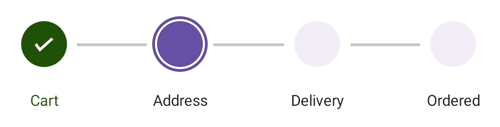

# Getting started with .NET MAUI Step ProgressBar
This section explains how to add the [.NET MAUI Step ProgressBar](https://www.syncfusion.com/maui-controls/maui-stepprogressbar) control. This section covers only the basic features needed to get started with Syncfusion Step ProgressBar. Follow the steps below to add a .NET MAUI Step progress bar control to your project.

To get start quickly with our .NET MAUI Step ProgressBar, you can check the below video.

"

## Prerequisites

Before proceeding, ensure the following are set up:
1. Install [.NET 7 SDK](https://dotnet.microsoft.com/en-us/download/dotnet/7.0) or later is installed.
2. Set up a .NET MAUI environment with Visual Studio 2022 (v17.3 or later) or VS Code. For VS Code users, ensure that the .NET MAUI workload is installed and configured as described [here.](https://learn.microsoft.com/en-us/dotnet/maui/get-started/installation?view=net-maui-8.0&tabs=visual-studio-code)

## Step 1: Create a New .NET MAUI Project

### Visual Studio

1. Go to **File > New > Project** and choose the **.NET MAUI App** template.
2. Name the project and choose a location, then click **Next**.
3. Select the .NET framework version and click **Create**.

### Visual Studio Code

1. Open the command palette by pressing `Ctrl+Shift+P` and type **.NET:New Project** and enter.
2. Choose the **.NET MAUI App** template.
3. Select the project location, type the project name and press enter.
4. Then choose **Create project.**

## Step 2: Install the Syncfusion MAUI ProgressBar NuGet Package

1. In **Solution Explorer,** right-click the project and choose **Manage NuGet Packages.**
2. Search for [Syncfusion.Maui.ProgressBar](https://www.nuget.org/packages/Syncfusion.Maui.ProgressBar/) and install the latest version.
3. Ensure the necessary dependencies are installed correctly, and the project is restored.

## Step 3: Register the handler

The [Syncfusion.Maui.Core](https://www.nuget.org/packages/Syncfusion.Maui.Core/) NuGet is a dependent package for all Syncfusion controls of .NET MAUI. In the **MauiProgram.cs** file, register the handler for Syncfusion core.




using Syncfusion.Maui.Core.Hosting;
namespace GettingStarted
{
    public static class MauiProgram
    {
        public static MauiApp CreateMauiApp()
        {
            var builder = MauiApp.CreateBuilder();

            builder.ConfigureSyncfusionCore();
            builder
            .UseMauiApp<App>()
            .ConfigureFonts(fonts =>
            {
                fonts.AddFont("OpenSans-Regular.ttf", "OpenSansRegular");
            });

            return builder.Build();
        }
    }
}




## Step 4: Add .NET MAUI Step Progress Bar control

1. To initialize the control, import the progressbar namespace into your code.
2. Initialize [SfStepProgressBar](https://help.syncfusion.com/cr/maui/Syncfusion.Maui.ProgressBar.SfStepProgressBar.html).




<ContentPage   
    . . .
    xmlns:stepProgressBar="clr-namespace:Syncfusion.Maui.ProgressBar;assembly=Syncfusion.Maui.ProgressBar"

    <stepProgressBar:SfStepProgressBar />
</ContentPage>




using Syncfusion.Maui.ProgressBar;
. . .

public partial class MainPage : ContentPage
{
    public MainPage()
    {
        InitializeComponent();
        SfStepProgressBar stepProgressBar = new SfStepProgressBar();
        this.Content = stepProgressBar;
    }
}




## Populating step progressbar items

You can use [ItemsSource](https://help.syncfusion.com/cr/maui/Syncfusion.Maui.ProgressBar.SfStepProgressBar.html#Syncfusion_Maui_ProgressBar_SfStepProgressBar_ItemsSource) property of SfStepProgressBar to populate the step progressbar items. Hence, you must create a item collection and bind it to the progressbar control.

* Create a simple Observable Collection of the item for the step progressbar,




public class ViewModel
{
    /// 

    /// The Step progress bar item collection.
    /// 

    private ObservableCollection<StepProgressBarItem> stepProgressItem;

    /// 

    /// The Step progress bar item collection.
    /// 

    public ObservableCollection<StepProgressBarItem> StepProgressItem
    {
        get
        {
            return stepProgressItem;
        }
        set
        {
            stepProgressItem = value;
        }
    }

    public ViewModel()
    {
        stepProgressItem = new ObservableCollection<StepProgressBarItem>();
        stepProgressItem.Add(new StepProgressBarItem() { PrimaryText = "Cart" });
        stepProgressItem.Add(new StepProgressBarItem() { PrimaryText = "Address" });
        stepProgressItem.Add(new StepProgressBarItem() { PrimaryText = "Delivery" });
        stepProgressItem.Add(new StepProgressBarItem() { PrimaryText = "Ordered" });
    }
}




* Bind the Collection to step progressbar

The Step progressbar control allows you to bind item collection by setting the [ItemsSource](https://help.syncfusion.com/cr/maui/Syncfusion.Maui.ProgressBar.SfStepProgressBar.html#Syncfusion_Maui_ProgressBar_SfStepProgressBar_ItemsSource) property from the [SfStepProgressBar](https://help.syncfusion.com/cr/maui/Syncfusion.Maui.ProgressBar.SfStepProgressBar.html). Bind item collection in both XAML and C#.




<stepProgressBar:SfStepProgressBar
                    x:Name="stepProgress"
                    VerticalOptions="Center"
                    HorizontalOptions="Center"                                        
                    Orientation="Horizontal"                                                                                       
                    LabelSpacing="12"
                    ActiveStepIndex="2"
                    ActiveStepProgressValue="60"
                    ProgressAnimationDuration="2500"
                    ItemsSource="{Binding StepProgressItem}">
</stepProgressBar:SfStepProgressBar>                                                                                             

<ContentPage.BindingContext>
    <local:ViewModel />
</ContentPage.BindingContext>




ViewModel viewModel = new ViewModel();
SfStepProgressBar stepProgressBar = new SfStepProgressBar()
{
    VerticalOptions = LayoutOptions.Center,
    HorizontalOptions = LayoutOptions.Center,
    Orientation = StepProgressBarOrientation.Horizontal,
    LabelSpacing = 12,
    ActiveStepIndex = 2,
    ActiveStepProgressValue = 60,
    ProgressAnimationDuration = 2500,               
    ItemsSource = viewModel.StepProgressItem,
};

this.Content = stepProgressBar;




## ActiveStepIndex
The [ActiveStepIndex](https://help.syncfusion.com/cr/maui/Syncfusion.Maui.ProgressBar.SfStepProgressBar.html#Syncfusion_Maui_ProgressBar_SfStepProgressBar_ActiveStepIndex) property is used to represent index of the currently active step within the sequence of steps. The [ActiveStepProgressValue](https://help.syncfusion.com/cr/maui/Syncfusion.Maui.ProgressBar.SfStepProgressBar.html#Syncfusion_Maui_ProgressBar_SfStepProgressBar_ActiveStepProgressValue) property is used to add the progress value of the currently active step within a sequence.




<stepProgressBar:SfStepProgressBar
                    x:Name="stepProgress"
                    ActiveStepIndex="3"
                    ActiveStepProgressValue="40">
</stepProgressBar:SfStepProgressBar>




SfStepProgressBar stepProgressBar = new SfStepProgressBar()
{
    ActiveStepIndex = 3,
    ActiveStepProgressValue = 40,
};




N> If `ActiveStepIndex` value is less than 0, first step will be marked as `NotStarted` step status. If `ActiveStepIndex` value is greater than the step count, all the steps will be marked as `Completed` step status.