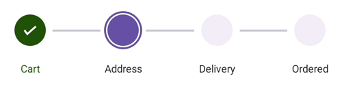

# Getting started with .NET MAUI Step ProgressBar
This section explains how to add the [.NET MAUI Step ProgressBar](https://www.syncfusion.com/maui-controls/maui-stepprogressbar) control. This section covers only the basic features needed to get started with Syncfusion Step ProgressBar. Follow the steps below to add a .NET MAUI Step progress bar control to your project.

To get start quickly with our .NET MAUI Step ProgressBar, you can check the below video.

"




## Prerequisites
Before proceeding, ensure the following are set up:

1. Install [.NET 9 SDK](https://dotnet.microsoft.com/en-us/download/dotnet/9.0) or later.
2. Set up a .NET MAUI environment with Visual Studio 2022 v17.12 or later.

## Step 1: Create a new .NET MAUI project

1. Go to **File > New > Project** and choose the **.NET MAUI App** template.
2. Name the project and choose a location. Then click **Next**.
3. Select the .NET framework version and click **Create**.

## Step 2: Install the Syncfusion&reg; .NET MAUI ProgressBar NuGet package

1. In **Solution Explorer,** right-click the project and choose **Manage NuGet Packages.**
2. Search for [Syncfusion.Maui.ProgressBar](https://www.nuget.org/packages/Syncfusion.Maui.ProgressBar/) and install the latest version.
3. Ensure the necessary dependencies are installed correctly, and the project is restored.




## Prerequisites

Before proceeding, ensure the following are set up:

1. Install [.NET 9 SDK](https://dotnet.microsoft.com/en-us/download/dotnet/9.0) or later.
2. Set up a .NET MAUI environment with Visual Studio Code.
3. Ensure that the .NET MAUI workloads are installed and configured as described [here](https://learn.microsoft.com/en-us/dotnet/maui/get-started/installation?view=net-maui-9.0&tabs=visual-studio-code).

## Step 1: Create a new .NET MAUI project

1. Open the command palette by pressing `Ctrl+Shift+P` and type **.NET:New Project** and enter.
2. Choose the **.NET MAUI App** template.
3. Select the project location, type the project name and press **Enter**.
4. Then choose **Create project.**

## Step 2: Install the Syncfusion&reg; .NET MAUI ProgressBar NuGet package

1. Press <kbd>Ctrl</kbd> + <kbd>`</kbd> (backtick) to open the integrated terminal in Visual Studio Code.
2. Ensure you're in the project root directory where your .csproj file is located.
3. Run the command `dotnet add package Syncfusion.Maui.Picker` to install the Syncfusion® .NET MAUI Picker NuGet package.
4. To ensure all dependencies are installed, run `dotnet restore`.




## Prerequisites

Before proceeding, ensure the following are set up:

1. Install [.NET 9 SDK](https://dotnet.microsoft.com/en-us/download/dotnet/9.0) or later.
2. Set up a .NET MAUI environment with JetBrains Rider 2024.3 or later.
3. Make sure the MAUI workloads are installed and configured as described [here.](https://www.jetbrains.com/help/rider/MAUI.html#before-you-start)

## Step 1: Create a new .NET MAUI project

1. Go to **File > New Solution,** Select .NET (C#) and choose the .NET MAUI App template.
2. Enter the Project Name, Solution Name, and Location.
3. Select the .NET framework version and click Create.

## Step 2: Install the Syncfusion® MAUI ProgressBar NuGet package

1. In **Solution Explorer,** right-click the project and choose **Manage NuGet Packages.**
2. Search for [Syncfusion.Maui.ProgressBar](https://www.nuget.org/packages/Syncfusion.Maui.ProgressBar/) and install the latest version.
3. Ensure the necessary dependencies are installed correctly, and the project is restored. If not, Open the Terminal in Rider and manually run: `dotnet restore`




## Step 3: Register Syncfusion handler

Make sure to add the namespace.



using Syncfusion.Maui.Core.Hosting;



Register the Syncfusion core handler in your `CreateMauiApp` method of `MauiProgram.cs` file to use Syncfusion controls.



builder.ConfigureSyncfusionCore();
 


## Step 4: Create the ViewModel

You can use [ItemsSource](https://help.syncfusion.com/cr/maui/Syncfusion.Maui.ProgressBar.SfStepProgressBar.html#Syncfusion_Maui_ProgressBar_SfStepProgressBar_ItemsSource) property of SfStepProgressBar to populate the step progressbar items. Hence, you must create a item collection and bind it to the progressbar control.

Create a simple Observable Collection of the item for the step progressbar,




public class ViewModel
{
    private ObservableCollection<StepProgressBarItem> stepProgressItem;
    public ObservableCollection<StepProgressBarItem> StepProgressItem
    {
        get
        {
            return stepProgressItem;
        }
        set
        {
            stepProgressItem = value;
        }
    }

    public ViewModel()
    {
        stepProgressItem = new ObservableCollection<StepProgressBarItem>();
        stepProgressItem.Add(new StepProgressBarItem() { PrimaryText = "Cart" });
        stepProgressItem.Add(new StepProgressBarItem() { PrimaryText = "Address" });
        stepProgressItem.Add(new StepProgressBarItem() { PrimaryText = "Delivery" });
        stepProgressItem.Add(new StepProgressBarItem() { PrimaryText = "Ordered" });
    }
}




## Step 5: Import Step ProgressBar namespace

Add the following namespace in your XAML or C#.




xmlns:stepProgressBar="clr-namespace:Syncfusion.Maui.ProgressBar;assembly=Syncfusion.Maui.ProgressBar"




using Syncfusion.Maui.ProgressBar;




## Step 6: Add the Step ProgressBar component

The Step progressbar control allows you to bind item collection by setting the [ItemsSource](https://help.syncfusion.com/cr/maui/Syncfusion.Maui.ProgressBar.SfStepProgressBar.html#Syncfusion_Maui_ProgressBar_SfStepProgressBar_ItemsSource) property from the [SfStepProgressBar](https://help.syncfusion.com/cr/maui/Syncfusion.Maui.ProgressBar.SfStepProgressBar.html). Bind item collection in both XAML and C#.




<stepProgressBar:SfStepProgressBar
                    x:Name="stepProgress"                                                                                     
                    LabelSpacing="12"
                    ActiveStepIndex="2"
                    ActiveStepProgressValue="60"
                    ProgressAnimationDuration="2500"
                    ItemsSource="{Binding StepProgressItem}">
<stepProgressBar:SfStepProgressBar>                                                                                        

<ContentPage.BindingContext>
    <local:ViewModel />
</ContentPage.BindingContext>




ViewModel viewModel = new ViewModel();
SfStepProgressBar stepProgressBar = new SfStepProgressBar()
{
    LabelSpacing = 12,
    ActiveStepIndex = 2,
    ActiveStepProgressValue = 60,
    ProgressAnimationDuration = 2500,               
    ItemsSource = viewModel.StepProgressItem,
};

this.Content = stepProgressBar;




You can download the Step ProgressBar Getting Started sample from [GitHub](https://github.com/SyncfusionExamples/dotnet-maui-step-progressbar-sample).