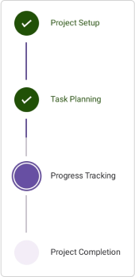

# Orientation in .NET MAUI StepProgressBar (Step Progress Bar)
The StepProgressBar control provides options to change the default orientation, so a multi-step process can be visualized in horizontal or vertical orientation.

## Horizontal
By default, StepProgressBar step views are displayed [Horizontal](https://help.syncfusion.com/cr/maui/Syncfusion.Maui.ProgressBar.StepProgressBarOrientation.html#Syncfusion_Maui_ProgressBar_StepProgressBarOrientation_Horizontal). You can also define the orientation as demonstrated in the following code example.




<stepProgressBar:SfStepProgressBar 
                    Orientation="Horizontal">
</stepProgressBar:SfStepProgressBar>




SfStepProgressBar stepProgressBar = new SfStepProgressBar();
stepProgressBar.Orientation = StepOrientation.Horizontal;




 

## Vertical
To view the step progress bar control in [Vertical](https://help.syncfusion.com/cr/maui/Syncfusion.Maui.ProgressBar.StepProgressBarOrientation.html#Syncfusion_Maui_ProgressBar_StepProgressBarOrientation_Vertical), you can define the vertical orientation as demonstrated in the following code example.




<stepProgressBar:SfStepProgressBar 
                    Orientation="Vertical">
</stepProgressBar:SfStepProgressBar>




SfStepProgressBar stepProgressBar = new SfStepProgressBar();
stepProgressBar.Orientation = StepOrientation.Vertical;




 