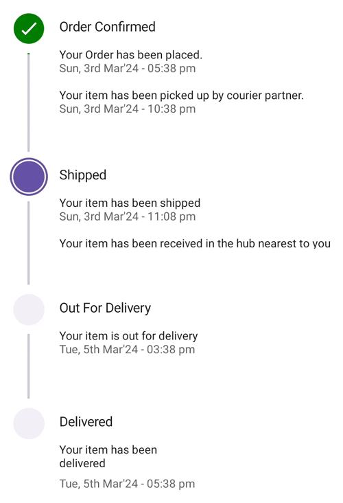

# Overview of .NET MAUI Step ProgressBar (SfStepProgressBar)

[Syncfusion .NET MAUI Step ProgressBar (SfStepProgressBar)](https://www.syncfusion.com/maui-controls/maui-stepprogressbar) control allows you to displays progress through multiple steps in a process, such as order tracking or a user registration form. It's customizable, with options for step shape, content, progress bar color, and more.

## Key features

* **Orientation** : The Step ProgressBar allows you to change the orientation to `horizontal` or `vertical` direction.

* **Progress indication status** : Supports three statuses of progress indications: `Completed`, `In Progress`, and `Not Started`.

* **Status representation** : To display information about a step's status using `Primary` and `Secondary` text.

* **Formatted text** : Primary and Secondary formatted text used to customize the description.

* **Label positioning** : You can change the label position to `Start`, `End`, `Top`, or `Bottom`.

* **Change active step status** : Allows initializing the active step index and progress value.

* **Content types** : You can add different content types such as `Tick`, `Cross`, `Dot`, or `None`, with customizations.

* **Shape customization** : Customize the step progress bar shape type to `Circle` or `Square`.

* **Image support** : You can represent the step progress bar content with images inside the step.

* **Customization** : Supports customization of the step progress bar background color, step size, content size, animations, and more.

