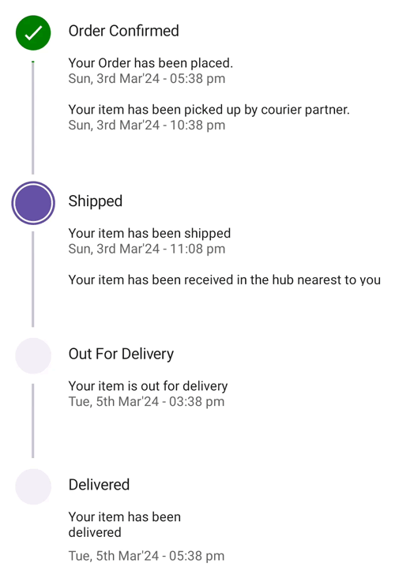

# Overview of .NET MAUI Step ProgressBar (SfStepProgressBar)

[Syncfusion .NET MAUI Step ProgressBar (SfStepProgressBar)](https://www.syncfusion.com/maui-controls/maui-stepprogressbar) control allows you to displays progress through multiple steps in a process, such as order tracking or a user registration form. It's customizable, with options for step shape, content, progress bar color, and more.

## Business use cases

- E-commerce applications that display order tracking stages such as placed, shipped, and delivered.  
- Form-based applications that guide users through multi-step processes such as registration or checkout flows.  
- Workflow systems that represent progress through defined sequential stages.  
- Business applications that require clear visualization of task completion status across steps.  

## Key features

- **Orientation** allows displaying the step progress bar in horizontal or vertical layouts.  
- **Progress status** allows representing steps using states such as completed, in progress, and not started.  
- **Status text** allows displaying primary and secondary text to describe each step clearly.  
- **Formatted text** allows customizing the appearance and style of step descriptions.  
- **Flexible label positioning** allows placing labels at start, end, top, or bottom positions.  
- **Active step control** allows setting and updating the current step index programmatically.  
- **Content customization** allows displaying indicators such as tick, cross, dot, or custom content.  
- **Shape customization** allows configuring step shapes such as circle or square.  
- **Image support** allows displaying images within step indicators for enhanced visualization.  
- **Appearance customization** allows modifying colors, sizes, animations, and layout for better UI consistency. 

## Globalization

The following table summarizes the globalization support available in this control.

 Full Support   
 Not Applicable

<table>
<tr>
<th align="center">Control</th>
<th align="center">Localization</th>
<th align="center">RTL</th>
<th align="center">Time zone</th>
<th align="center">Screen reader</th>
<th align="center">Keyboard navigation</th>
</tr>
<tr>
<td><a href="/maui/stepprogressbar/overview">Step Progress Bar</a></td>
<td align="center"></td>
<td align="center"></td>
<td align="center"></td>
<td align="center"></td>
<td align="center"></td>
</tr> 
</table>

## Related controls

- [Linear ProgressBar](https://help.syncfusion.com/maui/linearprogressbar/overview) for displaying continuous progress using a linear indicator.
- [Circular ProgressBar](https://help.syncfusion.com/maui/circularprogressbar/overview) for representing progress using circular visuals. 
- [TabView](https://help.syncfusion.com/maui/tabview/overview) for guiding users through multiple steps or stages using a structured, step-by-step interface.

## See Also

Explore further resources:

- [Getting Started](https://help.syncfusion.com/maui/stepprogressbar/getting-started) shows a step‑by‑step guide to begin using the Step ProgressBar control.  
- [Customization](https://help.syncfusion.com/maui/stepprogressbar/customization) explains how to customize appearance and step configuration.  
- [Tooltip](https://help.syncfusion.com/maui/stepprogressbar/tooltip) helps show helpful hints when hovering.  
- [UI Kit](https://www.syncfusion.com/demos/maui#maui-ui-control) provides interactive demos and ready‑made UI examples. 

## Resources

<!-- Card 1 -->
<a href="https://www.syncfusion.com/maui-controls/maui-stepprogressbar" class="form-card" target="_blank">
  

    <h3 class="form-title">Feature Tour</h3>
    

      Walk through highlights and core capabilities.
    

  

</a>
<!-- Card 2 -->
<a href="https://www.syncfusion.com/tutorial-videos/maui/step-progress-bar" class="form-card" target="_blank">
  

    <h3 class="form-title">Tutorial Videos</h3>
    

      Step‑by‑step guidance through video tutorials.
    

  

</a>
<!-- Card 3 -->
<a href="https://support.syncfusion.com/kb/cross-platforms/category/76" class="form-card" target="_blank">
  

    <h3 class="form-title">Explore KB's</h3>
    

      Find quick solutions and step‑by‑step guidance.
    

  

</a>
<!-- Card 4 -->
<a href="https://www.syncfusion.com/blogs/category/net-maui" class="form-card" target="_blank">
  

    <h3 class="form-title">Explore Blogs</h3>
    

      Read insights, tutorials, and developer journeys.
    

  

</a>