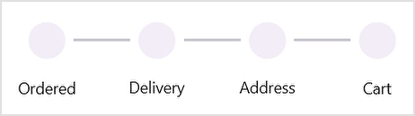

 
# RightToLeft Flow Direction in MAUI StepProgressBar (SfStepProgressBar)

The [SfStepProgressBar](https://www.syncfusion.com/maui-controls/maui-stepprogressbar) supports changing the flow direction of items rendering in the right-to-left order by setting the `FlowDirection` to `RightToLeft`.




  <ContentPage 
            . . .
            <stepProgressBar:SfStepProgressBar FlowDirection="RightToLeft"/>

   </ContentPage>
     



   
SfStepProgressBar stepProgressBar = new SfStepProgressBar();
stepProgressBar.FlowDirection = RightToLeft;
this.content = stepProgressBar;





