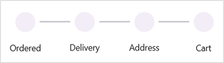

 
# RTL Support in .NET MAUI SfStepProgressBar

The [SfStepProgressBar](https://www.syncfusion.com/maui-controls/maui-stepprogressbar) supports changing the flow direction of items rendering in the right-to-left order by setting the `FlowDirection` to `RightToLeft`.




<ContentPage
            ...
            <stepProgressBar:SfStepProgressBar FlowDirection="RightToLeft"/>

</ContentPage>





SfStepProgressBar stepProgressBar = new SfStepProgressBar();
stepProgressBar.FlowDirection = FlowDirection.RightToLeft;
this.Content = stepProgressBar;





