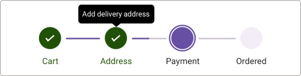
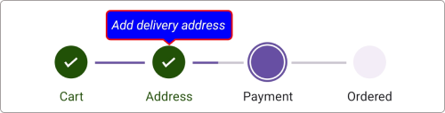

# Tooltip in .NET MAUI Step ProgressBar

The tooltip provides information when hovering over or tapping the steps in the step progress bar, displaying details about the each steps.

## Enable tooltip

To enable the tooltip for the step progress bar control, utilize the [ShowToolTip](https://help.syncfusion.com/cr/maui/Syncfusion.Maui.ProgressBar.SfStepProgressBar.html#Syncfusion_Maui_ProgressBar_SfStepProgressBar_ShowToolTip) property of [SfStepProgressBar](https://help.syncfusion.com/cr/maui/Syncfusion.Maui.ProgressBar.SfStepProgressBar.html). By default, the value of [ShowToolTip](https://help.syncfusion.com/cr/maui/Syncfusion.Maui.ProgressBar.SfStepProgressBar.html#Syncfusion_Maui_ProgressBar_SfStepProgressBar_ShowToolTip)  is set to `false`. To provide users with additional information or context about specific step, simply set this property to `true`.

## ToolTipText

The tooltip text for a step view can be set using the [ToolTipText](https://help.syncfusion.com/cr/maui/Syncfusion.Maui.ProgressBar.StepProgressBarItem.html#Syncfusion_Maui_ProgressBar_StepProgressBarItem_ToolTipText) property from the [StepProgressBarItem](https://help.syncfusion.com/cr/maui/Syncfusion.Maui.ProgressBar.StepProgressBarItem.html) collection, which is bound to the [ItemsSource](https://help.syncfusion.com/cr/maui/Syncfusion.Maui.ProgressBar.SfStepProgressBar.html#Syncfusion_Maui_ProgressBar_SfStepProgressBar_ItemsSource) property.

N> The tooltip is shown only when the [ToolTipText](https://help.syncfusion.com/cr/maui/Syncfusion.Maui.ProgressBar.StepProgressBarItem.html#Syncfusion_Maui_ProgressBar_StepProgressBarItem_ToolTipText) is provided.




<stepProgressBar:SfStepProgressBar
                    x:Name="stepProgress"
                    Orientation="Horizontal"
                    ShowToolTip="True"
                    ItemsSource="{Binding StepProgressItem}">
</stepProgressBar:SfStepProgressBar>                                                             
<ContentPage.BindingContext>
    <local:ViewModel />
</ContentPage.BindingContext>




SfStepProgressBar stepProgressBar = new SfStepProgressBar();
ViewModel viewModel = new ViewModel();
stepProgressBar.ItemsSource = viewModel.StepProgressItem;
stepProgressBar.Orientation = StepProgressBarOrientation.Horizontal;
stepProgressBar.ShowToolTip = true;
this.Content = stepProgressBar;




public class ViewModel
{
    /// 

    /// The Step progress bar item collection.
    /// 

    private ObservableCollection<StepProgressBarItem> stepProgressItem;

    /// 

    /// The Step progress bar item collection.
    /// 

    public ObservableCollection<StepProgressBarItem> StepProgressItem
    {
        get
        {
            return stepProgressItem;
        }
        set
        {
            stepProgressItem = value;
        }
    }

    public ViewModel()
    {
        stepProgressItem = new ObservableCollection<StepProgressBarItem>();
        stepProgressItem.Add(new StepProgressBarItem() { PrimaryText = "Cart", ToolTipText = "Add items to cart" });
        stepProgressItem.Add(new StepProgressBarItem() { PrimaryText = "Address", ToolTipText = "Add delivery address" });
        stepProgressItem.Add(new StepProgressBarItem() { PrimaryText = "Payment", ToolTipText = "Choose payment method" });
        stepProgressItem.Add(new StepProgressBarItem() { PrimaryText = "Ordered", ToolTipText = "Place your order" });
    }
}




## Customize tooltip appearance

The tooltip appearance customization can be achieved by using the [Stroke](https://help.syncfusion.com/cr/maui/Syncfusion.Maui.ProgressBar.StepProgressBarToolTipSettings.html#Syncfusion_Maui_ProgressBar_StepProgressBarToolTipSettings_Stroke), [Duration](https://help.syncfusion.com/cr/maui/Syncfusion.Maui.ProgressBar.StepProgressBarToolTipSettings.html#Syncfusion_Maui_ProgressBar_StepProgressBarToolTipSettings_Duration), [TextStyle](https://help.syncfusion.com/cr/maui/Syncfusion.Maui.ProgressBar.StepProgressBarToolTipSettings.html#Syncfusion_Maui_ProgressBar_StepProgressBarToolTipSettings_TextStyle), and [Background](https://help.syncfusion.com/cr/maui/Syncfusion.Maui.ProgressBar.StepProgressBarToolTipSettings.html#Syncfusion_Maui_ProgressBar_StepProgressBarToolTipSettings_Background) properties of [ToolTipSettings](https://help.syncfusion.com/cr/maui/Syncfusion.Maui.ProgressBar.SfStepProgressBar.html#Syncfusion_Maui_ProgressBar_SfStepProgressBar_ToolTipSettings) in the [SfStepProgressBar](https://help.syncfusion.com/cr/maui/Syncfusion.Maui.ProgressBar.SfStepProgressBar.html).

Additionally, you can achieve further appearance customization by using [ToolTipTemplate](https://help.syncfusion.com/cr/maui/Syncfusion.Maui.ProgressBar.SfStepProgressBar.html#Syncfusion_Maui_ProgressBar_SfStepProgressBar_ToolTipTemplate) of the [SfStepProgressBar](https://help.syncfusion.com/cr/maui/Syncfusion.Maui.ProgressBar.SfStepProgressBar.html).

### Customize tooltip appearance using its properties

To customize the appearance of the tooltip in the [SfStepProgressBar](https://help.syncfusion.com/cr/maui/Syncfusion.Maui.ProgressBar.SfStepProgressBar.html) using [ToolTipSettings](https://help.syncfusion.com/cr/maui/Syncfusion.Maui.ProgressBar.SfStepProgressBar.html#Syncfusion_Maui_ProgressBar_SfStepProgressBar_ToolTipSettings), you can utilize the following properties:

* [Background](https://help.syncfusion.com/cr/maui/Syncfusion.Maui.ProgressBar.StepProgressBarToolTipSettings.html#Syncfusion_Maui_ProgressBar_StepProgressBarToolTipSettings_Background): This property allows you to change the background color of the tooltip.
* [Duration](https://help.syncfusion.com/cr/maui/Syncfusion.Maui.ProgressBar.StepProgressBarToolTipSettings.html#Syncfusion_Maui_ProgressBar_StepProgressBarToolTipSettings_Duration): Specifies the duration in milliseconds, for which the tooltip will be displayed. This helps control how long the tooltip remains visible on the screen.
* [Stroke](https://help.syncfusion.com/cr/maui/Syncfusion.Maui.ProgressBar.StepProgressBarToolTipSettings.html#Syncfusion_Maui_ProgressBar_StepProgressBarToolTipSettings_Stroke): This property enables you to change the border color of the tooltip.
* [TextStyle](https://help.syncfusion.com/cr/maui/Syncfusion.Maui.ProgressBar.StepProgressBarToolTipSettings.html#Syncfusion_Maui_ProgressBar_StepProgressBarToolTipSettings_TextStyle): This property is used to modify the appearance of the tooltip text. You can customize attributes such as [TextColor](https://help.syncfusion.com/cr/maui/Syncfusion.Maui.ProgressBar.StepTextStyle.html#Syncfusion_Maui_ProgressBar_StepTextStyle_TextColor), [FontSize](https://help.syncfusion.com/cr/maui/Syncfusion.Maui.ProgressBar.StepTextStyle.html#Syncfusion_Maui_ProgressBar_StepTextStyle_FontSize), [FontFamily](https://help.syncfusion.com/cr/maui/Syncfusion.Maui.ProgressBar.StepTextStyle.html#Syncfusion_Maui_ProgressBar_StepTextStyle_FontFamily), and [FontAttributes](https://help.syncfusion.com/cr/maui/Syncfusion.Maui.ProgressBar.StepTextStyle.html#Syncfusion_Maui_ProgressBar_StepTextStyle_FontAttributes).




<stepProgressBar:SfStepProgressBar x:Name="stepProgressBar"
                    ItemsSource="{Binding StepProgressItem}"
                    Orientation="Horizontal"
                    ShowToolTip="True">
    <stepProgressBar:SfStepProgressBar.ToolTipSettings>
        <stepProgressBar:StepProgressBarToolTipSettings Background="Blue"
                            Stroke="Red"
                            Duration="0:0:10">
            <stepProgressBar:StepProgressBarToolTipSettings.TextStyle>
                <stepProgressBar:StepTextStyle TextColor="White"
                              FontSize="14"
                              FontAttributes="Italic"/>
            </stepProgressBar:StepProgressBarToolTipSettings.TextStyle>
        </stepProgressBar:StepProgressBarToolTipSettings>
    </stepProgressBar:SfStepProgressBar.ToolTipSettings>
    <stepProgressBar:SfStepProgressBar.BindingContext>
        <local:ViewModel />
    </stepProgressBar:SfStepProgressBar.BindingContext>
 </stepProgressBar:SfStepProgressBar>




SfStepProgressBar stepProgressBar = new SfStepProgressBar();
ViewModel viewModel = new ViewModel();
stepProgressBar.ItemsSource = viewModel.StepProgressItem;
stepprogressBar.Orientation = StepProgressBarOrientation.Horizontal;
stepProgressBar.ShowToolTip = true;
stepProgressBar.ToolTipSettings = new StepProgressBarToolTipSettings() { Background = Brush.Blue, Stroke = Brush.Red, Duration = new TimeSpan(0, 0, 10), TextStyle = new stepProgressBarTextStyle() { TextColor = Colors.White, FontSize = 14, FontAttributes = FontAttributes.Italic } };
this.Content = stepProgressBar;




public class ViewModel
{
    /// 

    /// The Step progress bar item collection.
    /// 

    private ObservableCollection<StepProgressBarItem> stepProgressItem;

    /// 

    /// The Step progress bar item collection.
    /// 

    public ObservableCollection<StepProgressBarItem> StepProgressItem
    {
        get
        {
            return stepProgressItem;
        }
        set
        {
            stepProgressItem = value;
        }
    }

    public ViewModel()
    {
        stepProgressItem = new ObservableCollection<StepProgressBarItem>();
        stepProgressItem.Add(new StepProgressBarItem() { PrimaryText = "Cart", ToolTipText = "Add items to cart" });
        stepProgressItem.Add(new StepProgressBarItem() { PrimaryText = "Address", ToolTipText = "Add delivery address" });
        stepProgressItem.Add(new StepProgressBarItem() { PrimaryText = "Payment", ToolTipText = "Choose payment method" });
        stepProgressItem.Add(new StepProgressBarItem() { PrimaryText = "Ordered", ToolTipText = "Place your order" });
    }
}




N> This property will only be applicable when the [ShowToolTip](https://help.syncfusion.com/cr/maui/Syncfusion.Maui.ProgressBar.SfStepProgressBar.html#Syncfusion_Maui_ProgressBar_SfStepProgressBar_ShowToolTip) is enabled.

### Customize tooltip appearance using DataTemplate

You can customize the tooltip appearance by using the [ToolTipTemplate](https://help.syncfusion.com/cr/maui/Syncfusion.Maui.ProgressBar.SfStepProgressBar.html#Syncfusion_Maui_ProgressBar_SfStepProgressBar_ToolTipTemplate) property in the [SfStepProgressBar](https://help.syncfusion.com/cr/maui/Syncfusion.Maui.ProgressBar.SfStepProgressBar.html).

The following code example shows the usage of DataTemplate.




<stepProgressBar:SfStepProgressBar x:Name="stepProgressBar"
                    ItemsSource="{Binding StepProgressItem}"
                    Orientation="Horizontal"
                    ShowToolTip="True">
    <progressBar:SfStepProgressBar.ToolTipTemplate>
        <DataTemplate>
            <StackLayout Orientation="Horizontal">
                <Image Source="info.png" WidthRequest="20" HeightRequest="20"/>
                <Label Text="{Binding ToolTipText}" 
                    TextColor="White"
                    FontSize="Caption"
                    Padding="5,0,0,0"
                    VerticalOptions="Center"/>
            </StackLayout>
        </DataTemplate>
    </progressBar:SfStepProgressBar.ToolTipTemplate>
    <stepProgressBar:SfStepProgressBar.BindingContext>
        <local:ViewModel />
    </stepProgressBar:SfStepProgressBar.BindingContext>
 </stepProgressBar:SfStepProgressBar>




SfStepProgressBar stepProgressBar = new SfStepProgressBar();
ViewModel viewModel = new ViewModel();
stepProgressBar.Orientation = StepProgressBarOrientation.Horizontal;
stepProgressBar.ShowToolTip = true;
stepProgressBar.ItemsSource = viewModel.StepProgressItem;
DataTemplate toolTipTemplate = new DataTemplate(() =>
{
    var stackLayout = new StackLayout();
    stackLayout.Orientation = StackOrientation.Horizontal;
    Image image = new Image
    {
        Source = "info.png",
        WidthRequest = 20,
        HeightRequest = 20
    };
    var label = new Label
    {
        TextColor = Colors.White,
        Padding = new Thickness(5, 0, 0, 0),
        VerticalOptions = LayoutOptions.Center
    };
    label.SetBinding(Label.TextProperty, "ToolTipText");
    stackLayout.Children.Add(image);
    stackLayout.Children.Add(label);
    return stackLayout;
});

stepProgressBar.ToolTipTemplate = toolTipTemplate;
this.Content = stepProgressBar;




public class ViewModel
{
    /// 

    /// The Step progress bar item collection.
    /// 

    private ObservableCollection<StepProgressBarItem> stepProgressItem;

    /// 

    /// The Step progress bar item collection.
    /// 

    public ObservableCollection<StepProgressBarItem> StepProgressItem
    {
        get
        {
            return stepProgressItem;
        }
        set
        {
            stepProgressItem = value;
        }
    }

    public ViewModel()
    {
        stepProgressItem = new ObservableCollection<StepProgressBarItem>();
        stepProgressItem.Add(new StepProgressBarItem() { PrimaryText = "Cart", ToolTipText = "Add items to cart" });
        stepProgressItem.Add(new StepProgressBarItem() { PrimaryText = "Address", ToolTipText = "Add delivery address" });
        stepProgressItem.Add(new StepProgressBarItem() { PrimaryText = "Payment", ToolTipText = "Choose payment method" });
        stepProgressItem.Add(new StepProgressBarItem() { PrimaryText = "Ordered", ToolTipText = "Place your order" });
    }
}




N> This property will only be applicable when the [ShowToolTip](https://help.syncfusion.com/cr/maui/Syncfusion.Maui.ProgressBar.SfStepProgressBar.html#Syncfusion_Maui_ProgressBar_SfStepProgressBar_ShowToolTip) is enabled.

