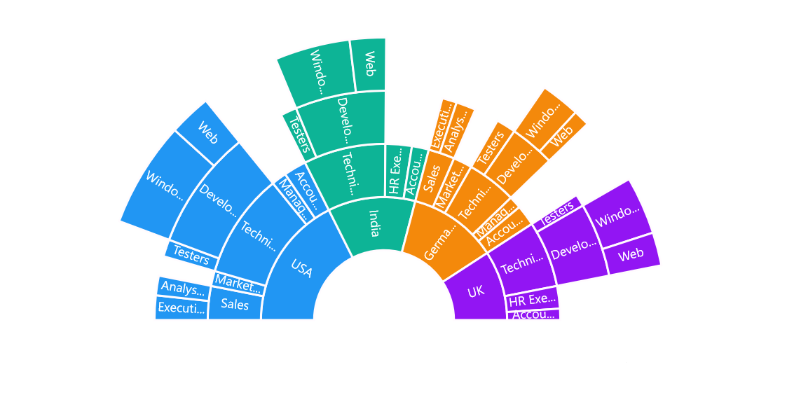
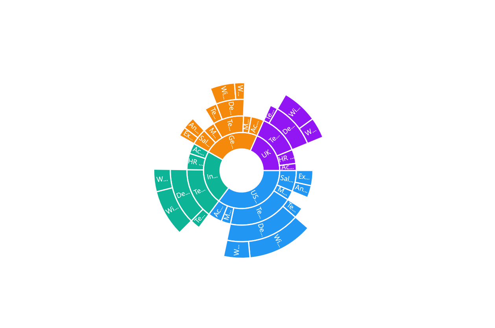
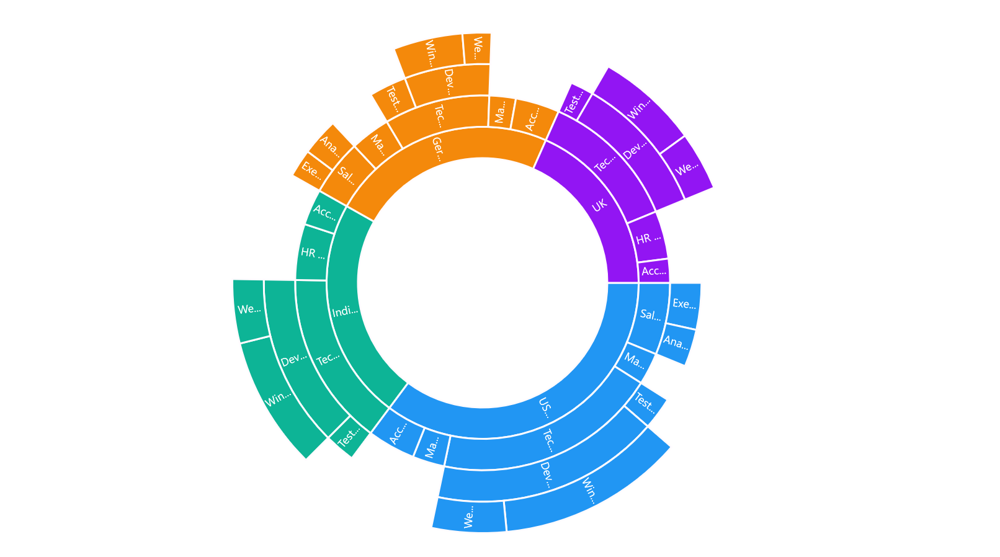

# Customization in .NET MAUI Chart

The sunburst chart provides various customizing and styling options to enrich the application.

## Angle

The start angle and end angle of the sunburst chart can be adjusted by using the [StartAngle]() and [EndAngle]() properties.

 



    <chart:SfSunburstChart  ItemsSource="{Binding DataSource}" 
                            StartAngle="180" 
                            EndAngle="360"
                            ValueMemberPath="EmployeesCount">
    . . .
    </chart:SfSunburstChart>
 




    SfSunburstChart chart = new SfSunburstChart();
    . . .
    chart.StartAngle = 180;
    chart.EndAngle = 360;
    . . .





## Radius

The sunburst chart allows you to customize the radius by using the [Radius]() property. The default value of this property is 0.9, and the value ranges from 0 to 1.

 



    <chart:SfSunburstChart  ItemsSource="{Binding DataSource}" 
                            Radius="0.5"
                            ValueMemberPath="EmployeesCount">
    . . .
    </chart:SfSunburstChart>
 




    SfSunburstChart chart = new SfSunburstChart();
    . . .
    chart.Radius = 0.5;
    . . .





## Inner radius

The sunburst chart allows you to customize the inner radius using the [InnerRadius]() property. The default value of this property is 0.2, and the value ranges from 0 to 1.

 



    <chart:SfSunburstChart  ItemsSource="{Binding DataSource}" 
                            InnerRadius="0.5"
                            ValueMemberPath="EmployeesCount">
    . . .
    </chart:SfSunburstChart>
 




    SfSunburstChart chart = new SfSunburstChart();
    . . .
    chart.InnerRadius = 0.5;
    . . .





## Stroke customization

Stroke color and stroke width of the sunburst chart can be customized using [Stroke]() and [StrokeWidth]() properties respectively.

 



    <chart:SfSunburstChart  ItemsSource="{Binding DataSource}" 
                            Stroke="Black" 
                            StrokeWidth="2"
                            ValueMemberPath="EmployeesCount">
    . . .
    </chart:SfSunburstChart>
 




    SfSunburstChart chart = new SfSunburstChart();
    . . .
    chart.Stroke = Colors.Black;
    chart.StrokeWidth = 2;
    . . .





