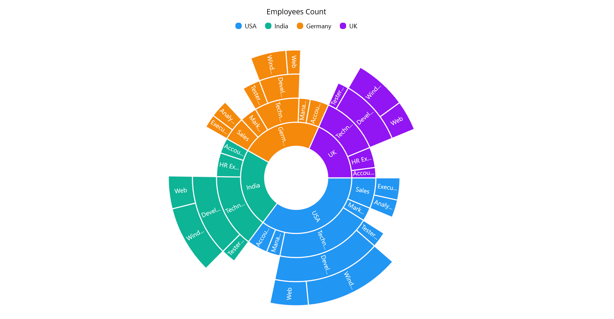

# Getting Started with .NET MAUI Chart(SfSunburstChart)

This section explains how to populate the sunburst chart with data, a title, data labels, a legend, and tooltips, as well as the essential aspects for getting started with the sunburst chart.

## Creating an application using the .NET MAUI chart(SfSunburstChart)

1. Create a new .NET MAUI application in Visual Studio.
2. Syncfusion .NET MAUI components are available in [nuget.org](https://www.nuget.org/). To add SfSunburstChart to your project, open the NuGet package manager in Visual Studio, search for Syncfusion.Maui.Charts and then install it.
3. To initialize the control, import the Chart namespace.
4. Initialize [SfSunburstChart]().

 



    <ContentPage   
        . . .
        xmlns:chart="">

        <chart:SfSunburstChart/>
    </ContentPage>
 




using Syncfusion.Maui.Charts;
. . .

public partial class MainWindow : ContentPage
{
    public MainPage()
    {
        this.InitializeComponent();
        SfSunburstChart chart = new SfSunburstChart();
    }
}   




## Register the handler

Syncfusion.Maui.Core NuGet is a dependent package for all Syncfusion controls of .NET MAUI. In the MauiProgram.cs file, register the handler for Syncfusion core.



    using Microsoft.Maui;
    using Microsoft.Maui.Hosting;
    using Microsoft.Maui.Controls.Compatibility;
    using Microsoft.Maui.Controls.Hosting;
    using Microsoft.Maui.Controls.Xaml;
    using Syncfusion.Maui.Core.Hosting;

    namespace ChartGettingStarted
    {
        public static class MauiProgram
        {
            public static MauiApp CreateMauiApp()
            {
                var builder = MauiApp.CreateBuilder();
                builder
                .UseMauiApp<App>()
                .ConfigureSyncfusionCore()
                .ConfigureFonts(fonts =>
                {
                    fonts.AddFont("OpenSans-Regular.ttf", "OpenSansRegular");
                });

                return builder.Build();
            }
        }
    }

 

## Initialize view model

Now, let us define a simple data model that represents a data point in the chart.

  



    public class SunburstModel
    {
        public string JobDescription { get; set; }
        public string JobGroup { get; set; }
        public string JobRole { get; set; }
        public double EmployeesCount { get; set; }
        public string Country { get; set; }
    }

 

 

Next, create a view model class and initialize a list of `SunburstModel ` objects as follows.

  



    public class SunburstViewModel
    {
            public ObservableCollection<SunburstModel> DataSource { get; set; }

            public SunburstViewModel()
            {
                this.DataSource = new ObservableCollection<SunburstModel>
                {
                    new SunburstModel { Country = "USA", JobDescription = "Sales", JobGroup="Executive", EmployeesCount = 50 },
                    new SunburstModel { Country = "USA", JobDescription = "Sales", JobGroup = "Analyst", EmployeesCount = 40 },
                    new SunburstModel { Country = "USA", JobDescription = "Marketing", EmployeesCount = 40 },
                    new SunburstModel { Country = "USA", JobDescription = "Technical", JobGroup = "Testers", EmployeesCount = 35 },
                    new SunburstModel { Country = "USA", JobDescription = "Technical", JobGroup = "Developers", JobRole = "Windows", EmployeesCount = 175 },
                    new SunburstModel { Country = "USA", JobDescription = "Technical", JobGroup = "Developers", JobRole = "Web", EmployeesCount = 70 },
                    new SunburstModel { Country = "USA", JobDescription = "Management", EmployeesCount = 40 },
                    new SunburstModel { Country = "USA", JobDescription = "Accounts", EmployeesCount = 60 },

                    new SunburstModel { Country = "India", JobDescription = "Technical", JobGroup = "Testers", EmployeesCount = 33 },
                    new SunburstModel { Country = "India", JobDescription = "Technical", JobGroup = "Developers", JobRole = "Windows", EmployeesCount = 125 },
                    new SunburstModel { Country = "India", JobDescription = "Technical", JobGroup = "Developers", JobRole = "Web", EmployeesCount = 60 },
                    new SunburstModel { Country = "India", JobDescription = "HR Executives", EmployeesCount = 70 },
                    new SunburstModel { Country = "India", JobDescription = "Accounts", EmployeesCount = 45 },

                    new SunburstModel { Country = "Germany", JobDescription = "Sales", JobGroup = "Executive", EmployeesCount = 30 },
                    new SunburstModel { Country = "Germany", JobDescription = "Sales", JobGroup = "Analyst", EmployeesCount = 40 },
                    new SunburstModel { Country = "Germany", JobDescription = "Marketing", EmployeesCount = 50 },
                    new SunburstModel { Country = "Germany", JobDescription = "Technical", JobGroup = "Testers", EmployeesCount = 40 },
                    new SunburstModel { Country = "Germany", JobDescription = "Technical", JobGroup = "Developers", JobRole = "Windows", EmployeesCount = 65 },
                    new SunburstModel { Country = "Germany", JobDescription = "Technical", JobGroup = "Developers", JobRole = "Web", EmployeesCount = 27 },
                    new SunburstModel { Country = "Germany", JobDescription = "Management", EmployeesCount = 33 },
                    new SunburstModel { Country = "Germany", JobDescription = "Accounts", EmployeesCount = 55 },

                    new SunburstModel { Country = "UK", JobDescription = "Technical", JobGroup = "Testers", EmployeesCount = 25 },
                    new SunburstModel { Country = "UK", JobDescription = "Technical", JobGroup = "Developers", JobRole = "Windows", EmployeesCount = 96 },
                    new SunburstModel { Country = "UK", JobDescription = "Technical", JobGroup = "Developers", JobRole = "Web", EmployeesCount = 55 },
                    new SunburstModel { Country = "UK", JobDescription = "HR Executives", EmployeesCount = 60 },
                    new SunburstModel { Country = "UK", JobDescription = "Accounts", EmployeesCount = 30 }
                };
            }    
    }

 

 

Create a `ViewModel` instance and set it as the chart's `BindingContext`. This enables property binding from `ViewModel` class.

N> Add the namespace of `ViewModel` class to your XAML Page, if you prefer to set `BindingContext` in XAML.

 

 

    <ContentPage
        . . .
        xmlns:chart="clr-namespace:Syncfusion.Maui.Charts;assembly=Syncfusion.Maui.Charts"
        xmlns:model="clr-namespace:ChartGettingStarted">

        <chart:SfSunburstChart>
            <chart:SfSunburstChart.BindingContext>
                <model:SunburstViewModel/>
            </chart:SfSunburstChart.BindingContext>
        </chart:SfSunburstChart>
    </ContentPage>



 

    SunburstViewModel viewModel = new SunburstViewModel();
    chart.BindingContext = viewModel;



 

## Populate chart with data

 Binding `DataSource` to the Sunburst chart [ItemsSource]() property from its BindingContext to create our own Sunburst chart.

   



    <chart:SfSunburstChart x:Name="sunburstChart" ItemsSource="{Binding DataSource}" 
                                                  ValueMemberPath="EmployeesCount">

        <chart:SfSunburstChart.Levels>
            <chart:SunburstHierarchicalLevel GroupMemberPath="Country"/>
            <chart:SunburstHierarchicalLevel GroupMemberPath="JobDescription"/>
            <chart:SunburstHierarchicalLevel GroupMemberPath="JobGroup"/>
            <chart:SunburstHierarchicalLevel GroupMemberPath="JobRole"/>
        </chart:SfSunburstChart.Levels>

    </chart:SfSunburstChart>





    SfSunburstChart chart = new SfSunburstChart();
    SunburstViewModel viewModel = new SunburstViewModel();
    chart.BindingContext = viewModel;
    chart.ItemsSource = viewModel.DataSource;
    chart.ValueMemberPath = "EmployeesCount";
    chart.Levels.Add(new SunburstHierarchicalLevel() { GroupMemberPath = "Country" });
    chart.Levels.Add(new SunburstHierarchicalLevel() { GroupMemberPath = "Country" });
    chart.Levels.Add(new SunburstHierarchicalLevel() { GroupMemberPath = "JobDescription" });
    chart.Levels.Add(new SunburstHierarchicalLevel() { GroupMemberPath = "JobGroup" });
    chart.Levels.Add(new SunburstHierarchicalLevel() { GroupMemberPath = "JobRole" });
    this.Content = chart;



 

## Add a title

The title of the chart acts as the title to provide quick information to the user about the data being plotted in the chart. You can set the title using the [Title]() property of the sunburst chart as follows.

 



    <chart:SfSunburstChart>
        <chart:SfSunburstChart.Title>
            <Label Text="Employees Count"/>
        </chart:SfSunburstChart.Title>
        . . .
    </chart:SfSunburstChart>





SfSunburstChart chart = new SfSunburstChart();
chart.Title = new Label
{
    Text = "Employees Count"
};



  

## Enable the data labels

The [ShowLabels]() property of the chart can be used to enable data labels to improve the readability of the sunburst chart. The label visibility is set to `False` by default.

 



    <chart:SfSunburstChart ShowLabels="True">
        . . .
    </chart:SfSunburstChart>





    SfSunburstChart chart = new SfSunburstChart();
    . . .
    chart.ShowLabels = true;



 

## Enable a legend

The legend provides information about the data point displayed in the sunburst chart. The [Legend]() property of the chart was used to enable it.

 



    <chart:SfSunburstChart>
        . . .
        <chart:SfSunburstChart.Legend>
            <chart:SunburstLegend/>
        </chart:SfSunburstChart.Legend>
    </chart:SfSunburstChart>





    SfSunburstChart chart = new SfSunburstChart();
    . . .
    chart.Legend = new SunburstLegend();



 

## Enable Tooltip

Tooltips are used to show information about the segment, when mouse over on it. Enable tooltip by setting the chart [EnableTooltip]() property as true.

 



    <chart:SfSunburstChart EnableTooltip="True">
        . . .
    </chart:SfSunburstChart>





    SfSunburstChart chart = new SfSunburstChart();
    . . .
    chart.EnableTooltip = true;





The following code example gives you the complete code of above configurations.

 



    <chart:SfSunburstChart ItemsSource="{Binding DataSource}" 
                        ShowLabels="True" 
                        EnableTooltip="True"
                        ValueMemberPath="EmployeesCount">

            <chart:SfSunburstChart.Levels>
                <chart:SunburstHierarchicalLevel GroupMemberPath="Country"/>
                <chart:SunburstHierarchicalLevel GroupMemberPath="JobDescription"/>
                <chart:SunburstHierarchicalLevel GroupMemberPath="JobGroup"/>
                <chart:SunburstHierarchicalLevel GroupMemberPath="JobRole"/>
            </chart:SfSunburstChart.Levels>

            <chart:SfSunburstChart.BindingContext>
                <model:SunburstViewModel/>
            </chart:SfSunburstChart.BindingContext>
            <chart:SfSunburstChart.Title>
                <Label Text="Employees Count"/>
            </chart:SfSunburstChart.Title>
            <chart:SfSunburstChart.Legend>
                <chart:SunburstLegend/>
            </chart:SfSunburstChart.Legend>

    </chart:SfSunburstChart>
 




    using Syncfusion.Maui.Charts;
    . . .
    public partial class MainPage : ContentPage
    {   
        public MainPage()
        {
            SfSunburstChart chart = new SfSunburstChart();
            chart.Title = new Label
            {
                Text = "Employees Count"
            };
            chart.Legend = new SunburstLegend();
            SunburstViewModel viewModel = new SunburstViewModel();
            chart.BindingContext = viewModel;
            chart.ItemsSource = viewModel.DataSource;
            chart.ValueMemberPath = "EmployeesCount";
            chart.Levels.Add(new SunburstHierarchicalLevel() { GroupMemberPath = "Country" });
            chart.Levels.Add(new SunburstHierarchicalLevel() { GroupMemberPath = "Country" });
            chart.Levels.Add(new SunburstHierarchicalLevel() { GroupMemberPath = "JobDescription" });
            chart.Levels.Add(new SunburstHierarchicalLevel() { GroupMemberPath = "JobGroup" });
            chart.Levels.Add(new SunburstHierarchicalLevel() { GroupMemberPath = "JobRole" });
            chart.EnableTooltip = true;
            chart.ShowLabels = true;
            this.Content = chart;
        }
    }





You can find the complete getting started sample from this [link]().