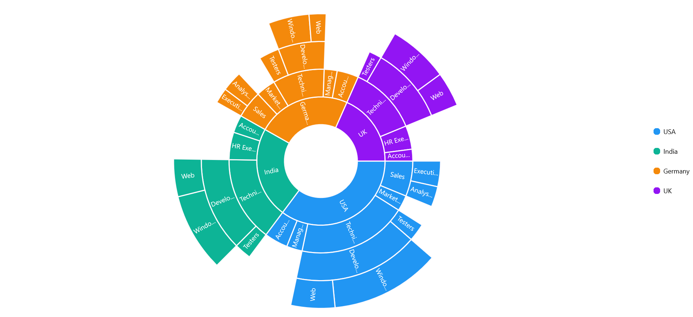

# Legend in .NET MAUI Sunburst Chart

Legends are used to represent the first level (i.e root level) of categories in the sunburst chart.

The following code explains how to initialize the legends.

 



    <sunburst:SfSunburstChart>
        . . .
        <sunburst:SfSunburstChart.Legend>
            <sunburst:SunburstLegend/>
        </sunburst:SfSunburstChart.Legend>
    </sunburst:SfSunburstChart>





    SfSunburstChart sunburst = new SfSunburstChart();
    . . .
    SunburstLegend legend = new SunburstLegend();
    sunburst.Legend = legend;



 

## Visibility

The visibility of legends can be controlled using the [IsVisible]() property.

The following code shows how to control the visibility of legend.

 



    <sunburst:SfSunburstChart>
        . . .
        <sunburst:SfSunburstChart.Legend>
            <sunburst:SunburstLegend IsVisible="True"/>
        </sunburst:SfSunburstChart.Legend>
    </sunburst:SfSunburstChart>





    SfSunburstChart sunburst = new SfSunburstChart();
    . . .
    SunburstLegend legend = new SunburstLegend();
    legend.IsVisible = true;
    sunburst.Legend = legend;



 

## Placement

Legends can be docked at the top, right, left, or bottom position using the Placement property.

The following code shows customizing the legend Placement.

 



    <sunburst:SfSunburstChart>
        . . .
        <sunburst:SfSunburstChart.Legend>
            <sunburst:SunburstLegend Placement="Right"/>
        </sunburst:SfSunburstChart.Legend>
    </sunburst:SfSunburstChart>





    SfSunburstChart sunburst = new SfSunburstChart();
    . . .
    SunburstLegend legend = new SunburstLegend();
    legend.Placement = LegendPlacement.Right;
    sunburst.Legend = legend;



 

