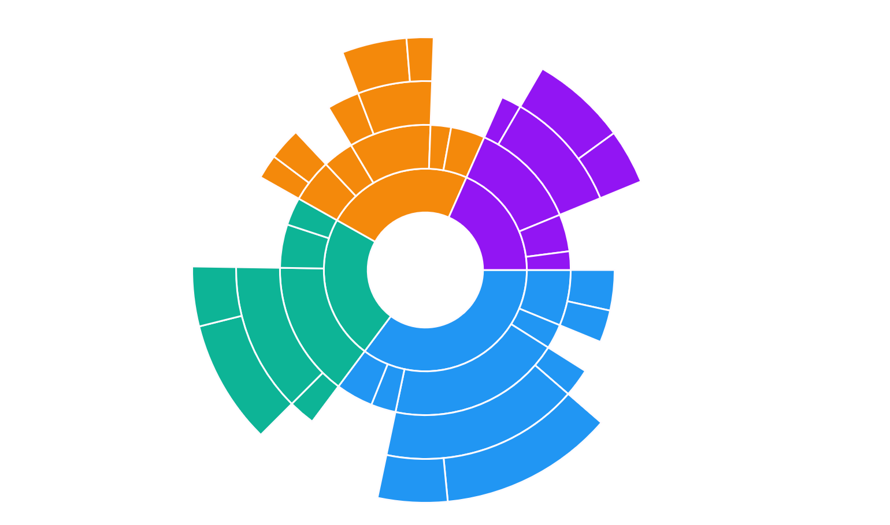

# Levels in .NET MAUI Sunburst Chart

The sunburst chart is used to display hierarchical data. More than one hierarchical data can be added to the [Levels]() collection of the sunburst chart. Each level of the hierarchy is represented by a circle.

The following code shows how to add hierarchical levels in the Levels collection.

 


 
    <chart:SfSunburstChart.Levels>
        <chart:SunburstHierarchicalLevel/>
    </chart:SfSunburstChart.Levels>





    SfSunburstChart chart = new SfSunburstChart();
    . . . 
    SunburstHierarchicalLevel level = new SunburstHierarchicalLevel();
    chart.Levels.Add(level);
    . . .





## Group member path

The [GroupMemberPath]() is a string property that is used to map the group category value in the sunburst [ItemsSource]

 



    . . .
        <chart:SfSunburstChart.Levels>
            <chart:SunburstHierarchicalLevel GroupMemberPath="Level1"/>
            <chart:SunburstHierarchicalLevel GroupMemberPath="Level2"/>
            <chart:SunburstHierarchicalLevel GroupMemberPath="Level2"/>
        </chart:SfSunburstChart.Levels>
    . . .
 




    SunburstHierarchicalLevel level1 = new SunburstHierarchicalLevel();
    level1.GroupMemberPath = "Level1";

    SunburstHierarchicalLevel level2 = new SunburstHierarchicalLevel();
    level2.GroupMemberPath = "Level2";

    SunburstHierarchicalLevel level3 = new SunburstHierarchicalLevel();
    level3.GroupMemberPath = "Level3";

    Chart.Levels.Add(level1);
    Chart.Levels.Add(level2);
    Chart.Levels.Add(level3);





The following code specifies the levels for data model specified in the getting started section.

 



    <chart:SfSunburstChart ItemsSource="{Binding DataSource}" 
                           ValueMemberPath="EmployeesCount">

            <chart:SfSunburstChart.Levels>
                <chart:SunburstHierarchicalLevel GroupMemberPath="Country"/>
                <chart:SunburstHierarchicalLevel GroupMemberPath="JobDescription"/>
                <chart:SunburstHierarchicalLevel GroupMemberPath="JobGroup"/>
                <chart:SunburstHierarchicalLevel GroupMemberPath="JobRole"/>
            </chart:SfSunburstChart.Levels>

    </chart:SfSunburstChart>
 




    SfSunburstChart chart = new SfSunburstChart();
    SunburstViewModel viewModel = new SunburstViewModel();
    chart.BindingContext = viewModel;
    chart.ItemsSource = viewModel.DataSource;
    chart.ValueMemberPath = "EmployeesCount";
    chart.Levels.Add(new SunburstHierarchicalLevel() { GroupMemberPath = "Country" });
    chart.Levels.Add(new SunburstHierarchicalLevel() { GroupMemberPath = "Country" });
    chart.Levels.Add(new SunburstHierarchicalLevel() { GroupMemberPath = "JobDescription" });
    chart.Levels.Add(new SunburstHierarchicalLevel() { GroupMemberPath = "JobGroup" });
    chart.Levels.Add(new SunburstHierarchicalLevel() { GroupMemberPath = "JobRole" });
    this.Content = chart;





