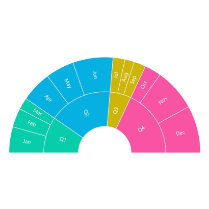
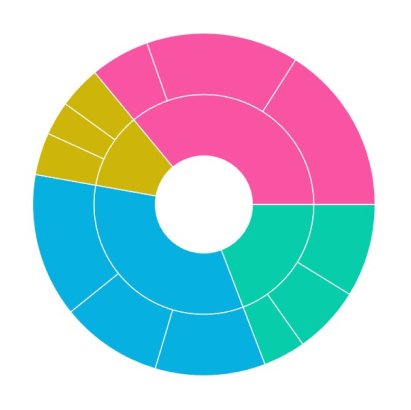
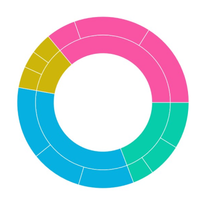
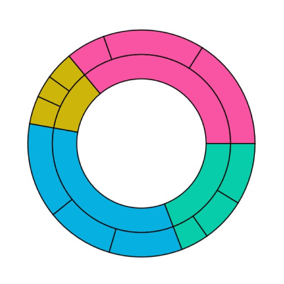

# Appearance in .NET MAUI Sunburst Chart

The appearance of the [SfSunburstChart](https://help.syncfusion.com/cr/maui/Syncfusion.Maui.SunburstChart.SfSunburstChart.html) can be customized by using Angle, Radius, Inner radius and Stroke, which allows for enriching the application.

## Angle

The start angle and end angle of the sunburst chart can be adjusted by using the [StartAngle](https://help.syncfusion.com/cr/maui/Syncfusion.Maui.SunburstChart.SfSunburstChart.html#Syncfusion_Maui_SunburstChart_SfSunburstChart_StartAngle) and [EndAngle](https://help.syncfusion.com/cr/maui/Syncfusion.Maui.SunburstChart.SfSunburstChart.html#Syncfusion_Maui_SunburstChart_SfSunburstChart_EndAngle) properties.

 



<sunburst:SfSunburstChart ItemsSource="{Binding DataSource}" 
                          StartAngle="180"
                          EndAngle="360"
                          ValueMemberPath="EmployeesCount">
    . . .
</sunburst:SfSunburstChart>
 




SfSunburstChart sunburst = new SfSunburstChart();
sunburst.ItemsSource = (new SunburstViewModel()).DataSource;
sunburst.StartAngle = 180;
sunburst.EndAngle = 360;
sunburst.ValueMemberPath = "EmployeesCount";
. . .
this.Content = sunburst;





## Radius

The sunburst chart allows you to customize the radius by using the [Radius](https://help.syncfusion.com/cr/maui/Syncfusion.Maui.SunburstChart.SfSunburstChart.html#Syncfusion_Maui_SunburstChart_SfSunburstChart_Radius) property. The default value of this property is `0.9`, and the value ranges from `0` to `1`.

 



<sunburst:SfSunburstChart ItemsSource="{Binding DataSource}"
                          Radius="0.7"
                          ValueMemberPath="EmployeesCount">
    . . .
</sunburst:SfSunburstChart>
 




SfSunburstChart sunburst = new SfSunburstChart();
sunburst.ItemsSource = (new SunburstViewModel()).DataSource;
sunburst.Radius = 0.7;
sunburst.ValueMemberPath = "EmployeesCount";
. . .
this.Content = sunburst;





## Inner radius

The sunburst chart allows you to customize the inner radius using the [InnerRadius](https://help.syncfusion.com/cr/maui/Syncfusion.Maui.SunburstChart.SfSunburstChart.html#Syncfusion_Maui_SunburstChart_SfSunburstChart_InnerRadius) property. The default value of this property is `0.25`, and the value ranges from 0 to 1.

 



<sunburst:SfSunburstChart ItemsSource="{Binding DataSource}"
                          InnerRadius="0.4"
                          ValueMemberPath="EmployeesCount">
    . . .
</sunburst:SfSunburstChart>
 




SfSunburstChart sunburst = new SfSunburstChart();
sunburst.ItemsSource = (new SunburstViewModel()).DataSource;
sunburst.InnerRadius = 0.4;
sunburst.ValueMemberPath = "EmployeesCount";
. . .
this.Content = sunburst;





## Stroke

Stroke color and stroke width of the sunburst chart can be customized using [Stroke](https://help.syncfusion.com/cr/maui/Syncfusion.Maui.SunburstChart.SfSunburstChart.html#Syncfusion_Maui_SunburstChart_SfSunburstChart_Stroke) and [StrokeWidth](https://help.syncfusion.com/cr/maui/Syncfusion.Maui.SunburstChart.SfSunburstChart.html#Syncfusion_Maui_SunburstChart_SfSunburstChart_StrokeWidth) properties respectively.

 



<sunburst:SfSunburstChart ItemsSource="{Binding DataSource}" 
                          Stroke="Black"
                          StrokeWidth="2"
                          ValueMemberPath="EmployeesCount">
    . . .
</sunburst:SfSunburstChart>
 




SfSunburstChart sunburst = new SfSunburstChart();
sunburst.ItemsSource = (new SunburstViewModel()).DataSource;
sunburst.Stroke = Colors.Black;
sunburst.StrokeWidth = 2;
sunburst.ValueMemberPath = "EmployeesCount";
. . .
this.Content = sunburst;





