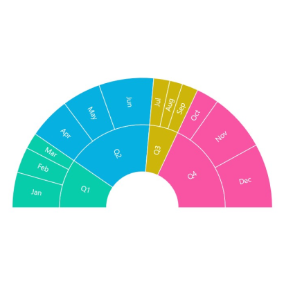
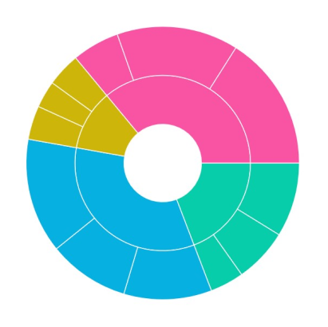
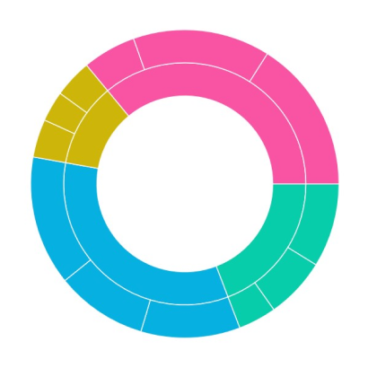
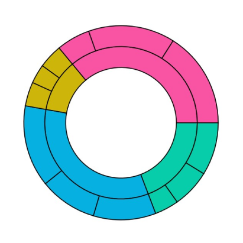

# Appearance in .NET MAUI Sunburst Chart

The appearance of the [SfSunburstChart](https://help.syncfusion.com/cr/maui/Syncfusion.Maui.SunburstChart.SfSunburstChart.html) can be customized using properties such as Title, Angle, Radius, Inner radius, and Stroke, which allow you to enhance the visual presentation of your application.

N> **Prerequisite:** Ensure that the required NuGet package is installed, the necessary namespaces are imported, and the **Sunburst Chart** control is properly configured in your application. For detailed setup and configuration instructions, refer to the **[Getting Started](https://help.syncfusion.com/maui/sunburstchart/getting-started)** guide.

## Add a Title
The title of the sunburst chart provides quick information to the user about the data being plotted in the chart. The [Title](https://help.syncfusion.com/cr/maui/Syncfusion.Maui.SunburstChart.SfSunburstChart.html#Syncfusion_Maui_SunburstChart_SfSunburstChart_Title) property accepts a `View` and is used to set a title for the sunburst chart. The following example uses a `Label` as the title within a `ContentPage`.

 



<sunburst:SfSunburstChart>
    <sunburst:SfSunburstChart.Title>
        <Label Text="Employees Count"/>
    </sunburst:SfSunburstChart.Title>
    <!-- code omitted for brevity -->
</sunburst:SfSunburstChart>





SfSunburstChart sunburst = new SfSunburstChart();
sunburst.Title = new Label()
{
    Text = "Employees Count"
};

// code omitted for brevity
this.Content = sunburst;



  

## Angle

The start angle and end angle of the sunburst chart can be adjusted by using the [StartAngle](https://help.syncfusion.com/cr/maui/Syncfusion.Maui.SunburstChart.SfSunburstChart.html#Syncfusion_Maui_SunburstChart_SfSunburstChart_StartAngle) and [EndAngle](https://help.syncfusion.com/cr/maui/Syncfusion.Maui.SunburstChart.SfSunburstChart.html#Syncfusion_Maui_SunburstChart_SfSunburstChart_EndAngle) properties. The default values are `StartAngle = 0` and `EndAngle = 360`. Angles are measured clockwise starting from the right-middle edge of the chart (the 3 o'clock position), which is defined as `0°`.

 



<sunburst:SfSunburstChart ItemsSource="{Binding DataSource}" 
                          StartAngle="180"
                          EndAngle="360"
                          ValueMemberPath="EmployeesCount">
    <!-- code omitted for brevity -->
</sunburst:SfSunburstChart>
 




SfSunburstChart sunburst = new SfSunburstChart();
sunburst.ItemsSource = (new SunburstViewModel()).DataSource;
sunburst.StartAngle = 180;
sunburst.EndAngle = 360;
sunburst.ValueMemberPath = "EmployeesCount";
// code omitted for brevity
this.Content = sunburst;





## Radius

The sunburst chart allows you to customize the radius by using the [Radius](https://help.syncfusion.com/cr/maui/Syncfusion.Maui.SunburstChart.SfSunburstChart.html#Syncfusion_Maui_SunburstChart_SfSunburstChart_Radius) property. The default value of this property is `0.9`, and the value ranges from `0` to `1`. To maintain a valid chart layout, the `Radius` value should be greater than the `InnerRadius` value.

 



<sunburst:SfSunburstChart ItemsSource="{Binding DataSource}"
                          Radius="0.7"
                          ValueMemberPath="EmployeesCount">
    <!-- code omitted for brevity -->
</sunburst:SfSunburstChart>
 




SfSunburstChart sunburst = new SfSunburstChart();
sunburst.ItemsSource = (new SunburstViewModel()).DataSource;
sunburst.Radius = 0.7;
sunburst.ValueMemberPath = "EmployeesCount";
// code omitted for brevity
this.Content = sunburst;





## Inner radius

The sunburst chart allows you to customize the inner radius by using the [InnerRadius](https://help.syncfusion.com/cr/maui/Syncfusion.Maui.SunburstChart.SfSunburstChart.html#Syncfusion_Maui_SunburstChart_SfSunburstChart_InnerRadius) property. The default value of this property is `0.25`, and the value ranges from `0` to `1`. Ensure the `InnerRadius` value is less than the `Radius` value; otherwise, the chart layout may not render as expected.

 



<sunburst:SfSunburstChart ItemsSource="{Binding DataSource}"
                          InnerRadius="0.4"
                          ValueMemberPath="EmployeesCount">
    <!-- code omitted for brevity -->
</sunburst:SfSunburstChart>
 




SfSunburstChart sunburst = new SfSunburstChart();
sunburst.ItemsSource = (new SunburstViewModel()).DataSource;
sunburst.InnerRadius = 0.4;
sunburst.ValueMemberPath = "EmployeesCount";
// code omitted for brevity
this.Content = sunburst;





## Stroke

Stroke color and stroke width of the sunburst chart can be customized by using the [Stroke](https://help.syncfusion.com/cr/maui/Syncfusion.Maui.SunburstChart.SfSunburstChart.html#Syncfusion_Maui_SunburstChart_SfSunburstChart_Stroke) and [StrokeWidth](https://help.syncfusion.com/cr/maui/Syncfusion.Maui.SunburstChart.SfSunburstChart.html#Syncfusion_Maui_SunburstChart_SfSunburstChart_StrokeWidth) properties respectively. The Stroke is applied to all segments across all levels of the chart. The default value of `StrokeWidth` is `1`, and the default `Stroke` is `White`.

 



<sunburst:SfSunburstChart ItemsSource="{Binding DataSource}" 
                          Stroke="Black"
                          StrokeWidth="2"
                          ValueMemberPath="EmployeesCount">
    <!-- code omitted for brevity -->
</sunburst:SfSunburstChart>
 




SfSunburstChart sunburst = new SfSunburstChart();
sunburst.ItemsSource = (new SunburstViewModel()).DataSource;
sunburst.Stroke = Colors.Black;
sunburst.StrokeWidth = 2;
sunburst.ValueMemberPath = "EmployeesCount";
// code omitted for brevity
this.Content = sunburst;





