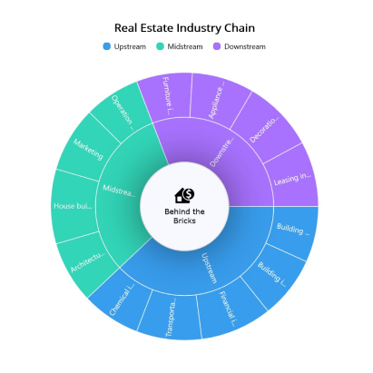

# Center View in .NET MAUI Sunburst Chart 

Any view can be added to the center of the sunburst chart using the [CenterView]() property of [SfSunburstChart](). The view placed in the center of the chart is useful for sharing additional information about the sunburst chart.The binding context of the CenterView will be the SfSunburstChart class.

## CenterHoleSize

The [CenterHoleSize]() property of SfSunburstChart is used to get the diameter value of the center hole. Using the CenterHoleSize, we can protect the view in the sunburst chart center from overlapping with the segments.





<chart:SfSunburstChart.CenterView>

    <Border x:Name="border" HeightRequest="{Binding CenterHoleSize}" 
        WidthRequest="{Binding CenterHoleSize}" BackgroundColor="GhostWhite">
        <Border.StrokeShape>
            <RoundRectangle 
                CornerRadius="{Binding CenterHoleSize,Converter={StaticResource cornerRadius}}"/>
        </Border.StrokeShape>
        <Border.Shadow>
            <Shadow Brush="Black"  Opacity="0.5" 
                    Radius="50"/>
        </Border.Shadow>
        <VerticalStackLayout 
            WidthRequest="{Binding CenterHoleSize,Converter={StaticResource cornerRadius}}"
            HorizontalOptions="Center" VerticalOptions="Center">

            <Grid HorizontalOptions="Center">
                <Path Data="{StaticResource PathData}" Fill="Black"/>
            </Grid>

            <Label LineBreakMode="WordWrap" WidthRequest="{Binding CenterHoleSize,Converter={StaticResource cornerRadius}}" 
                    Text="Behind the Bricks" TextColor="Black" FontSize="12" Padding="0,5,0,0"
                    VerticalTextAlignment="Center"  HorizontalTextAlignment="Center" FontFamily="Verdana"
                    HorizontalOptions="CenterAndExpand"/>
        </VerticalStackLayout>
    </Border>
</chart:SfSunburstChart.CenterView>





    SfSunburstChart sunburst = new SfSunburstChart();
    . . .      
    RoundRectangle roundRectangle = new RoundRectangle();
    roundRectangle.SetBinding(RoundRectangle.CornerRadiusProperty, "CenterHoleSize", converter: sunburstChart.Resources["cornerRadius"] as IValueConverter);

    Label label = new Label();
    label.Text = "Behind the Bricks";
    label.LineBreakMode = LineBreakMode.WordWrap;
    label.HorizontalTextAlignment = TextAlignment.Center;
    label.VerticalTextAlignment = TextAlignment.Center;
    label.FontSize = 12;
    label.Padding = new Thickness(0, 5, 0, 0);
    label.FontFamily = "Verdana";
    label.TextColor = Colors.Black;

    Path path = new Path();
    path.Data = viewModel.Data;
    path.Fill = Brush.Black;

    Grid grid = new Grid();
    grid.HorizontalOptions = LayoutOptions.Center;
    grid.Children.Add(path);

    VerticalStackLayout views = new VerticalStackLayout();
    views.HorizontalOptions = LayoutOptions.Center;
    views.VerticalOptions = LayoutOptions.Center;
    views.SetBinding(WidthRequestProperty, "CenterHoleSize", converter: sunburstChart.Resources["cornerRadius"] as IValueConverter);
    views.Children.Add(grid);
    views.Children.Add(label);

    Border border = new Border();
    border.SetBinding(HeightRequestProperty, "CenterHoleSize");
    border.SetBinding(WidthRequestProperty, "CenterHoleSize");
    border.BackgroundColor = Colors.GhostWhite;
    border.StrokeShape = roundRectangle;
    border.Shadow = new Shadow() { Radius = 50, Brush = Brush.Black, Opacity = 0.5f };

    border.Content = views;
    sunburst.CenterView = border;





