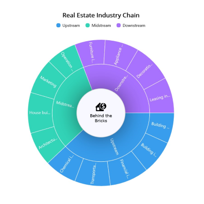

# Center view in .NET MAUI Sunburst Chart 

Any view can be added to the center of the sunburst chart using the [CenterView](https://help.syncfusion.com/cr/maui/Syncfusion.Maui.SunburstChart.SfSunburstChart.html#Syncfusion_Maui_SunburstChart_SfSunburstChart_CenterView) property of [SfSunburstChart](https://help.syncfusion.com/cr/maui/Syncfusion.Maui.SunburstChart.SfSunburstChart.html). The view placed in the center of the chart is useful for displaying summary or contextual information about the sunburst chart. The binding context of the CenterView is the `SfSunburstChart` instance, so any binding in the CenterView resolves against the chart.

N> **Prerequisite:** Ensure that the required NuGet package is installed, the necessary namespaces are imported, and the **Sunburst Chart** control is properly configured in your application. For detailed setup and configuration instructions, refer to the **[Getting Started](https://help.syncfusion.com/maui/sunburstchart/getting-started)** guide.

## Add a center view

Set the `CenterView` property to a `View` (for example, a `Border` containing a layout) to display content in the center of the sunburst chart. The following example adds a `Border` with a `VerticalStackLayout`, a `Path`, and a `Label` as the center view.

**CenterHoleSize**

The [CenterHoleSize](https://help.syncfusion.com/cr/maui/Syncfusion.Maui.SunburstChart.SfSunburstChart.html#Syncfusion_Maui_SunburstChart_SfSunburstChart_CenterHoleSize) is a read-only property that returns the diameter of the center hole, in device-independent units. Bind the `CenterHoleSize` to the `HeightRequest` and `WidthRequest` of the center view to prevent the view from overlapping with the sunburst segments.





<sunburst:SfSunburstChart>
    <chart:SfSunburstChart.CenterView>
        <Border x:Name="border" HeightRequest="{Binding CenterHoleSize}" 
                WidthRequest="{Binding CenterHoleSize}" BackgroundColor="GhostWhite">
            <Border.StrokeShape>
                <RoundRectangle CornerRadius="{Binding CenterHoleSize,Converter={StaticResource cornerRadius}}"/>
            </Border.StrokeShape>
            <Border.Shadow>
                <Shadow Brush="Black" Opacity="0.5" 
                        Radius="50"/>
            </Border.Shadow>
            <VerticalStackLayout WidthRequest="{Binding CenterHoleSize,Converter={StaticResource cornerRadius}}"
                                HorizontalOptions="Center" VerticalOptions="Center">
                <Grid HorizontalOptions="Center">
                    <Path Data="{StaticResource PathData}" Fill="Black"/>
                </Grid>
                <Label LineBreakMode="WordWrap" WidthRequest="{Binding CenterHoleSize,Converter={StaticResource cornerRadius}}" 
                    Text="Behind the Bricks" TextColor="Black" FontSize="12" Padding="0,5,0,0"
                    VerticalTextAlignment="Center" HorizontalTextAlignment="Center" FontFamily="Verdana"
                    HorizontalOptions="CenterAndExpand"/> 
            </VerticalStackLayout>
        </Border>
    </chart:SfSunburstChart.CenterView>
    <!-- code omitted for brevity -->
</sunburst:SfSunburstChart>





SfSunburstChart sunburst = new SfSunburstChart();
// code omitted for brevity

RoundRectangle roundRectangle = new RoundRectangle();
roundRectangle.SetBinding(RoundRectangle.CornerRadiusProperty, "CenterHoleSize", converter: sunburst.Resources["cornerRadius"] as IValueConverter);

Label label = new Label()
{
    Text = "Behind the Bricks",
    LineBreakMode = LineBreakMode.WordWrap,
    HorizontalTextAlignment = TextAlignment.Center,
    VerticalTextAlignment = TextAlignment.Center,
    FontSize = 12,
    Padding = new Thickness(0, 5, 0, 0),
    FontFamily = "Verdana",
    TextColor = Colors.Black
};

Path path = new Path()
{
    Data = viewModel.Data,
    Fill = Brush.Black
};

Grid grid = new Grid()
{
    HorizontalOptions = LayoutOptions.Center
};
grid.Children.Add(path);

VerticalStackLayout views = new VerticalStackLayout()
{
    HorizontalOptions = LayoutOptions.Center,
    VerticalOptions = LayoutOptions.Center
};
views.SetBinding(WidthRequestProperty, "CenterHoleSize", converter: sunburst.Resources["cornerRadius"] as IValueConverter);
views.Children.Add(grid);
views.Children.Add(label);

Border border = new Border()
{
    BackgroundColor = Colors.GhostWhite,
    StrokeShape = roundRectangle,
    Shadow = new Shadow { Radius = 50, Brush = Brush.Black, Opacity = 0.5f }
};
border.SetBinding(HeightRequestProperty, "CenterHoleSize");
border.SetBinding(WidthRequestProperty, "CenterHoleSize");

border.Content = views;
sunburst.CenterView = border;





