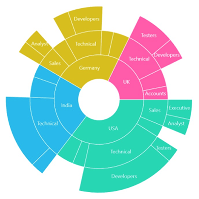
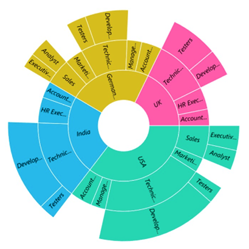

# Data Labels in .NET MAUI Sunburst Chart
Data labels are used to display information about segments at the (X, Y) point.

## Enable Data Label 
Data labels are enabled and disabled using the [ShowLabels](https://help.syncfusion.com/cr/maui/Syncfusion.Maui.SunburstChart.SfSunburstChart.html#Syncfusion_Maui_SunburstChart_SfSunburstChart_ShowLabels) property. The default value of the ShowLabels property is `False`.

The following code explains how to initialize data labels.





<sunburst:SfSunburstChart ShowLabels="True"/>
    . . .
</sunburst:SfSunburstChart>





SfSunburstChart sunburst = new SfSunburstChart();
. . .
sunburst.ShowLabels = true;
this.Content = sunburst;



 

## Overflow Mode

When the data labels are large in text size, they will overlap each other. To avoid overlapping, trim or hide the data labels using the OverflowMode property. By default, the OverFlow mode is `Trim`.

The following code shows how to hide the data labels.





<sunburst:SfSunburstChart ShowLabels="True">
    . . .
    <sunburst:SfSunburstChart.DataLabelSettings>
        <sunburst:SunburstDataLabelSettings OverFlowMode="Hide"/>
    </sunburst:SfSunburstChart.DataLabelSettings>
</sunburst:SfSunburstChart>





SfSunburstChart sunburst = new SfSunburstChart();
. . .
sunburst.ShowLabels = true;
sunburst.DataLabelSettings = new SunburstDataLabelSettings()
{
    OverFlowMode = SunburstLabelOverflowMode.Hide
};
this.Content = sunburst;



 

## Rotation Mode

The view of data labels can be customized using the [RotationMode](https://help.syncfusion.com/cr/maui/Syncfusion.Maui.SunburstChart.SunburstDataLabelSettings.html#Syncfusion_Maui_SunburstChart_SunburstDataLabelSettings_RotationMode) property. Data labels can be rotated to an angle for better readability. By default, the rotation mode is `Angle`.

The following code shows normal mode of data labels.





<sunburst:SfSunburstChart ShowLabels="True">
    . . .
    <sunburst:SfSunburstChart.DataLabelSettings>
        <sunburst:SunburstDataLabelSettings RotationMode="Normal"/>
    </sunburst:SfSunburstChart.DataLabelSettings>
</sunburst:SfSunburstChart>





SfSunburstChart sunburst = new SfSunburstChart();
. . .
sunburst.ShowLabels = true;
sunburst.DataLabelSettings = new SunburstDataLabelSettings()
{
    RotationMode = SunburstLabelRotationMode.Normal     
};
this.Content = sunburst;



 

## Customization

 Data labels can be customized using the [DataLabelSettings](https://help.syncfusion.com/cr/maui/Syncfusion.Maui.SunburstChart.SfSunburstChart.html#Syncfusion_Maui_SunburstChart_SfSunburstChart_DataLabelSettings) property of the chart. For customizing, you need to create an instance of [SunburstDataLabelSettings](https://help.syncfusion.com/cr/maui/Syncfusion.Maui.SunburstChart.SunburstDataLabelSettings.html) and set it to the [DataLabelSettings](https://help.syncfusion.com/cr/maui/Syncfusion.Maui.SunburstChart.SfSunburstChart.html#Syncfusion_Maui_SunburstChart_SfSunburstChart_DataLabelSettings) property.The following properties, available in [SunburstDataLabelSettings](https://help.syncfusion.com/cr/maui/Syncfusion.Maui.SunburstChart.SunburstDataLabelSettings.html), are used to customize the data labels: 

* [FontAttributes](https://help.syncfusion.com/cr/maui/Syncfusion.Maui.SunburstChart.SunburstDataLabelSettings.html#Syncfusion_Maui_SunburstChart_SunburstDataLabelSettings_FontAttributes) of type `FontAttributes`, indicates the font style of * the label.
* [FontFamily](https://help.syncfusion.com/cr/maui/Syncfusion.Maui.SunburstChart.SunburstDataLabelSettings.html#Syncfusion_Maui_SunburstChart_SunburstDataLabelSettings_FontFamily) of type `string`, indicates the font family for the label.
* [FontSize](https://help.syncfusion.com/cr/maui/Syncfusion.Maui.SunburstChart.SunburstDataLabelSettings.html#Syncfusion_Maui_SunburstChart_SunburstDataLabelSettings_FontSize) of type `float`, indicates the font size.
* [TextColor](https://help.syncfusion.com/cr/maui/Syncfusion.Maui.SunburstChart.SunburstDataLabelSettings.html#Syncfusion_Maui_SunburstChart_SunburstDataLabelSettings_TextColor) of type `Color`, indicates the color of the displayed text.





<sunburst:SfSunburstChart ShowDataLabels="True">
    . . .
    <sunburst:SfSunburstChart.DataLabelSettings>
        <sunburst:SunburstDataLabelSettings     
            TextColor="Red"   
            FontSize="10"    
            FontAttributes="Bold"/>
    </sunburst:SfSunburstChart.DataLabelSettings>
</sunburst:SfSunburstChart>





SfSunburstChart sunburst = new SfSunburstChart();
. . .
sunburst.ShowLabels = true;
sunburst.DataLabelSettings = new SunburstDataLabelSettings()
{
    TextColor = Colors.Red,
    FontSize = 10,
    FontAttributes = FontAttributes.Bold
};
this.Content = sunburst;



 

