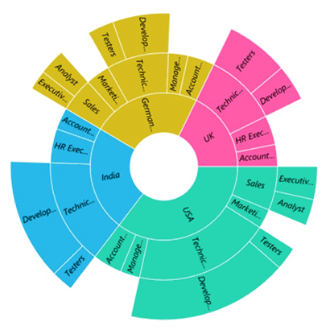

# Data Labels in .NET MAUI Sunburst Chart

Data labels are used to display information about segments of the sunburst chart.

N> **Prerequisite:** Ensure that the required NuGet package is installed, the necessary namespaces are imported, and the **Sunburst Chart** control is properly configured in your application. For detailed setup and configuration instructions, refer to the **[Getting Started](https://help.syncfusion.com/maui/sunburstchart/getting-started)** guide.

## Enable Data Labels

Data labels are enabled and disabled using the [ShowLabels](https://help.syncfusion.com/cr/maui/Syncfusion.Maui.SunburstChart.SfSunburstChart.html#Syncfusion_Maui_SunburstChart_SfSunburstChart_ShowLabels) property. The default value of the ShowLabels property is `False`. For data labels to appear, the chart must also be bound to data via the [ItemsSource](https://help.syncfusion.com/cr/maui/Syncfusion.Maui.SunburstChart.SfSunburstChart.html#Syncfusion_Maui_SunburstChart_SfSunburstChart_ItemsSource), [ValueMemberPath](https://help.syncfusion.com/cr/maui/Syncfusion.Maui.SunburstChart.SfSunburstChart.html#Syncfusion_Maui_SunburstChart_SfSunburstChart_ValueMemberPath), and [Levels](https://help.syncfusion.com/cr/maui/Syncfusion.Maui.SunburstChart.SfSunburstChart.html#Syncfusion_Maui_SunburstChart_SfSunburstChart_Levels) properties. See the [Getting Started](https://help.syncfusion.com/maui/sunburstchart/getting-started) topic for setup details.

The following code explains how to enable data labels.





<sunburst:SfSunburstChart ShowLabels="True">
    <!-- code omitted for brevity -->
</sunburst:SfSunburstChart>





SfSunburstChart sunburst = new SfSunburstChart();
// code omitted for brevity
sunburst.ShowLabels = true;
this.Content = sunburst;



 

## Overflow Mode

When data labels are too large to fit, they overlap each other. To avoid overlapping, trim the label text or hide the labels using the [OverFlowMode](https://help.syncfusion.com/cr/maui/Syncfusion.Maui.SunburstChart.SunburstDataLabelSettings.html#Syncfusion_Maui_SunburstChart_SunburstDataLabelSettings_OverFlowMode) property of the [SunburstDataLabelSettings](https://help.syncfusion.com/cr/maui/Syncfusion.Maui.SunburstChart.SunburstDataLabelSettings.html) class. By default, the OverFlowMode is `Trim`, which truncates the text and appends an ellipsis. The available modes are:

* `Trim` - Truncates the label text with an ellipsis when there is not enough space.
* `Hide` - Hides the labels that would overlap.

The following code shows how to hide the data labels.





<sunburst:SfSunburstChart ShowLabels="True">
    <sunburst:SfSunburstChart.DataLabelSettings>
        <sunburst:SunburstDataLabelSettings OverFlowMode="Hide"/>
    </sunburst:SfSunburstChart.DataLabelSettings>
    <!-- code omitted for brevity -->
</sunburst:SfSunburstChart>





SfSunburstChart sunburst = new SfSunburstChart();
// code omitted for brevity
sunburst.ShowLabels = true;
sunburst.DataLabelSettings = new SunburstDataLabelSettings()
{
    OverFlowMode = SunburstLabelOverflowMode.Hide
};
this.Content = sunburst;



 

## Rotation Mode

The orientation of data labels can be customized using the [RotationMode](https://help.syncfusion.com/cr/maui/Syncfusion.Maui.SunburstChart.SunburstDataLabelSettings.html#Syncfusion_Maui_SunburstChart_SunburstDataLabelSettings_RotationMode) property of the [SunburstDataLabelSettings](https://help.syncfusion.com/cr/maui/Syncfusion.Maui.SunburstChart.SunburstDataLabelSettings.html) class. By default, the rotation mode is `Angle`, which rotates labels to align with the arc of each segment for better readability. The available modes are:

* `Angle` - Rotates the labels to align with the angle of the segment arc.
* `Normal` - Keeps the labels horizontal without rotation.

The following code shows data labels in normal mode.





<sunburst:SfSunburstChart ShowLabels="True">
    <sunburst:SfSunburstChart.DataLabelSettings>
        <sunburst:SunburstDataLabelSettings RotationMode="Normal"/>
    </sunburst:SfSunburstChart.DataLabelSettings>
    <!-- code omitted for brevity -->
</sunburst:SfSunburstChart>





SfSunburstChart sunburst = new SfSunburstChart();
// code omitted for brevity
sunburst.ShowLabels = true;
sunburst.DataLabelSettings = new SunburstDataLabelSettings()
{
    RotationMode = SunburstLabelRotationMode.Normal
};
this.Content = sunburst;



 

## Customization

The appearance of data labels can be customized using the [DataLabelSettings](https://help.syncfusion.com/cr/maui/Syncfusion.Maui.SunburstChart.SfSunburstChart.html#Syncfusion_Maui_SunburstChart_SfSunburstChart_DataLabelSettings) property of the chart. To customize, create an instance of the [SunburstDataLabelSettings](https://help.syncfusion.com/cr/maui/Syncfusion.Maui.SunburstChart.SunburstDataLabelSettings.html) class and assign it to the [DataLabelSettings](https://help.syncfusion.com/cr/maui/Syncfusion.Maui.SunburstChart.SfSunburstChart.html#Syncfusion_Maui_SunburstChart_SfSunburstChart_DataLabelSettings) property. The following properties of [SunburstDataLabelSettings](https://help.syncfusion.com/cr/maui/Syncfusion.Maui.SunburstChart.SunburstDataLabelSettings.html) are used to customize the data labels:

* [FontAttributes](https://help.syncfusion.com/cr/maui/Syncfusion.Maui.SunburstChart.SunburstDataLabelSettings.html#Syncfusion_Maui_SunburstChart_SunburstDataLabelSettings_FontAttributes), of type `FontAttributes`, indicates the font style of the label.
* [FontFamily](https://help.syncfusion.com/cr/maui/Syncfusion.Maui.SunburstChart.SunburstDataLabelSettings.html#Syncfusion_Maui_SunburstChart_SunburstDataLabelSettings_FontFamily), of type `string`, indicates the font family for the label.
* [FontSize](https://help.syncfusion.com/cr/maui/Syncfusion.Maui.SunburstChart.SunburstDataLabelSettings.html#Syncfusion_Maui_SunburstChart_SunburstDataLabelSettings_FontSize), of type `float`, indicates the font size.
* [TextColor](https://help.syncfusion.com/cr/maui/Syncfusion.Maui.SunburstChart.SunburstDataLabelSettings.html#Syncfusion_Maui_SunburstChart_SunburstDataLabelSettings_TextColor), of type `Color`, indicates the color of the displayed text.





<sunburst:SfSunburstChart ShowLabels="True">
    <sunburst:SfSunburstChart.DataLabelSettings>
        <sunburst:SunburstDataLabelSettings
                                            TextColor="Red"
                                            FontSize="12"
                                            FontAttributes="Bold"
                                            FontFamily="OpenSansRegular"/>
    </sunburst:SfSunburstChart.DataLabelSettings>
    <!-- code omitted for brevity -->
</sunburst:SfSunburstChart>





SfSunburstChart sunburst = new SfSunburstChart();
// code omitted for brevity
sunburst.ShowLabels = true;
sunburst.DataLabelSettings = new SunburstDataLabelSettings()
{
    TextColor = Colors.Red,
    FontSize = 12,
    FontAttributes = FontAttributes.Bold,
    FontFamily = "OpenSansRegular"
};
this.Content = sunburst;



 

