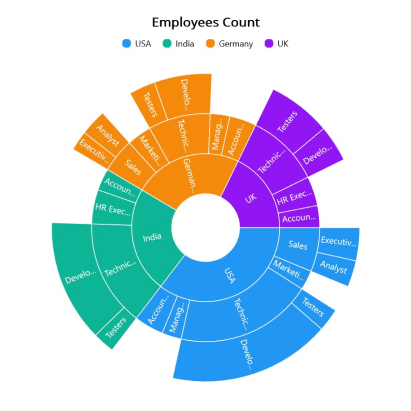

> **Notice**: After **Volume 3 2025 (Mid of March 2025)**, feature enhancements for this control will no longer be available in the Syncfusion® package. Please switch to the **Syncfusion® Toolkit for .NET MAUI** for continued support. For a smooth transition refer this [migration document](https://help.syncfusion.com/maui-toolkit/migration).

# Getting Started with .NET MAUI Sunburst Chart

This section explains how to populate the sunburst chart with data, a title, data labels, a legend, and a tooltip, as well as the essential aspects of getting started with the [Sunburst Chart](https://help.syncfusion.com/cr/maui/Syncfusion.Maui.SunburstChart.SfSunburstChart.html).




## Prerequisites

Before proceeding, ensure that the following are set up:

1. Install [.NET 8 SDK](https://dotnet.microsoft.com/en-us/download/dotnet/8.0) or later.
2. Set up a .NET MAUI environment with Visual Studio 2022 (v17.8 or later).

## Step 1: Create a new .NET MAUI project

1. Go to **File > New > Project** and choose the **.NET MAUI App** template.
2. Name the project and choose a location. Click **Next**.
3. Select the .NET framework version and click **Create**.

## Step 2: Install the Syncfusion® .NET MAUI Sunburst Chart Package

1. In **Solution Explorer**, right-click the project and choose **Manage NuGet Packages**.
2. Search for [Syncfusion.Maui.SunburstChart](https://www.nuget.org/packages/Syncfusion.Maui.SunburstChart/) and install the latest version.
3. Ensure the necessary dependencies are installed correctly, and the project is restored.

## Step 3: Register the handler

[Syncfusion.Maui.Core](https://www.nuget.org/packages/Syncfusion.Maui.Core) nuget is a dependent package for all Syncfusion® controls of .NET MAUI. In the **MauiProgram.cs** file, register the handler for Syncfusion® core.




using Microsoft.Maui;
using Microsoft.Maui.Hosting;
using Microsoft.Maui.Controls.Compatibility;
using Microsoft.Maui.Controls.Hosting;
using Microsoft.Maui.Controls.Xaml;
using Syncfusion.Maui.Core.Hosting;

namespace SunburstGettingStarted
{
    public static class MauiProgram
    {
        public static MauiApp CreateMauiApp()
        {
            var builder = MauiApp.CreateBuilder();
            builder
            .UseMauiApp<App>()
            .ConfigureSyncfusionCore()
            .ConfigureFonts(fonts =>
            {
                fonts.AddFont("OpenSans-Regular.ttf", "OpenSansRegular");
            });

            return builder.Build();
        }
    }
}

 
 

## Step 4: Add .NET MAUI Sunburst Chart

1. To initialize the control, import the `Syncfusion.Maui.SunburstChart` namespace.
2. Initialize [SfSunburstChart](https://help.syncfusion.com/cr/maui/Syncfusion.Maui.SunburstChart.SfSunburstChart.html).

 


<ContentPage   
    . . .
    xmlns:sunburst="clr-namespace:Syncfusion.Maui.SunburstChart;assembly=Syncfusion.Maui.SunburstChart">

    <sunburst:SfSunburstChart/>

</ContentPage>
 




using Syncfusion.Maui.SunburstChart;

namespace SunburstGettingStarted
{
    public partial class MainPage : ContentPage
    {
        public MainPage()
        {
            InitializeComponent();           
            SfSunburstChart sunburst = new SfSunburstChart();
            this.Content = sunburst;
        }
    }   
}








## Prerequisites

Before proceeding, ensure that the following are set up:

1. Install [.NET 8 SDK](https://dotnet.microsoft.com/en-us/download/dotnet/8.0) or later.
2. Set up a .NET MAUI environment with Visual Studio Code.
3. Ensure that the .NET MAUI extension is installed and configured as described [here](https://learn.microsoft.com/en-us/dotnet/maui/get-started/installation?view=net-maui-8.0&tabs=visual-studio-code).

## Step 1: Create a new .NET MAUI project

1. Open the command palette by pressing `Ctrl+Shift+P` and type **.NET:New Project** and enter.
2. Choose the **.NET MAUI App** template.
3. Select the project location, type the project name and press **Enter**.
4. Then choose **Create project**.

## Step 2: Install the Syncfusion® .NET MAUI Sunburst Chart Package

1. Press <kbd>Ctrl</kbd> + <kbd>`</kbd> (backtick) to open the integrated terminal in Visual Studio Code.
2. Ensure you're in the project root directory where your .csproj file is located.
3. Run the command `dotnet add package Syncfusion.Maui.SunburstChart` to install the Syncfusion® .NET MAUI SunburstChart NuGet package.
4. To ensure all dependencies are installed, run `dotnet restore`.

## Step 3: Register the handler

[Syncfusion.Maui.Core](https://www.nuget.org/packages/Syncfusion.Maui.Core) nuget is a dependent package for all Syncfusion® controls of .NET MAUI. In the **MauiProgram.cs** file, register the handler for Syncfusion® core.




using Microsoft.Maui;
using Microsoft.Maui.Hosting;
using Microsoft.Maui.Controls.Compatibility;
using Microsoft.Maui.Controls.Hosting;
using Microsoft.Maui.Controls.Xaml;
using Syncfusion.Maui.Core.Hosting;

namespace SunburstGettingStarted
{
    public static class MauiProgram
    {
        public static MauiApp CreateMauiApp()
        {
            var builder = MauiApp.CreateBuilder();
            builder
            .UseMauiApp<App>()
            .ConfigureSyncfusionCore()
            .ConfigureFonts(fonts =>
            {
                fonts.AddFont("OpenSans-Regular.ttf", "OpenSansRegular");
            });

            return builder.Build();
        }
    }
}

 
 

## Step 4: Add .NET MAUI Sunburst Chart

1. To initialize the control, import the `Syncfusion.Maui.SunburstChart` namespace.
2. Initialize [SfSunburstChart](https://help.syncfusion.com/cr/maui/Syncfusion.Maui.SunburstChart.SfSunburstChart.html).

 


<ContentPage   
    . . .
    xmlns:sunburst="clr-namespace:Syncfusion.Maui.SunburstChart;assembly=Syncfusion.Maui.SunburstChart">

    <sunburst:SfSunburstChart/>

</ContentPage>
 




using Syncfusion.Maui.SunburstChart;

namespace SunburstGettingStarted
{
    public partial class MainPage : ContentPage
    {
        public MainPage()
        {
            InitializeComponent();           
            SfSunburstChart sunburst = new SfSunburstChart();
            this.Content = sunburst;
        }
    }   
}








## Prerequisites

Before proceeding, ensure the following are set up:

1. Ensure you have the latest version of JetBrains Rider.
2. Install [.NET 8 SDK](https://dotnet.microsoft.com/en-us/download/dotnet/8.0) or later is installed.
3. Make sure the MAUI workloads are installed and configured as described [here.](https://www.jetbrains.com/help/rider/MAUI.html#before-you-start)

## Step 1: Create a new .NET MAUI Project

1. Go to **File > New Solution,** Select .NET (C#) and choose the .NET MAUI App template.
2. Enter the Project Name, Solution Name, and Location.
3. Select the .NET framework version and click Create.

## Step 2: Install the Syncfusion® .NET MAUI Sunburst Chart Package

1. In **Solution Explorer,** right-click the project and choose **Manage NuGet Packages.**
2. Search for [Syncfusion.Maui.SunburstChart](https://www.nuget.org/packages/Syncfusion.Maui.SunburstChart/) and install the latest version.
3. Ensure the necessary dependencies are installed correctly, and the project is restored. If not, Open the Terminal in Rider and manually run: `dotnet restore`

## Step 3: Register the handler

Syncfusion.Maui.Core nuget is a dependent package for all Syncfusion® controls of .NET MAUI. In the **MauiProgram.cs** file, register the handler for Syncfusion® core.




using Microsoft.Maui;
using Microsoft.Maui.Hosting;
using Microsoft.Maui.Controls.Compatibility;
using Microsoft.Maui.Controls.Hosting;
using Microsoft.Maui.Controls.Xaml;
using Syncfusion.Maui.Core.Hosting;

namespace SunburstGettingStarted
{
    public static class MauiProgram
    {
        public static MauiApp CreateMauiApp()
        {
            var builder = MauiApp.CreateBuilder();
            builder
            .UseMauiApp<App>()
            .ConfigureSyncfusionCore()
            .ConfigureFonts(fonts =>
            {
                fonts.AddFont("OpenSans-Regular.ttf", "OpenSansRegular");
            });

            return builder.Build();
        }
    }
}

 
 

## Step 4: Add .NET MAUI Sunburst Chart

1. To initialize the control, import the `Syncfusion.Maui.SunburstChart` namespace.
2. Initialize [SfSunburstChart](https://help.syncfusion.com/cr/maui/Syncfusion.Maui.SunburstChart.SfSunburstChart.html).

 


<ContentPage   
    . . .
    xmlns:sunburst="clr-namespace:Syncfusion.Maui.SunburstChart;assembly=Syncfusion.Maui.SunburstChart">

    <sunburst:SfSunburstChart/>

</ContentPage>
 




using Syncfusion.Maui.SunburstChart;

namespace SunburstGettingStarted
{
    public partial class MainPage : ContentPage
    {
        public MainPage()
        {
            InitializeComponent();           
            SfSunburstChart sunburst = new SfSunburstChart();
            this.Content = sunburst;
        }
    }   
}








### Initialize View Model

Now, let us define a simple data model that represents a data point in the sunburst chart.

  



public class SunburstModel
{
    public string JobDescription { get; set; }
    public string JobGroup { get; set; }
    public double EmployeesCount { get; set; }
    public string Country { get; set; }
}

 

 

Next, create a view model class and initialize a list of `SunburstModel` objects as follows.

  



public class SunburstViewModel
{
    public ObservableCollection<SunburstModel> DataSource { get; set; }

    public SunburstViewModel()
    {
        this.DataSource = new ObservableCollection<SunburstModel>
        {
            new SunburstModel ( "USA", "Sales", "Executive",  50 ),
            new SunburstModel ( "USA", "Sales", "Analyst",  40 ),
            new SunburstModel ( "USA", "Marketing",  40 ),
            new SunburstModel ( "USA", "Technical", "Testers",  35 ),
            new SunburstModel ( "USA", "Technical", "Developers",  175 ),
            new SunburstModel ( "USA", "Technical", "Developers",  70 ),
            new SunburstModel ( "USA", "Management",  40 ),
            new SunburstModel ( "USA", "Accounts",  60 ),
            new SunburstModel ( "India", "Technical", "Testers",  33 ),
            new SunburstModel ( "India", "Technical", "Developers",  125 ),
            new SunburstModel ( "India", "Technical", "Developers",  60 ),
            new SunburstModel ( "India", "HR Executives",  70 ),
            new SunburstModel ( "India", "Accounts",  45 ),
            new SunburstModel ( "Germany", "Sales", "Executive",  30 ),
            new SunburstModel ( "Germany", "Sales", "Analyst",  40 ),
            new SunburstModel ( "Germany", "Marketing",  50 ),
            new SunburstModel ( "Germany", "Technical", "Testers",  40 ),
            new SunburstModel ( "Germany", "Technical", "Developers",  60 ),
            new SunburstModel ( "Germany", "Technical", "Developers",  27 ),
            new SunburstModel ( "Germany", "Management",  40 ),
            new SunburstModel ( "Germany", "Accounts",  55 ),
            new SunburstModel ( "UK", "Technical", "Testers",  96 ),
            new SunburstModel ( "UK", "Technical", "Developers",  55 ),
            new SunburstModel ( "UK", "HR Executives",  60 ),
            new SunburstModel ( "UK", "Accounts",  45 )
        };
    }    
}

 

 

Set the `SunburstViewModel` instance as the `BindingContext` of your page to bind the `SunburstViewModel` properties to the chart.

N> Add the namespace of the `SunburstViewModel` class to your XAML Page, if you prefer to set `BindingContext` in XAML.

 

 

<ContentPage
    . . .
    xmlns:sunburst="clr-namespace:Syncfusion.Maui.SunburstChart;assembly=Syncfusion.Maui.SunburstChart"
    xmlns:model="clr-namespace:SunburstGettingStarted">

    <ContentPage.BindingContext>
        <model:SunburstViewModel></model:SunburstViewModel>
    </ContentPage.BindingContext>

</ContentPage>



 

this.BindingContext = new SunburstViewModel();



 

### Populate Sunburst Chart with Data

Bind `DataSource` to the Sunburst chart [ItemsSource](https://help.syncfusion.com/cr/maui/Syncfusion.Maui.SunburstChart.SfSunburstChart.html#Syncfusion_Maui_SunburstChart_SfSunburstChart_ItemsSource) property from its BindingContext to create your Sunburst chart.
Then, add the [SunburstHierarchicalLevel](https://help.syncfusion.com/cr/maui/Syncfusion.Maui.SunburstChart.SunburstHierarchicalLevel.html) to [Levels](https://help.syncfusion.com/cr/maui/Syncfusion.Maui.SunburstChart.SfSunburstChart.html#Syncfusion_Maui_SunburstChart_SfSunburstChart_Levels) collection. Each hierarchy level is formed based on the property specified in the [GroupMemberPath](https://help.syncfusion.com/cr/maui/Syncfusion.Maui.SunburstChart.SunburstHierarchicalLevel.html#Syncfusion_Maui_SunburstChart_SunburstHierarchicalLevel_GroupMemberPath) property, and each arc segment size is calculated using the [ValueMemberPath](https://help.syncfusion.com/cr/maui/Syncfusion.Maui.SunburstChart.SfSunburstChart.html#Syncfusion_Maui_SunburstChart_SfSunburstChart_ValueMemberPath) property.

   


        
<ContentPage
    . . .
    xmlns:sunburst="clr-namespace:Syncfusion.Maui.SunburstChart;assembly=Syncfusion.Maui.SunburstChart"
    xmlns:model="clr-namespace:SunburstGettingStarted">

    <sunburst:SfSunburstChart x:Name="sunburst" 
                              ItemsSource="{Binding DataSource}" 
                              ValueMemberPath="EmployeesCount">

        <sunburst:SfSunburstChart.Levels>
            <sunburst:SunburstHierarchicalLevel GroupMemberPath="Country"/>
            <sunburst:SunburstHierarchicalLevel GroupMemberPath="JobDescription"/>
            <sunburst:SunburstHierarchicalLevel GroupMemberPath="JobGroup"/>
        </sunburst:SfSunburstChart.Levels>

    </sunburst:SfSunburstChart>
</ContentPage>





SfSunburstChart sunburst = new SfSunburstChart();

sunburst.ItemsSource = (new SunburstViewModel()).DataSource;
sunburst.ValueMemberPath = "EmployeesCount";

sunburst.Levels.Add(new SunburstHierarchicalLevel() { GroupMemberPath = "Country" });
sunburst.Levels.Add(new SunburstHierarchicalLevel() { GroupMemberPath = "JobDescription" });
sunburst.Levels.Add(new SunburstHierarchicalLevel() { GroupMemberPath = "JobGroup" });

this.Content = sunburst;



 

### Add a Title
The title of the sunburst chart provides quick information to the user about the data being plotted in the chart. The [Title](https://help.syncfusion.com/cr/maui/Syncfusion.Maui.SunburstChart.SfSunburstChart.html#Syncfusion_Maui_SunburstChart_SfSunburstChart_Title) property is used to set title for the sunburst chart as follows.

 



<sunburst:SfSunburstChart>
    <sunburst:SfSunburstChart.Title>
        <Label Text="Employees Count"/>
    </sunburst:SfSunburstChart.Title>
    . . .
</sunburst:SfSunburstChart>





SfSunburstChart sunburst = new SfSunburstChart();
sunburst.Title = new Label()
{
    Text = "Employees Count"
};

this.Content = sunburst;



  

### Enable the Data Labels

The [ShowLabels](https://help.syncfusion.com/cr/maui/Syncfusion.Maui.SunburstChart.SfSunburstChart.html#Syncfusion_Maui_SunburstChart_SfSunburstChart_ShowLabels) property of the chart can be used to enable data labels to improve the readability of the sunburst chart. The label visibility is set to `False` by default.

 



<sunburst:SfSunburstChart ShowLabels="True">
    . . .
</sunburst:SfSunburstChart>





SfSunburstChart sunburst = new SfSunburstChart();
. . .
sunburst.ShowLabels = true;
this.Content = sunburst;



 

### Enable a Legend

The legend provides information about the data points displayed in the sunburst chart. The [Legend](https://help.syncfusion.com/cr/maui/Syncfusion.Maui.SunburstChart.SfSunburstChart.html#Syncfusion_Maui_SunburstChart_SfSunburstChart_Legend) property of the chart enables the [SunburstLegend](https://help.syncfusion.com/cr/maui/Syncfusion.Maui.SunburstChart.SunburstLegend.html).

 



<sunburst:SfSunburstChart>
    . . .
    <sunburst:SfSunburstChart.Legend>
        <sunburst:SunburstLegend/>
    </sunburst:SfSunburstChart.Legend>
</sunburst:SfSunburstChart>





SfSunburstChart sunburst = new SfSunburstChart();
. . .
sunburst.Legend = new SunburstLegend();
this.Content = sunburst;



 

### Enable Tooltip

Tooltips are used to display information about a segment when the mouse hovers over it. Enable the tooltips by setting the chart's [EnableTooltip](https://help.syncfusion.com/cr/maui/Syncfusion.Maui.SunburstChart.SfSunburstChart.html#Syncfusion_Maui_SunburstChart_SfSunburstChart_EnableTooltip) property to `True`.

 



<sunburst:SfSunburstChart EnableTooltip="True">
    . . .
</sunburst:SfSunburstChart>





SfSunburstChart sunburst = new SfSunburstChart();
. . .
sunburst.EnableTooltip = true;
this.Content = sunburst;





The following code example gives you the complete code of above configurations.

 



<ContentPage
    . . .
    xmlns:sunburst="clr-namespace:Syncfusion.Maui.SunburstChart;assembly=Syncfusion.Maui.SunburstChart"
    xmlns:model="clr-namespace:SunburstGettingStarted">

    <sunburst:SfSunburstChart ItemsSource="{Binding DataSource}" 
                              ShowLabels="True"  
                              EnableTooltip="True"
                              ValueMemberPath="EmployeesCount">

        <sunburst:SfSunburstChart.BindingContext>
            <model:SunburstViewModel/>
        </sunburst:SfSunburstChart.BindingContext>

        <sunburst:SfSunburstChart.Title>
            <Label Text="Employees Count"/>
        </sunburst:SfSunburstChart.Title>

        <sunburst:SfSunburstChart.Legend>
            <sunburst:SunburstLegend/>
        </sunburst:SfSunburstChart.Legend> 

        <sunburst:SfSunburstChart.Levels>
            <sunburst:SunburstHierarchicalLevel GroupMemberPath="Country"/>
            <sunburst:SunburstHierarchicalLevel GroupMemberPath="JobDescription"/>
            <sunburst:SunburstHierarchicalLevel GroupMemberPath="JobGroup"/>
        </sunburst:SfSunburstChart.Levels>
    </sunburst:SfSunburstChart>

</ContentPage>
 




using Syncfusion.Maui.SunburstChart;
. . .
public partial class MainPage : ContentPage
{   
    public MainPage()
    {
        SfSunburstChart sunburst = new SfSunburstChart();

        sunburst.ItemsSource = (new SunburstViewModel()).DataSource;
        sunburst.ValueMemberPath = "EmployeesCount";

        sunburst.Title = new Label
        {
            Text = "Employees Count"
        };

        sunburst.Legend = new SunburstLegend();

        sunburst.Levels.Add(new SunburstHierarchicalLevel() { GroupMemberPath = "Country" });
        sunburst.Levels.Add(new SunburstHierarchicalLevel() { GroupMemberPath = "JobDescription" });
        sunburst.Levels.Add(new SunburstHierarchicalLevel() { GroupMemberPath = "JobGroup" });

        sunburst.EnableTooltip = true;
        sunburst.ShowLabels = true;
        
        this.Content = sunburst;
    }
}





Find the complete getting started sample from this [link](https://github.com/SyncfusionExamples/GettingStarted_SunburstChart_MAUI).