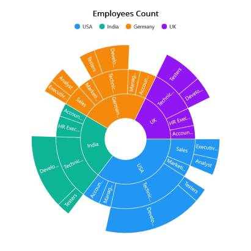

# Getting Started with .NET MAUI Sunburst Chart

This section explains how to populate the sunburst chart with data, a title, data labels, a legend, and a tooltip, as well as the essential aspects of getting started with the [Sunburst Chart](https://help.syncfusion.com/cr/maui/Syncfusion.Maui.SunburstChart.SfSunburstChart.html).




## Prerequisites
Before proceeding, ensure the following are set up:

1. Install [.NET 9 SDK](https://dotnet.microsoft.com/en-us/download/dotnet/9.0) or later.
2. Set up a .NET MAUI environment with Visual Studio 2022 v17.12 or later.

## Step 1: Create a new .NET MAUI project

1. Go to **File > New > Project** and choose the **.NET MAUI App** template.
2. Name the project and choose a location. Click **Next**.
3. Select the .NET framework version and click **Create**.

## Step 2: Install the Syncfusion® .NET MAUI Sunburst Chart Package

1. In **Solution Explorer**, right-click the project and choose **Manage NuGet Packages**.
2. Search for [Syncfusion.Maui.SunburstChart](https://www.nuget.org/packages/Syncfusion.Maui.SunburstChart/) and install the latest version.
3. Ensure the necessary dependencies are installed correctly, and the project is restored.




## Prerequisites

Before proceeding, ensure the following are set up:

1. Install [.NET 9 SDK](https://dotnet.microsoft.com/en-us/download/dotnet/9.0) or later.
2. Set up a .NET MAUI environment with Visual Studio Code.
3. Ensure that the .NET MAUI workloads are installed and configured as described [here](https://learn.microsoft.com/en-us/dotnet/maui/get-started/installation?view=net-maui-9.0&tabs=visual-studio-code).

## Step 1: Create a new .NET MAUI project

1. Open the command palette by pressing `Ctrl+Shift+P` and type **.NET:New Project** and enter.
2. Choose the **.NET MAUI App** template.
3. Select the project location, type the project name and press **Enter**.
4. Then choose **Create project**.

## Step 2: Install the Syncfusion® .NET MAUI Sunburst Chart Package

1. Press <kbd>Ctrl</kbd> + <kbd>`</kbd> (backtick) to open the integrated terminal in Visual Studio Code.
2. Ensure you're in the project root directory where your .csproj file is located.
3. Run the command `dotnet add package Syncfusion.Maui.SunburstChart` to install the Syncfusion® .NET MAUI SunburstChart NuGet package.
4. To ensure all dependencies are installed, run `dotnet restore`.




## Prerequisites

Before proceeding, ensure the following are set up:

1. Install [.NET 9 SDK](https://dotnet.microsoft.com/en-us/download/dotnet/9.0) or later.
2. Set up a .NET MAUI environment with JetBrains Rider 2024.3 or later.
3. Make sure the MAUI workloads are installed and configured as described [here.](https://www.jetbrains.com/help/rider/MAUI.html#before-you-start)

## Step 1: Create a new .NET MAUI Project

1. Go to **File > New Solution,** Select .NET (C#) and choose the .NET MAUI App template.
2. Enter the Project Name, Solution Name, and Location.
3. Select the .NET framework version and click Create.

## Step 2: Install the Syncfusion® .NET MAUI Sunburst Chart Package

1. In **Solution Explorer,** right-click the project and choose **Manage NuGet Packages.**
2. Search for [Syncfusion.Maui.SunburstChart](https://www.nuget.org/packages/Syncfusion.Maui.SunburstChart/) and install the latest version.
3. Ensure the necessary dependencies are installed correctly, and the project is restored. If not, Open the Terminal in Rider and manually run: `dotnet restore`




## Step 3: Register Syncfusion handler
 
Make sure to add the namespace.
 

using Syncfusion.Maui.Core.Hosting;

 
Register the Syncfusion core handler in your CreateMauiApp method of `MauiProgram.cs` file to use Syncfusion controls.
 

builder.ConfigureSyncfusionCore();


## Step 4: Import SunburstChart namespace

Add the following namespace in your XAML or C#.




xmlns:sunburst="clr-namespace:Syncfusion.Maui.SunburstChart;assembly=Syncfusion.Maui.SunburstChart"




using Syncfusion.Maui.SunburstChart;




## Step 5: Create the Model and ViewModel

Now, let us define a simple data model and viewmodel that represents a data point in the sunburst chart.

  



public class SunburstModel
{
    public string JobDescription { get; set; }
    public string JobGroup { get; set; }
    public double EmployeesCount { get; set; }
    public string Country { get; set; }
}

public class SunburstViewModel
{
    public ObservableCollection<SunburstModel> DataSource { get; set; }

    public SunburstViewModel()
    {
        this.DataSource = new ObservableCollection<SunburstModel>
        {
            new SunburstModel ( "USA", "Sales", "Executive",  50 ),
            new SunburstModel ( "USA", "Sales", "Analyst",  40 ),
            new SunburstModel ( "India", "Technical", "Testers",  33 ),
            new SunburstModel ( "India", "Technical", "Developers",  125 ),
            new SunburstModel ( "Germany", "Sales", "Executive",  30 ),
            new SunburstModel ( "Germany", "Sales", "Analyst",  40 ),
            // Add more items
        };
    }    
}

 

 

Set the `SunburstViewModel` instance as the `BindingContext` of your page to bind the `SunburstViewModel` properties to the chart.

N> Add the namespace of the `SunburstViewModel` class to your XAML Page, if you prefer to set `BindingContext` in XAML.

## Step 6: Add the Sunburst Chart component

Initialize the `SunburstChart` control and bind `DataSource` to the Sunburst chart [ItemsSource](https://help.syncfusion.com/cr/maui/Syncfusion.Maui.SunburstChart.SfSunburstChart.html#Syncfusion_Maui_SunburstChart_SfSunburstChart_ItemsSource) property from its BindingContext to create your Sunburst chart.
Then, add the [SunburstHierarchicalLevel](https://help.syncfusion.com/cr/maui/Syncfusion.Maui.SunburstChart.SunburstHierarchicalLevel.html) to [Levels](https://help.syncfusion.com/cr/maui/Syncfusion.Maui.SunburstChart.SfSunburstChart.html#Syncfusion_Maui_SunburstChart_SfSunburstChart_Levels) collection. Each hierarchy level is formed based on the property specified in the [GroupMemberPath](https://help.syncfusion.com/cr/maui/Syncfusion.Maui.SunburstChart.SunburstHierarchicalLevel.html#Syncfusion_Maui_SunburstChart_SunburstHierarchicalLevel_GroupMemberPath) property, and each arc segment size is calculated using the [ValueMemberPath](https://help.syncfusion.com/cr/maui/Syncfusion.Maui.SunburstChart.SfSunburstChart.html#Syncfusion_Maui_SunburstChart_SfSunburstChart_ValueMemberPath) property.

 



<sunburst:SfSunburstChart ItemsSource="{Binding DataSource}" 
                          ShowLabels="True"  
                          EnableTooltip="True"
                          ValueMemberPath="EmployeesCount">
        <sunburst:SfSunburstChart.BindingContext>
            <model:SunburstViewModel/>
        </sunburst:SfSunburstChart.BindingContext>
        <sunburst:SfSunburstChart.Title>
            <Label Text="Employees Count"/>
        </sunburst:SfSunburstChart.Title>
        <sunburst:SfSunburstChart.Legend>
            <sunburst:SunburstLegend/>
        </sunburst:SfSunburstChart.Legend> 
        <sunburst:SfSunburstChart.Levels>
            <sunburst:SunburstHierarchicalLevel GroupMemberPath="Country"/>
            <sunburst:SunburstHierarchicalLevel GroupMemberPath="JobDescription"/>
            <sunburst:SunburstHierarchicalLevel GroupMemberPath="JobGroup"/>
        </sunburst:SfSunburstChart.Levels>
    </sunburst:SfSunburstChart>
 




SfSunburstChart sunburst = new SfSunburstChart();

sunburst.ItemsSource = (new SunburstViewModel()).DataSource;
sunburst.ValueMemberPath = "EmployeesCount";
sunburst.Title = new Label
{
    Text = "Employees Count"
};

sunburst.Legend = new SunburstLegend();
sunburst.Levels.Add(new SunburstHierarchicalLevel() { GroupMemberPath = "Country" });
sunburst.Levels.Add(new SunburstHierarchicalLevel() { GroupMemberPath = "JobDescription" });
sunburst.Levels.Add(new SunburstHierarchicalLevel() { GroupMemberPath = "JobGroup" });
sunburst.EnableTooltip = true;
sunburst.ShowLabels = true;
        
this.Content = sunburst;





You can download the Sunburst Chart Getting Started sammple from [here](https://github.com/SyncfusionExamples/GettingStarted_SunburstChart_MAUI).