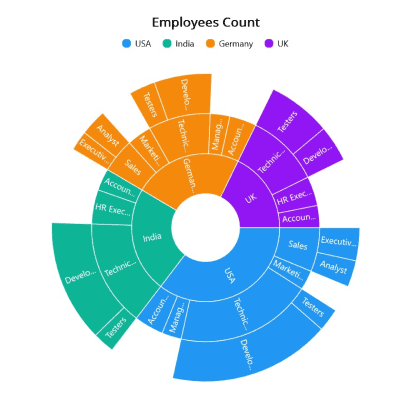

# Getting Started with .NET MAUI Sunburst Chart

This section explains how to populate the sunburst chart with data, a title, data labels, a legend, and a tooltip, as well as the essential aspects of getting started with the sunburst chart.

## Creating an Application Using the .NET MAUI Sunburst Chart

1. Create a new .NET MAUI application in Visual Studio.
2. The Syncfusion .NET MAUI components are available in [nuget.org](https://www.nuget.org/). To add SfSunburstChart to your project, open the NuGet package manager in Visual Studio, search for Syncfusion.Maui.SunburstChart and then install it.
3. To initialize the control, import the Sunburst Chart namespace.
4. Initialize [SfSunburstChart]().

 



    <ContentPage   
        . . .
        xmlns:sunburst="clr-namespace:Syncfusion.Maui.SunburstChart;assembly=Syncfusion.Maui.SunburstChart">

        <chart:SfSunburstChart/>
    </ContentPage>
 




    using Syncfusion.Maui.SunburstChart;

    namespace SunburstGettingStarted
    {
        public partial class MainPage : ContentPage
        {
            public MainPage()
            {
                InitializeComponent();           
                SfSunburstChart sunburst = new SfSunburstChart();
            }
        }   
    }





## Register the handler

Syncfusion.Maui.Core NuGet is a dependent package for all Syncfusion controls of .NET MAUI. In the MauiProgram.cs file, register the handler for Syncfusion core.



    using Microsoft.Maui;
    using Microsoft.Maui.Hosting;
    using Microsoft.Maui.Controls.Compatibility;
    using Microsoft.Maui.Controls.Hosting;
    using Microsoft.Maui.Controls.Xaml;
    using Syncfusion.Maui.Core.Hosting;

    namespace SunburstGettingStarted
    {
        public static class MauiProgram
        {
            public static MauiApp CreateMauiApp()
            {
                var builder = MauiApp.CreateBuilder();
                builder
                .UseMauiApp<App>()
                .ConfigureSyncfusionCore()
                .ConfigureFonts(fonts =>
                {
                    fonts.AddFont("OpenSans-Regular.ttf", "OpenSansRegular");
                });

                return builder.Build();
            }
        }
    }

 

## Initialize View model

Now, let us define a simple data model that represents a data point in the sunburst chart.

  



    public class SunburstModel
    {
        public string JobDescription { get; set; }
        public string JobGroup { get; set; }
        public double EmployeesCount { get; set; }
        public string Country { get; set; }
    }

 

 

Next, create a view model class and initialize a list of `SunburstModel` objects as follows.

  



    public class SunburstViewModel
    {
        public ObservableCollection<SunburstModel> DataSource { get; set; }

        public SunburstViewModel()
        {
            this.DataSource = new ObservableCollection<SunburstModel>
            {
                new SunburstModel ( "USA", "Sales", "Executive",  50 ),
                new SunburstModel ( "USA", "Sales", "Analyst",  40 ),
                new SunburstModel ( "USA", "Marketing",  40 ),
                new SunburstModel ( "USA", "Technical", "Testers",  35 ),
                new SunburstModel ( "USA", "Technical", "Developers",  175 ),
                new SunburstModel ( "USA", "Technical", "Developers",  70 ),
                new SunburstModel ( "USA", "Management",  40 ),
                new SunburstModel ( "USA", "Accounts",  60 ),
                new SunburstModel ( "India", "Technical", "Testers",  33 ),
                new SunburstModel ( "India", "Technical", "Developers",  125 ),
                new SunburstModel ( "India", "Technical", "Developers",  60 ),
                new SunburstModel ( "India", "HR Executives",  70 ),
                new SunburstModel ( "India", "Accounts",  45 ),
                new SunburstModel ( "Germany", "Sales", "Executive",  30 ),
                new SunburstModel ( "Germany", "Sales", "Analyst",  40 ),
                new SunburstModel ( "Germany", "Marketing",  50 ),
                new SunburstModel ( "Germany", "Technical", "Testers",  40 ),
                new SunburstModel ( "Germany", "Technical", "Developers",  60 ),
                new SunburstModel ( "Germany", "Technical", "Developers",  27 ),
                new SunburstModel ( "Germany", "Management",  40 ),
                new SunburstModel ( "Germany", "Accounts",  55 ),
                new SunburstModel ( "UK", "Technical", "Testers",  96 ),
                new SunburstModel ( "UK", "Technical", "Developers",  55 ),
                new SunburstModel ( "UK", "HR Executives",  60 ),
                new SunburstModel ( "UK", "Accounts",  45 )
            };
        }    
    }

 

 

Set the `SunburstViewModel` instance as the `BindingContext` of your page to bind the `SunburstViewModel` properties to the chart.

N> Add the namespace of the `SunburstViewModel` class to your XAML Page, if you prefer to set `BindingContext` in XAML.

 

 

	<ContentPage
	    . . .
	    xmlns:sunburst="clr-namespace:Syncfusion.Maui.SunburstChart;assembly=Syncfusion.Maui.SunburstChart"
	    xmlns:model="clr-namespace:SunburstGettingStarted">

	    <ContentPage.BindingContext>
	        <model:SunburstViewModel></model:SunburstViewModel>
	    </ContentPage.BindingContext>

	</ContentPage>



 

    this.BindingContext = new ViewModel();



 

## Populate sunburst chart with data

 Bind `DataSource` to the Sunburst chart [ItemsSource]() property from its BindingContext to create your Sunburst chart.
 Then, add the [SunburstHierarchicalLevel]() to [Levels]() collection. Each hierarchy level is formed based on the property specified in the [GroupMemberPath]() property, and each arc segment size is calculated using the [ValueMemberPath]() property.

   


        
    <ContentPage
            . . .
            xmlns:sunburst="clr-namespace:Syncfusion.Maui.SunburstChart;assembly=Syncfusion.Maui.SunburstChart"
            xmlns:model="clr-namespace:SunburstGettingStarted>

    <sunburst:SfSunburstChart x:Name="sunburst" 
            ItemsSource="{Binding DataSource}" 
            ValueMemberPath="EmployeesCount">

        <sunburst:SfSunburstChart.Levels>
            <sunburst:SunburstHierarchicalLevel GroupMemberPath="Country"/>
            <sunburst:SunburstHierarchicalLevel GroupMemberPath="JobDescription"/>
            <sunburst:SunburstHierarchicalLevel GroupMemberPath="JobGroup"/>
        </sunburst:SfSunburstChart.Levels>

        </sunburst:SfSunburstChart>
    </ContentPage>





    SfSunburstChart sunburst = new SfSunburstChart();

    sunburst.ItemsSource = (new SunburstViewModel()).DataSource;
    sunburst.ValueMemberPath = "EmployeesCount";

    sunburst.Levels.Add(new SunburstHierarchicalLevel() { GroupMemberPath = "Country" });
    sunburst.Levels.Add(new SunburstHierarchicalLevel() { GroupMemberPath = "Country" });
    sunburst.Levels.Add(new SunburstHierarchicalLevel() { GroupMemberPath = "JobDescription" });
    sunburst.Levels.Add(new SunburstHierarchicalLevel() { GroupMemberPath = "JobGroup" });

    this.Content = sunburst;



 

## Add a title
The title of the sunburst chart provides quick information to the user about the data being plotted in the    chart. The [Title]() property is used to set title for the sunburst chart as follows.

 



    <sunburst:SfSunburstChart>
        <sunburst:SfSunburstChart.Title>
            <Label Text="Employees Count"/>
        </sunburst:SfSunburstChart.Title>
        . . .
    </sunburst:SfSunburstChart>





    SfSunburstChart sunburst = new SfSunburstChart();
    sunburst.Title = new Label
    {
        Text = "Employees Count"
    };



  

## Enable the data labels

The [ShowLabels]() property of the chart can be used to enable data labels to improve the readability of the sunburst chart. The label visibility is set to `False` by default.

 



    <sunburst:SfSunburstChart ShowLabels="True">
        . . .
    </sunburst:SfSunburstChart>





    SfSunburstChart sunburst = new SfSunburstChart();
    . . .
    sunburst.ShowLabels = true;



 

## Enable a legend

The legend provides information about the data points displayed in the sunburst chart. The [Legend]() property of the chart enables the [SunburstLegend]().

 



    <sunburst:SfSunburstChart>
        . . .
        <sunburst:SfSunburstChart.Legend>
            <sunburst:SunburstLegend/>
        </sunburst:SfSunburstChart.Legend>
    </sunburst:SfSunburstChart>





    SfSunburstChart sunburst = new SfSunburstChart();
    . . .
    sunburst.Legend = new SunburstLegend();



 

## Enable Tooltip

Tooltips are used to display information about a segment when the mouse hovers over it. Enable the tooltips by setting the chart's [EnableTooltip]() property to `True`.

 



    <sunburst:SfSunburstChart EnableTooltip="True">
        . . .
    </sunburst:SfSunburstChart>





    SfSunburstChart sunburst = new SfSunburstChart();
    . . .
    sunburst.EnableTooltip = true;





The following code example gives you the complete code of above configurations.

 



    <ContentPage
        . . .
        xmlns:sunburst="clr-namespace:Syncfusion.Maui.SunburstChart;assembly=Syncfusion.Maui.SunburstChart"
        xmlns:model="clr-namespace:SunburstGettingStarted>

        <sunburst:SfSunburstChart 
                    ItemsSource="{Binding DataSource}" 
                    ShowLabels="True"  EnableTooltip="True"
                    ValueMemberPath="EmployeesCount">

            <sunburst:SfSunburstChart.BindingContext>
                <model:SunburstViewModel/>
            </sunburst:SfSunburstChart.BindingContext>

            <sunburst:SfSunburstChart.Title>
                <Label Text="Employees Count"/>
            </sunburst:SfSunburstChart.Title>

            <sunburst:SfSunburstChart.Legend>
                <sunburst:SunburstLegend/>
            </sunburst:SfSunburstChart.Legend> 

            <sunburst:SfSunburstChart.Levels>
                <sunburst:SunburstHierarchicalLevel GroupMemberPath="Country"/>
                <sunburst:SunburstHierarchicalLevel GroupMemberPath="JobDescription"/>
                <sunburst:SunburstHierarchicalLevel GroupMemberPath="JobGroup"/>
            </sunburst:SfSunburstChart.Levels>
        </sunburst:SfSunburstChart>

    </ContentPage>
 




    using Syncfusion.Maui.SunburstChart;
    . . .
    public partial class MainPage : ContentPage
    {   
        public MainPage()
        {
            SfSunburstChart sunburst = new SfSunburstChart();

            sunburst.ItemsSource = (new SunburstViewModel()).DataSource;
            sunburst.ValueMemberPath = "EmployeesCount";

            sunburst.Title = new Label
            {
                Text = "Employees Count"
            };

            sunburst.Legend = new SunburstLegend();

            sunburst.Levels.Add(new SunburstHierarchicalLevel() { GroupMemberPath = "Country" });
            sunburst.Levels.Add(new SunburstHierarchicalLevel() { GroupMemberPath = "Country" });
            sunburst.Levels.Add(new SunburstHierarchicalLevel() { GroupMemberPath = "JobDescription" });
            sunburst.Levels.Add(new SunburstHierarchicalLevel() { GroupMemberPath = "JobGroup" });

            sunburst.EnableTooltip = true;
            sunburst.ShowLabels = true;
            
            this.Content = sunburst;
        }
    }





Find the complete getting started sample from this [link](https://github.com/SyncfusionExamples/GettingStarted_SunburstChart_MAUI).