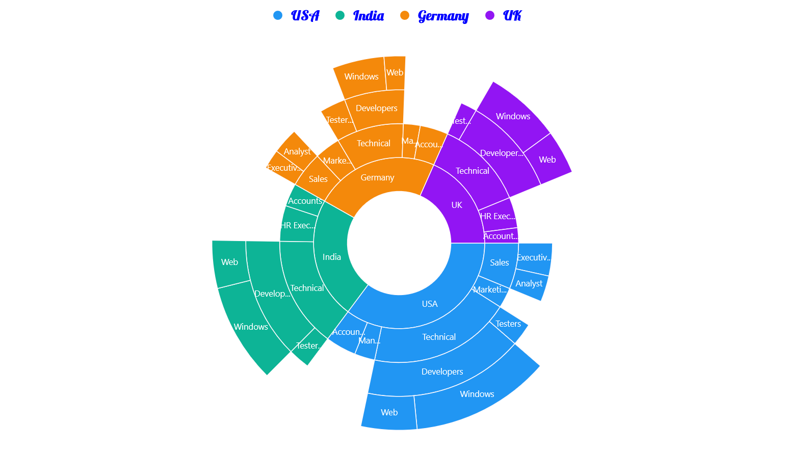
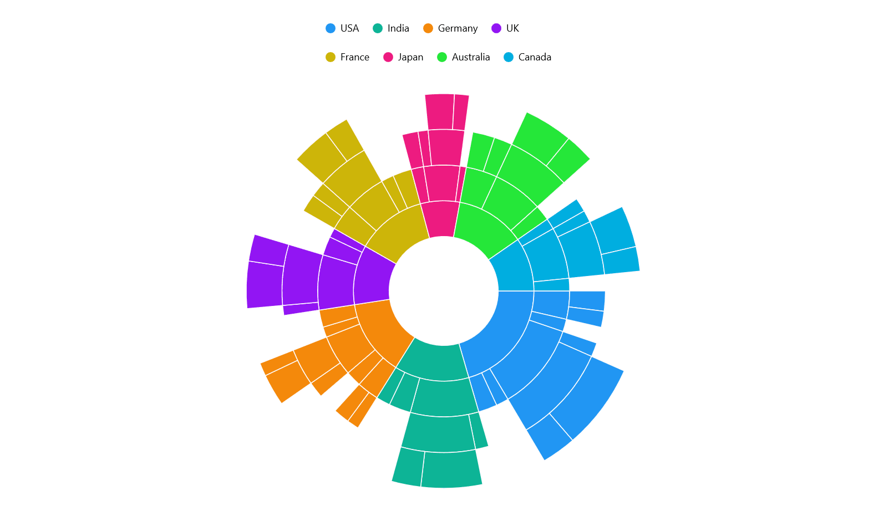
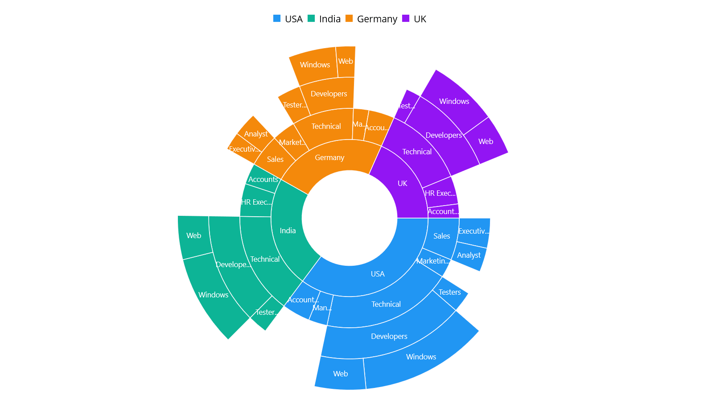

# Legend in .NET MAUI Sunburst Chart
The [Legend](https://help.syncfusion.com/cr/maui/Syncfusion.Maui.SunburstChart.SfSunburstChart.html#Syncfusion_Maui_SunburstChart_SfSunburstChart_Legend) provides a list of data points, helping to identify the corresponding data points in the chart. Here's a detailed guide on how to define and customize the legend in the sunburst chart.

## Defining the legend
To define the legend in the chart, initialize the [SunburstLegend](https://help.syncfusion.com/cr/maui/Syncfusion.Maui.SunburstChart.SunburstLegend.html) class and assign it to the [Legend](https://help.syncfusion.com/cr/maui/Syncfusion.Maui.SunburstChart.SfSunburstChart.html#Syncfusion_Maui_SunburstChart_SfSunburstChart_Legend) property.





<sunburst:SfSunburstChart>
    . . .
    <sunburst:SfSunburstChart.Legend>
        <sunburst:SunburstLegend/>
    </sunburst:SfSunburstChart.Legend>
</sunburst:SfSunburstChart>





SfSunburstChart sunburst = new SfSunburstChart();
. . .
sunburst.Legend = new SunburstLegend();
this.Content = sunburst;





## Legend visibility
The visibility of the sunburst legend can be controlled using the [IsVisible](https://help.syncfusion.com/cr/maui/Syncfusion.Maui.SunburstChart.SunburstLegend.html#Syncfusion_Maui_SunburstChart_SunburstLegend_IsVisible) property. By default, the IsVisible property is set to `true`.





<sunburst:SfSunburstChart>
    . . .
    <sunburst:SfSunburstChart.Legend>
        <sunburst:SunburstLegend IsVisible="True"/>
    </sunburst:SfSunburstChart.Legend>
</sunburst:SfSunburstChart>





SfSunburstChart sunburst = new SfSunburstChart();
. . .
sunburst.Legend = new SunburstLegend()
{ 
    IsVisible = true 
};
this.Content = sunburst;





## Customizing labels

The appearance of the legend label can be customized using the **`LabelStyle`** property. The following properties are available:

* **`TextColor`** – Gets or sets the color of the label.
* **`FontFamily`** - Gets or sets the font family for the legend label. 
* **`FontAttributes`** - Gets or sets the font style for the legend label. 
* **`FontSize`** - Gets or sets the font size for the legend label.
* **`Margin`** - Gets or sets the margin size of labels.

 



<sunburst:SfSunburstChart>
    . . .
        <sunburst:SfSunburstChart.Legend>
            <sunburst:SunburstLegend>
                <sunburst:SunburstLegend.LabelStyle>
                    <sunburst:ChartLegendLabelStyle TextColor="Blue" 
                                                    Margin="5" 
                                                    FontSize="18" 
                                                    FontAttributes="Bold" 
                                                    FontFamily="Lobster" />
                </sunburst:SunburstLegend.LabelStyle>
            </sunburst:SunburstLegend>
        </sunburst:SfSunburstChart.Legend>
</sunburst:SfSunburstChart>





SfSunburstChart sunburst = new SfSunburstChart();
. . .
sunburst.Legend = new SunburstLegend();
ChartLegendLabelStyle labelStyle = new ChartLegendLabelStyle()
{
    TextColor = Colors.Blue,
    Margin = 5,
    FontSize = 18,
    FontAttributes = FontAttributes.Bold,
    FontFamily = "Lobster"
};
sunburst.Legend.LabelStyle = labelStyle;
this.Content = sunburst;





## Placement
The legend can be positioned to the left, right, top, or bottom of the chart area using the [Placement](https://help.syncfusion.com/cr/maui/Syncfusion.Maui.SunburstChart.SunburstLegend.html#Syncfusion_Maui_SunburstChart_SunburstLegend_Placement) property in the SunburstLegend class. The default placement is `Top`.





<sunburst:SfSunburstChart>
    . . .
    <sunburst:SfSunburstChart.Legend>
        <sunburst:SunburstLegend Placement="Bottom"/>
    </sunburst:SfSunburstChart.Legend>
</sunburst:SfSunburstChart>





SfSunburstChart sunburst = new SfSunburstChart();
. . .
sunburst.Legend = new SunburstLegend()
{ 
    Placement = LegendPlacement.Bottom
};
this.Content = sunburst;





## Legend maximum size request
To set the maximum size request for the legend view, override the **`GetMaximumSizeCoefficient`** protected method in the [SunburstLegend](https://help.syncfusion.com/cr/maui/Syncfusion.Maui.SunburstChart.SunburstLegend.html) class. The value should be between 0 and 1, representing the maximum size request, not the desired size of the legend items layout. Its default value is 0.25.




    
<sunburst:SfSunburstChart>
    . . .
    <sunburst:SfSunburstChart.Legend>
        <local:SunburstLegendExt/>
    </sunburst:SfSunburstChart.Legend>
</sunburst:SfSunburstChart>





public class SunburstLegendExt : SunburstLegend
{
    protected override double GetMaximumSizeCoefficient()
    {
        return 0.7;
    }
}

SfSunburstChart sunburst = new SfSunburstChart();
. . .
sunburst.Legend = new SunburstLegendExt();
this.Content = sunburst;





## Items layout

The **`ItemsLayout`** property is used to customize the arrangement and position of legend items. The default value is `null`. This property accepts any layout type.





<sunburst:SfSunburstChart>
    . . .
    <sunburst:SfSunburstChart.Legend>
        <sunburst:SunburstLegend>
            <sunburst:SunburstLegend.ItemsLayout>
                <FlexLayout Wrap="Wrap"
                            WidthRequest="300">
                </FlexLayout>
            </sunburst:SunburstLegend.ItemsLayout>
         </sunburst:SunburstLegend>
    </sunburst:SfSunburstChart.Legend>
</sunburst:SfSunburstChart>





SfSunburstChart sunburst = new SfSunburstChart();
. . .
SunburstLegend legend = new SunburstLegend();
legend.ItemsLayout = new FlexLayout()
{
    Wrap = FlexWrap.Wrap,
    WidthRequest = 300
};

sunburst.Legend = legend;
this.Content = sunburst;
        




## Item template
The [SunburstLegend](https://help.syncfusion.com/cr/maui/Syncfusion.Maui.SunburstChart.SunburstLegend.html) supports customizing the appearance of legend items using the **`ItemTemplate`** property. The default value of ItemsTemplate is `null`.

N> The BindingContext of the template is the corresponding underlying legend item.





<sunburst:SfSunburstChart>
    . . .
    <sunburst:SfSunburstChart.Resources>
        <DataTemplate x:Key="legendTemplate">
            <StackLayout Orientation="Horizontal">
                <Rectangle HeightRequest="12"
                           WidthRequest="12" 
                           Margin="3"
                           Background="{Binding IconBrush}"/>
                <Label Text="{Binding Text}"
                       Margin="3"/>
            </StackLayout>
        </DataTemplate>
    </sunburst:SfSunburstChart.Resources>
    
    <sunburst:SfSunburstChart.Legend>
        <sunburst:SunburstLegend ItemTemplate="{StaticResource legendTemplate}"/>
    </sunburst:SfSunburstChart.Legend>
</sunburst:SfSunburstChart>





SfSunburstChart sunburst = new SfSunburstChart();
SunburstLegend legend = new SunburstLegend();
legend.ItemTemplate = sunburst.Resources["legendTemplate"] as DataTemplate;
. . .
sunburst.Legend = legend;
this.Content = sunburst;
        




## Event 

**LegendItemCreated**

The **`LegendItemCreated`** event is triggered when the sunburst legend item is created. The event argument contains a [`LegendItem`](https://help.syncfusion.com/cr/maui/Syncfusion.Maui.Core.LegendItemEventArgs.html#Syncfusion_Maui_Core_LegendItemEventArgs_LegendItem) object with the following properties:

* [`Text`](https://help.syncfusion.com/cr/maui/Syncfusion.Maui.Core.ILegendItem.html#Syncfusion_Maui_Core_ILegendItem_Text) – used to get or set the text of the label.
* [`TextColor`](https://help.syncfusion.com/cr/maui/Syncfusion.Maui.Core.ILegendItem.html#Syncfusion_Maui_Core_ILegendItem_TextColor) – used to get or set the color of the label.
* [`FontFamily`](https://help.syncfusion.com/cr/maui/Syncfusion.Maui.Core.ILegendItem.html#Syncfusion_Maui_Core_ILegendItem_FontFamily) - used to get or set the font family for the legend label. 
* [`FontAttributes`](https://help.syncfusion.com/cr/maui/Syncfusion.Maui.Core.ILegendItem.html#Syncfusion_Maui_Core_ILegendItem_FontAttributes) - used to get or set the font style for the legend label. 
* [`FontSize`](https://help.syncfusion.com/cr/maui/Syncfusion.Maui.Core.ILegendItem.html#Syncfusion_Maui_Core_ILegendItem_FontSize) - used to get or set the font size for the legend label.
* [`TextMargin`](https://help.syncfusion.com/cr/maui/Syncfusion.Maui.Core.ILegendItem.html#Syncfusion_Maui_Core_ILegendItem_TextMargin) - used to get or set the margin size of labels.
* [`IconBrush`](https://help.syncfusion.com/cr/maui/Syncfusion.Maui.Core.ILegendItem.html#Syncfusion_Maui_Core_ILegendItem_IconBrush) - used to change the color of the legend icon.
* [`IconType`](https://help.syncfusion.com/cr/maui/Syncfusion.Maui.Core.ILegendItem.html#Syncfusion_Maui_Core_ILegendItem_IconType) - used to get or set the icon type for the legend icon.
* [`IconHeight`](https://help.syncfusion.com/cr/maui/Syncfusion.Maui.Core.ILegendItem.html#Syncfusion_Maui_Core_ILegendItem_IconHeight) - used to get or set the icon height of the legend icon.
* [`IconWidth`](https://help.syncfusion.com/cr/maui/Syncfusion.Maui.Core.ILegendItem.html#Syncfusion_Maui_Core_ILegendItem_IconWidth) - used to get or set the icon width of the legend icon.
* [`Index`](https://help.syncfusion.com/cr/maui/Syncfusion.Maui.Core.ILegendItem.html#Syncfusion_Maui_Core_ILegendItem_Index) - used to get index position of the legend.
* [`Item`](https://help.syncfusion.com/cr/maui/Syncfusion.Maui.Core.ILegendItem.html#Syncfusion_Maui_Core_ILegendItem_Item) - used to get the corresponding SunburstItem hierarchical and positional information for the legend item.