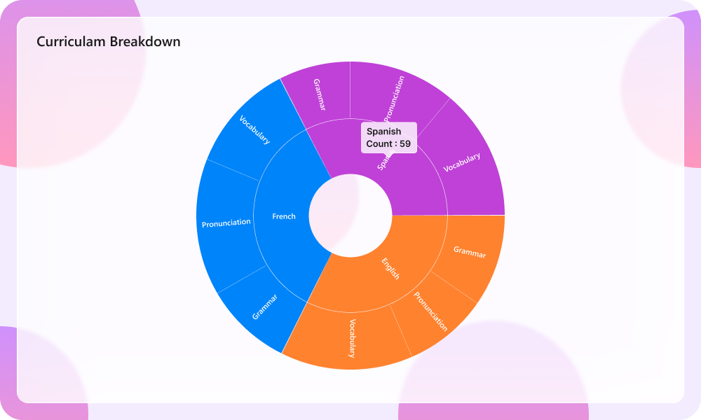

# Liquid Glass Effect in .NET MAUI Sunburst Chart

The liquid glass effect is a modern design style that provides a sleek, minimalist appearance with clean lines, subtle visual effects, and elegant styling. It features smooth rounded corners and sophisticated visual treatments that create a polished, professional look for your charts.

N> **Prerequisite:** 
- Ensure that the required NuGet package is installed, the necessary namespaces are imported, and the **Sunburst Chart** control is properly configured in your application. For detailed setup and configuration instructions, refer to the **[Getting Started](https://help.syncfusion.com/maui/sunburstchart/getting-started)** guide.
- To use **SfGlassEffectView**, ensure that the Syncfusion.Maui.Core package is installed and import the Syncfusion.Maui.Core namespace.

N> The liquid glass effect is supported only on `.NET 10` and on `iOS 26` and `macOS 26` or later. Enabling these properties on other platforms (such as Windows or Android) has no effect; the chart renders normally without the glass appearance.

## How it enhances chart UI on macOS and iOS

The liquid glass effect enhances MAUI [SfSunburstChart](https://help.syncfusion.com/cr/maui/Syncfusion.Maui.SunburstChart.SfSunburstChart.html) with a sleek, glassy look and improved interactivity.

- **Chart background:** Wrap the chart in an [SfGlassEffectView](https://help.syncfusion.com/cr/maui/Syncfusion.Maui.Core.SfGlassEffectView.html) to give the chart surface a blurred or clear glass background.
- **Tooltip:** Applies a glassy appearance to tooltips for clearer data highlights.

## Apply the liquid glass effect to the chart

To give the chart surface a glass (blurred or clear) appearance, wrap the [SfSunburstChart](https://help.syncfusion.com/cr/maui/Syncfusion.Maui.SunburstChart.SfSunburstChart.html) inside an [SfGlassEffectView](https://help.syncfusion.com/cr/maui/Syncfusion.Maui.Core.SfGlassEffectView.html). `SfGlassEffectView` is available in the [Syncfusion.Maui.Core](https://www.nuget.org/packages/Syncfusion.Maui.Core/) package, which must be installed separately. For detailed guidance on [SfGlassEffectView](https://help.syncfusion.com/cr/maui/Syncfusion.Maui.Core.SfGlassEffectView.html).

The following properties of [SfGlassEffectView](https://help.syncfusion.com/cr/maui/Syncfusion.Maui.Core.SfGlassEffectView.html) are used to customize the glass appearance:

* [CornerRadius](https://help.syncfusion.com/cr/maui/Syncfusion.Maui.Core.SfGlassEffectView.html#Syncfusion_Maui_Core_SfGlassEffectView_CornerRadius), of type `double`, indicates the radius of the rounded corners.
* [Padding](https://help.syncfusion.com/cr/maui/Syncfusion.Maui.Core.SfGlassEffectView.html#Syncfusion_Maui_Core_SfGlassEffectView_Padding), of type `Thickness`, indicates the padding between the chart and the glass view.
* [EffectType](https://help.syncfusion.com/cr/maui/Syncfusion.Maui.Core.SfGlassEffectView.html#Syncfusion_Maui_Core_SfGlassEffectView_EffectType), of type `GlassEffectType`, indicates the type of glass effect.
* [EnableShadowEffect](https://help.syncfusion.com/cr/maui/Syncfusion.Maui.Core.SfGlassEffectView.html#Syncfusion_Maui_Core_SfGlassEffectView_EnableShadowEffect), of type `bool`, indicates whether the shadow effect is enabled.

The [EffectType](https://help.syncfusion.com/cr/maui/Syncfusion.Maui.Core.SfGlassEffectView.html#Syncfusion_Maui_Core_SfGlassEffectView_EffectType) property uses the `GlassEffectType` enum with the following values:

* `Regular` - Produces a more blurred, frosted-glass appearance.
* `Clear` - Produces a crisper, glassy appearance.





<core:SfGlassEffectView CornerRadius="20"
                        Padding="12"
                        EffectType="Regular"
                        EnableShadowEffect="True">
    <sunburst:SfSunburstChart>
        <!-- code omitted for brevity -->
    </sunburst:SfSunburstChart>
</core:SfGlassEffectView>





SfSunburstChart chart = new SfSunburstChart();
// code omitted for brevity

SfGlassEffectView glass = new SfGlassEffectView
{
    CornerRadius = 20,
    Padding = 12,
    EffectType = GlassEffectType.Regular,
    EnableShadowEffect = true,
    Content = chart
};

this.Content = glass;





## Apply the liquid glass effect to the tooltip

To enable the liquid glass effect on tooltips, set the [EnableLiquidGlassEffect](https://help.syncfusion.com/cr/maui/Syncfusion.Maui.SunburstChart.SfSunburstChart.html#Syncfusion_Maui_SunburstChart_SfSunburstChart_EnableLiquidGlassEffect) property and the [EnableTooltip](https://help.syncfusion.com/cr/maui/Syncfusion.Maui.SunburstChart.SfSunburstChart.html#Syncfusion_Maui_SunburstChart_SfSunburstChart_EnableTooltip) property of [SfSunburstChart](https://help.syncfusion.com/cr/maui/Syncfusion.Maui.SunburstChart.SfSunburstChart.html) to `true`.





<sunburst:SfSunburstChart EnableLiquidGlassEffect="True"
                          EnableTooltip="True">
    <!-- code omitted for brevity -->
</sunburst:SfSunburstChart>





SfSunburstChart chart = new SfSunburstChart();
chart.EnableLiquidGlassEffect = true;
chart.EnableTooltip = true;
// code omitted for brevity
this.Content = chart;





When using a custom tooltip template via the [TooltipTemplate](https://help.syncfusion.com/cr/maui/Syncfusion.Maui.SunburstChart.SfSunburstChart.html#Syncfusion_Maui_SunburstChart_SfSunburstChart_TooltipTemplate) property, set the template's background to `Transparent` so the liquid glass effect is visible.





<sunburst:SfSunburstChart EnableLiquidGlassEffect="True"
                          EnableTooltip="True">
    <sunburst:SfSunburstChart.TooltipTemplate>
        <DataTemplate>
            <Grid Background="Transparent"
                  Padding="8">
                <Label Text="{Binding Item[0]}"
                       TextColor="White"/>
            </Grid>
        </DataTemplate>
    </sunburst:SfSunburstChart.TooltipTemplate>
    <!-- code omitted for brevity -->
</sunburst:SfSunburstChart>





SfSunburstChart chart = new SfSunburstChart();
chart.EnableLiquidGlassEffect = true;
chart.EnableTooltip = true;
// Define a DataTemplate with a Transparent background and assign to chart.TooltipTemplate.
// code omitted for brevity
this.Content = chart;





## Best practices and tips

- The liquid glass effect is most visible when the chart is placed over images or colorful backgrounds.
- Set the [EffectType](https://help.syncfusion.com/cr/maui/Syncfusion.Maui.Core.SfGlassEffectView.html#Syncfusion_Maui_Core_SfGlassEffectView_EffectType) property to `Regular` for a more blurred look, or `Clear` for a crisper, glassy look.
- Tune the `CornerRadius` and `Padding` values to balance content density and visual polish.
- On unsupported platforms, the liquid glass properties are ignored and the chart renders normally.