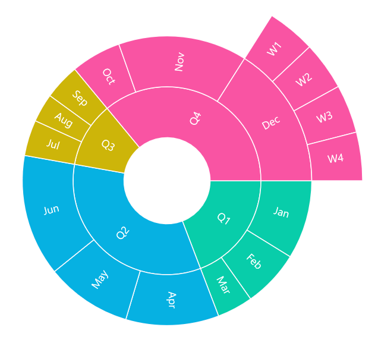

# .NET MAUI Chart Overview

The Syncfusion .NET MAUI Sunburst Chart is used to represent the hierarchical data structures. Each level represents a different category or subcategory, allowing users to understand the relationships and dependencies within the data and making it user-friendly.

## Key features

* Supports data labels and legends for better readability.
* Supports tooltip to provide more information about the segments.
* Can customize the appearance with custom palette brushes.
* Add the additional information with the center view elevation.
