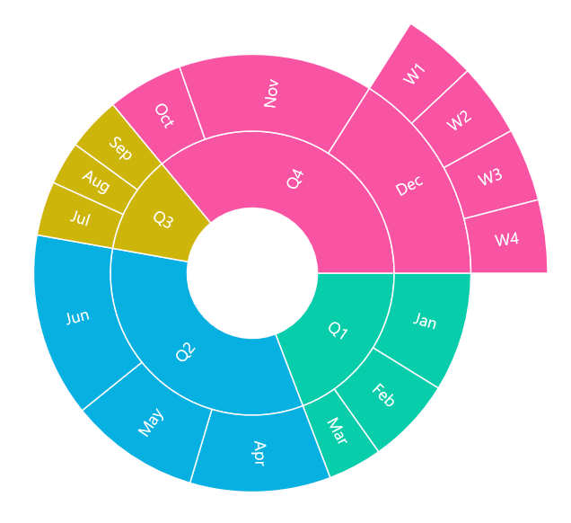

# .NET MAUI Sunburst Chart Overview

The Syncfusion® .NET MAUI Sunburst Chart is used to visualize hierarchical data structures. The chart organizes data in multiple levels, where each level represents a different category or subcategory. This visualization helps users understand relationships and dependencies within the data in an intuitive and user-friendly way.

## Business use cases

- Business intelligence applications that require visualizing hierarchical data such as organizational structures or product categories.
- Financial and analytics dashboards that display multi-level data distribution and contribution analysis.
- Data-driven applications that require comparative insights across parent and child categories.
- Scientific and research applications that visualize nested and hierarchical relationships in datasets.  

## Key features

- **Hierarchical data visualization** allows representing multiple levels of categories and subcategories effectively.  
- **Data label** allows displaying labels for better readability of each segment.  
- **Legend** allows identifying categories and understanding data representation clearly.  
- **Tooltip** allows displaying additional information on interaction with segments.  
- **Appearance customization** allows applying custom color palettes and styling to enhance visualization.  
- **Center view** allows displaying additional information or summary content at the center of the chart.  

## Globalization

The following table summarizes the globalization support available in this control.

    
    Partial Support

    
    No Support

<table>
<tr>
<th align="center">Control</th>
<th align="center">Localization</th>
<th align="center">RTL</th>
<th align="center">Time zone</th>
<th align="center">Screen reader</th>
<th align="center">Keyboard navigation</th>
</tr>
<tr>
<td><a href="/maui/sunburstchart/overview">Sunburst Chart</a></td>
<td align="center"></td>
<td align="center"></td>
<td align="center"></td>
<td align="center"></td>
<td align="center"></td>
</tr> 
</table>

## Related controls

- [Treemap](https://help.syncfusion.com/maui/treemap/overview) for visualizing hierarchical data using rectangular layouts.
- [Circular Charts](https://help.syncfusion.com/maui/circular-charts/overview) for representing proportional data using pie and doughnut charts.
- [Cartesian Charts](https://help.syncfusion.com/maui/cartesian-charts/overview) for visualizing tabular data trends and comparisons.

## See Also

Explore further resources:

- [Getting Started](https://help.syncfusion.com/maui/sunburstchart/getting-started) shows a step‑by‑step guide to begin using the Sunburst Chart control.  
- [Appearance](https://help.syncfusion.com/maui/sunburstchart/appearance) explains how to customize chart appearance and styling.  
- [Labels](https://help.syncfusion.com/maui/sunburstchart/datalabels) helps configure data labels and segment display.  
- [UI Kit](https://www.syncfusion.com/demos/maui#maui-ui-control) provides interactive demos and ready‑made UI examples.

## Resources

<!-- Card 1 -->
<a href="https://www.syncfusion.com/maui-controls/maui-sunburst-charts" class="form-card" target="_blank">
  

    <h3 class="form-title">Feature Tour</h3>
    

      Walk through highlights and core capabilities.
    

  

</a>
<!-- Card 2 -->
<a href="https://github.com/syncfusion/maui-demos/tree/master/MAUI/SunburstChart" class="form-card" target="_blank">
  

    <h3 class="form-title">Showcase Samples</h3>
    

      Explore sample scenarios for real apps.
    

  

</a>
<!-- Card 3 -->
<a href="https://www.syncfusion.com/tutorial-videos/maui/sunburst-chart" class="form-card" target="_blank">
  

    <h3 class="form-title">Tutorial Videos</h3>
    

      Step‑by‑step guidance through video tutorials.
    

  

</a>
<!-- Card 4 -->
<a href="https://support.syncfusion.com/kb/cross-platforms/category/76" class="form-card" target="_blank">
  

    <h3 class="form-title">Explore KB's</h3>
    

      Find quick solutions and step‑by‑step guidance.
    

  

</a>
<!-- Card 5 -->
<a href="https://www.syncfusion.com/blogs/category/net-maui" class="form-card" target="_blank">
  

    <h3 class="form-title">Explore Blogs</h3>
    

      Read insights, tutorials, and developer journeys.
    

  

</a>
